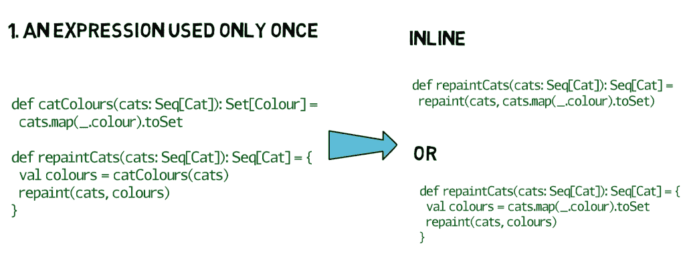
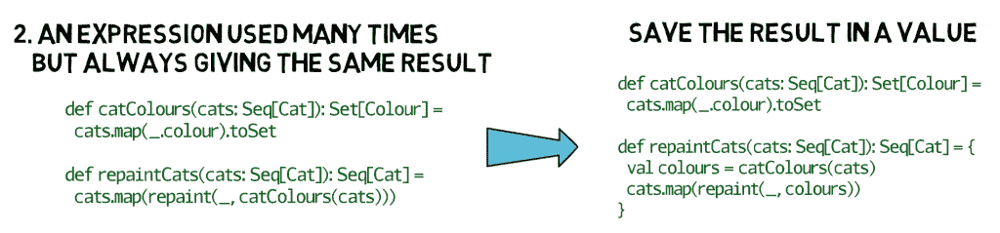
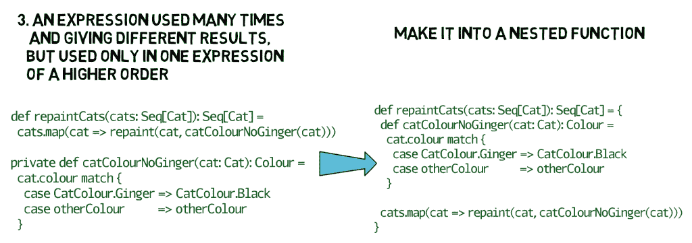
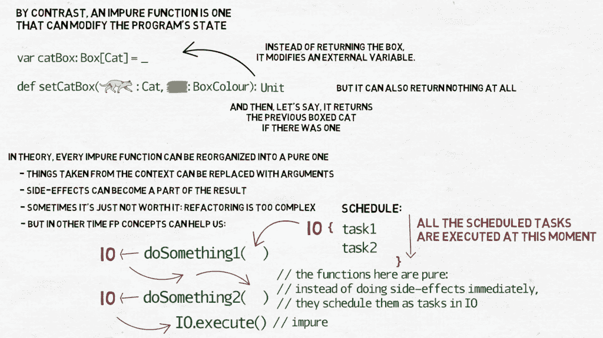

# 使用函数编程#7:表达式优于语句

> 原文：<https://medium.com/nerd-for-tech/programming-with-functions-7-expressions-over-statements-20fbb7a9114d?source=collection_archive---------27----------------------->

另一个您可能已经知道但与函数式编程无关的概念是表达式——与语句相对。当以命令式风格编写代码时，我们用语句构建函数。这就是我们命令程序做某事的方式:从这里获取数据，像那样修改，保存在那里。从这个角度来看，函数的主要目的是修改程序的状态——也就是函数本身之外的数据。但是在学校，在数学上，我们也学过函数，他们不是那样的。他们没有修改任何东西，而是用这些论证产生了一个新的结果。它们是表达。

表达式是一个或多个常量、变量、运算符和函数的组合，编程语言对其进行解释和计算以产生另一个值。

请注意我用的词:这并不意味着表达式不能在系统上执行操作——所谓的副作用——也不意味着由语句组成的函数不能返回结果。事实上，在大多数编程语言中，大多数函数都位于这两个对立面之间的灰色地带。区别在于我们认为给定函数的主要目的是什么。在函数式编程中，我们喜欢表达式有很多原因。其中一些我们一会儿会谈到，但现在我想把重点放在一个不太容易定义的问题上:写表达式而不是写语句如何影响我们写代码的方式。

在使用 Java 多年后，我第一次尝试编写 Scala，看起来是这样的:

```
def foo(arg1: Something, arg2: SomethingElse): Foo = {
  statement1
  statement2
  ...
  fooValue // some value of type Foo is put at the end 
           //so it’s going to be returned 
}
```

那不是真正的 Scala，不是吗？即使表达式的定义有点模糊，但这绝对不是我第一次提到表达式时的想法。让我们重新开始。让我们从小处着手。

```
def mul(x: Int, y: Int): Int = x * ydef catColours(cats: Seq[Cat]): Set[Colour] = 
  cats.map(_.colour).toSetdef catColoursNoGinger(cats: Seq[Cat]): Set[Colour] =
  cats.filter(_.colour != CatColour.Ginger)
      .map(_.colour)
      .toSet
```

表达式可以比这复杂得多，但您应该有这样的感觉:它们由一个操作链(或一棵树)组成，其中每个操作都返回一些数据(很可能因为它也是一个表达式)，然后这些数据被后续的操作接管，一个操作再次返回数据，等等。我喜欢把它想象成一系列相互连接的管道，我想通过这些管道把数据推到另一端。对于每一个使用的管道，数据都会以某种方式发生变化，最终得到的结果与我输入的非常不同。


就像管道一样，当我们将表达式连接在一起并测试它们工作良好时，我们可以开始将它们视为一个表达式，并使用它们来组成更复杂的表达式。例如:

```
def catColoursNoGinger(cats: Seq[Cat]): Set[Colour] = 
  catColours(cats).filter(_ != CatColour.Ginger)
```

然后，如果您选择的语言支持 if/else、match/case 等结构中的表达式语法，您可以用它做一些有趣的事情:

```
sealed trait Actionobject Action {
  case object AllColours extends Action
  case object NoGinger   extends Action
}def getColours(action: Action, cats: Seq[Cat]): Set[Colour] = 
  action match {
    case Action.AllColours => catColours(cats)
    case Action.NoGinger   => catColoursNoGinger(cats)
  }
```

专注于表达式和模式匹配的混合代码是一件非常强大的事情。它经常在教程中被忽略，我猜原因是它对长期使用它的人来说太明显和透明了。它使我们能够清晰简洁地写出复杂的推理。除此之外，还要为函数、字段和类添加有表现力的类型系统和简单明了的名字(对不起，这是你的问题——命名是计算机科学的难题之一)，这样你就可以把你的代码交给别人，他们可能会真正阅读和理解它。

你会很快发现，你写的表达式越多，你写的表达式就越多。当表达式很短并且只做一件事的时候效果最好。如果你发现你的表情做得太多——把它一分为二或者提取一个子部分。在大多数情况下，这很容易做到。但是，您可能需要注意一些事情:

1.  一个表达式只使用一次➡️内联它或将结果保存在一个值中。



2.多次使用但结果始终相同的表达式➡️将结果保存在一个值中。



3.一个多次使用并给出不同结果的表达式，但只在一个高阶表达式中使用，➡️使它成为一个嵌套函数。



4.最后，如果有一个表达式太复杂，难以理解，➡️会把它分成几个中间步骤，然后把结果保存在值中。

```
def bathCat(cat: Cat): Try[Cat] = {
  def tryBathing(bath: Bath, safety: Safety, tryN: Int): Try[Cat] = {
    val catCaught = catchCat(cat, safety)
    bath(catCaught).recoverWith {
      case _ if tryN < MAX_NUMBER_OF_TRIES => tryBathing(bath, safety, tryN + 1)
    }
  }

  val bath = prepareBath()
  val safety = wearGloves()

  tryBathing(bath, safety, 0)
    .map(releaseCat)
    .recoverWith(_ => giveUp())
    .tap(_ => treatWounds())
}
```

*(请注意，这段代码和我在视频里展示的有点不一样。我无法在两个版本之间做出选择。不同之处在于，我想象* `*Bath*` *类有一个* `*apply*` *方法，该方法返回一个*`*Try[Cat]*`*——如果我们设法给猫洗澡，则为成功，否则为失败。* `*bath.apply(catCaught)*` *方法可以简称为*`*bath(catCaught)*`*`*Try*`*有一个方法* `*recoverWith*` *让我们对失败做出反应。在这种情况下，如果我们没能给猫洗澡，我们可以再试一次，除非我们已经试了* `*tryN*` *次，在这种情况下我们放弃了)。**

*这些情况表明，在代码中包含一条语句可能会对您有所帮助，但这些语句并不是强制性的，您可以使用它们来提高可读性和性能，但也可以不使用它们。*

*因此，编写表达式而不是语句更多的是思维方式，而不是任何编码技巧。从我的经验来看，自从我从 Java 切换到 Scala，并开始注意以更面向表达式的方式编写代码，我开始编写比以前更多的小方法，代码中的变量数量下降了很多，我编写的代码几乎可以立即重用。为处理一段数据而编写的表达式可以非常容易地用作函数，作为处理该数据集合的高阶函数之一的参数。几乎不需要重构。*

## *纯函数和不纯函数*

*我们说一个函数——一个表达式——是纯的，如果它只对给它的参数起作用，并返回一个新值，而不修改程序的状态。一个纯函数很容易测试，甚至证明是正确的:我们可以检查它的参数的所有可能的组合，并证明在每种情况下我们都得到一个有效的结果。从现在开始，函数可以是一个黑盒——我们不需要知道它的内部是如何工作的。它工作了。就是这样。*

*它给我们的一个东西就是引用透明:*一个* [*表达式*](https://en.wikipedia.org/wiki/Expression_(programming)) *如果能在不改变程序行为的情况下用其对应的值* [*替换*](https://en.wikipedia.org/wiki/Rewriting) *就叫引用透明。这反过来在许多方面使程序变得更好。如果我们确信一个表达式对于相同的参数总是给出相同的结果，那么最常见的参数和它们的结果可以保存到某种缓存中，从而节省 CPU 时间，否则这些时间将不得不花费在反复计算相同的结果上。这也意味着编译器可以自动内联我们的代码，减少函数跳转的次数。如果纯表达式被许多线程访问，程序实际上可以忽略许多安全技巧，确信表达式不会试图偷偷访问或修改一些共享数据。最后但同样重要的是，这意味着我们能够对每一个用例进行单元测试。**

*实际上，只有少数编程语言，Haskell 是其中最流行的，要求程序员编写纯函数。其他一些，像 Kotlin 或 Pascal/Delphi，有一个特殊的语法来标记你写的表达式，但是它们仍然允许副作用。在 Scala 中，一切都是表达式，甚至是 if/else 和 match/case 这样的结构，但是仍然没有办法阻止对全局状态的修改。*

*当函数修改了程序的状态，我们说它是不纯的。修改可能通过对函数可以访问的外部可变数据结构的某种全局引用发生，或者因为其中一个参数是，或者具有这样的引用。不纯函数的特殊情况是函数不返回任何东西——在 Scala 中是 Unit，在 C、C++和 Java 中是 void 并且它的所有工作都是通过全局状态的改变来完成的。*

*理论上，每一个不纯函数都可以重组为纯函数。一切取自上下文的东西，都可以用论据代替。我们产生的任何副作用都会成为结果的一部分。有时所需的工作量太大，产生的代码太复杂，不值得。但是这是可能的，越来越多的面向 FP 语言的库试图让程序员更容易理解。它背后的主要概念有时被称为 IO monad——这超出了本教程的范围，但简而言之，您可以这样想象:不是实际对环境(通常是文件系统，因此是 I/O)进行更改，而是传递一个对象，该对象的工作方式类似于您想要做的场景的构建器。你把它作为一个纯函数的参数，这个函数——而不是产生副作用——记录它需要做什么，并返回它，这样它就可以传递给另一个纯函数。*

**

*然后，在某个时刻，程序决定不再等待，并按照记录累积的顺序执行所有记录。这使我们能够更好地控制何时进行什么更改。另一方面，许多生成记录的纯函数也会注册回调:当实际发生更改时，这些回调应该被执行并执行一些额外的操作。*

*你可以从阿尔文·亚历山大的文章中读到更多关于木卫一的内容。*

*但是我们先讨论一下单子怎么样？这将是下一章的主题，所以我会给你一些时间做心理准备。*