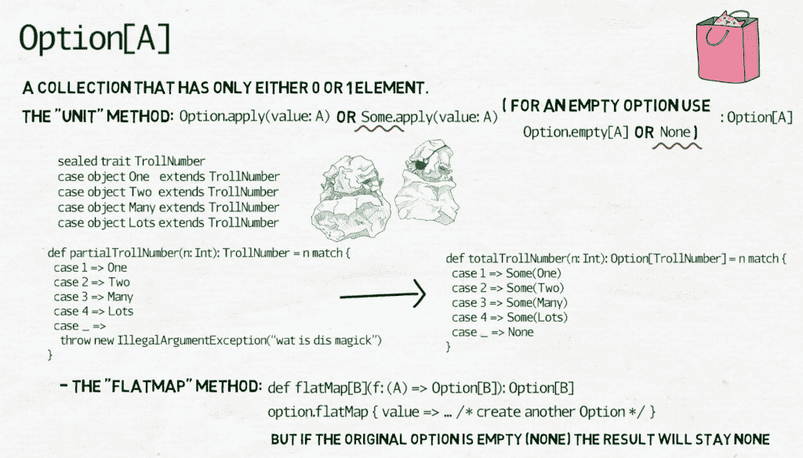
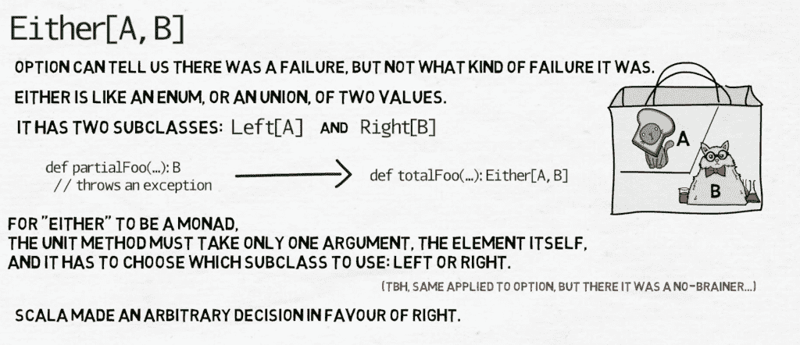
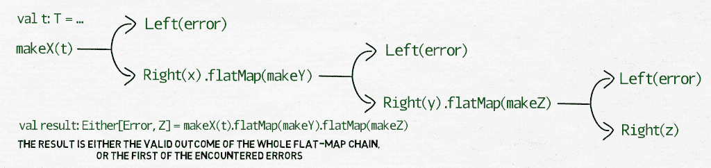

# 函数编程#8:单子

> 原文：<https://medium.com/nerd-for-tech/programming-with-functions-8-monads-c2a30153f5ff?source=collection_archive---------6----------------------->

在 Scala 中，不像 Haskell，monad 只是一个概念——没有一个叫做 Monad 的超类，所有的 Monad 都继承自它。monad 基本上是任何具有静态方法 unit 的包装类(注意:这是该方法的流行名称；它不是单元类型)，它接受一个元素或元素的集合，并创建一个包含它们的单子，它实现了 flatMap，使我们能够对单子进行链式操作:我们可以从原始元素创建一个单子，然后将这个元素平面映射到另一种类型的单子，将元素平面映射到那个单子中，等等。但是语言并没有区分单子类和非单子类。开发人员在编写他们的类时，应该牢记一元规则。

很有可能你可以有一个漫长而快乐的程序员生涯，并且永远不用单子。但是如果我能说服你考虑至少使用一些简单的方法呢？或者也许你已经在不知不觉中使用了它们？有三种:`Option`、`Either`、`Try`。它们将帮助你避免一件我们都应该避免的事情:例外。

## 不要抛出异常。永远不会。

在前面的一章中，我举例说明了一种划分两个双精度数的方法`div`，以及如何使用`Double`类中的一个特殊常量来解决这个问题。Scala 中的`Double`用的就是那两个常量:`Infinity`、`-Infinity`和神奇的`NaN`，只是运气不好。在许多其他情况下，我们就没有这么幸运了，使用某些参数或参数组合会导致抛出异常。

抛出异常就相当于把双手抛向空中，大喊*“OMG，我不知道怎么办！”*逃跑。这并不能解决你的问题。它只是把它交给别人，好像它是一个烫手山芋。千万不要这样做，如果不是因为其他原因，至少是为了那个必须代替你处理异常的人。那个人可能就是你，明天。

从表面上看，抛出异常类似于早期返回、循环中断和 goto 语句。在过去的某个时候，它们都被认为是处理特殊情况的有效方法。该函数将对其参数或中间结果执行一些断言，如果断言失败，它将提前返回一些特殊值。或者它会运行一个循环，从一个集合的元素中计算复杂的结果，但是如果一个元素不是预期的，它会提前中断这个循环。随着时间的推移，出现了许多关于这些结构如何导致不可读的代码、困难的重构和难以预测的结果的批评，并且逐渐地它们不再被使用。我非常相信抛出异常也属于这一类，也应该停止使用。总有比抛出异常或者返回某个特殊值更好的处理问题的方法( **cough* null *cough** )。幸运的是，函数式编程中有一些工具可供我们使用。

## [计]选项

`Option`是最简单有趣的单子(你总是可以在`Unit`类型上定义`flatMap`——它什么都不会做，但是耶，它是单子)。

您可以将`Option`视为一个集合，它可以只有零个或一个元素。它的单元方法仅仅是它的构造函数，它将一个给定类型 A 的元素作为参数，并返回一个包含该元素的`Option[A]`实例。如果你想有一个零元素的选项，你调用方法`Option.empty[A]`。您仍然会收到一个`Option[A]`的实例，即使其中没有`A`类型的元素。在下面，子类`Some[A]`表示带有元素的选项，子类`None`表示空选项。如果您正在编写的函数通常会产生类型为`A`的结果，但是对于某些参数来说，它无法做到这一点，那么您可以自由地将结果类型声明中的`A`替换为`Option[A]`并使用该功能。



```
sealed trait TrollNumber
case object One extends TrollNumber
case object Two extends TrollNumber
case object Many extends TrollNumber
case object Lots extends TrollNumber
```

在特里·普拉切特的 Discworld 系列中，巨魔是一种基于石英的生命形式。他们的智力受到温度的影响:当温度下降到接近绝对零度时，他们可能会非常聪明，但通常他们的智力低于平均水平，而且他们对大数(即大于 2 的数)有一点麻烦。

【巨魔的头颅，作者马特·史密斯，来自 Lwiki，[https://wiki.lspace.org/User:Knmatt](https://wiki.lspace.org/User:Knmatt)，[https://creativecommons.org/licenses/by-nc-sa/4.0/](https://creativecommons.org/licenses/by-nc-sa/4.0/)】

```
def partialTrollNumber(n: Int): TrollNumber = n match {
  case 1 => One
  case 2 => Two
  case 3 => Many
  case 4 => Lots
  case _ => throw new IllegalArgumentException(“oh no!”)
}def totalTrollNumber(n: Int): Option[TrollNumber] = n match {
  case 1 => Some(One)
  case 2 => Some(Two)
  case 3 => Some(Many)
  case 4 => Some(Lots)
  case _ => None
}
```

然后是类`Option[A]`的`flatMap`方法:

```
def flatMap[B](f: (A) => Option[B]): Option[B]
```

您为它提供一个函数`f`，它将获取选项的元素并基于该元素创建一个新的选项，类型为`B`。但是这只有在选项实际上有一个元素时才有效——如果`Option[A]`为空，`Option[B]`也将为空。

我们也可以将这些平面图链接在一起。如果结果是`Some`，第一个被调用函数的结果将作为参数传递给第二个函数，如果结果是`Some`，那么第二个函数的结果将传递给第三个函数，以此类推。最终，只有当所有连续的函数调用都产生中间结果时，我们才会得到`Some(finalResult)`。如果他们中的任何一个以`None`结束，最终的结果也将是`None`。

```
def foo(t: T): Option[X]
def bar(x: X): Option[Y]
def boo(y: Y): Option[Z]
val t: T = ...
val result: Option[Z] = foo(t).flatMap(bar).flatMap(boo)
```

由于一个选项可以被视为任何其他集合——毕竟，它只是一个最多包含一个元素的列表——除了`flatMap` : `map`，`foreach`，`fold`，`filter`等等之外，还有大量的方法可以像它们的对应方法一样用于更常规的集合，即使有时在一个您知道可能最多包含一个元素的集合上使用它们会感觉有点奇怪。

最后，在 Scala 中有一种特殊的情况:如果你用 null 作为元素来提供`Option`构造函数，你将得到`None`，一个空的选项。您不应该显式地这样做，但是有时您可能会因为调用用 Java 编写的第三方库而收到一个`null`。如果您担心这种情况会发生，那么将调用的结果包装在一个`Option`中，并将您自己的逻辑放在`Option.foreach`中。

```
val result = javaLib.getSomethingOrNull(bar)
Option(result).foreach { res =>
  // will be executed only if result is NOT null
}
```

简而言之，`None`，一个空选项，可以用来表示出了问题或者发生了意想不到的事情，无法计算出有效的结果。

## 也

然而，有时我们想知道更多关于发生的事情。这就是为什么有这么多类型的异常的原因——它们不仅用于在发生错误时引起恐慌，还用于大声呼喊阻止您继续计算的悲剧是什么。

`Option`当然太简单了，但这就是为什么有`Either`。就其一般形式而言，`Either`就像是两种价值观的结合，只不过是兴奋剂。一个`Either[A, B]`实例只能包含一个元素，但是这个元素可以是`A`或者`B`类型。类似于`Option[A]`有两个子类:`Some[A]`和`None`，`Either[A, B]`也有两个:`Left[A]`和`Right[B]`。所以每次我们有一个函数

```
def partialFoo(...): B
```

可以抛出一个异常，我们可以把它转换成

```
def totalFoo(...): Either[A, B]
```

其中`B`是有效结果的类型，而`A`是描述错误的数据结构。



但是等等，还有更多。我选择`B`作为有效结果的类型是有原因的。为了使`Either`成为单子，必须有一个偏好:`unit`方法必须只有一个参数，即元素本身，并且它必须自己选择使用哪个子类。此外，`flatMap`方法需要选择它采用什么“路径”——我们是向左还是向右平面映射？Scala 做了一个有利于`Right[B]`的武断决定，从而永远压迫左撇子，比如我(😢 ).得益于此，我们现在可以链接“eithers”:如果我们从一个函数返回一个结果作为一个`Either`，那么我们可以将它平面映射到另一个函数。然后，该函数将接收第一个函数的结果，但前提是该结果属于子类`Right[B]`。然后第二个函数可以产生另一个`Either[C, D]`类型的结果，这个结果可以链接到另一个函数，等等。



但是，如果这些链接的函数中的任何一个产生了错误，处理就在链中的该链接处停止，绕过所有连续的函数调用，并从整个链中返回错误。这就是使用一元进行错误处理的美妙之处:它的优点是只在一个地方处理异常，而没有异常造成的混乱。

```
case class Error(msg: String)
def makeX(t: T): Either[Error, X]
def makeY(x: X): Either[Error, Y]
def makeZ(y: Y): Either[Error, Z]
val t = T()
val result: Either[Error, Z] = 
  makeX(t).flatMap(makeY).flatMap(makeZ)
// the result is either the valid outcome of 
// the whole flat-map chain, or the first of the encountered errors
```

理论上来说，`Either`的左边部分可以用来做任何事情。只有一元规则的实现方式使它特别适合处理错误。我们使用数据本身——例如，如上所述，错误可以由描述错误的文本消息组成——但我们也可以利用类型系统并创建我们的错误层次结构。`Error`可以是一个特征，然后我们可以有 IO 错误、网络错误、无效状态错误等类别。这就是默认的 Java 异常层次结构的工作方式，如果我们觉得懒惰，我们可以使用那个层次结构，而不是创建我们自己的层次结构。例如:

```
def petBlackCat(cat: Cat): Either[Throwable, Purr] = 
  if (cat.colour != Black) 
    Left(new IllegalArgumentException(“this is not a black cat”))
  else 
    Right(pet(cat)) // the method `pet` produces a purr
```

在下一个视频中，我们将继续这个话题，讨论`Try`单子、`for/yield`语法，以及单子到底是什么的一些理论。到时候见。

前情提要:[语句上的表情](/nerd-for-tech/programming-with-functions-7-expressions-over-statements-20fbb7a9114d)

## 链接

*   Scala 文档中的[选项](https://www.scala-lang.org/api/current/scala/Option.html)
*   [在 Scala 文档中](https://www.scala-lang.org/api/current/scala/util/Either.html)
*   [Alvin Alexander 关于 Option + flatMap 的文章](https://alvinalexander.com/scala/handling-nested-options-with-flatmap-for/)(在那里你可以找到他关于这个主题的其他文章的链接)