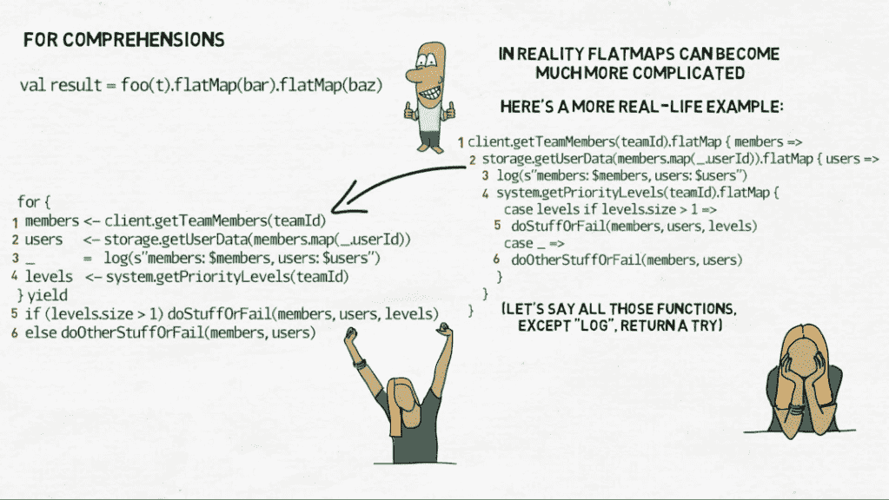
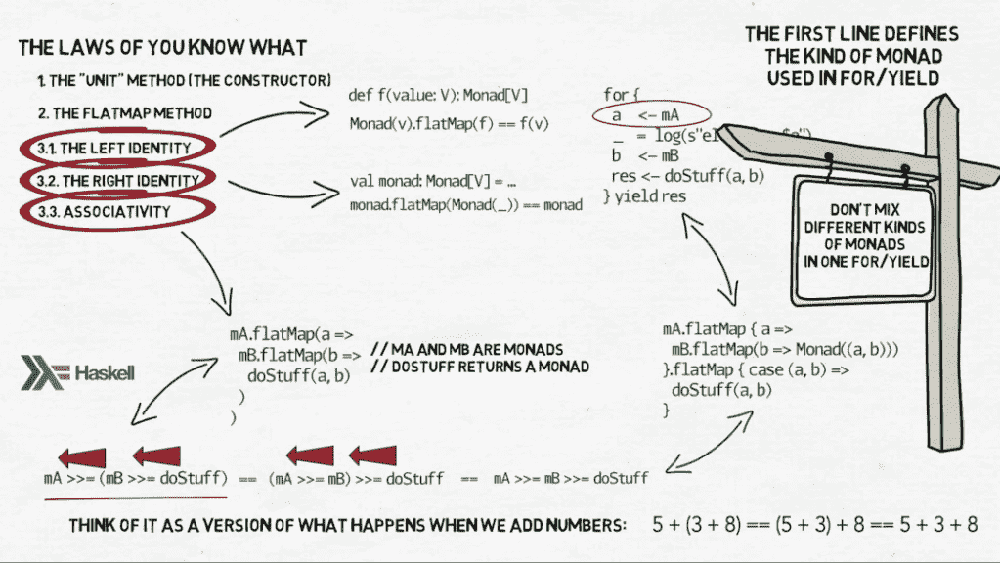

# 函数编程#9:尝试、理解和一元法则

> 原文：<https://medium.com/nerd-for-tech/programming-with-functions-9-try-for-comprehension-and-monadic-laws-4d04c4b77ed7?source=collection_archive---------3----------------------->

# 尝试

在上一集里，我们谈到了`Option`和`Either`，以及如何使用它们来避免抛出异常。但是更多时候，我们从第三方库接收异常，并尝试用`try/catch`子句处理它们。有时我们会重新抛出它们——这是我们在这里试图避免的，所以您可能会认为对这些情况使用`Either`可能有意义。

```
def foo(data: Data): Either[Throwable, Result] = 
  try {
    val res: Result = javaLib.getSomethingOrThrowException(data)
    Right(res)
  } catch {
    case NonFatal(err) => Left(err)
  }
```

异常在 JVM 上是如此普遍，以至于在 Scala 中我们有一个特殊的构造来帮助我们。它被简称为`Try`，你可以把它看作是一个`try/catch`子句的功能版本。如果我们决定使用它，上面的代码将如下所示:

```
def foo(data: Data): Try[Result] =
  Try(javaLib.getSomethingOrThrowException(data))
```

`Try[Result]`和`Either[Throwable, Result]`差别不大。我们可以把`Try`看作是`Either`的一个更专业的版本，甚至更适合处理错误，但仅限于来自 JVM 的错误。这就像一个必要之恶:我们不应该需要它，因为根本不应该有异常，但我们并不是生活在一个理想的函数世界里，异常无处不在，正因为如此我们才使用`Try`。正如`Either`对于成功的计算有`Right`子类，对于错误有`Left`子类一样，`Try`有`Success`和`Failure`。子类`Success[T]`包含成功计算的结果，而`Failure`包含被抛出的异常。与`Either`一样，`Try`使我们能够使用`flatMap`来链接对可能抛出异常的函数的调用。我们还可以访问`map`、`foreach`、`filter`等等。所有这些方法都是在原始计算结果成功的条件下工作的——如果计算最终抛出异常，它们将什么也不做。为此，我们有另外两种方法:`recover`和`recoverWith`。

```
case class Result(text: String)val t: Try[Result] =
  Try(javaLib.getSomethingOrThrowException(data))t.recover {
  case ex: IOException => defaultResult
}t.recoverWith {
  case ex: IOException =>
    if (ignoreErrors) Success(defaultResult) 
    else Failure(ex)  
}
```

它们都取代了`try/catch`中的 catch 子句，但它们的工作方式略有不同。当你确定对于某些异常，你的代码应该返回一个成功的结果时，使用`recover`。`recover`将一个部分函数作为它的参数:这个部分函数应该产生一个结果，这个结果的恢复将包含在一个`Success`中。对于分部函数不支持的所有其他类型的异常，结果仍然是一个`Failure`。`recoverWith`允许更多的灵活性:它接受一个局部函数，这个函数可以单独决定它的结果应该是一个`Success`还是一个`Failure`。您可以想象`recover`是异常的`map`，将它们映射到结果，然后将结果包装在成功的尝试中，而`recoverWith`是平面映射——它将异常平面映射到成功或失败的尝试。另一方面，如果你根本不关心错误，你只想从一个可以抛出异常的方法中得到有效的结果，你可以把一个`Try`变成一个`Option`:

```
Try(javaLib.getSomethingOrThrowException(data)).toOption
```

简而言之:用`Try`代替`try/catch`。

# 为了理解

在上述所有三种情况下——`Option`、`Either`和`Try`——以及其他构造(集合、期货、事件流……)中，我们可以使用平面图将几个接受一些参数的函数链接在一起，并产生同类的构造。我在前面的视频中举了一个例子，但只是一个非常简单的例子:三个函数，每个函数都有一个参数，由前面的函数产生，产生一个结果作为后面函数的参数。

```
val result = foo(t).flatMap(bar).flatMap(boo)
```

这看起来非常干净漂亮，但实际上，那些平面图可能会变得复杂得多。平面图中可以嵌套平面图，我们可能需要在它们之间执行一些操作，并且我们可能需要使用多个函数的结果作为参数。这里有一个更真实的例子:

```
val res = client.getTeamMembers(teamId).flatMap { members =>
  storage.getUserData(members.map(_.userId)).flatMap { users =>
    log(s”members: $members, users: $users”)
    system.getPriorityLevels(teamId).flatMap {
      case levels if levels.size > 1 =>
        doSomeStuffOrFail(members, users, levels)
      case _ =>
        doSomeOtherStuffOrFail(members, users)
    }
  }
}
```

有点丑，对吧？每个调用都需要一个新的嵌套级别。总是有办法解除平面图的嵌套，把它们变成一个链，但是这可能会使代码可读性更差。但是我们还能做什么呢？Scala 为我们提供了语法糖，在这种情况下很有帮助:`for/yield`，也称为 **for-comprehensions** 。Haskell 也实现了类似的东西，即“do”符号。在 Scala 中是这样的:

```
val res = for {
  members <- client.getTeamMembers(teamId)
  users   <- storage.getUserData(members.map(_.userId))
  _       =  log(s”members: $members, users: $users”)
  levels  <- system.getPriorityLevels(teamId)
} yield
  if (levels.size > 1) 
    doSomeStuffOrFail(members, users, levels)
  else 
    doSomeOtherStuffOrFail(members, users)
```

现在好多了。

`for/yield`内的每条“左箭头”线代表一个新的`flatMap`，给出一个成功的结果。如果一个`flatMap`成功了，我们往下走一行，也就是到下一个`flatMap`。如果失败，则跳过所有连续的行以及 yield 后面的行，整个 for-comprehension 返回失败。



# 一元定律

这是可能的，因为单子的一个性质，你不必知道，但我还是要告诉你:**结合律**。正如我之前提到的，单子是一个概念。如果一段代码满足一定的标准，我们称之为单子。就是这样。在这些标准中有“单位”法、`flatMap`法，还有三个所谓的一元定律:

1.  左侧标识
2.  正确的身份
3.  结合性

前两个相当琐碎。他们关心的是“单元”方法，也就是我们用来创建单子的构造函数。比方说，我们有一个函数`f`，它接受一个值并返回另一个值的单子:

```
def f(value: V): Monad[V]
```

**左同一律**说如果我们用“unit”方法创建一个带值的单子，然后用`f`对其进行`flatMap`，那么结果应该和我们只是用那个值调用`f`一样:

```
Monad(v).flatMap(f) == f(v)
```

**右恒等律**说，如果我们有一个单子`flatMap`用“单位”法把它做出来，那么结果应该完全就像我们没有做一样。

```
val monad: Monad[V] = …
monad.flatMap(Monad(_)) == monad
```

第三个定律，**结合律**，稍微复杂一点。基本上，它说应该可以取消一个单子的每个嵌套`flatMap`。为了解释，让我们从上一个示例的更简单版本开始:

```
mA.flatMap(a =>
  mB.flatMap(b => // mA and mB are monads
    doStuff(a, b) // doStuff returns a monad
  )
)
```

在 Haskell 中，我们可以使用操作符`>>=`来代替方法`flatMap`。如果我们这样做了，并且如果我们只对如何将单子与平面图连接在一起感兴趣，而不是对里面的数据实际做了什么，那么上面的代码可以简化成这样:

```
mA >>= (mB >>= doStuff)
```

正如您在括号中看到的，我们将首先对`mB`单子中的内容执行`doStuff`，只有在之后，我们才会将结果传递给`mA`。我们从里到外。但是这里出现了结合律，它说首先使用两个平面图中的哪一个(或`>>=`)并不重要。

```
mA >>= (mB >>= doStuff)
```

应该会给我们相同的结果

```
(mA >>= mB) >>= doStuff
```

这意味着我们也可以完全去掉括号，直接

```
mA >>= mB >>= doStuff
```

你可以把它想象成我们添加数字时发生的事情的一个更普通的版本:

```
5 + (3 + 8) == (5 + 3) + 8 == 5 + 3 + 8
```

不是每个操作都遵守这个规则(例如，减法不遵守)，但是如果我们处理单子，它们的平面图操作遵守。在我们的例子中，这意味着嵌套代码:

```
mA.flatMap(a => 
  mB.flatMap(b => 
    doStuff(a, b)
  )
)
```

可以重构为:

```
mA.flatMap { a => 
  mB.flatMap(b => Monad((a, b)))
}.flatMap { case (a, b) => 
  doStuff(a, b)
}
```

然后我们可以在上面撒上语法糖，得到这个:

```
for {
  a   <- mA
  b   <- mB
  res <- doStuff(a, b)
} yield res
```

在“左箭头”行之间，我们可以插入标准的“赋值”行，用于 log 语句(如上)或更常见的用于简化计算，并将它们存储在中间值中，然后可以用作连续函数调用的参数。尽管有一个或者两个限制:for-comprehension 中的第一行必须是“左箭头”行，因为这是 Scala 编译器决定使用哪种单子的方式。毕竟，`Option.flatMap`要求我们返回`Option`、`Either.flatMap` — `Either`等等。这是由 for-comprehension 的第一行决定的……这也意味着你必须小心不要在一个 for-comprehension 中混合不同种类的单子。这很容易做到，但会导致神秘的编译错误。但至少它们是编译错误。



还可以对左箭头返回的数据进行模式匹配，只有在某些条件为真时才采取进一步的行动。例如，你可能有一个`Boolean`的`Option`,并且想要继续理解只有当它包含`true`的时候:

```
def checkSetting(setting: Setting): Option[Boolean] = ...for { // this is a for/yield for the type Option
  ...
  true <- checkSetting(Settings.IS_RECORDING_ALLOWED)
  ...
} yield { ... }
```

只有当`checkSetting`返回`Some(true)`时，行`true <- checkSetting(Settings.IS_RECORDING_ALLOWED)`才会被通过。如果它返回`Some(false)`或`None`，剩余的 for-comprehension 将被跳过。

Uff。单子说够了。

在这个系列中，还有一个我想讨论的话题。这与函数式编程有点无关，但我认为包含它足够有趣:接下来是 [**复合超过继承**。](https://makingthematrix.medium.com/programming-with-functions-10-composition-over-inheritance-33bfbcf295c3)

**链接:**

[试试在 Scala docs](https://www.scala-lang.org/api/current/scala/Try.html)
[中更多关于单子从“R](https://www.youtube.com/watch?v=d-dy1x33moA)