# 将您的 Windows 屏幕投影到旧笔记本电脑上

> 原文：<https://medium.com/nerd-for-tech/projecting-your-windows-screen-into-old-laptop-179b6f3b1e4d?source=collection_archive---------5----------------------->

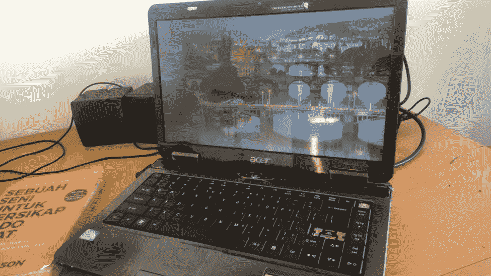

我的旧笔记本电脑

你有旧的笔记本电脑吗？这台设备太旧了，不能正常工作。如果你读了这篇文章，我相信你会的。我非常渴望找到如何将我的屏幕投影到旧笔记本电脑上。我之前已经买过 HDMI 和 VGA 线，没用。我试图按照互联网上的步骤，仍然没有找到它们。甚至在论坛上，我看到有人说，“为什么你需要在你的旧笔记本电脑上投影？你可以把它用得比显示器还多”。当时，我同意这种说法，直到我意识到我的笔记本电脑太旧了，无法正常工作，所以我认为这只是某人的无用评论。

作为一个程序员，你可能已经知道这种方式或者有更多的钱花更多的监视器。但是，作为该领域的初学者，购买显示器并不是最佳选择之一。只会给你家增加垃圾。想想，如果我们中途放弃了呢？

在这个故事中，我想写下将你的窗口从一台笔记本电脑投影到你的旧笔记本电脑的步骤。老实说，当我试图将显示器投影到智能手机上时，我得到了答案。它只需要互联网连接，然后嘣，一切都完成了。

# 流动

这是我们将通过的所有步骤的流程。

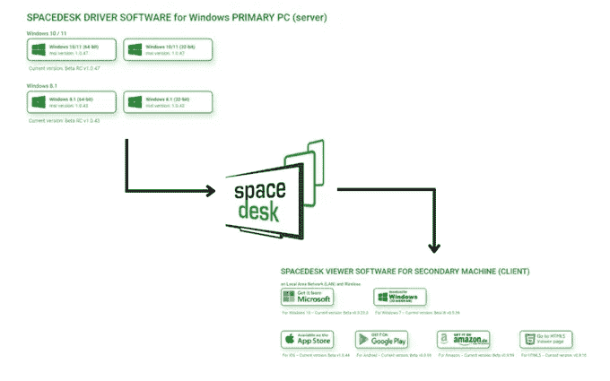

嗯，从其他设备投影你的窗口是使用` [spacedesk](https://www.spacedesk.net/) `。我认为这是一个被低估的应用程序，可以帮助很多人。但要让这个应用传播得更广，开发者应该多做广告。他们使用的文档已经很棒了。这里有一个来自[网站](https://www.spacedesk.net/)的视频截图。

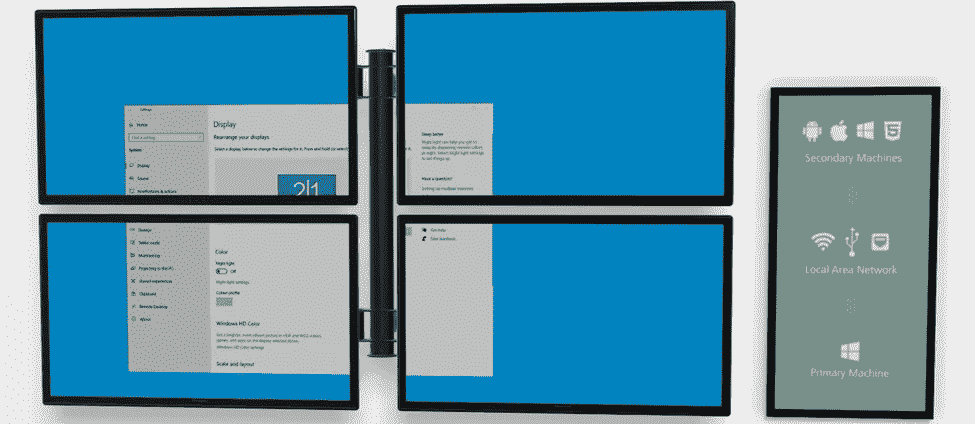

好吧，让我们看看文件。

# 文档

我将把文档分成两部分，因为我们应该配置服务器和客户机。

## 计算机网络服务器

1.首先，你必须从源代码下载应用程序，或者只需简单地按下这里的下载就会自动开始。

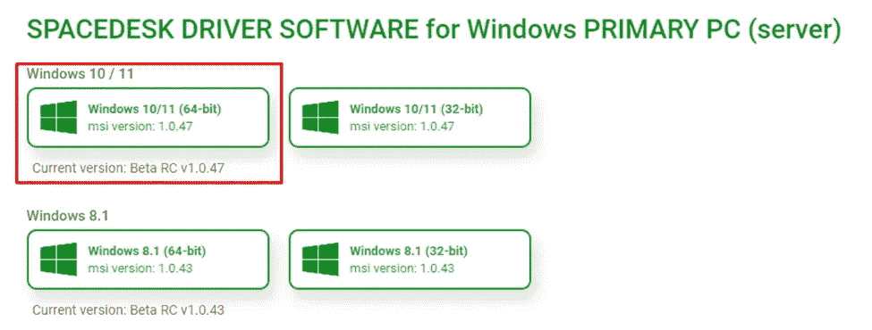

2.下载完成后，启动已安装的应用程序，然后单击下一步。

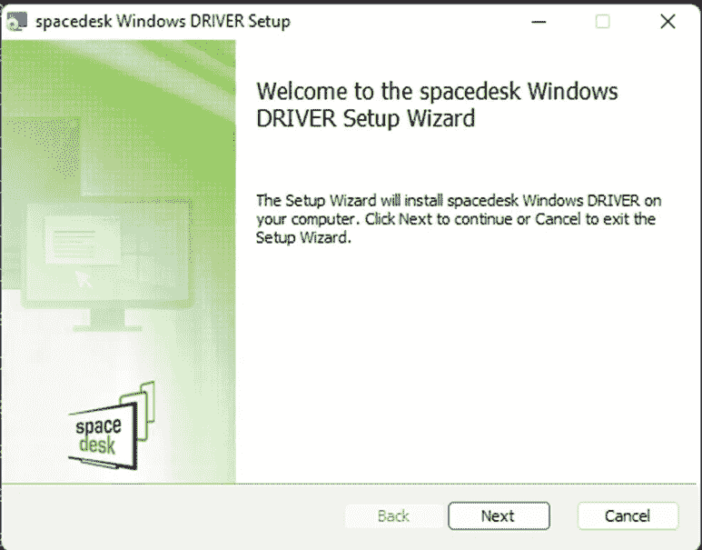

3.阅读或只是检查协议，然后单击下一步。

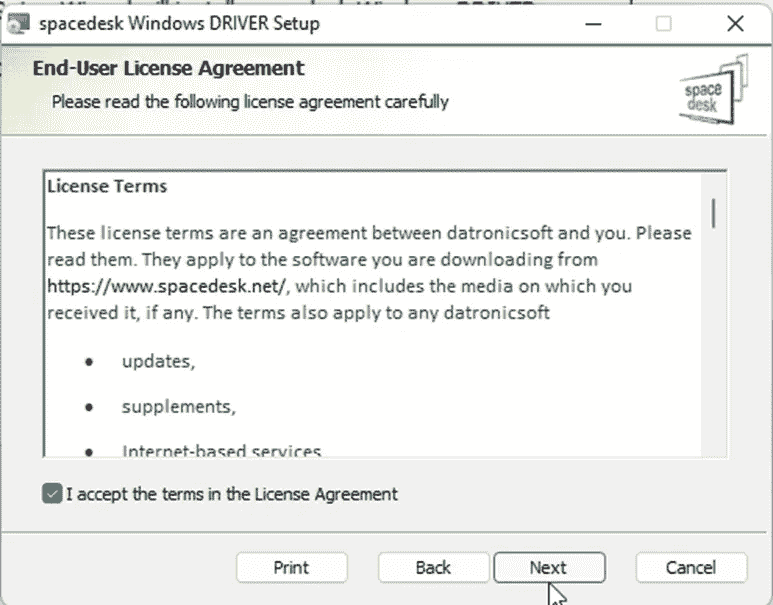

4.请选择“spacedesk Windows 驱动程序”的位置，我更喜欢将它安装在 c 盘上。

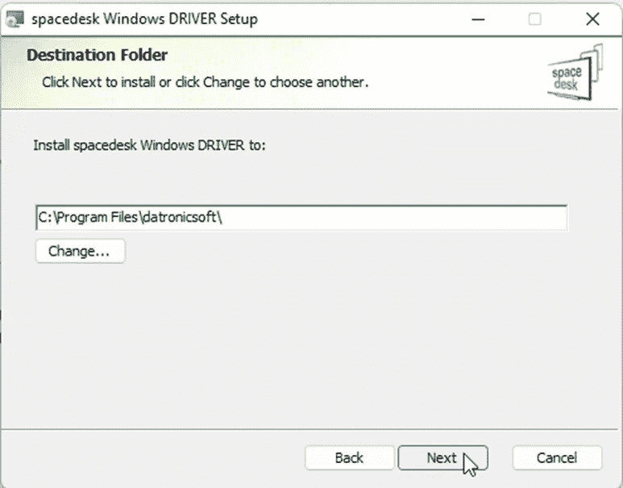

5.下面的步骤很重要。不要忘记在防火墙上添加一个例外，因为如果您忘记了这一步，除了本文档之外，您可能需要手动配置它。

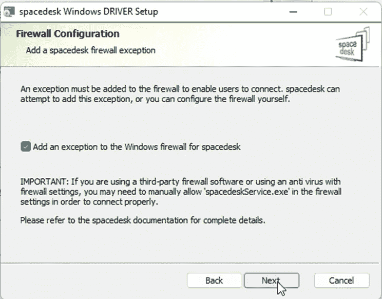

6.点按“安装”,等待安装完成。

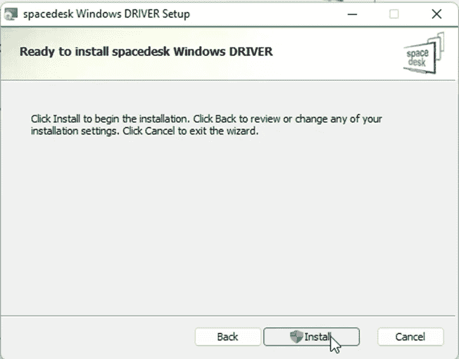

7.Tadaaa，服务器的安装已经完成，点击 Finish，服务器端已经配置好了。单击“完成”退出。

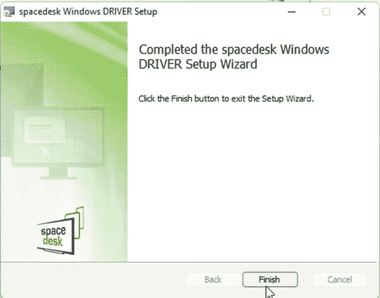

8.打开应用程序，别忘了打开`spacedesk Status`。

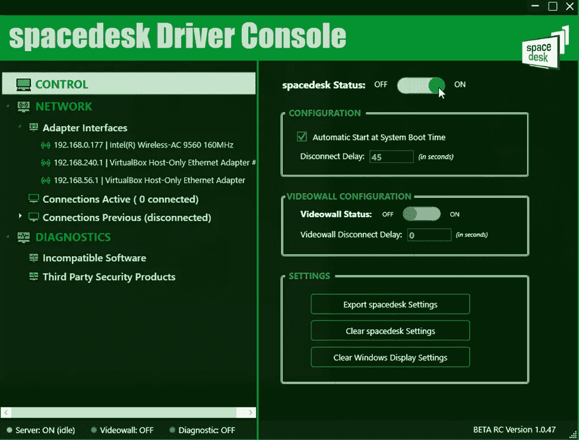

```
Most Common Error:
You probably found errors such as MinGW or C++ errors. I re-run the installation using the administrator privileges saved in the C drive to solve the problem.
```

## 客户

1.对于客户端，正如你所看到的，你可以把它安装在你喜欢的许多设备上。我已经在我的 Android、Windows 7 和 Windows 10 上测试过了。在这个文档中，我们把它安装在 Windows 10 中。

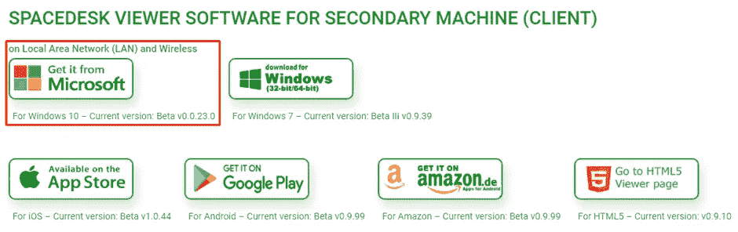

2.如果选择 Windows 10，必须打开微软商店。

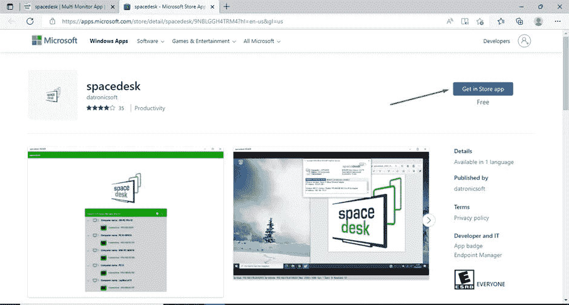

3.单击获取，等待下载开始。

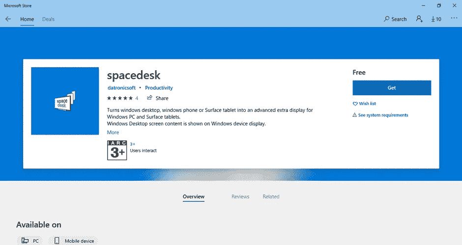

4.下载不会花很长时间。

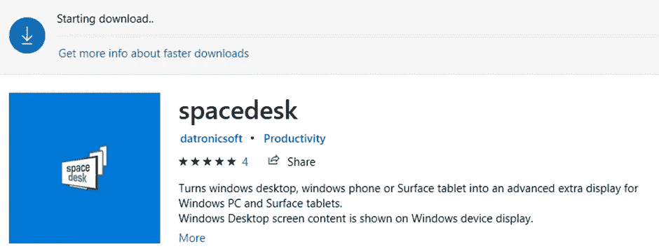

5.如果下载完成，您会收到通知(如果您没有关闭通知栏)

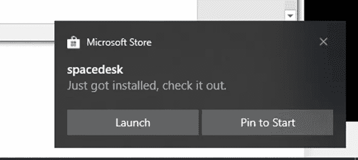

6.打开应用程序，您将看到已经连接的服务器。它将扫描您网络中的所有“spacedrive 服务器”。

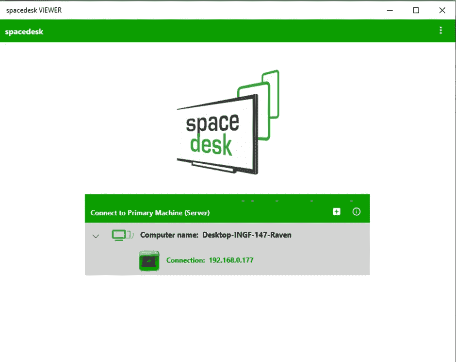

7.如果你点击“连接:xxx.xxx.xxx.xxx”，程序会投射出主屏幕。

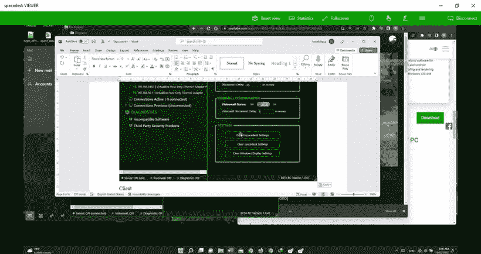

这是这些作品完成的证明。

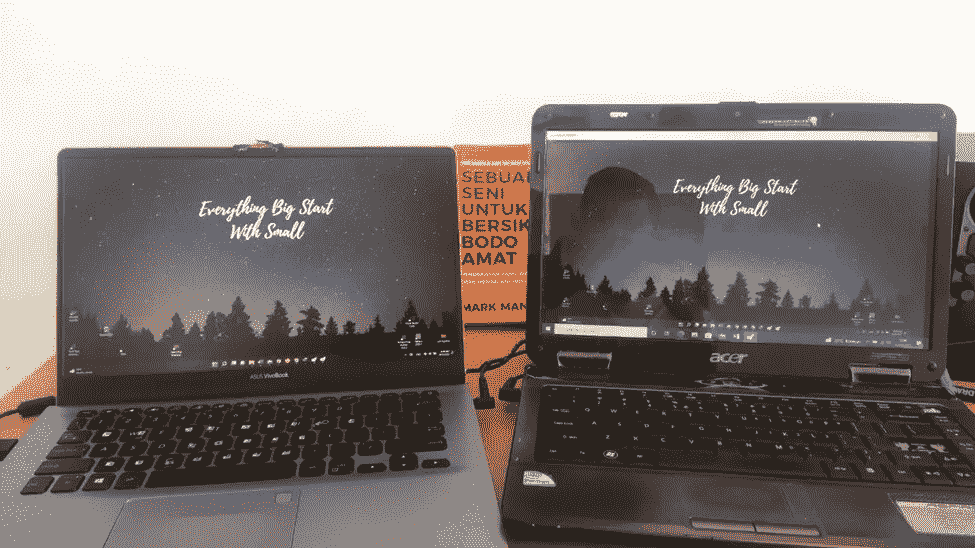

## 其他提示

使用这个应用程序，你可以实现几个技巧来投影你的旧设备屏幕。

1.“spacedrive”应用程序使用网络作为显示器共享，因此您可以更改屏幕选项，无论是复制、扩展等。

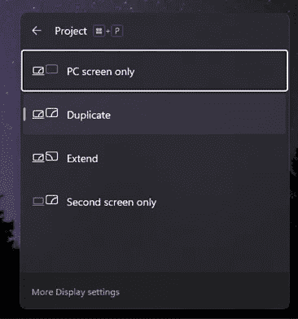

2.在客户端，有时设备看起来太慢。您可以通过打开设置来调整分辨率。在压缩部分，您可以更改编码颜色。如果您选择高色彩质量选项，您将获得更高的结果。尽管如此，速度会降低，因为它使用网络传输信息。我更喜欢使用低色彩质量来获得高速传输。

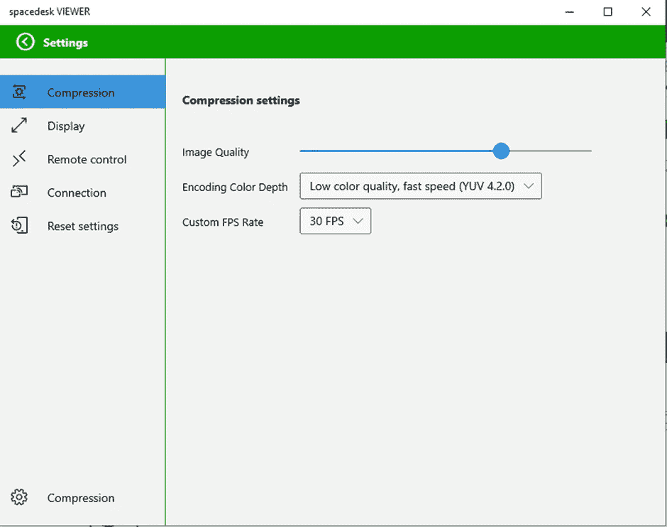

3.您可以控制显示选项，如屏幕分辨率或保持显示器清醒。

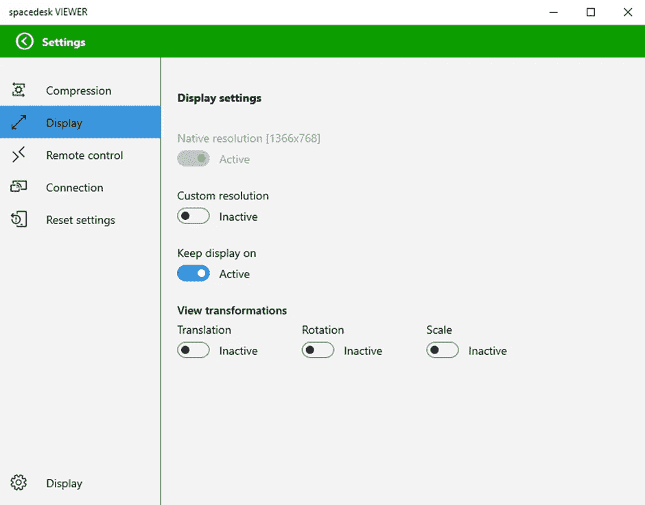

好吧，最后，多探索一下，是你的选择。

# 结论

恭喜，您现在可以将 windows 屏幕投影到旧设备上了。我希望它能给你额外的现金，因为你不能卖掉旧机器，因为它们有内存。而且，你不必把更多的垃圾带进你的房间。不是要打击，但我相信人们喜欢开始，但不喜欢结束。最后，感谢阅读。

# 查看相关内容

关于投射一些东西，我已经在创作一些类似的故事了。也许你找到了一个匹配的。你可以很容易地访问它。

[](https://handhikayp.medium.com/projecting-your-visual-studio-code-live-server-into-another-device-af9163c9ef40) [## 将 Visual Studio Code Live 服务器投影到另一个设备中

### 如今，使用多台电脑的现象越来越普遍。对于许多开发人员来说，它可以帮助很多，所以他可以使用一个…

handhikayp.medium.com](https://handhikayp.medium.com/projecting-your-visual-studio-code-live-server-into-another-device-af9163c9ef40) [](/nerd-for-tech/streaming-smartphone-from-your-desktop-very-light-no-root-required-1aa0e8002b20) [## 从您的桌面上流式智能手机非常轻(不需要根)

### 你是流光吗？游戏玩家？或者一个需要更大显示屏的人？本文将分享如何镜像…

medium.com](/nerd-for-tech/streaming-smartphone-from-your-desktop-very-light-no-root-required-1aa0e8002b20) 

## 注意:

如果你在我的图片上看到一本书，它只是推荐你阅读，而不是广告。因为阅读打开了知识之门，马克·曼森《起源》书名(不给 A F*ck 的微妙艺术)。😇