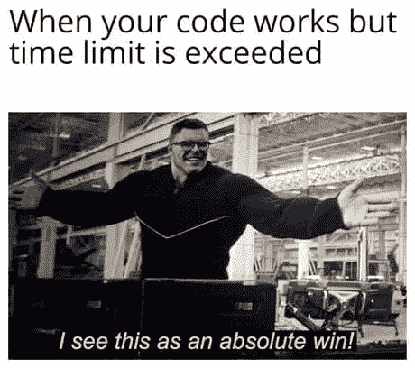

# 项目与竞争性编程

> 原文：<https://medium.com/nerd-for-tech/projects-vs-competitive-programming-f0c997486aeb?source=collection_archive---------4----------------------->

初学者和中级程序员会问很多关于这个的问题。此外，那些正在为实习做准备的人脑子里会有这样一个问题，面试时什么更重要？我们是应该更专注于**竞技节目**还是**项目**？对于竞技程序员的编程能力有很多误解。有些人认为他们有“最差的编码风格”，这是不完全正确的。据信，他们的唯一目的是解决问题，大多数时候，他们的代码是不可读的。让我们揭开真相！

资料来源:发展至

因此，在这篇文章中，我将表达我的观点和一些关于这些问题的事实。

不管是哪家公司，第一轮都是*编码回合*，要求你在规定时间内解决问题。如果你成功了，你就有资格进入下一轮。这第一轮的经历对每个人来说都会不一样。一些学生由于各种原因无法通过这一轮考试，比如他们不习惯参加**限时**考试，或者他们被所谓的**过度自信**的邪恶所困。考虑到你需要面对的所有障碍，正确地为这一轮做准备是非常重要的。

让我们考虑一个场景，其中学生 Bob 在学习编程语言的过程中已经完成了各种课程。但当涉及到解决诸如 **LeetCode** 或 **Codeforces** 等平台中的问题时，他发现解决这些问题极其困难。此外，他在早期就失去了信心。更令人沮丧的是，他在第一轮面试中就被拒绝了。那么，他之前应该做了什么，又该如何提升自己呢？他应该做的第一件也是最重要的事情是实际实施他在课程中学到的东西，并开始在像 **HackerRank** 和 **HackerEarth** 这样的平台上练习，并开始参加竞赛，这样他就可以习惯有时间限制的测试。然后慢慢地，他必须转移到平台上，例如 **LeetCode** 和 **Codeforces** 。

现在，如果一个人通过了第一轮，但他的简历中的**项目部分**是空的，或者只做过一些基本的项目，比如一个简单的计算器应用程序，或者一个简单的银行管理系统迷你项目，该怎么办？让我们试着理解这种情况。再一次，让我们提出与主题相关的问题，项目和竞争性编程同等重要吗？基于公司，这些是如何比较的？考虑一个人，他在编码平台上有更高的排名和评级，那么他的**推荐**被 HR 接受的机会就比普通程序员多。但是，只有在上述情况下，项目的重要性才被意识到。

因此，需要注意的是，如果你是一名优秀的有竞争力的程序员，在知名的编码平台上有很高的评级和排名，那么你的简历上有**中级项目**就足够了。但是，如果你是一个中等水平的有竞争力的程序员，那么在简历中展示一些伟大的项目就变得非常重要。此外，这里需要注意的更重要的一点是**初创企业**通常更喜欢项目，而不是基于技能的竞争性编程。我听说过许多人被拒的故事，他们被拒的原因仅仅是因为他们简历上的项目较少，尽管他们非常擅长竞争性编程。

所以，记住这些要点，准备你的面试。万事如意！希望这篇文章真的有帮助。

如果您有任何疑问，请在下面的**评论**部分发帖。在 [LinkedIn](https://www.linkedin.com/in/vaidhyanathansm/) 上与我联系。此外，如果你想看看我开发的惊人的应用程序集，别忘了查看谷歌 Play 商店。

了解我更多[在这里](https://vaidhyanathansm.tech/)。

话虽如此，感谢您阅读我的文章和*快乐编码！*