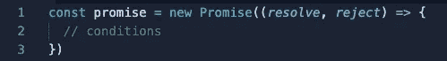
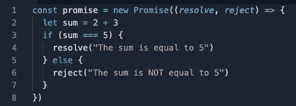
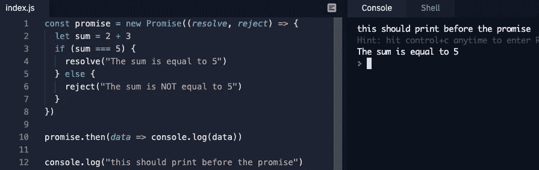
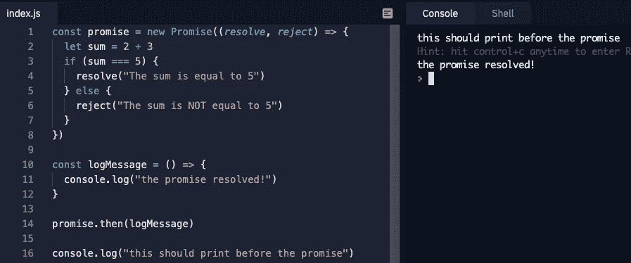
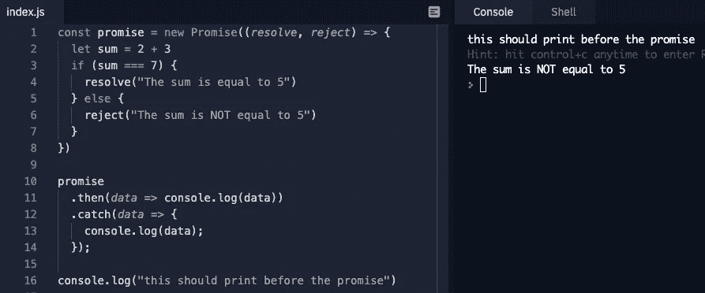
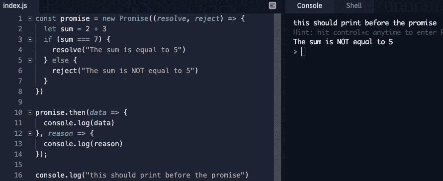

# JavaScript 中的承诺

> 原文：<https://medium.com/nerd-for-tech/promises-in-javascript-88da85b1c65e?source=collection_archive---------26----------------------->

## 什么是承诺？

来自 MDN 的一个很棒的定义:*promise 对象表示异步操作的最终完成(或失败)及其结果值。*

JavaScript 承诺类似于我们在现实生活中对承诺的看法。一个承诺要么被履行(“解决”)，要么被打破(“拒绝”)。我们的承诺是从一个构造函数创建的，并接受一个带有两个参数的回调函数，一个用于 *resolve* ，一个用于 *reject* 。

承诺本质上是异步的，并且在 JavaScript 调用栈上运行了所有同步代码之后返回。它们非常适合执行通常需要很长时间才能运行的代码(例如，从服务器获取数据)，而不会导致调用堆栈被阻塞。基于承诺中的条件，它要么被解决，要么被拒绝。让我们看看这是什么样子:

如果条件在承诺中得到满足，我们希望解决承诺，否则，我们拒绝它。在上面的例子中，我们看到我们的承诺应该被解决，因为 sum === 5 为真。但是我们实际上如何返回*解析*中的数据呢？

## 用*进行承诺链接。然后()*和。catch()

为了看到我们承诺的结果，我们需要添加或“链接”一个方法。为了返回一个已解决的承诺，我们链接*。然后()*。该方法接受一个回调，该回调可以选择访问我们解析的数据作为参数。让我们看两个例子:第一个例子是利用匿名回调中的可选参数来显示我们解析的数据，第二个例子是传递一个现有的回调而不使用解析的数据。两个回调都不会运行，直到调用堆栈为空，并且承诺已经通过回调队列并返回到调用堆栈。我添加了一个同步 console.log 来演示:

记录来自已解决承诺的数据的示例

执行现有回调而不是使用已解析承诺中的数据的示例

如果一个承诺被拒绝，我们需要在*上加上锁链。catch()* 方法返回承诺。数据可以作为回调的参数访问，就像*一样。然后()*作品。注意*。catch()* 只会返回已被拒绝的承诺:

**边注:**可以用*退回被拒绝的承诺。然后()，*然而，这并不是一个很常用的方法:

退回被拒绝的承诺。然后()

## **承诺的三种状态**

我们的承诺有三种状态:**未决、已解决、**或**拒绝**。承诺在到达事件循环中的调用堆栈后处于“待定”状态，并被发送到 Web APIs 容器(参见我的[关于 JavaScript 事件循环的博客](https://javascript.plainenglish.io/what-is-the-javascript-event-loop-84d21ef276ee))。我们的 promise 主体将在 WebAPIs 容器中执行，并确定是被解析还是被拒绝，而其余的同步代码在调用堆栈中运行。一旦调用栈为空， *resolve* 或 *reject* 方法(取决于我们的承诺)将访问调用栈，我们将可以在*中访问它的数据。然后()*或者*。catch()* 方法。

## 承诺和回访

承诺解决嵌套回调过多的问题，也称为“回调地狱”。关于这个话题的更多信息，我建议观看 Dev Ed 的伟大的 YouTube 视频。