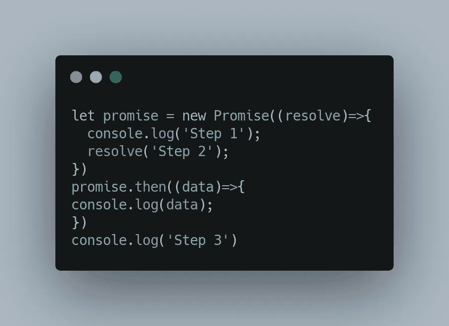
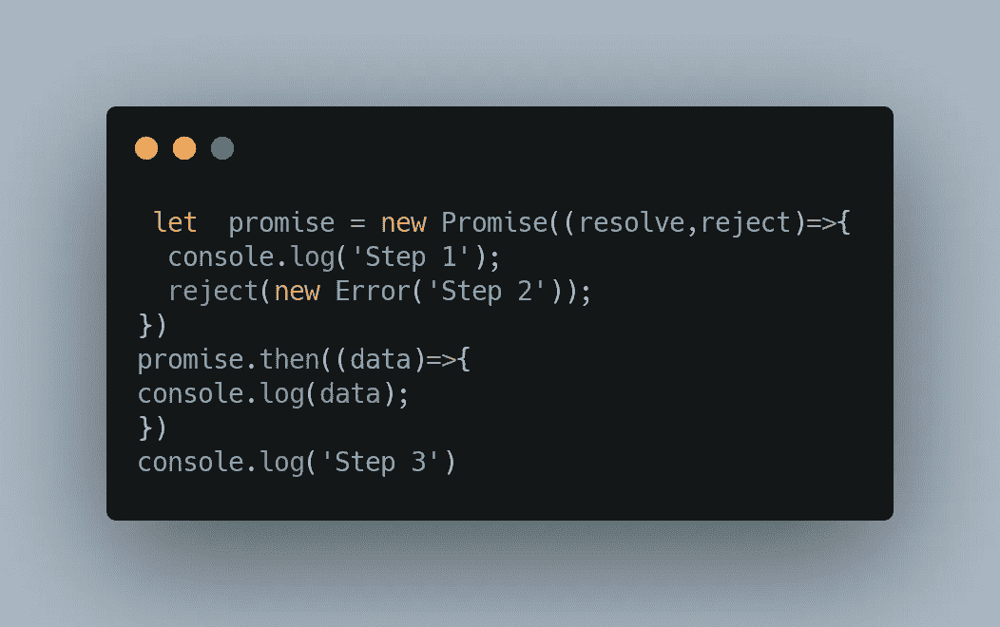
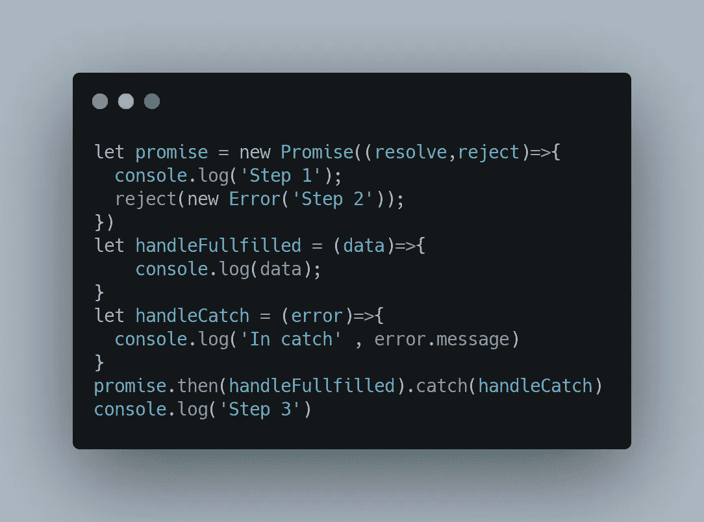
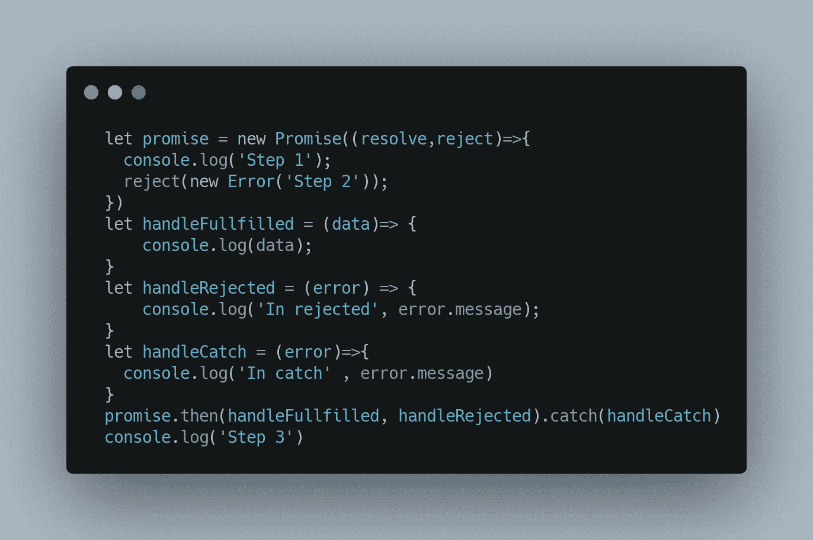
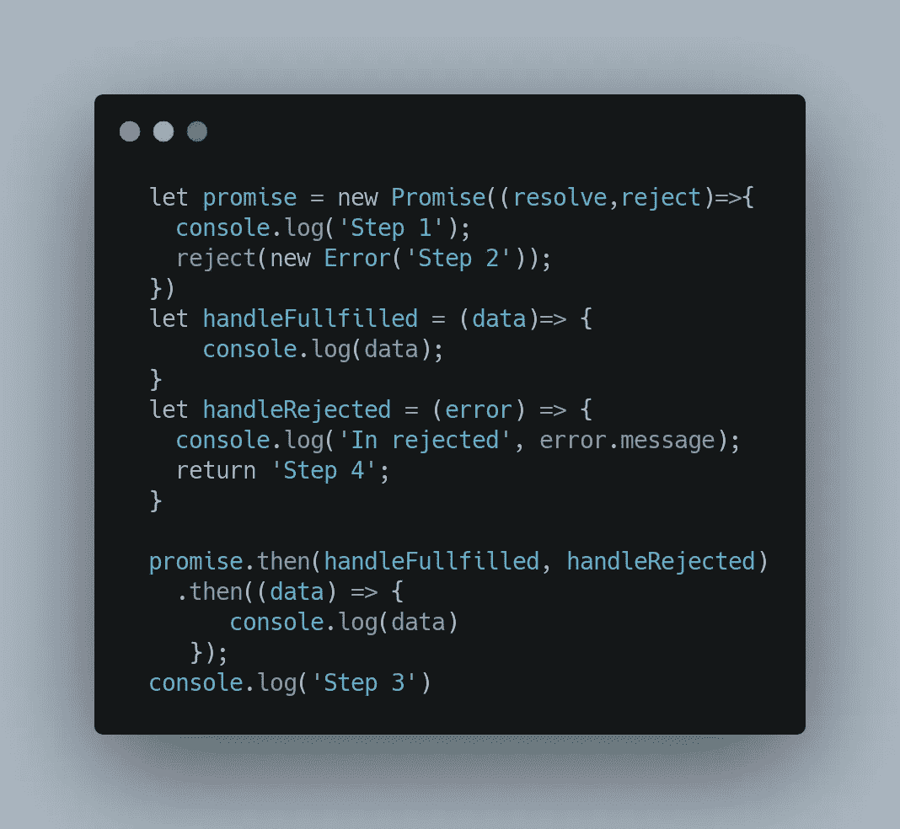
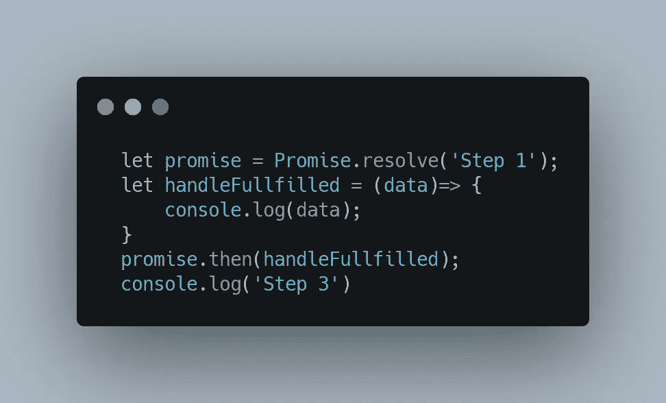
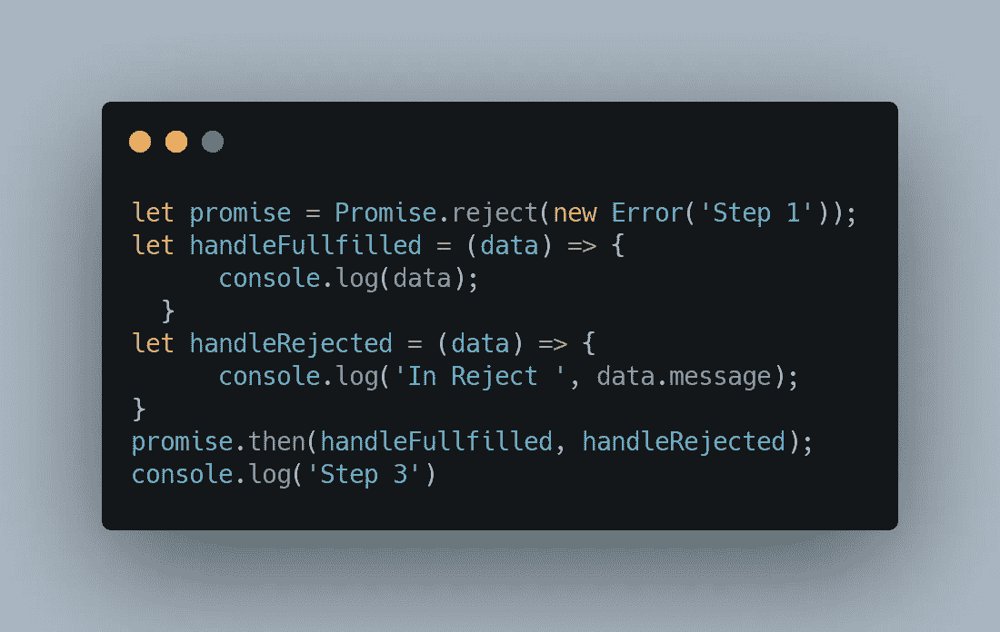
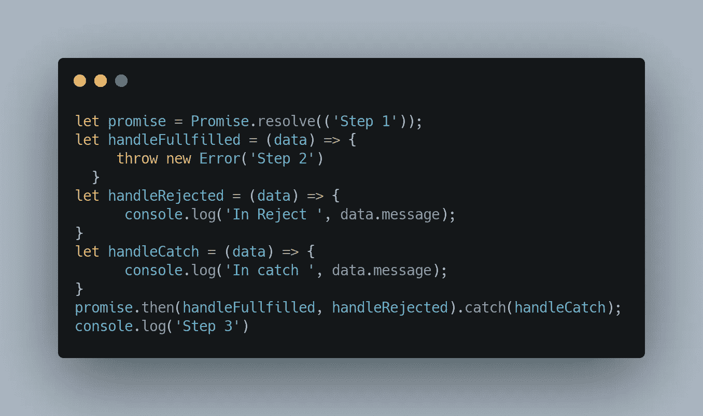
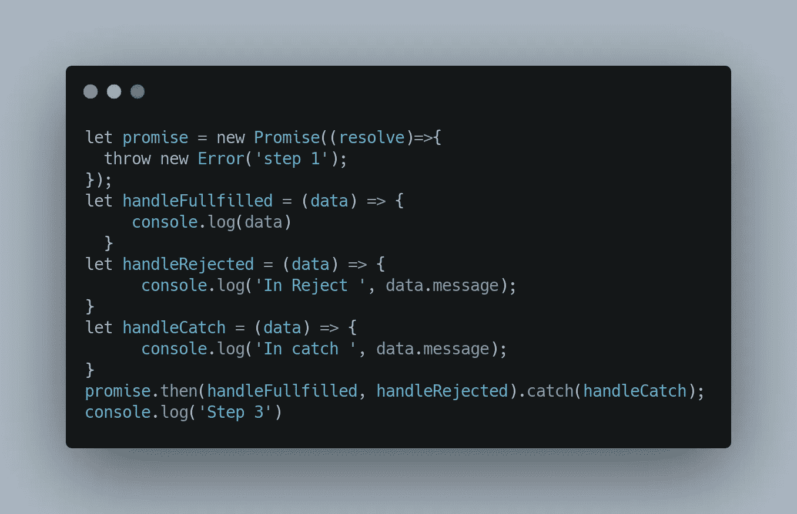
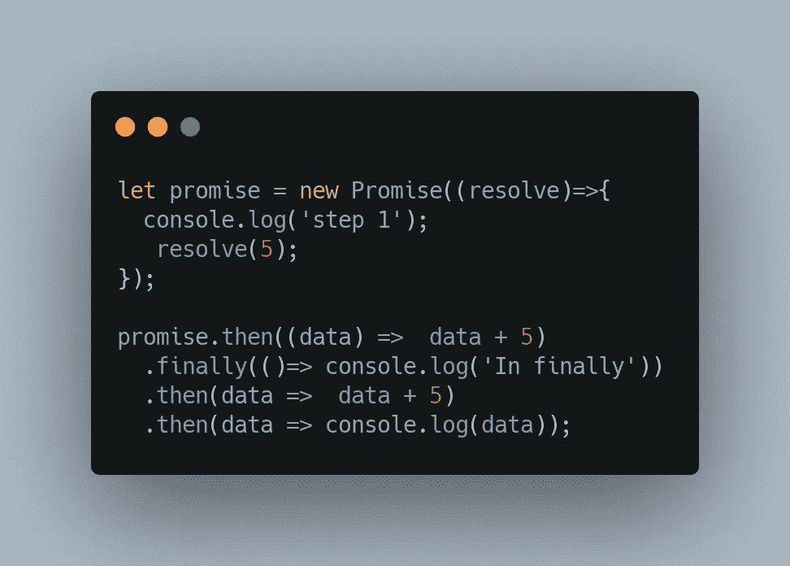

# JavaScript 中的承诺片段

> 原文：<https://medium.com/nerd-for-tech/promises-snippets-in-javascript-40a7faea8d6b?source=collection_archive---------5----------------------->

JavaScript 中的承诺看似简单，但细节处理起来很复杂。让我们通过一些片段来分析输出。我建议你仔细想想这些片段，想象一下它会打印出什么。

# 1.承诺创建和解决

## 输出

第 1 步
第 3 步
第 2 步

## 理由

**步骤 1** 当我们创建承诺时，承诺中的函数执行并打印它。

**第三步**第二行因为涉及到解决承诺，所以推迟到以后执行。第三行执行并打印。

**步骤 2** 由于没有要执行的内容，promise 在下一次执行时解析并打印解析的数据**。**

# 2.拒绝承诺

## 输出

第 1 步
第 3 步
未捕获(承诺中)错误:第 2 步

## 理由

**步骤 1** 和**步骤 3** 参见片段 1

这里要注意的有趣的事情是 reject 并没有立即抛出错误。当有人试图访问**时，它会抛出错误。然后**。错误没有处理程序，所以它在控制台中打印出来。

# 3.捕捉被拒绝的承诺

## 输出

捕捉步骤 2 中的步骤 1
步骤 3

## 理由

**步骤 1** 和**步骤 3** 参见片段 1

**在捕捉步骤 2** 中，我们已经为**承诺编写了捕捉，然后**错误在那里被捕捉并打印出来。

# 4.处理拒绝

## 输出

拒绝步骤 2 中的步骤 1
步骤 3

## 理由

**步骤 1** 和**步骤 3** 参考片段 1

**在拒绝步骤 2 中，**有一个 **promise.then 拒绝的处理程序。**不会调用 handleCatch，因为错误已经由 handleRejected 处理。

# 5.链接拒绝

## 输出

步骤 1
步骤 3
中被拒绝的步骤 2
步骤 4

## 理由

**步骤 1
步骤 3
在被拒绝的步骤 2 中，**参考片段 5

**第四步，**每隔**。然后**回一个承诺，可以被链。即使承诺被拒绝，handleRejected 也返回步骤 4。这可以作为正常的承诺。这是一种从错误中恢复的方法。

# 6.承诺.决心

## 输出

第三步
第一步

## 理由

这类似于代码片段 1。Promise.resolve(“步骤 1”)返回一个承诺。当它解决时，它给出步骤 1。

# 7.承诺.拒绝

## 输出

拒绝步骤 1 中的步骤 3

## 理由

这类似于我们在代码片段 2 中看到的创建一个承诺并拒绝它。我们可以使用一条语句来创建状态为“已拒绝”的承诺。

# 8.处理完成时抛出错误

## 输出

捕捉步骤 1 中的步骤 3

## 理由

在履行承诺的过程中出现错误。因此，这个问题被称为“捕获”。由于 handleFulfilled 中的错误，未调用有趣的 handleRejected，调用了 handleCatch。

# 9.创建承诺时出现错误

## 输出

拒绝步骤 1 中的步骤 3

## 理由

创建承诺时出现错误。因为在创建承诺本身时抛出了错误，所以调用了 handleRejected。

# 10.最后与链接

**输出**

第 1 步
终于到了
15

## 理由

**。最后,**可以与承诺链接，并在其所有先前的链接被执行后被执行。

每个承诺.然后返回另一个承诺，并且可以被链接。因为我们已经两次返回数据+ 5。结果是 15。