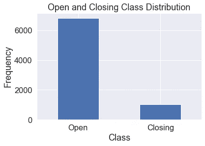
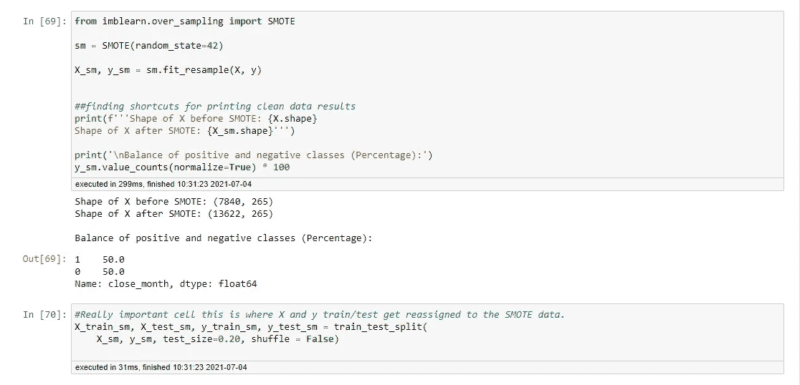
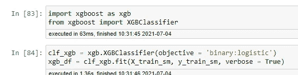
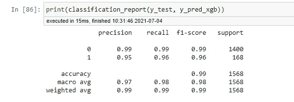

# 正确使用 SMOTE

> 原文：<https://medium.com/nerd-for-tech/properly-using-smote-930924e81ab5?source=collection_archive---------9----------------------->

## 学习经历的故事

学习任何新东西都是一个学习的过程。你不知道，直到你知道。从你第一次学习的时候开始回顾工作总是很有见地的。用“我到底在想什么”的内心对话来嘲笑自己？？这太可怕了！!"

最近，我和一位经验比我丰富得多的数据科学家一起喝咖啡。他翻看了我的笔记本，总体来说非常互补。然而，在某一点上，他皱着脸问道:“为什么你在模型上的训练和测试集都使用 SMOTE？”过了一会儿，我回答说“因为……嗯……我不知道”。

我接受了他的建议，使用 SMOTE 数据集进行训练，使用原始数据集进行测试。这样做提高了我的模型的准确性，也给我留下了一些关于这项技术的新发现。在这篇文章中，我想回顾一下什么是 SMOTE，什么时候使用它，以及如何正确地使用它。

# 什么是 SMOTE？

SMOTE 代表合成少数过采样技术。它类似于统计学中的 bootstrapping 技术，对*已知*人口进行重采样，以生成合成数据点来代表*未知*人口。

# 什么时候用 SMOTE？

在现实世界的数据中，我们经常会遇到阶级不平衡的问题。类别不平衡发生在分类变量上。很多时候这是我们在进行二元分类的时候，把一个变量分类为 1 或者 0。

# 如何正确使用？

使用 SMOTE 时，不能同时用于训练集和测试集。对我来说，这就是使用这种方法的神奇而难以捉摸的秘密。这背后的理论是，这是适当的膨胀你的训练集，因为它有助于模型学习它在做什么。然而，一旦你开始测试，你就必须使用真实世界的数据。如果该模型是在增强数据上测试的，那么它就不能代表现实世界中正在发生的事情。所以你在 SMOTE 数据上训练，在保留的原始数据上测试。您可以在下面的代码中看到，我将模型的训练集用作 *X_train_sm* ，将测试集用作分类报告的 *X_test* 。在这个特定的模型中，我使用了一个基于时间序列的数据集，因此您会注意到我将 shuffle 设置为 *False* ，以便模型按顺序使用数据。

# 结论

弄乱变得凌乱是学习的一部分。我正处于人生的一个转折点，我不再为自己的错误感到羞耻，而是欣然接受。我花了一整天的时间检查我的笔记本，纠正错误。在某些情况下，它甚至降低了我的模型的准确性，但它是真实的。让我的作品反映真实的生活是谦卑和有见地的。从错误中学习是成长的唯一途径。