# 自定义三维 Koch 雪花的属性

> 原文：<https://medium.com/nerd-for-tech/properties-of-a-custom-3-dimensional-koch-snowflake-5f282845ceec?source=collection_archive---------6----------------------->

**简介**

D 在我上高中微积分课时，我们学习了基本的倒易函数:1/x。我们研究了该函数的积分，并计算了它绕 x 轴旋转的体积。我被一个三维图形的想法迷住了，这个三维图形具有有限的体积，但违反直觉地具有无限的表面积。这让我想起了之前我一直在研究的分形。有一种分形特别引起了我的共鸣，它让我对那些物理性质不符合逻辑的物体产生了新的兴趣。在很久以后的一次科学展览会上，我本能地参观了数学岛，令我惊讶的是，科赫雪花就在那里。我总是在二维空间看到它，但从来没有在三维空间看到它，因此我对它做了一些研究，发现它与二维版本具有预期的相似特征，但因为它是三维的，所以它有两个新的几何属性:总表面积和体积。三维版本的复杂让我体会到了二维科赫雪花的错综复杂。随着进一步的研究，我发现，与 1/x 的旋转体积中的加布里埃尔角类似，随着分形迭代接近无穷大，三维科赫雪花在体积和表面积方面具有有争议的有限性。这激发了我的兴趣，促使我将这个想法用于我的内部评估。

对于我的数学探索，我将调查我的自定义科赫雪花模型的总表面积和体积的收敛性。为了实现这一点，我将为自定义科赫雪花分形的连续迭代制作总表面积和体积的数学模型，并使用本课程微积分选项中的方法测试它们的收敛性；比率检验和积分检验。然后，我会使用我的编程知识来建模和计算体积和总表面积，通过观察它们如何随着分形迭代的增加而变化，来确认它们的收敛或发散。

一个[分形](https://fractalfoundation.org/resources/what-are-fractals/)是一个永无止境的重复几何形状的图案。它们是无限复杂的模式，在不同的尺度上是自相似的。分形是通过在一个持续的反馈循环中反复重复一个简单的过程而产生的。分形图案非常熟悉，因为自然界充满了树木、河流、海岸线、山脉、云彩、贝壳等形式的分形(*分形基础)。理解分形有助于数学家可视化各种无穷级数，模拟细菌生长，并在特殊情况下，如 mandelbrot 集，确定概率。*

**科赫雪花**

T2 科赫雪花是由瑞典数学家尼尔斯·法比安·黑尔格·冯·科赫创造的。在他 1904 年的论文中，他用科赫雪花图证明了在每一点都连续但在任何一点都不可微的图形是可能的。科赫雪花的产生始于科赫曲线。Koch 曲线是这样构建的:取一条线段，用它自身的两个副本替换中间的三分之一，形成一个等边三角形的两条边，然后对其后的每个子线段递归地重复这一过程。查看第一次迭代，曲线的总长度增加了 4/3 倍，这适用于所有后续迭代。由此可见，科赫雪花的周长是无限的。

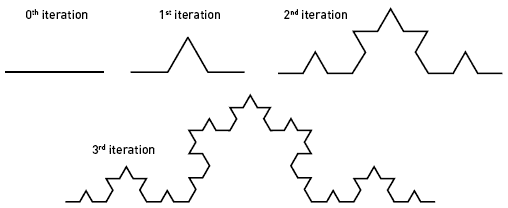

图 1( [*安嫩伯格学习者*](http://www.learner.org/courses/mathilluminated/units/5/textbook/06.php) )

为了做出科赫雪花，形成等边三角形的三条等长的线成为起点。从这里开始，就像曲线一样，每条边被分成三个线段，中间的线段被边长等于被删除线段长度的等边三角形代替。图 2 显示了 Koch 雪花的前四次迭代。

图 2( [诺埃尔，威廉 L](http://www.cmath.info/html/kochPerimeter.html)

**三维科赫雪花**

与二维 Koch 雪花不同，三维雪花的迭代是在面上进行的，而不是在边上。因为它是三维的，所以它有体积和总表面积。由于三维科赫雪花是一个新奇的想法，它不存在官方认可的模型。如下所述的模型。

对于所研究的三维雪花的版本，起点是边长为 s 的正四面体(基于三角形的金字塔)。对于每次迭代，在每个三角形面上添加一个边长等于上一次迭代中四面体边长一半的新四面体。图 3 显示了在四面体的一个面上的前三次迭代。

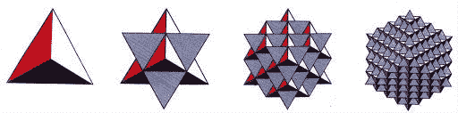

不同迭代下的 Kock 雪花 3D 插图

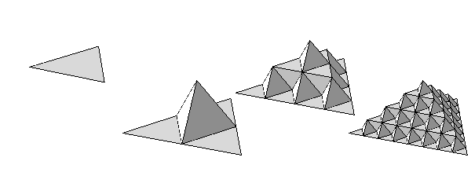

图 3( [科赫雪花](http://en.wikipedia.org/wiki/Koch_snowflake#/media/File:Koch_surface_0_through_3.png))

为了简化计算这种定制的 3D Koch 雪花的体积和总表面积的方法，将使用从雪花的这一个面的推导来导出通用公式。此后，因为四面体有四个面，所以所获得的量将乘以因子 4，以说明基础四面体的所有面。

**定制 3D 科赫雪花的体积**

三棱锥的体积为:

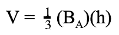

其中 BA 是底部的面积， **h** 是金字塔的垂直高度。

使用这个[图](http://www.mathalino.com/reviewer/solid-mensuration-solid-geometry/regular-tetrahedron)作为指导，

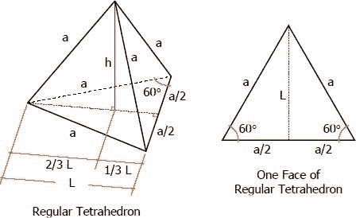

如果 **a = s =边长**，

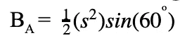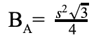

求四面体高度 h；

l 是三角形底边的高度，可以用毕达哥拉斯定理来确定。

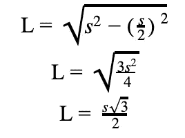

高度 H 与 L 相交于 L 到三角形底边三分之一长度的一点。从这个交点到底边的顶点画一条线，y，将有助于求出高度 h 的长度。

再次使用毕达哥拉斯定理；

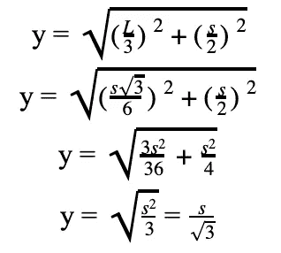

有了 y，就可以计算出高度 H；

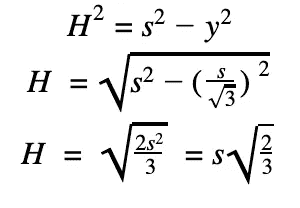

因此，四面体的体积是:

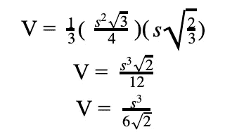

目前为止都很简单。我是说，对于一个高中生来说，这是事情变得复杂的地方。

现在看一下假想四面体的一个面，第一次迭代产生一个边长为 s/2 的附加四面体。第二次迭代增加 6 个边长为 s/4 的额外四面体，第三次迭代增加 36 个边长为 s/8 的新四面体。每批新四面体的体积是:

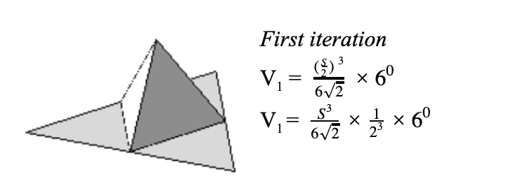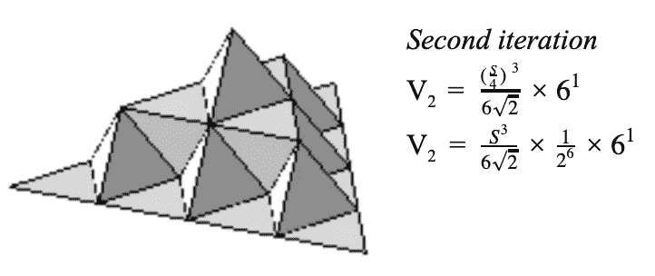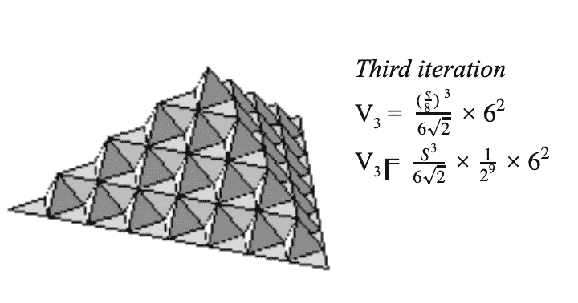

从推导中，可以推导出每次迭代在单个面上附加四面体体积的一般术语。将此总和乘以 4 将得到基础四面体所有 4 个面上所有附加四面体的总体积。将基础四面体的体积加到结果上将给出第 n 次迭代的体积的一般公式。

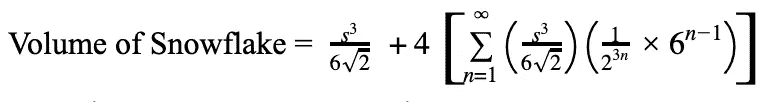

分解出常见的术语给出:

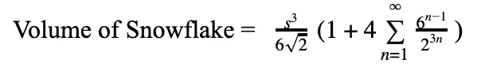

**自定义 3D Koch 雪花体积收敛测试**

为了测试自定义 Koch 雪花体积的收敛性，将使用积分测试。这是因为通式求和方面的通项符合积分检验的要求。积分检验的三个条件是:给定函数在 x ≥ 1 的区域上必须是正的、连续的、单调递减的。

**积分测试**

1.  求和下的表达式或函数对域 x≥1 中的所有值都是正的。
2.  因为不存在使表达式不确定的实数 x，所以函数对定义域中的所有实数 x 都是连续的。因此它在区间 x ≥ 1 上没有垂直渐近线。
3.  为了确定函数是否在区域 x1 上递减，将使用单调性定理。该定理指出，对于函数 f(x)，如果在给定区间上所有 x 值的导数 f'(x)<0，则该函数在该区间上递减。

用求和表达式作为我们的函数，

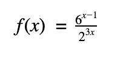

使用商法则；

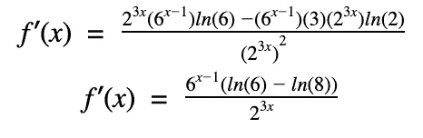

对于 x 的所有值，函数的一阶导数都是负的。因此，它对于 x **∈** ℝ是单调递减的，并且因此在域 x≥1 上递减。

由于满足了积分检验的所有条件，所以可以确定 f(x)的反常积分，其中 x**∈**【1，∞】。

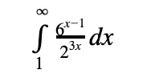

因为它是一个不恰当的积分，我们用一个变量“t”来代替它，这样当 t 接近无穷大时，我们可以得到积分的极限。

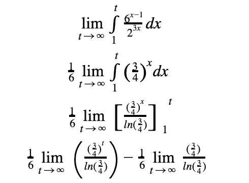

当 t 趋近于无穷大时，(3/4)^t 趋近于零，同样，常数的极限等于常数本身。

因此；

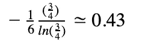

*积分的极限是一个定值，因此自定义三维科赫雪花的体积收敛，p* 表示自定义雪花的体积有限。

为了更好地显示三维自定义雪花在连续迭代中的体积变化，下图显示了前 7 次连续迭代中体积的递减变化。

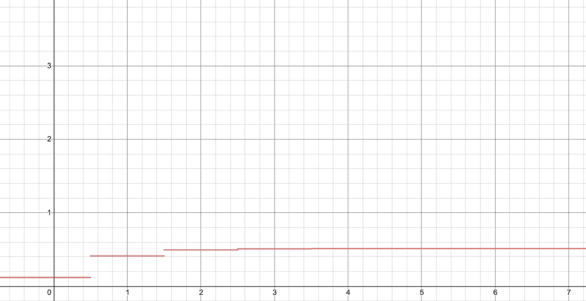

自定义雪花的前 7 次迭代的体积图

从图中可以看出，由于迭代是整数值，因此整数两边 0.5 范围内的小数值被舍入到最接近的整数。由于体积在每次迭代中增加*减少增量*，并在 4 次迭代后最终保持不变，这显示了自定义雪花体积的收敛。

**定制 3D Koch 雪花的总表面积**

这个 3D Koch 雪花的总表面积可以通过观察基础四面体的一个面的表面积如何随着每次连续迭代而变化来确定。为了确定表面积，必须定义边长为 s 的等边三角形的面积 A 的一般公式。这是因为要创建的所有公式都将局限于四面体的一个面以管理复杂性，并且最终结果将乘以 4 以考虑基础四面体的所有 4 个面。对于每次迭代，我都在基础四面体初始面的三维视图图像的右侧绘制一个插图，以及所有被该迭代遮挡的面。

使用以前的公式；

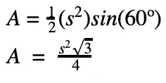

每次一个新的四面体被添加到分形上，三个新的面被添加，而一个与新的面面积相等的现有面被丢失，因为新添加的四面体覆盖了它自身下面的一部分面积。丢失的区域以深灰色显示在每次迭代的最右侧图像中。

对于第一次迭代；

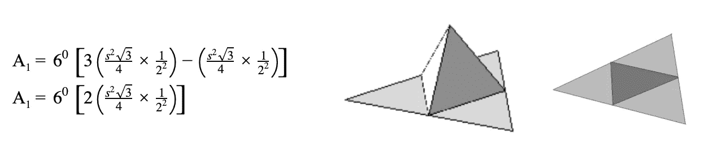

将面积的一般公式乘以 1/(2)^2 是用 s/2 代替 s 的结果，因为每次迭代使用前一次的一半边长。如右图所示，添加新四面体会添加三个边长为 s/2 的面，并遮挡基础四面体面的前一个区域中同一区域的一个面。整个等式乘以 6，因为每一次新的迭代，面数都变成先前面数的 6 倍。请注意，基础四面体只有一个面是可见的。然后在上面显示的第一次迭代之后，从最左边的图开始总共有 6 个面。

进行第二次迭代；

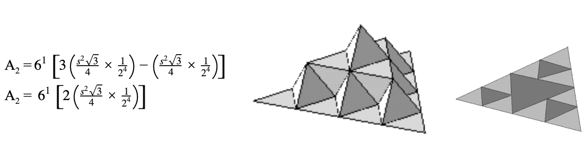

在这次迭代中，新四面体的数量等于前一次迭代后剩下的面的数量，即 6。因此，边长为 s/4 的新四面体的总面积和以前一样，增加了 3 个新面，1 个被遮挡，但是乘以 6，因为这是新四面体的数量。

对于第三次迭代，这是原始四面体的这一面的结果结构；

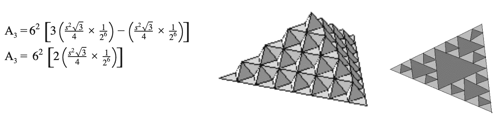

从上面可以看出，趋势随着每次新的迭代而发展，因此定制 Koch 雪花的总表面积的一般公式可以表示为初始总表面积的总和加上每次迭代损失和获得的面积总和的 4 倍。

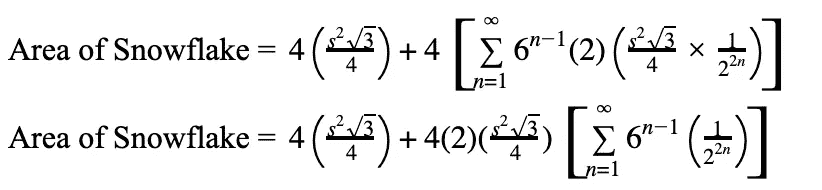

分解出相似的术语；

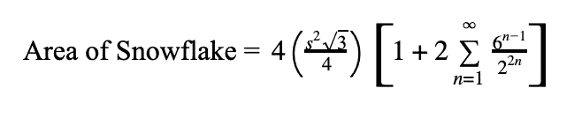

**自定义 3D Koch 雪花总表面积的收敛测试**

为了确定自定义 Koch 雪花的总表面积是否收敛，将使用积分测试。这是合适的，因为我不熟悉积分幂级数，因此这将是一个学习一些新数学的好机会，以实现我的目标。

为了测试雪花总表面积的收敛性，将使用微积分选项(IB 数学 HL 教学大纲)中的**比率测试**。最初，**挤压定理**会被使用，但是在确定使用的上限时会有一个问题。

对于根据比率测试收敛的总表面积，

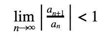

对于自定义 Koch 雪花总表面积的一般公式，受此测试影响的唯一部分是无穷和，因为公式的其余部分是常数，并且只影响总和的最终值。因此，比率项为:

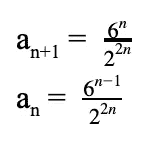

测试如下:

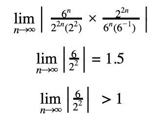

*因此，自定义 3D Koch 雪花的总表面积会发散，因为从比率测试获得的结果大于 1。*

再一次，为了描绘出随着自定义三维雪花迭代的增加这意味着什么，下图显示了前 10 次迭代的总表面积。

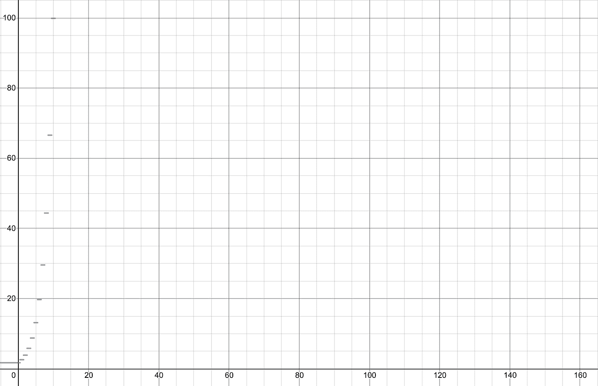

自定义雪花的前 10 次迭代的总表面积的图形

如同体积对迭代的图表一样，不相交的线是由于将非整数值舍入到最接近的整数。该图显示了 s = 1 时雪花的总表面积。该图显示总表面积似乎呈指数增长，因此总表面积的发散性是明显的。

**结论**

这项研究是为了探索定制的三维 Koch 雪花的两个属性，即它的体积和总表面积。这将通过研究雪花连续迭代中这两个属性的变化趋势，并推导出第 n 次迭代的预测体积和总表面积的表达式来实现。从上面的结果来看，自定义三维 Koch 雪花的体积在最初几次迭代中稳定增加，最终保持不变。达到这个结果是因为积分测试产生了大约 0.43 的值。因为求和表达式的反常积分具有有限值，所以对于 Koch 雪花的体积，收敛被确认。

对于总表面积，获得的结果表明它随着雪花迭代次数的增加而无限增加。这是因为比率测试给出的值为 1.5。由于常数的极限是相同的常数，并且计算极限的最终表达式是常数 1.5，雪花的总表面积不会逐渐接近任何值，而是发散。当然，这些结论仅仅是理论上的，尽管是用逻辑从现实世界的观察中推导出来的。一个可能的扩展是确定在这个研究中获得的公式在多大程度上适用于自定义雪花的物理版本。这将作为这一探索的可能延伸而进一步讨论。

然而，可以对导致这些结果的方法进行一些改进。第 n 次迭代的方程仅在前几次迭代中得到确认，并做出了假设；从前几次迭代推导出的一般表达式适用于所有第 n 次迭代，其中 n **∈** Z+。为了提高这些表达式的可信度，我可以利用数学归纳法证明它们适用于所有(n+1)次迭代，因此适用于所有正整数迭代。

**延期考虑进一步勘探**

为了验证现实生活中的收敛量是否超出理论值，使用 3D 打印机将会很有帮助。我将能够在不同的迭代中模拟许多定制的雪花(取决于打印机的分辨率),并进行一项实验，我将它们分别完全浸没在尤里卡罐中固定的已知体积的水中。浸没后水的体积变化将是 3D 模型的体积，因为被浸没的物体置换的水的体积等于浸没的物体的体积。排出的水将从尤里卡倒入一个带刻度的烧杯中，从烧杯中可以读出并记录下体积。然后，我会将实验中的实际体积与从体积方程式中获得的理论体积进行比较。

我相信这次数学探索是令人兴奋的，而且你已经学到了一些东西，不管是多么少的东西。我在这上面工作得很开心，我希望你在阅读它的时候也很开心。