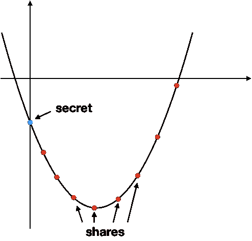

# 像伏地魔一样保护你的密码:使用魂器

> 原文：<https://medium.com/nerd-for-tech/protect-your-cryptos-like-voldemort-using-horcruxes-77b6310b9564?source=collection_archive---------1----------------------->

在这篇博文中，我将教你用最安全的方式来保护你的密码:分裂种子并隐藏碎片，但要用一种很酷的方式。

将一个种子/秘密分割成若干份，然后藏在不同的地方*(或者物体，比如伏地魔)*可能是最安全的存储方式。你也可以将股票转让给许多值得信任的人，他们可以收集并重建它，这样，在你去世的情况下，资金甚至可以转移。

> 但是要小心！:如果操作不当，也可能非常不安全。

拆分秘密可以像简单地把它切成同样长的片(份)一样简单。但这不是一个安全的方法:首先，如果只有一个股票丢失，你就失去了你的秘密。股份越多，这种情况发生的可能性就越大。其次，你必须知道它们的顺序。

> 这就是 Shamir 的秘密共享算法的用武之地。

分割它的理想方式是，你只需要所有份额的一个子集来完全重建秘密。例如，你把它分成 8 个部分，你只需要 6 个部分就可以完全重建它。任何两只股票可能会丢失，你会没事的。

此外，你不想把它分开，这样你就可以用你拥有的每一份来逐渐建立秘密。这是因为在例如 6 个份额中的 5 个被泄露的情况下，秘密可以被暴力破解剩余的百分比*(只有 17%的秘密需要被暴力破解)*。

Shamir 的秘密共享算法将秘密拆分成 n 份，需要 m 份才能还原。这就是所谓的门槛。此外，如果你有少于 m 个必要的部分，你将有 0%的秘密的信息！

# 使用 Shamir 秘密共享

算法的一个实现可以在[这个网页](https://iancoleman.io/shamir/)找到。该项目是 100%开源的，其源代码可以在 [GitHub](https://github.com/iancoleman/shamir) 中找到。

如果你想小心一点:

*   *首先，加载页面*
*   *然后，离线使用该工具，将共享文件保存在安全的地方*
*   *最后，关闭页面并关闭电脑，然后重新连接电脑*

即使在这样做的时候，你也可以有一个键盘记录器，它可以得到你的秘密，所以如果你真的有妄想症，做同样的过程，但使用 Tails *(一个从闪存驱动器运行的操作系统，没有恶意软件)*。

这样就不会有你的秘密或你的电脑中的股份的痕迹。

如果你决定把股份送给人，一定要留下如何找回秘密的说明*(可能是这篇文章？以防万一你不在那里帮助他们。*

# 它是如何工作的

但是你可能想知道 Shamir 的秘密共享算法是如何工作的？嗯，它背后的数学很棒。

先说一个简化的例子，因为真正的应用有点难把握。

一个秘密可以解释为一个数字(最后，它只不过是比特)。想象一下，我们把这个数作为笛卡尔平面 Y 轴上的一个点。穿过该点的直线可以由平面上的另外两个点定义。如果我们找到这条线，我们就找到了秘密*(因为我们知道它在 Y 轴上，与这条线相交)*。

所以如果我们有两个股票，我们可以画一条穿过这两点的线，它与 Y 轴相交，这就是我们的秘密。在同一条线上，可以画出无限个点，所以我们可以产生无限份的秘密，只要两个点就能揭示它。

沙米尔的秘密分享

如果我们想让 3 股揭示秘密，我们只需按照函数的顺序向上，所以不再是一条线，而是一条抛物线。有了三个点(份额),你就找到了函数，所以它与 Y 轴相交。

你可以永远往上走，让门槛想多高就多高。

如果你想了解更多细节，你可以访问[这篇文章](https://qvault.io/cryptography/shamirs-secret-sharing/)。

文章到此结束。我希望你至少学到了一些有趣的东西，并且在感觉像伏地魔藏着他的魂器的时候，找到了一个安全存放密码的好方法。