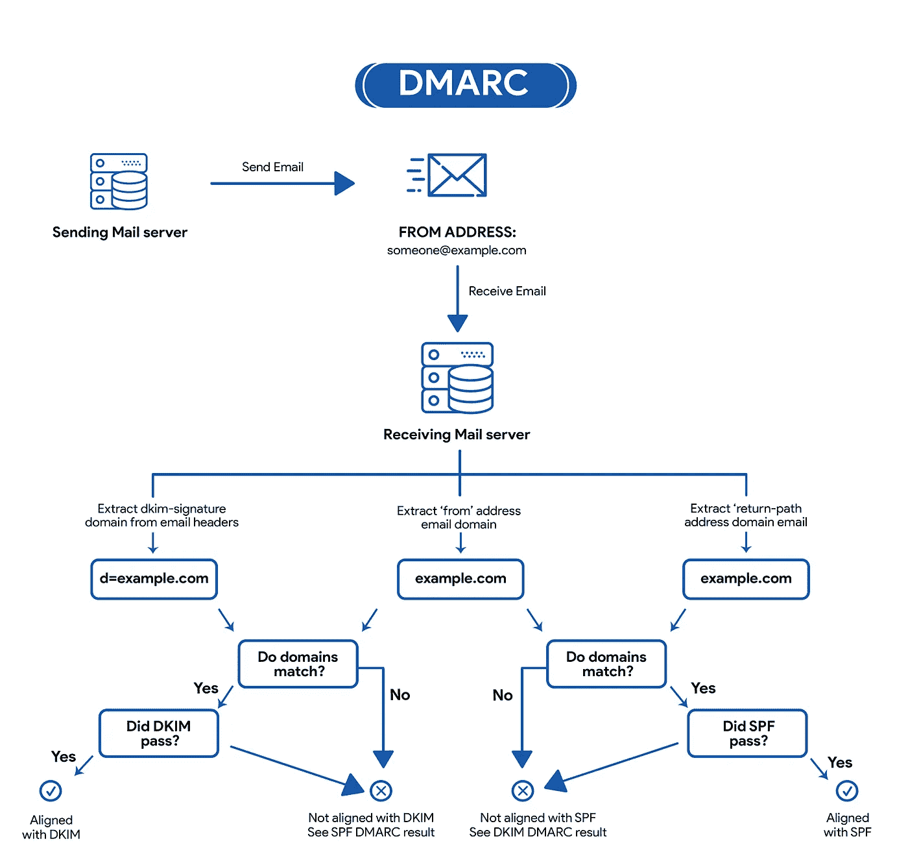
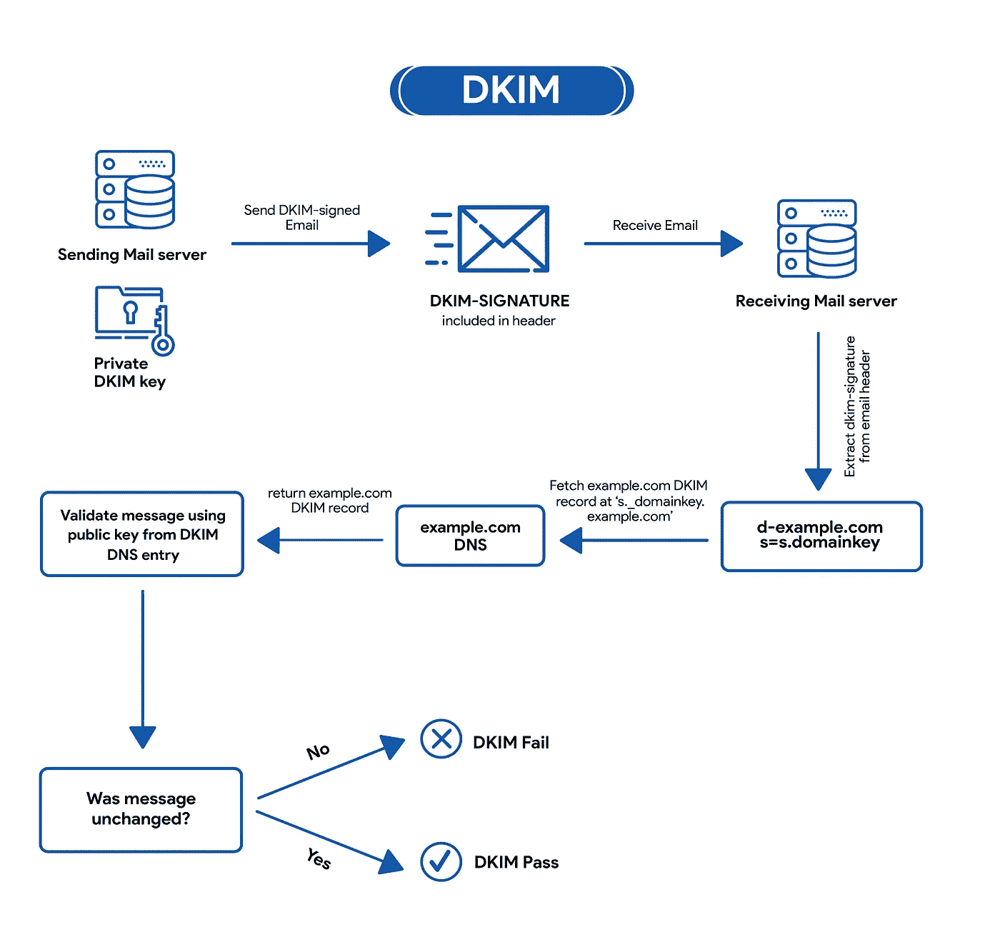

# 通过添加 DMARC、DKIM 和 SPF 来保护您的电子邮件域

> 原文：<https://medium.com/nerd-for-tech/protect-your-email-domain-by-adding-dmarc-dkim-and-spf-93014add3740?source=collection_archive---------11----------------------->

如今，电子邮件欺骗和网络钓鱼攻击在网络攻击中非常常见，在这些攻击中，黑客试图冒充一个域来欺骗他人。

原因很明显。如果你知道信息发送者或信息来源，你就更有可能与之互动。这仅仅是信任和安全的问题。攻击者知道这一点并加以利用。

因此，欺骗会从两个方面伤害你和你的企业。首先，使用你的域名。黑客可以使用您的域名、公司名称和品牌进行诈骗，尤其是通过电子邮件。第二，用危险的和不需要的信息淹没你的邮箱。

黑客使用这种技术是因为发送电子邮件的过程没有先进的消息认证机制。

发送过程基于 SMTP 协议，它不太关心发送者的地址。SMTP 的主要目的只是传送信息，这使得黑客可以使用其他人的域名。

因此，可能有人正在使用您的域名和公司名称来传播垃圾邮件和网络钓鱼攻击。

你如何保护你的域名？

通过添加 DMARC，DKIM 和 SPF 保护到您的域。但是这三种保护工具是什么呢？

让我们从…开始吧

# 了解 DMARC

基于域的邮件身份验证、报告和一致性(DMARC)是一种标准的电子邮件身份验证方法。DMARC 帮助邮件管理员防止黑客和其他攻击者假冒他们的组织和域。欺骗是一种伪造电子邮件发件人地址的攻击。假冒邮件似乎来自模拟的组织或域。

DMARC 还允许您从从您的组织或域获取邮件的电子邮件服务器请求报告。这些报告包含的信息有助于您识别从您的域发送的邮件中可能存在的身份验证问题和恶意活动。

【DMARC 如何防止电子欺骗？

DMARC 告诉接收邮件服务器，当它们收到看似来自您的组织，但未通过身份验证检查，或者不符合 DMARC 策略记录中的身份验证要求的邮件时，该如何处理。未经身份验证的邮件可能是假冒您的组织，或者可能是从未经授权的服务器发送的。

DMARC 总是与这两种电子邮件身份验证方法或检查一起使用:

1.  发件人策略框架(SPF)允许域所有者授权允许为该域发送电子邮件的 IP 地址。接收服务器可以验证似乎来自特定域的邮件是从域所有者允许的服务器发送的。
2.  域密钥识别邮件(DKIM)为每封发送的邮件添加数字签名。接收服务器使用签名来验证邮件是真实的，并且在传输过程中没有被伪造或更改。

# 了解 DKIM

域密钥识别邮件(DKIM)是一种技术标准，有助于保护电子邮件发件人和收件人免受垃圾邮件、欺骗和网络钓鱼的侵害。它是一种电子邮件身份验证形式，允许组织以一种可由收件人验证的方式声明对邮件负责。

具体来说，它使用一种称为公钥加密的方法来验证电子邮件消息是从授权的邮件服务器发送的，以检测伪造并防止发送有害的电子邮件，如垃圾邮件。它补充了用于发送电子邮件的基本协议 SMTP，因为如上所述，它本身不包括任何认证机制。

它是如何工作的？

它的工作原理是在电子邮件的标题中添加数字签名。可以对照组织的域名系统(DNS)记录中的公钥来验证该签名。一般来说，该过程是这样工作的:

域所有者在域的所有 DNS 记录中发布加密公钥作为特殊格式的 TXT 记录。

当邮件消息由出站邮件服务器发送时，服务器会生成唯一的 DKIM 签名头并将其附加到消息中。这个头包括两个加密散列，一个指定的头，一个消息体(或它的一部分)。标头包含有关如何生成签名的信息。

当入站邮件服务器收到传入的电子邮件时，它会在 DNS 中查找发件人的公共 DKIM 密钥。入站服务器使用此密钥解密签名，并将其与新计算的版本进行比较。如果两个值匹配，则可以证明消息是可信的，并且在传输过程中未被更改。

**你怎么能加上这个？**

我按照谷歌的指南来设置 DKIM — [用 DKIM](https://support.google.com/a/answer/174124?hl=en&ref_topic=2752442&visit_id=637594558177403303-201457265&rd=1) 来增加发送电子邮件的安全性，但是你也可以使用任何其他可用的在线服务。

# 了解 SPF

发件人策略框架(SPF)是一种技术标准和电子邮件身份验证技术，有助于保护电子邮件发件人和收件人免受垃圾邮件、欺骗和网络钓鱼的侵害。

具体来说，它定义了一种方法来验证电子邮件消息是从授权的邮件服务器发送的，以便检测伪造和防止垃圾邮件。它旨在补充 SMTP，用于发送电子邮件的基本协议，因为 SMTP 本身不包含任何身份验证机制。

**SPF 是怎么起作用的？**

SPF 建立了一种接收邮件服务器的方法，以验证来自某个域的传入电子邮件是由该域的管理员授权的主机发送的。它依赖于成熟的域名系统(DNS)。一般来说，该过程是这样工作的:

域管理员发布定义被授权从该域发送电子邮件的邮件服务器的策略。这个策略称为 SPF 记录，它被列为域的全部 DNS 记录的一部分。

当入站邮件服务器收到传入的电子邮件时，它会在 DNS 中查找退回(返回路径)域的规则。然后，入站服务器将邮件发件人的 IP 地址与 SPF 记录中定义的授权 IP 地址进行比较。

然后，接收邮件服务器使用发送域的 SPF 记录中指定的规则来决定是接受、拒绝还是标记该电子邮件。

你怎么能加上这个？

我再次按照谷歌的指南设置 SPF — [防止网络钓鱼&防止邮件被标记为垃圾邮件](https://support.google.com/a/answer/33786?hl=en&ref_topic=10685331)

如果你也使用自己的电子邮件域名，花五分钟检查一下你的保护情况。您可以使用众多跳棋中的一种。以下是我使用的一些跳棋:

【https://dmarcian.com/domain-checker/ 

[https://mxtoolbox.com/emailhealth/](https://mxtoolbox.com/emailhealth/)

[https://www.mail-tester.com/](https://www.mail-tester.com/)

拥有自己的域名可能有点麻烦，但也非常有趣。

我喜欢了解 SPF，DKIM 和 DMARC。