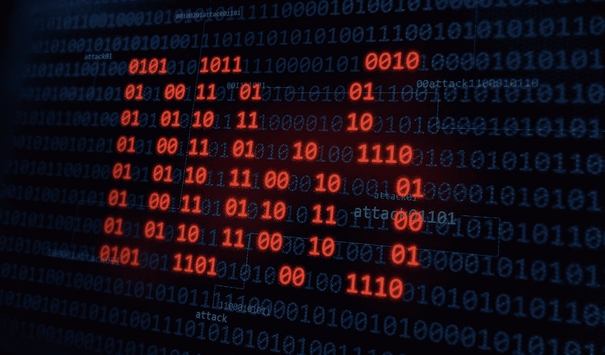
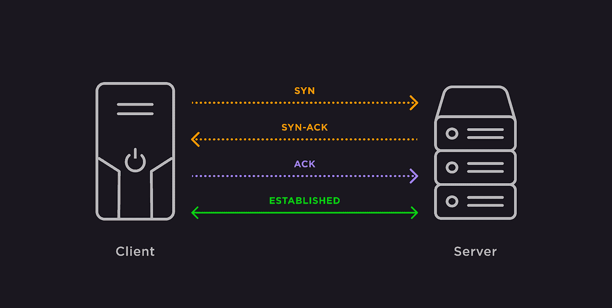
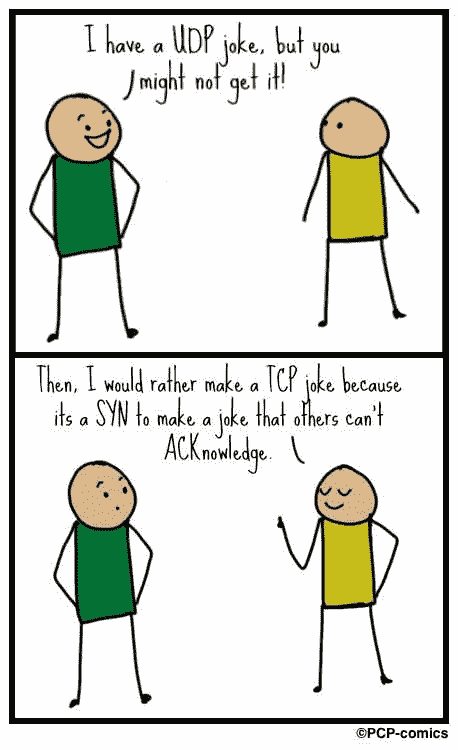
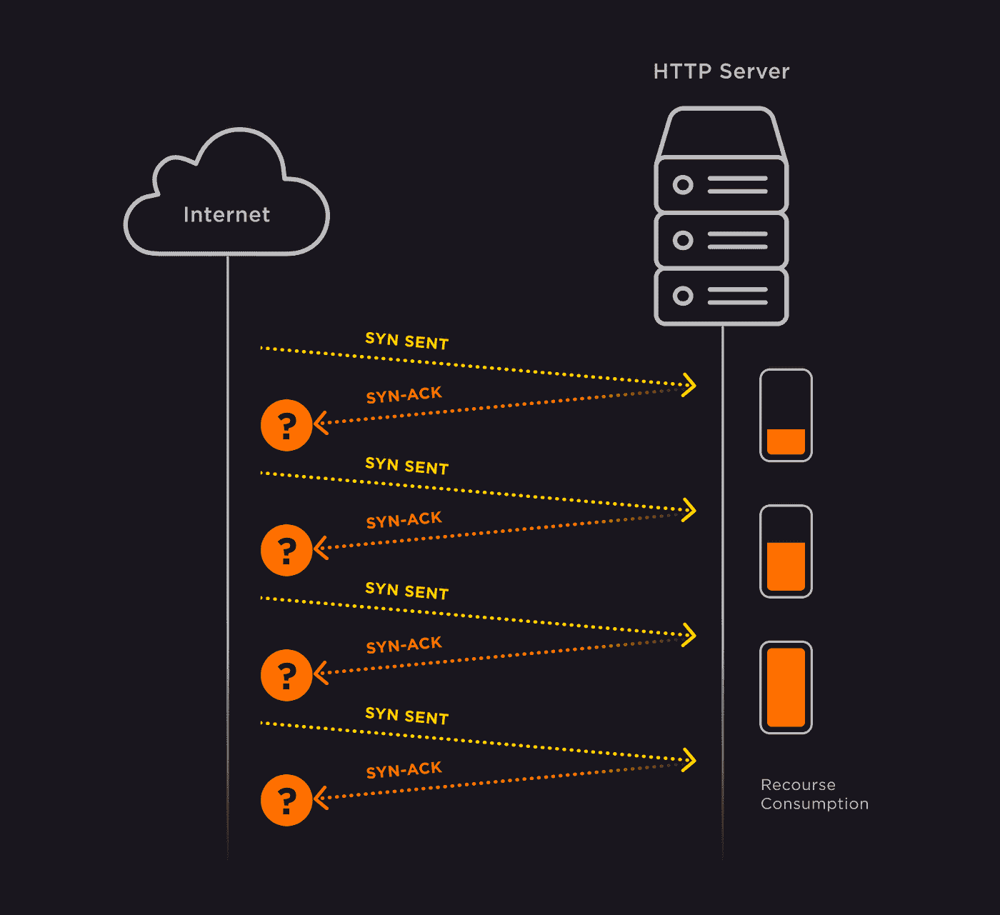

# 防御 DDoS 攻击

> 原文：<https://medium.com/nerd-for-tech/protection-from-ddos-attacks-a4a19bd53601?source=collection_archive---------0----------------------->

# 以及为什么它是无用的

在这篇文章中，我们将使用一个简单的例子来说明现有类型的 DDoS 攻击，以及企业如何试图抵御它们。

DDoS 是一种互联网攻击，对于不熟悉这一主题的人来说，它能够破坏从电话亭到五角大楼的任何东西。仅 Q1 2021 就记录了总共 5，351，930 次 DDoS 攻击。平均攻击持续时间为 50 分钟，增加了 31%。

网络工程师(和我们一样)和安全工程师负责防御这种攻击。

我们公司主要是开发娱乐应用程序。直到最近，该公司根本不需要网络专业知识。

巧合的是，就在我第一个工作日之前，公司遭到了海啸 DDoS 攻击(显然是一些人在 meme 评论中打架的结果)。

更令人惊讶的是，尽管缺乏抵御此类攻击的真正专业知识，但该团队在没有任何第三方帮助的情况下成功转移了打击。无论如何，我们不得不跳出来调查发生了什么，以及如何防止它再次发生。

在我的网络研究中，我意识到没有一个单一的资源可以简单明了地表达这个主题。大多数文章是由试图销售其 DDoS 保护服务的企业发布的，因此这些材料本质上是宣传性的，而不是教育性的。我开始专注于选择合适的 DDoS 保护解决方案，刷新了我们在这个问题上的已知知识。

我们认为，对我来说，在一篇文章中整理所有的材料，添加一些我自己的专业知识，然后把整件事作为一篇文章发布在网上是有意义的。

那么，我们开始吧…

首先要知道并公认为公理的是，没有针对 DDoS 攻击的防御措施。

如果有必要，只要有足够的资源可用，恶意行为者甚至能够损害受到良好保护的地理分布式基础设施，如由主要云提供商运营的基础设施:Amazon、Azure 等。

如果我们想要防御 DDoS 攻击，我们必须为可能发生的情况做好准备，如果我们真的成为恶意行为者的目标，我们可能不得不不断建立我们的防御，直到它们开始花费我们十倍于攻击任何针对我们的行为者的成本。更不用说恶意的参与者只需点击几下鼠标就能扩大他们的攻击。

如果您有决心战斗到底，在某个时候，您可能会发现，由于攻击而遭受的声誉和经济损失最终会比您的防御和不断加强的防御更少。

存在攻击主要企业的大型黑客组织，只是为了勒索金钱以换取停止攻击。

如果你在谷歌上搜索“订购 DDoS 攻击”，你会惊讶地发现找到你想要的服务是多么容易。提供这类服务的网站将自己伪装成合法的“网站和服务安全测试的提供者，以利于他们的管理员。”听起来很合理。而且只需要 50 到 100 美元(事实上，在暗网上可以找到更多便宜的交易)。

看起来，如果事情糟糕到任何一个学生都可以用他们的午餐钱来发起 DDoS 攻击，企业对此无能为力。但是我们不这么认为！

让我们看看我们在努力防御什么以及如何防御。

**简介**

首先，让我们同意网络工程师遵循特定的网络模型来实现最合理的网络架构。

这个网络模型有四层。

每一层都配备了自己的一套具有不同功能和能力的设备:从最基本的单元开始，唯一的目的是每秒向易受影响的数据验证系统(交换机)传输尽可能多的数据。

设备在层次结构中的位置越高，技术就越复杂，操作的算法就越复杂。

就防 DDoS 保护而言，这意味着每一层都会中和其威胁份额，直到最终完全抑制为止。

让我们想象我们正在建造一所房子，但是我们知道我们不能把它和中央供水系统联系起来。我们要做什么？

(1)计算出家庭需要多少水，钻一口深度和宽度都合适的井，将直径合适的水管铺设到房子里。在网络工程师的说法中，这一阶段被称为链路层，或简称为“线路”

(2)安装一个初级过滤器和一个泵。让我们称之为互联网层(路由器)

(3)安装中间过滤器:传输层(防火墙)

(4)安装精细过滤器:应用层—智能防火墙—下一代防火墙，以及专门的 Web 应用防火墙

让我们快速浏览一下这些层，看看哪里有潜在的瓶颈。

**对链路层的攻击**

在我们的房子比喻的最基本的场景中，DDoS 攻击将被模拟为地下水压力的增加，由此更多的水被推向地表，增加了管道和接头的内部压力，因此管道最终可能会破裂。在整个过程中，水将保持清洁，除非我们因为压力而不使用它(除非我们是消防员)。

在现实世界中，当你和家人或朋友在家时，类似的事情也会发生。有人开始下载一部电影，突然大家都开始抱怨网速太慢。这被称为“线路拥塞”

第一次也是最简单的 DDoS 攻击就是这么做的。

当恶意行为者攻击大型数据中心时，也会发生同样的事情。不同的是，在这种情况下，你不能对决定下载东西的人大喊大叫，因为据你所知，超载的代理可能在北极。

回到我们的比喻，我们必须扩大井和更换管道，让更多的水在压力下通过。

在这个阶段可能已经出现问题，因为带有 1000 Mb 连接器的家用路由器起价为 100 美元，而带有 100 Mb 连接器的家用路由器起价为 30 美元，而数据中心使用的类似设备的价格要高出 100 到 1000 倍。但是让我们假设我们有无限的财力来建设我们的管道的耐久性和无限的输送能力。接下来呢？

**对网络层的攻击**

现在我们发现，在压力下从井中喷出的水含有:

*   沙粒
*   生锈的恐龙
*   我们不想摄入的其他重要的外来混合物

我们启动我们需要安装的第一个过滤器来清除所有这些污染。

但是以前的任务是确保管道所需的吞吐能力。现在的挑战是过滤掉随水上升的污染。

在这个阶段，白名单和黑名单扮演着这种过滤器的安全角色。

黑名单通常包含已经在网络上遭到破坏的 IP 地址或整个 IP 地址池(在被用于垃圾邮件或发起 DDoS 攻击后，这些地址会一直更新)。

但是这并不像看起来那么容易:黑名单并不总是有效。恶意代理可以用“发送者”框中的任何其他互联网用户来代替他们的 IP 地址。在这种情况下:

(a)追踪恶意代理将更具挑战性。

(b)恶意代理可以通过告诉他们的僵尸网络(大量受感染的计算机和物联网设备)向任何在线资源发送每个 64 字节的请求来加强攻击。为了响应每个僵尸网络请求，资源服务器将返回每个大小为 300 字节的回复，目标是 DDoS 攻击受害者。当来自完全不同的服务器的这种来回滚雪球般增加到每秒数万个请求时，我们就遇到了基本的 DDoS 攻击，就像上面描述的那样。打个比方，攻击的升级是通过要求某人“说几句关于他们自己的话”并得到 40 个以上的回复来实现的。这种最大化攻击的方法叫做放大。

到目前为止，我们只扩大了管道，安装了三个过滤器中的第一个。我们尝了尝水，才意识到我们必须花更多的钱，再买一个处理动作更精细的过滤器。

**对传输层的攻击**

现在我们来解决可能是最容易受到 DDoS 攻击的最糟糕的瓶颈:第二个过滤器，它通常会安抚我们的水并清除重金属。

在网络世界中，这是争夺处理器资源、防火墙和服务器内存的最激烈的地方，也是部署最复杂的网络解决方案以在 DDoS 攻击期间过滤和分离合法流量和恶意流量的地方。

任何列表在这里都是无效的:我们已经用完了我们的列表。从现在开始，我们收到的所有东西都应该来自合法的互联网用户。另一个不言而喻的原因是，任何给定的 IP 地址都可能代表几十个用户和数百台设备，而其中只有一台受到感染。

想象你在浏览器中打开了大量的标签页…好吗？

现在把这些标签乘以 10。你不需要太多的专业技术知识就能知道你的电脑会发生什么:它要么会变成蓝色的“死亡之屏”，要么会死机。

现在考虑一下，当服务器(本质上是一台计算机)开始收到对存储在其上的某个页面的大量请求(比方说，每秒一百万或更多)时，会发生什么情况。必须处理每个请求，并将网站的内容返回给请求者。

这是一个 DDoS 攻击，其中只有 10，000 个请求是真实的。我们的任务是建立一个良好的保护系统来过滤掉大量的恶意流量。

在为这一层建立这样一个系统之前，有必要更深入地研究互联网上数据传输的技术方面。

传输控制协议(TCP)是一种嵌入式解决方案附带的技术，用于协调连接，并确保所有数据都已传送，任何丢失的数据包都已重新发送，并且交换以正确的连接终止行为结束。

TCP 连接控制方法被称为三次握手:在您的计算机和服务器交换了三个数据包之前，数据共享不会开始，这意味着它们已经“握手”

这是一种全双工(双向)连接，其中两端相互同步(SYN)和确认(ACK)。

一旦您的计算机和服务器交换了三个数据包(SYN SYN-ACK 和 ACK)并建立了连接，数据共享(例如，加载网站页面)将开始。

这个流程图足以让我们理解客户机和服务器必须知道彼此的 IP 地址才能“握手”这意味着没有恶意代理能够实现前面提到的发送者地址替换。

但这并不是说 DDoS 攻击是不可能的:当一个发送者地址被替换时，我们得到了我们所说的 TCP 半开。

我们收到建立连接的请求，我们回复，但我们从未收到最后一个数据包(ACK)。这阻塞了我们服务器的资源，因为它必须在内存中存储连接数据，等待一个永远不会到来的回答，这给我们的服务器带来了压力。

下图显示了这种攻击的流程图。

应用层攻击及其防御

现在我们来看最后一个过滤器，它在现实生活中负责去除水中的氯、异味和杀虫剂。

假设在你居住的地方上游一公里处有一条下水道向河里倾倒化学废物，污染了地下水。因为没有标准的滤水器会有任何用处，你打电话给专业人士，一个化学专家，在你的财产上取土壤和水的样本。将需要一系列的实验室测试来设计出满足您特定需求的解决方案。

针对各种漏洞的各种攻击可能会发生。众所周知，攻击会随着防御而发展，变得越来越复杂，因此检测和应对的手段也必须不断升级。

对这一层的攻击不像针对上述三层的攻击那样频繁，因为它们需要恶意代理采取更微妙的方法。

这里不可能有地址替换:在发送任何请求和对目标网站发起攻击之前，必须完成握手过程。

为攻击部署的机器人必须拥有完整的浏览器堆栈，这意味着它们不能简单地发送随机请求，而是模仿真正的客户端浏览器。

现在让我们看看攻击是如何在这一层发生的:

想象一个平常的晚上，所有的家务都做完了，你在家。你去你最喜欢的在线剧院网站，点击搜索栏，选择“喜剧”和“以前没有看过”，并设置一个过滤器按排名排序。然后你一页一页地翻看电影，在不同的标签页打开你喜欢的电影。15 到 30 分钟后，你下定决心看你想看的电影，然后开始看。

与您不同，恶意代理会在同一网站上植入僵尸网络，通过随机打开不同的页面和部分使其超载，并通过设置多个搜索参数来扰乱搜索引擎。

站在服务器的立场上，比较一下回答这两个不同的问题有多难:说出你知道的最受欢迎的越狱电影，说出你知道的所有越狱电影。你头脑中的过程类似于你最喜欢的电影搜索网站所在的服务器。你知道，网站也会变得疲惫不堪，所以不要着急。

支持这样一个网站或应用的技术团队应该在机器学习的帮助下，训练网络应用防火墙，使其能够对通过过滤器的大约 10 万个请求进行分类，仅凭行为将善意的内容搜索者与恶意的网站资源浪费者区分开来。

有趣的是，这一层的设备具有学习能力。我们把它放在用户和网站之间的路线上，简单地观察发生了什么。过一段时间后，设备会自己想出适当的程序。然而，这种方法有其缺点，许多人不愿意将安全事务委托给机器。

无论如何，要记住的是，如果发生了规模相对较大的 DDoS 攻击，它将像海啸一样，让你的防御设施、你的房子、邻居的房子、最近的城镇，甚至曾经困扰你的化工厂都荡然无存。

当这种情况发生时，你唯一的救赎就是尽快撤离:

(1)根据预先测试的行动计划，将所有基础架构临时迁移到云中，这正是 FunCorp 所做的。

(2)作为一种替代方案，使用谷歌的免费设施 Project Shield(T0)为那些遭受审查风暴的人提供一个避风港，这些审查风暴的形式是对他们的资源进行 DDoS 攻击。

**结论**

我很高兴地通知您，DDoS 攻击的情况会有所好转，但令我遗憾的是，没有迹象表明这种情况会很快发生。相反，太多的因素预示着相反的情况。

很容易看出，DDoS 攻击的成本不太可能有太大变化，而它们的规模以及基础设施防御的成本和复杂性肯定会上升。

我们不能幻想，随着 5G(及其继任者 [6G](https://en.wikipedia.org/wiki/6G_(network)) ，已经在工作中)的到来，千兆互联网进入每个家庭和每个移动设备，会在这方面有所改善。

无论你走到哪里，你都可以看到成百上千的联网设备:从手机、烤面包机到车床和汽车。它们中的每一个都可能是一个或几个僵尸网络的一部分。

总结一下，没有太多要补充的。我们能够在全球范围内改变这种状况的唯一方法是对数字卫生进行尽职调查。不要忘记在家里和工作设备上运行防病毒软件，定期更新路由器和防火墙，并希望你的邻居也会这样做。更好的是，提醒你的邻居做所有这些，如果他们不知道怎么做，就教他们。

古老的戒律依然适用:*“如果你想改变世界，从改变你自己开始。”在这种情况下，我们将面对一个全新的数字世界。*