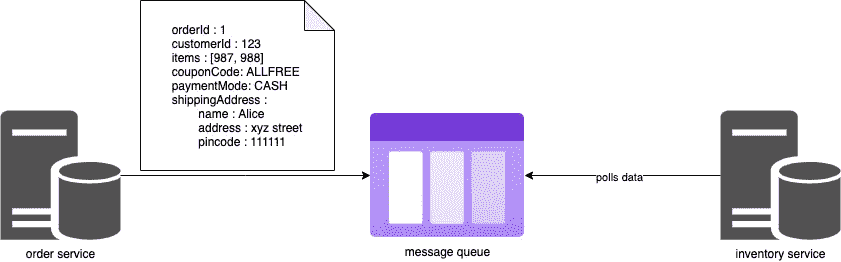
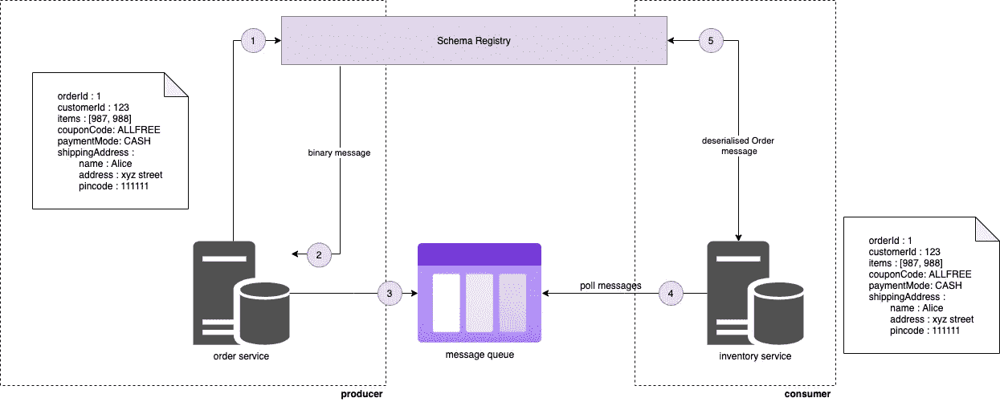
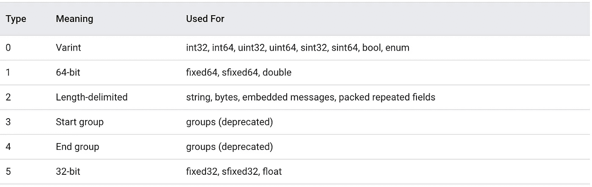

# Protobuf —什么&为什么？

> 原文：<https://medium.com/nerd-for-tech/protobuf-what-why-fcb324a64564?source=collection_archive---------0----------------------->

Protobuf 是 Google 精心制作的二进制消息格式，与 JSON & XML 等其他消息格式相比，它是高效的。

但是为什么 Protobuf 效率高呢？从 JSON/XML 消息格式转移到 Protobuf 是不是更好的选择？要回答这些问题，让我们深入了解 Protobuf 并理解它的工作原理。

我们都知道 JSON，这是在 web 应用程序中传输消息的最流行的消息格式。JSON 是人类可读的，与 XML 相比是高效的，并且易于使用。JSON 也在 NodeJS 这样的后端框架和 Chrome 这样的客户端应用程序上得到原生支持。这使得 JSON 序列化和反序列化在 Javascript 环境中变得越来越快。

既然 JSON 已经做得很好了，我们为什么还要学习一种新的消息格式呢？看看以下几点是否能说服你。

1.  Protobuf 因为它已经是二进制的，所以序列化和反序列化非常快，而且消息的大小也比 JSON & XML 小(我们将在本文的最后一节了解更多)。此外，打开服务器压缩后，Protobuf 的有效负载会变得更小。所以有了 Protobuf，我们的 web 应用程序可以更快地请求和响应！
2.  JSON 不允许对消息进行严格的模式定义。这可能不是一个大问题，因为消息验证可以在客户机或服务器上进行。但是，比方说，多个微服务通过一个像 Kafka 这样的使用 JSON 消息的消息代理相互交互。当生产者想要更新一个特定的 JSON 属性时会发生什么？这可能会迫使我们改变大型应用程序中成千上万消费者的验证逻辑，对吗？我们可以在 Kafka 中使用 Protobuf 和模式注册表来解决这个问题。
3.  使用 Protobuf，开发工作量要小得多，因为协议缓冲编译器自动为许多流行语言的序列化和反序列化消息生成代码。

如果以上几点不能让你信服，也许你可以考虑学习 Protobuf 作为额外的工具。我在哪里看过，学习新的东西可以让你的大脑肌肉保持活跃！:)

# 为什么是 Protobuf？

如下图所示，假设客户下订单后，订单服务通过消息队列将订单细节发送给库存服务。这个订单详细信息消息将存储在消息队列中，库存服务异步轮询订单详细信息并对其进行处理。



订单和库存系统之间的通信

对于像亚马逊这样一天处理超过 100 万个订单的网站，服务之间的数据传输需要更快，并且应该消耗更少的带宽。这里的目标是通过减少网络上传输的数据量来提高吞吐量和减少延迟。在我们的示例中，我们应该能够以更少的网络带宽和消息队列中每条消息的最小存储利用率，尽可能快地将消息从订单服务发送到库存服务。

让我们试着找到解决这个问题的方法。

**尝试#1** 当我们使用 XML 作为通信的消息类型时，通过网络传输消息所需的带宽将会很大，因为其冗余结构会占用大量带宽，如下所示。我们可能还需要大量空间来将这些 XML 数据存储在消息队列中。

```
<root>
  <orderId>1</orderId>
  <customerId>123</customerId>
  <items>987</items>
  <items>988</items>
  <couponCode>ALLFREE</couponCode>
  <paymentMode>CASH</paymentMode>
  <shippingAddress>
    <name>Alice</name>
    <address>xyz street</address>
    <pincode>111111</pincode>
  </shippingAddress>
</root>
```

对于一条消息来说，这是很大的数据量。对于每天接收数百万订单的 Amazon 来说，XML 作为消息类型可能无法很好地扩展。

**尝试#2** 我们为什么不试试 JSON？JSON 是一种非常流行的消息格式，被广泛使用。尽管与 XML 相比，JSON 占用的空间和网络带宽更少，但作为一种基于文本的消息格式，它也占用了更多的空间和带宽。我们可以做得更好。

```
{
    "orderId": 1,
    "customerId": 123,
    "items": [987, 988],
    "couponCode": "ALLFREE",
    "paymentMode": "CASH",
    "shippingAddress": {
        "name": "Alice",
        "address": "xyz street",
        "pincode": "111111"
    } 
}
```

**尝试#3** 协议缓冲区以二进制格式在网络上发送消息。因为消息是二进制的，所以它需要较少的空间和带宽来传输。下面显示的是通过网络传输的订单详细信息。

```
8,1,16,123,26,4,219,7,220,7,34,7,65,76,76,70,82,69,69,40,1,50,27,10,5,65,108,105,99,101,18,10,120,121,122,32,115,116,114,101,101,116,26,6,49,49,49,49,49,49
```

与 JSON 和 XML 相比，协议缓冲区由于其较小的尺寸，可以很好地扩展以通过网络传输数百万条消息。

现在我们知道了问题的解决方案是使用协议缓冲区，我们可能会有以下问题。

1.  我们如何将我们的域对象(即订单消息)转换成二进制格式？
2.  如何从二进制格式重建另一端(库存服务)的订单对象？

让我们在下一节讨论这些问题的答案。

# Protobuf 语义

这一切都是从定义一个包含消息结构的`.proto`文件开始的，即我们示例中的顺序。

```
syntax = "proto3";message Order {
    enum PaymentMode {
        CASH = 0;
        CARD = 1;
    }
    int32 orderId = 1;
    int32 customerId = 2;
    repeated int32 items = 3;
    string couponCode = 4;
    PaymentMode paymentMode = 5;
    Address shippingAddress = 6;
}message Address {
    string name = 1;
    string address = 2;
    string pincode = 3;
}
```

上述`order.proto`文件包含订单消息的模式，内容如下:

`syntax = "proto3"`说这个文件是用`proto3`编译器格式编写的(下面有更多关于 proto 编译器的信息)

一种包含以下字段定义的`Order`消息类型。

*   `PaymentMode`枚举定义
*   `orderId`类型为`integer`的字段
*   `customerId`类型为`integer`的字段
*   `items`类型为`collection of integers`的字段
*   `couponCode`字符串类型的字段
*   `paymentMode`类型为`PaymentMode`的字段，它是一个枚举
*   `shippingAddress`类型为`Address`的字段，也是一种消息类型

包含以下字段定义的`Address`消息类型。

*   `name`类型为`string`的字段
*   `address`类型为`string`的字段
*   `pincode`类型为`string`的字段

您可能想知道分配给每个字段的数字是多少。这个编号被称为**字段编号**，并且需要是唯一的。字段编号用于在序列化&反序列化过程中识别字段。我们稍后将回到序列化、反序列化&字段编号。

一旦定义了原型文件，我们需要一些代码将订单消息转换成二进制格式，反之亦然。这是最具挑战性的部分，但幸运的是，我们有一个由 Google 创建的**原型编译器**，它可以通过必要的算法自动为我们生成代码，完成上述工作。编译器能够生成不同编程语言的代码。以下示例显示了如何使用编译器生成 Javascript 代码。

```
protoc --proto_path=. --js_out=import_style=commonjs,binary:. order.proto
```

*   `protoc`是 protobuf 编译器
*   `proto_path`是包含原型文件的目录的路径。`.`表示当前目录
*   `js_out=import_style=commonjs,binary:.`输出 commonjs 风格的 Javascript 代码，并将 js 文件放在当前目录中。
*   `order.proto`原型文件的名称

运行`protoc`命令将在我们当前的目录中生成一个`order_pb.js`文件。这个文件包含的方法有

*   `serializeBinary` -将订单 JS 对象序列化为二进制格式
*   `deserializeBinary` -将二进制文件反序列化为订单 JS 对象
*   `setOrderid` -像`order.setOrderid()`一样设置订单 id
*   `setCustomerid` -像`order.setCustomerid()`一样设置客户 id
*   `setItemsList` -设置项目集合
*   `setShippingaddress` -设置送货地址。请注意，送货地址也是一个`Address`对象，它包含类似于`serializeBinary`、`deserializeBinary`、`setName`、`setAddress`等方法

诸如此类。

下面是一个示例 JS 代码，它创建一个 order `order1`，序列化为二进制格式，然后再反序列化为 order 对象。将这一思想推广到我们的订单示例中，我们可以将序列化的订单消息(也称为二进制数据)通过网络从订单服务发送到消息队列和库存服务。请注意，只有这种二进制形式通过网络传输并存储在消息队列中。库存服务可以再次将二进制数据反序列化回适当的 JS Order 对象，并开始使用它。

```
*// import*
const OrderSchema = require("./order_pb");*// create order1*
const order1 = new OrderSchema.Order();
order1.setOrderid(1);
order1.setCustomerid(123);
order1.setItemsList([987, 988]);
order1.setCouponcode("ALLFREE");
order1.setPaymentmode(1);*// create address for order1*
const address = new OrderSchema.Address();
address.setName("Alice");
address.setAddress("xyz street");
address.setPincode("111111");order1.setShippingaddress(address);*// serialize order1 to binary*
const bytes = order1.serializeBinary();
console.log("Binary : " + bytes);*// deserialize order1 from binary to JS object*
const object = OrderSchema.Order.deserializeBinary(bytes).toString();
console.log("Deserialize : " + object);
```

您可能会有一个问题，订单和库存服务是如何知道 proto 文件的？

好问题。

在生产就绪的消息队列/消息代理(如 Apache Kafka)中，这个原型文件由一个模式注册表管理，该注册表是一个存储原型定义的高可用性服务。生产者使用模式注册中心对消息进行编码。这些编码的消息通过网络传输并存储在消息代理中。消费者提取编码的消息，然后在模式注册中心的帮助下解码它们。下图很好地说明了这一工作流程。



使用模式注册表的消息通信

这就是 Protobuf 的工作方式。它速度快，重量轻，占用空间和网络带宽少。

# Protobuf 内部

如果你很想了解对象→二进制→对象转换是如何发生的，想知道编码背后的逻辑，那么请继续读下去。

在前面的例子中，订单消息被转换成二进制消息格式，如下所示。

**订单报文二进制格式:**

```
8,1,16,123,26,4,219,7,220,7,34,7,65,76,76,70,82,69,69,40,1,50,27,10,5,65,108,105,99,101,18,10,120,121,122,32,115,116,114,101,101,116,26,6,49,49,49,49,49,49
```

**订单消息原型(供参考):**

```
message Order {
    enum PaymentMode {
        CASH = 0;
        CARD = 1;
    }
    int32 orderId = 1;
    int32 customerId = 2;
    repeated int32 items = 3;
    string couponCode = 4;
    PaymentMode paymentMode = 5;
    Address shippingAddress = 6;
}message Address {
    string name = 1;
    string address = 2;
    string pincode = 3;
}
```

**以文本形式订购消息(供参考):**

```
orderId: 1
customerId: 123
items: [987, 988]
couponCode: "ALLFREE"
paymentMode: "CASH"
shippingAddress:
        - name: "Alice"
        - address: "xyz street"
        - pincode: "111111"
```

为了理解编码，让我们从二进制消息格式的第一个数字开始:- `8`。

**解码 8:** 既然`8`是第一个数，那就是一个`key`。解码一个密钥会给我们原始文件中的字段。为了理解如何解码一个密钥，我们可以使用下面的逻辑。

```
Decoding logic for key 8:1\. Convert 8 to binary = 0000 1000
2\. Take last 3 digits and convert to decimal to get wire type (more about wire type shortly) = 000 i.e 0
3\. Right shift by 3 and convert to decimal to get field value i.e 0000 1000 >> 3 = 1
```

另一个例子，

```
Decoding key logic for 16:1\. Convert 16 to binary = 0001 0000
2\. Take last 3 digits and convert to decimal to get wire type (more about wire type shortly) = 000 i.e 0
3\. Right shift by 3 and convert to decimal to get field value i.e 0000 1000 >> 3 = 2 (10 in binary)
```

回到我们的二进制消息，从`8`我们已经确定了两件事:

1.  电线类型为`0`
2.  字段编号为`1`

这样，我们可以说`8`对应于字段`orderId`(来自 proto 文件的字段编号 1)。

**解码 1:** 由于`8`的导线类型是`0`我们可以说即将出现的数字应该是一个 Varint 导线类型。

线类型告诉我们如何处理即将到来的数字。下表显示了导线类型及其含义之间的映射。



什么是 Varint？ Varint 是一种使用一个或多个字节序列化整数的方法。让我们以整数`1`为例，它的变量表示为`0000 0001`。再比如`987`，它的变量是`11011011 00000111`。我们怎么算出这是`987`？下面的块解释了逻辑。

```
Decode Logic for Varint 11011011 00000111:1\. The MSB tells us whether there are further bytes to come. If the MSB is 1, we have upcoming bytes. If MSB is 0 then that is the last byte. In this case the msb of 1st byte is 1 so that means we have to consider the next byte as well. But the MSB of the 2nd byte is 0 so that means no other bytes.2\. Strip out the msb's of the bytes
1011011 00001113\. Reverse the bytes
0000111 10110114\. Concat the bytes and convert to decimal
0000111 + 1011011 -> 1111011011 -> 987
```

再举一个例子，`98765`和它的变体是`11001101 10000011 00000110`

```
Decode Logic for Varint 11001101 10000011 00000110:1\. MSB of 1st byte is 1 so there is 2nd byte, MSB of 2nd byte is 1 so there is 3rd byte, MSB of 3rd byte is 0 so no further bytes.2\. Strip out the msb's of the bytes
1001101 0000011 00001103\. Reverse the bytes
0000110 0000011 10011014\. Concat the bytes and convert to decimal
0000110 + 0000011 + 1001101 -> 11000000111001101 -> 98765
```

回到我们的二进制消息，`1`是一个变量，它的值是 1。

此时，我们已经从解码`8 & 1`中提取了以下信息:

1.  `orderId`的值为`1`。

**解码 16:** 既然之前的数字是线型，`16`应该是一个键。到现在为止，你可能已经知道如何破译一把钥匙了。

我们有 16 个，

1.  电线类型为`0`
2.  字段编号为`2`

这意味着`16`对应于字段 customerId(字段编号 2)。

此时，我们已经从解码中提取了以下信息`8, 1, 16`

1.  `orderId`的值是`1`
2.  字段是`customerId`

**解码 123:** 由于`16`的线类型是`0`我们可以说接下来的数字应该是一个变量。这里的`123`即`01111011`是一个变量，解析它会给出`123`值。

```
Decode Logic for Varint 01111011:1\. MSB of 1st byte is 0 so there is no 2nd byte.2\. Strip out the msb's of the bytes
11110113\. Reverse the bytes
11110114\. Concat the bytes and convert to decimal
1111011 -> 123
```

此时，我们已经从解码`8, 1, 16 & 123`中提取了以下信息:

1.  `orderId`的值为`1`。
2.  `customerId`的值为`123`

**解码 26:** 既然之前的数字是线型，`26`应该是一个键。

```
Decoding logic for key 26:1\. Convert 26 to binary = 0001 1010
2\. Take last 3 digits and convert to decimal to get wire type i.e 010 i.e 2
3\. Right shift by 3 and convert to decimal to get field value i.e 0001 1010 >> 3 = 3 (11 in binary)
```

对于`26`我们有，

1.  电线类型为`2`
2.  字段编号为`3`

这意味着`26`对应于字段`items`(字段编号 3)。

此时，我们已经从解码`8, 1, 16, 123 & 26`中提取了以下信息:

1.  `orderId`的值为`1`
2.  `customerId`的值是`123`
3.  该字段是`items`

**解码 4，219，7，220，7:** 由于`26`的线类型是`2`，我们可以说接下来的数字应该是长度分隔的线类型(参考上表)。那么我们如何解析长度分隔的导线类型呢？让我们来看看。

```
Decode Logic for Length Delimited:1\. First number is always the length given in Varint i.e value of Varint 4 is 4, so length is 4.2\. Since the length is 4, consider the next 4 numbers i.e 219, 7, 220, 73\. The field number calculated previously for 26 is 3 which corresponds to collection (repeated) of ints, we can say that 219 (11011011), 7 (00000111), 220 (11011100), 7 (00000111) are Varints that would resolve to integers.4\. 11011011 00000111 11011100 00000111 contains 2 ints based on the MSBs5\. 11011011 00000111 Varint resolves to 9876\. 11011100 00000111 Varint resolves to 988
```

此时，我们已经从解码`8, 1, 16, 123, 26, 4, 219, 7, 220, 7`中提取了以下信息:

1.  `orderId`的值为`1`
2.  `customerId`的值为`123`
3.  `items`的值是有`987` & `988`的集合

**解码 34:** 既然之前的数字是线型，`34`应该是一个键。

因为我们有，

1.  电线类型为`2`
2.  字段编号为`4`

这意味着`34`对应于字段`couponCode`(字段编号 4)。

此时，我们已经从解码`8, 1, 16, 123, 26, 4, 219, 7, 220, 7 & 34`中提取了以下信息:

1.  `orderId`的值为`1`
2.  `customerId`的值为`123`
3.  `items`的值是有`987` & `988`的集合
4.  字段是`couponCode`

**解码 7，65，76，76，70，82，69，69:** 由于`34`的线类型是`2`，我们可以说接下来的数字应该是长度分隔的线类型。那么我们如何解析长度分隔的导线类型呢？让我们来看看。

```
Decode Logic for Length Delimited:1\. First number is always the length given in Varint i.e value of Varint 7 is 7, so length is 7.2\. Since the length is 7, consider the next 7 numbers i.e 65,76,76,70,82,69,693\. The field number calculated previously for 34 is 4 which corresponds to string, we can say that 65 (1000001), 76 (1001100), 76 (1001100), 70 (1000110), 82 (1010010), 69(1000101), 69 (1000101) would resolve to UTF-8 string.4\. 1000001 1001100 1001100 1000110 1010010 1000101 1000101 -> ALLFREE (UTF-8)
```

此时我们已经从解码`8, 1, 16, 123, 26, 4, 219, 7, 220, 7`中提取了以下信息:

1.  `orderId`的值是`1`
2.  `customerId`的值为`123`
3.  `items`的值是有`987` & `988`的集合
4.  `couponCode`的值为`ALLFREE`

同样，我们可以对数字`40 & 41`做同样的事情。

**解码 50:** 既然之前的号码是线型，`50`应该是一个键。

我们有 50 美元，

1.  电线类型为`2`
2.  字段编号为`6`

这意味着`50`对应于字段`shippingAddress`(字段编号 6)。

此时，我们已经从解码`8, 1, 16, 123, 26, 4, 219, 7, 220, 7 & 50`中提取了以下信息:

1.  `orderId`的值为`1`
2.  `customerId`的值是`123`
3.  `items`的值是有`987` & `988`的集合
4.  `couponCode`的值为`ALLFREE`
5.  字段是`shippingAddress`

**解码 27，10，5，65，108，105，99，101，18，10，120，121，122，32，115，116，114，101，116，26，6，49，49，49，49，49:** 既然`50`的导线类型是`2`我们可以说下一个那么我们如何解析长度分隔的导线类型呢？让我们来看看。

```
Decode Logic for Length Delimited:1\. First number is always the length given in Varint i.e value of Varint 27 is 27 so length is 27.2\. Since the length is 27, consider the next 27 numbers i.e 10,5,65,108,105,99,101,18,10,120,121,122,32,115,116,114,101,101,116,26,6,49,49,49,49,49,493\. Since the field number calculated previously for 50 is 6 which corresponds to a message type Address, upcoming numbers starting from 10 to 49 belong to the Address message type and can be parsed similar to the Order message type. You can take that up as an exercise.
```

使用上面提到的二进制格式编码逻辑，我们能够从二进制中构造消息。

本帖到此为止，感谢阅读。我们下次再见，在那之前保重，继续学习:)