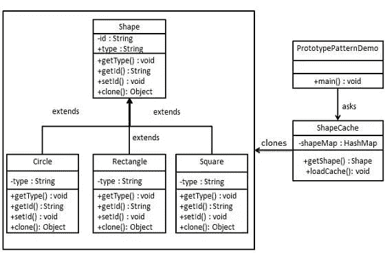
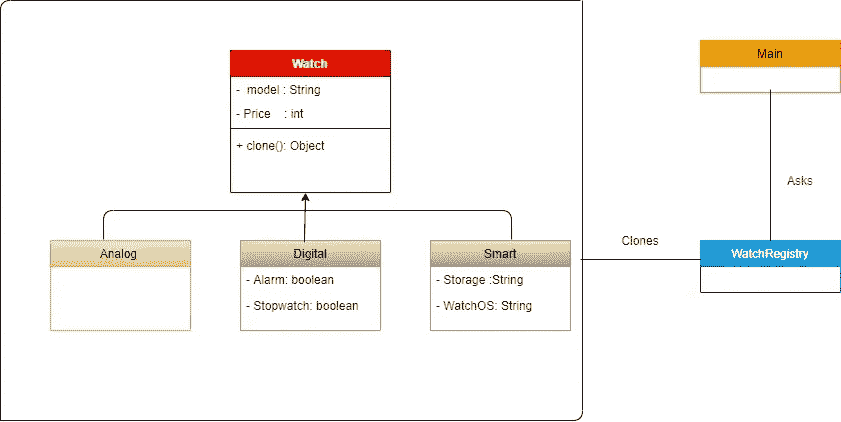
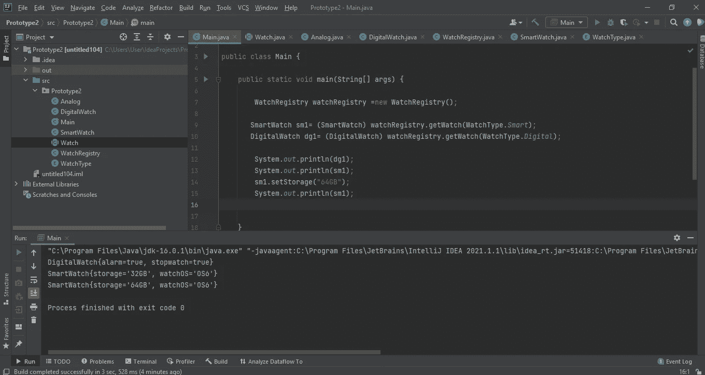

# 原型设计模式

> 原文：<https://medium.com/nerd-for-tech/prototype-design-pattern-6bf52e3c6e63?source=collection_archive---------7----------------------->

如你所知，这篇文章将是另一个设计模式，是原型设计模式，它是在创造类型下。我已经发表了两篇关于设计模式的文章。所以如果你是设计模式的新手，你可以参考这些文章。原型模式表示**克隆一个现有的对象，而不是创建一个新的，也可以根据需求**定制。那么这意味着什么呢？我简单解释一下。比方说，我们有一个在线商店，所以当用户搜索一个产品，它会显示成千上万的项目的权利。因此克隆这些项目比创建更容易。我们可以创建第一个实例并注册它。当你需要一个实例时，你可以从原始实例中克隆它。不需要创建新的实例。在我以前的文章中，首先让我们通过一个简单的例子来学习原型设计模式。然后，在我们理解了基础知识之后，我们可以去找一个更高级的真实世界的例子。看看下面的 UML 图。

如上图所示，我们需要创建形状抽象类和其他具体类(这里的子类是圆形、正方形、矩形)。那么这些类应该从 shape 类扩展而来。接下来，我们需要创建 ShapeCache 类。在我们的 ShapeCache 类中，我们有方法调用 get shape，它返回用户请求的形状的实例。用户请求是通过主类完成的。我们的 PrototypePatternDemo 类有一个 main 方法，它将使用 ShapeCacshe 来获取一个 Shape 对象。它会将信息(圆形/矩形/正方形)传递给 ShapeCacshe，以获得它需要的对象类型。正如你所看到的，这是原型设计模式的基本概念。我不打算实现这个场景，因为所有的属性和方法都在 UML 图中清楚地提到了，所以你可以试试那个。

## 浅层拷贝与深层拷贝

当您实现原型设计模式时，您需要确定您是需要浅层拷贝还是深层拷贝。浅层复制是通过创建一个新的集合对象并用对原始对象的子对象的引用填充它来完成的。因为复制操作不会递归，所以不会复制子对象。**浅拷贝存储原对象的拷贝，并指向原对象的引用。** **简单来说就是对一个对象的副本所做的所有修改都反映在原对象中。**

术语“深度复制”指的是递归复制过程。这意味着首先创建一个新的集合对象，然后用原始子对象的副本递归地填充它。**一个对象的副本被复制到深度副本中的另一个对象(位置)**。**对对象副本的任何修改都不会反映在原始对象中。**

现在让我们看一个高级的真实世界的例子。有一家卖手表的商店叫神奇手表。那家商店有不同类型、不同型号、不同价格的手表可供选择。顾客可以到商店购买或通过网站在线购买。种类繁多。主要手表分为模拟手表、数字手表和智能手表。模拟手表只包含手表的基本功能。所以基本上这是传统手表。数字手表有闹钟和秒表。智能手表有一些传统手表没有的功能，如手表的存储、手表操作系统。

让我们实现这个场景。首先，我实现了 Watch 类，并将其抽象。还实现了 getters 和 setters。因为需要这些对象来从 Cloneable 接口克隆 Watch 类实现。

然后，我创建了模拟、数字和智能手表的其他类，并从手表类扩展而来。我还实现了 toString 方法。

然后你必须实现一个枚举，如下所示。

接下来，在 WatchRegistry 类中，我实现了名为 Watches 的 HashMap。在 WatchRegistry 类中，我们有构造函数、getWatch 方法和 initialize()方法，如下所示。

在 main 类中，首先从 WatchRegistry 类创建一个实例。然后，您可以从这里的模拟、数字和智能子类中创建一个实例。接下来，您可以使用 WatchRegistry 实例调用 watchRegistry 类中的 getWatch 方法，并记住像下面这样进行转换。最后，您可以根据需要更改任何属性值。

程序的输出如下。

现在让我们来看看原型设计模式的优缺点。

## 原型设计模式的优势

1.  它减少了分类的需要。
2.  它隐藏了创建对象的复杂性。
3.  客户端可以获得新的对象，而不知道它将是哪种类型的对象。
4.  它允许您在运行时添加或删除对象。

## **原型设计模式的缺点**

1.  对于使用很少对象和/或没有强调原型链扩展的项目来说，这是过度的。
2.  它还对客户端隐藏了具体的产品类
3.  Prototype 的每个子类都必须实现 clone()操作，当所考虑的类已经存在时，这可能很困难。此外，当 clone()的内部包含不支持复制或具有循环引用的对象时，实现 clone()会很困难。

## 何时使用原型设计模式

1.  当类在运行时被实例化时。
2.  当创建一个对象的成本很高或很复杂时。
3.  当您希望保持应用程序中的类数量最少时。
4.  当客户端应用程序不需要知道对象的创建和表示时。

您已到达这篇文章的结尾。所以我希望你了解原型设计模式，我将在接下来的博客中上传另一个设计模式。我已经上传了完整的代码到 GitHub，我把链接放在了参考文献中，所以如果你想的话，你可以参考一下。那么是时候说再见了，让我们从另一篇文章中见面。

# 参考

 [## dilshanushara/Krish _ LP _ Training

### 在 GitHub 上创建一个帐户，为 Dilshanushara/Krish _ LP _ Training 的发展做出贡献。

github.com](https://github.com/Dilshanushara/Krish_LP_Training/tree/master/Design%20Patterns/Pototype)  [## 设计模式-原型模式

### 原型模式是指在考虑性能的同时创建重复的对象。这种类型的设计模式…

www.tutorialspoint.com](https://www.tutorialspoint.com/design_pattern/prototype_pattern.htm)  [## 用 Python 复制(深层复制和浅层复制)- GeeksforGeeks

### 在 Python 中，赋值语句不复制对象，它们在目标和对象之间创建绑定。当我们使用…

www.geeksforgeeks.org](https://www.geeksforgeeks.org/copy-python-deep-copy-shallow-copy/)