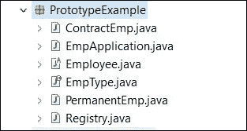
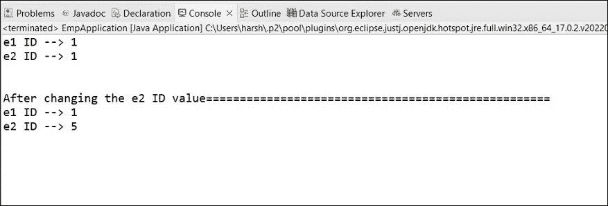

# 原型设计模式

> 原文：<https://medium.com/nerd-for-tech/prototype-design-pattern-ed85ac4cc575?source=collection_archive---------1----------------------->

原型设计模式是创造性设计模式之一。当创建对象是一件昂贵的事情，需要大量的时间和资源，并且你已经有一个类似的对象时，使用原型设计模式。它提供了一种机制，将原来的对象复制到一个新的对象中，然后根据我们的需要进行修改。

这种模式鼓励我们克隆对象，而不是创建新对象。也就是说，一旦你完成了对象的注册，它就避免了**【新关键字】**。

基本上我们可以这样说，在这种情况下，你可以从原型模式中获益。

1.  **如果对象创建过程开销很大**
2.  **如果创建对象时有很多事情要做**

您将学习我们如何实现原型设计模式以及原型模式中的示例。

## 原型模式的背景:

在 java 中，当你实现原型模式时，你必须使用“ **Cloneable 接口**”。

你想在你希望得到克隆的类中实现可克隆的接口。然后，您需要在类中覆盖 clone()方法。但是一定要记住它总是返回对象类型。

很可能在现实世界的应用中，你可能不得不使用你自己的克隆方法。

更进一步，当你使用克隆方法时，首先根据你的程序考虑你需要什么。请务必选择您想要“浅层拷贝”还是“深层拷贝”。

当我们克隆东西的时候。根据我们如何实现克隆方法，它可能给出“浅层拷贝”或“深层拷贝”。

> **浅复制** - >只是将第一级对象中的*复制并引用*到新对象中
> 
> **深度复制** - >你进去*你把每一个对象和值*复制/克隆到新对象里。

浅层拷贝非常危险，因为有时当你修改克隆的对象时，也可能影响到你的原始对象。

## **原型样板演示:**

在这里，我将从员工那里获得范例。假设我们有两种类型的员工“永久员工”和“合同员工”。

现在您有了一个与 Employee 相关的系统，您可能需要从这两个雇员创建对象。让我们假设雇员对象创建过程更昂贵。

如果是这样的话，我们可以使用原型设计模式。对吗？

我们在原型模式中所做的是，首先，我们得到每一个对象，并在注册表中注册这些对象。

因为我们想从 employee 类中获得克隆，所以我们在 employee 类中重写了 clone 方法。然后，无论何时用户从永久雇员或合同雇员那里请求一个对象，你都可以与注册中心见面并请求一个克隆对象。因为在注册表中，我们有所有注册的对象。

1.第一步，我们要做的是，我们需要为 Employee 创建一个抽象类。PermanentEmp 和 ContractEmp 将扩展 Employee 类。

这是我们的雇员类，它只有 setters 和 getters。除此之外，我们还覆盖了 clone 方法，因为我们想从 Employee 类中克隆。

在这里你可以看到克隆方法返回了对象类型。此外，我们需要关注异常。为了获得使用克隆方法的许可，你必须实现**可克隆接口**。

然后，你可以实现 PermanentEmp.java 和 ContractEmp.java

2.现在，我们需要一个可以进行对象注册的地方。我们在 Registry.java 内部这样做。

当用户创建一个注册表对象时，我们需要在注册表中注册所有的对象。所以我们在构造函数内部使用 registerObj()方法。

在该方法中，我们从 employees 创建新对象，所有对象都将使用 hash map 在注册表中注册。

一切都好。但是应该有一种方法让用户获得雇员克隆，所以我们需要一种方法。这里，我们使用名为 getEmployee()的方法。基于雇员类型，它将提供相关的克隆对象。

此外，您可以使用 enum 来保存雇员类型。

3.最后，我们有一个主类，它可以从注册表中创建实例，并从我们需要的对象中获得一个克隆。

我们的结果会是这样的。

这是原型设计模式。只要创建对象的成本很高，就可以使用这种模式。

**代码示例:**

[https://github . com/harshani 2427/learn-with-krish/tree/master/Design % 20 patterns/proto type/protoyedesignpattern](https://github.com/harshani2427/learn-with-krish/tree/master/Design%20Patterns/Protoype/ProtoypeDesignPattern)