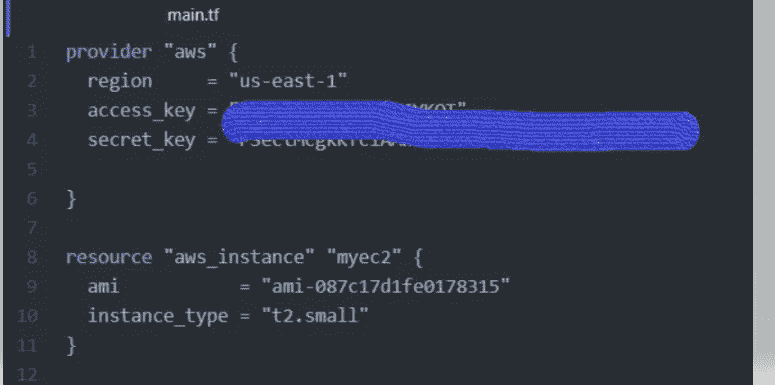
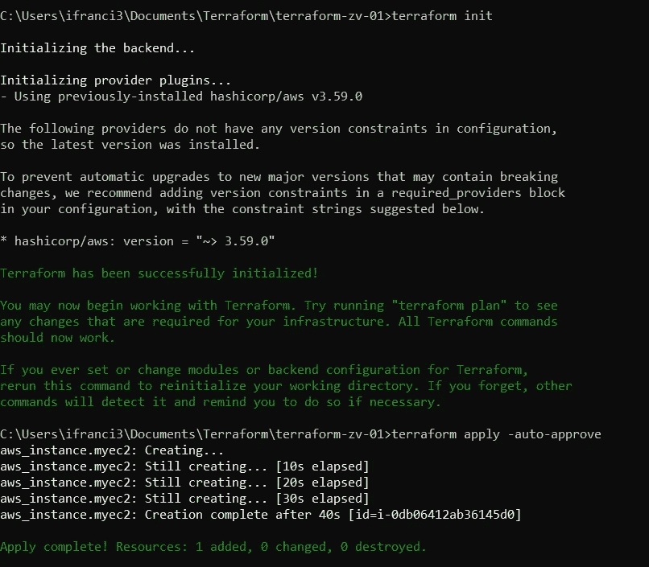
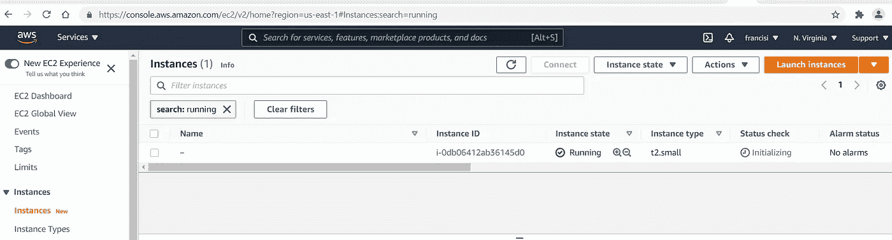
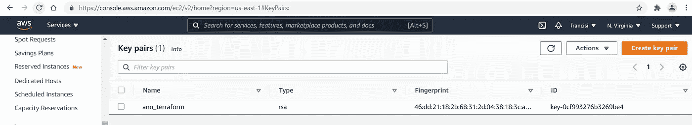
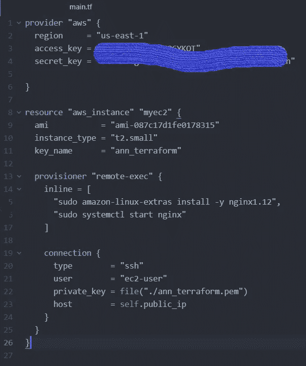
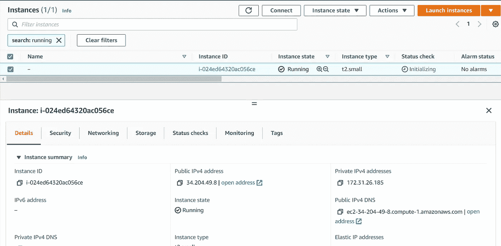
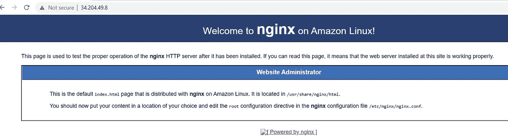

# 在 AWS 上使用 terraform 提供您的第一个 nginx

> 原文：<https://medium.com/nerd-for-tech/provisioning-your-first-nginx-using-terraform-on-aws-2182d9ccf928?source=collection_archive---------3----------------------->

穆罕默德·阿里·皮克在 [Unsplash](https://unsplash.com?utm_source=medium&utm_medium=referral) 上拍摄的照片

我们将学习使用 provisioners 作为 terraform 中资源创建的一部分，来部署 EC2 并运行自定义脚本来安装 nginx web 服务器。

先决条件-

1.  已安装 Terraform v0.13+
2.  AWS CLI v 2+已安装和配置

**什么是置备者？**

置备程序是帮助我们配置通过 terraform 启动的资源的助手组件。例如，terraform 可以在 AWS 中推出 EC2，但仅靠 terraform 无法帮助我们在 EC2 上运行脚本。这就是置备者所要帮助的。

有两种类型的置备程序

1.  本地执行供应器 -允许调用本地可执行文件
2.  **远程执行供应器** —直接在远程机器上运行脚本

让我们从使用远程执行供应器配置 nginx 开始

**第一步:**

让我们通过 terraform 发布一个 EC2。

创建一个名为 main.tf 的新文件

现在快跑

*地形初始化*

*地形申请-自动审批*

交叉检查这是否在我们的帐户中启动了 EC2 实例

**第二步:**

让我们修改代码，通过 provisioner 安装 nginx。

我们将通过远程执行安装 nginx，为此我们需要一个密钥对来连接到服务器。转到控制台-> EC2->密钥对

创建一个新的密钥对，下载它并将其放在与 main.tf 相同的文件夹中

修改 tf 以包括 provisioner

现在快跑

*地形申请-自动审批*

申请成功后，打开控制台，获取公共 IP

验证 nginx 已启动并正在运行

恭喜您，您已经通过 terraform remote-exec 配置了您的 nginx