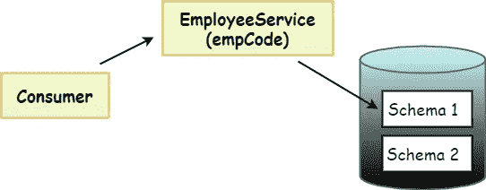
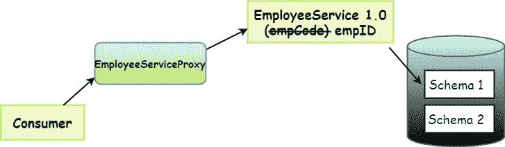
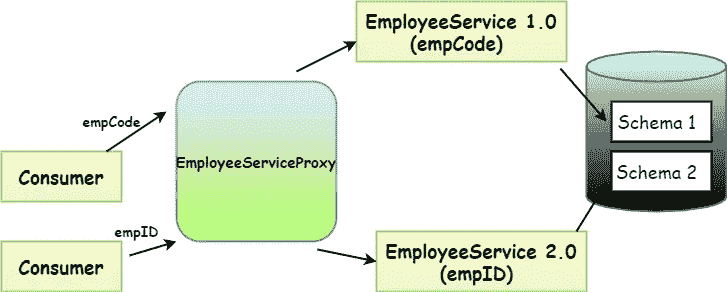
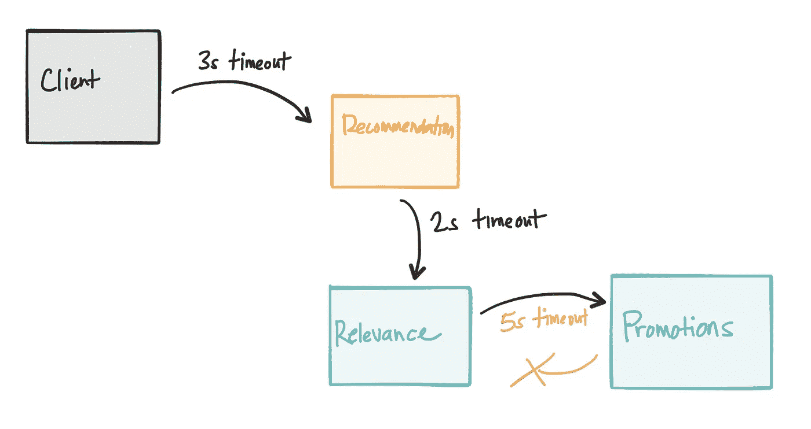

# 代理微服务设计模式

> 原文：<https://medium.com/nerd-for-tech/proxy-microservice-design-pattern-91d455b0d05a?source=collection_archive---------2----------------------->

微服务设计模式(**第 3 部分**)

代理微服务设计模式与聚合器略有相似。但是根据代理设计模式，我们不需要消费者上的聚合器，而是创建一个微服务来基于业务需求调用其他服务。让我们通过下面的例子来理解代理模式。

**举例:**

️Assume 您的公司目前有一个单一的应用程序。所以现在你需要转向微服务架构。因此，当您部署微服务时，可能需要改变服务。

▪️考虑一下，你有一个微服务来获取员工的休假信息。因此，消费者需要通过 empCode 来获取休假信息。(图 1)

图 1

▪️:但是在新的重组中，你决定保留 empID 作为所有记录的关系键。

▪️:现在你部署了新的重组员工服务(新版本)。但不幸的是，已经在消费你之前的员工服务的消费者将**打破**。😭

## 为什么？🧐

▪️，因为那些消费者会通过“empCode”。但是新版本的服务需要 empID。所以在那个时候，你把当前的服务更新到新的版本，你的消费者就会崩溃。

🟡 **作为一个解决方案，我们可以在这里使用代理设计模式。**

▪️你可以通过创建一个单独的代理服务来解决这个问题，如下所示。(图 2)

图 2

▪️相应地，消费者将调用代理服务。您可以将其修改为(图 3):

> *如果消费者通过 empID* ***调用版本 2(新版本)***
> 
> *如果消费者通过 empCode* ***调用版本 1(旧版本)***

图 3

✹:这样，你就可以独立地部署服务，而不会影响消费者。当没有流量，schema 1 没有收到来自消费者的请求时，您可以停止服务 1，保留服务 2(新版本)。在这里，语义版本控制非常重要。

✹然而，当谈到代理设计模式时，我们还必须考虑其他重要的事情。🡻

## ✨版本控制

> ***语义版本化***

语义版本控制通过三个非负整数将每个版本显示为“ ***MAJOR”。MINOR.PATCH*** ”(如图 4)而这些整数每一个都有自己的含义。

▪️我在我的“ [**微服务最佳实践**](/geekculture/best-practices-for-microservices-microservices-part-2-a8646f3e1753) ”博客中讨论了版本控制。更多详情请参考。(点击下面的链接)

 [## 微服务的最佳实践📳(微服务—第 2 部分)

### 微服务:✨最佳实践

medium.com](/geekculture/best-practices-for-microservices-microservices-part-2-a8646f3e1753) 

## ✨服务发现

✹:当你创建一个服务时，最好使用一个外部团体来发现你的服务。

**为什么？** 🧐

因为，如果基于微服务的系统中的基础架构发生变化，主机名、IP 地址等。也可以改。。为了保持安全，消费者需要一种方法来识别可用服务的实例。因此，如果您有一个服务发现工具，代理可以调用服务发现工具，并可以获得更新的地址。这就是服务发现出现的方式。

一些服务发现工具的例子: **WSO2 治理注册中心，Hashicorp 咨询，Zookeeper，smart stack…等等。**

**笔记📝:**

✤:当你实现代理模式时，你需要注意线程池。因为如果没有实现适当的线程池功能，线程可能会被阻塞。(最好相应地使用多线程池或线程移交机制)

✤代理位于消费者和新的微服务(新创建的微服务版本)之间。代理保留了原始的 API，从而允许消费者与之交互。代理服务具有所需的逻辑来与新的微服务结合，以便向消费者提供数据和原始逻辑。

## ✨暂停

当你有一个代理服务，并假设服务版本 1.0 被延迟。因此，如果您没有实现“超时”，它可能会阻塞线程，并可能会影响新的服务版本 2.0。

ref:[https://dzone . com/articles/the-hard-part-of-micro services-calling-your-ser](https://dzone.com/articles/the-hardest-part-of-microservices-calling-your-ser)

我在博客“ [**断路器模式**](/nerd-for-tech/circuit-breaker-design-pattern-ce6378f5a929) ”中讨论过超时问题。更多详情请参考。(点击下面的链接)

 [## 断路器设计模式🔩

### 微服务设计模式—第 2 部分

medium.com](/nerd-for-tech/circuit-breaker-design-pattern-ce6378f5a929) 

# 代理设计模式的优缺点

## 优势:

✹这很容易实现。

✹简单。

可以实现与外部服务相关的✹验证和安全性，并且可以非常容易地封装在代理中。

## 缺点:

✹瓶颈

✹不适宜改变反应

# 参考

[微服务的设计模式—代理](https://www.youtube.com/watch?v=7mBvb7nKONg&list=PLD-mYtebG3X9HaZ1T39-aF4ghEtWy9-v3&index=7)

[https://www.geeksforgeeks.org/proxy-design-pattern](https://www.geeksforgeeks.org/proxy-design-pattern/)

[https://www . tutorialspoint . com/microservice _ architecture/microservice _ architecture _ composition _ patterns . ht](https://www.tutorialspoint.com/microservice_architecture/microservice_architecture_composition_patterns.htm)ml

[https://www . oreilly . com/library/view/microservice-patterns-and/9781788474030/5b 4d 76 ce-184 b-4480-a050-AEC 1582 c8 c 83 . html](https://www.oreilly.com/library/view/microservice-patterns-and/9781788474030/5b4d76ce-184b-4480-a050-aec1582c8c83.xhtml)

[https://8 thlight . com/blog/Colin-Jones/2018/09/18/microservice sarent-magic-handling-time outs . html](https://8thlight.com/blog/colin-jones/2018/09/18/microservices-arent-magic-handling-timeouts.html)

[https://www . nginx . com/blog/service-discovery-in-a-micro services-architecture](https://www.nginx.com/blog/service-discovery-in-a-microservices-architecture/)

[https://search apparchitecture . tech target . com/tip/Navigate-service-discovery-in-a-micro services-architecture](https://searchapparchitecture.techtarget.com/tip/Navigate-service-discovery-in-a-microservices-architecture)