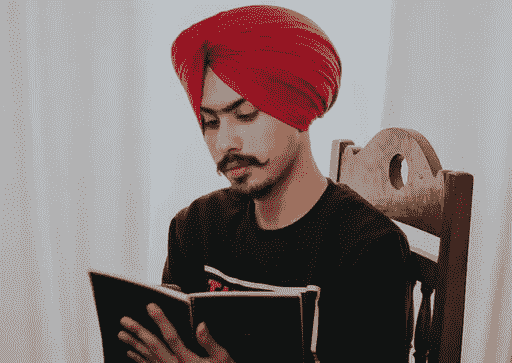

# 为什么媒体应该付钱给印度作家？💸

> 原文：<https://medium.com/nerd-for-tech/psst-medium-consider-paying-indian-writers-please-9dfc21a830c5?source=collection_archive---------5----------------------->

## 这只是一位印度作家关于媒介合作伙伴计划的另一篇文章

由 [Unsplash](https://unsplash.com/s/photos/indian-writer?utm_source=unsplash&utm_medium=referral&utm_content=creditCopyText) 上的[美元吉尔](https://unsplash.com/@dollargill?utm_source=unsplash&utm_medium=referral&utm_content=creditCopyText)拍摄的照片

我在 2019 年 6 月开始在 Medium 上写作。那时，我正试图离开我的 Wordpress 博客， [HardTasksIn](https://www.hardtasksin.wordpress.com) ，尝试在媒体上写作。

我一点也不知道我会爱上这个平台。与其他作家互动，阅读他们的故事，对我来说意味着一个世界。

# 我的故事会爆炸，但我的钱包不会

我在这个平台上写了将近 3 年的文章，获得了超过 30 万的浏览量和超过 20 万的阅读量，但是我的工作从来没有得到过报酬。类似的情况还有成千上万的印度作家在这个平台上免费写作。

在离开这个平台近一年后，我最近又达到了每月 20k+的浏览量，因为 Medium 不会支付我的工作。我尝试在 Dev.to、Hacker Noon、GeeksforGeeks、GitHub pages 和许多其他网站上发表文章。但我觉得，我应该回来。

# 对我来说，写作从来都不是为了钱

我最初并不是为了钱，但相信我，如果他们允许印度作家注册并从这个平台上赚钱，那感觉会很棒。

这将是他们的读者对他们工作出色的认可，谁知道许多人会仅仅因为工作出色而开始全职工作。

[Sharon McCutcheon](https://unsplash.com/@sharonmccutcheon?utm_source=unsplash&utm_medium=referral&utm_content=creditCopyText) 在 [Unsplash](https://unsplash.com/s/photos/cash?utm_source=unsplash&utm_medium=referral&utm_content=creditCopyText) 上拍摄的照片

# 为什么用条纹做借口？

Medium 还是会告诉你“ **Stripe 在印度没有”**(即使在我加入 3 年后！！)因此，**我们不会向印度作家**支付他们的收入份额和**他们为网站创造的流量，tbh，这是很多的**。

我在平台上见过一些了不起的印度作家，如果不是因为 Medium 的虚伪，他们真的会变得财务稳定。**该平台本可以变得更加包容和多样化。**

让我提醒你，Medium 是一家互联网创业公司，和其他公司一样。我还没找到他们为什么不允许印度作家参与他们的合作项目，而其他支付服务如 Paypal、电汇、Transfer Wise 和 Payoneer 已经在印度使用并完全发挥作用。印度自由职业者已经在使用这些服务进行国际交易。

> 仅仅说 stripe 在巴西和印度处于测试阶段，因此我们不能支付这些地区的作家并不意味着什么！！
> 
> 这只是表明，尽管有全球知名投资者的支持，但你“**没有能力为在该平台上写作的大部分作家带来价值”。**

# 我写这个想达到什么目的？

第一个目标是让其他作者意识到**媒介合作伙伴计划对某些国家来说是一项真正的特权。**

> 有**人实际上带来了读者**和**还有其他人从中获利**而与此同时**首先带来流量的人没有得到报酬**。印度作家在媒体上的情况与此相似。这比抵押劳工更糟糕！！

鉴于平台上印度作家的规模，如果每个人都停止在媒体上写作，这将意味着媒体失去大量眼球和免费收入。

更好的是，如果有人像印度的 Medium 一样为作家发明了一个本土平台，这将真正改变游戏。

我的第二个目标是让我们在 Medium 的朋友们意识到我们印度人不仅仅是廉价劳动力，并提醒他们这个问题不会自己解决。我们喜欢在媒体上分享我们的知识，但我们希望这个平台能回报我们同样的爱。

# 结论

希望他们能读一下这个。我不想让这听起来像是威胁或警告，而更像是真实的反馈。在平台上写了几年之后，我真的觉得他们早就应该通过媒体合作伙伴计划向印度作家付费了。

在那一天到来之前，我会为我的观众写作。干杯！