# 发布到 Google Play 商店

> 原文：<https://medium.com/nerd-for-tech/publishing-to-the-google-play-store-1f225d16759e?source=collection_archive---------1----------------------->

## 统一指南

## 关于如何将手机游戏发布到 Google Play 商店的快速指南

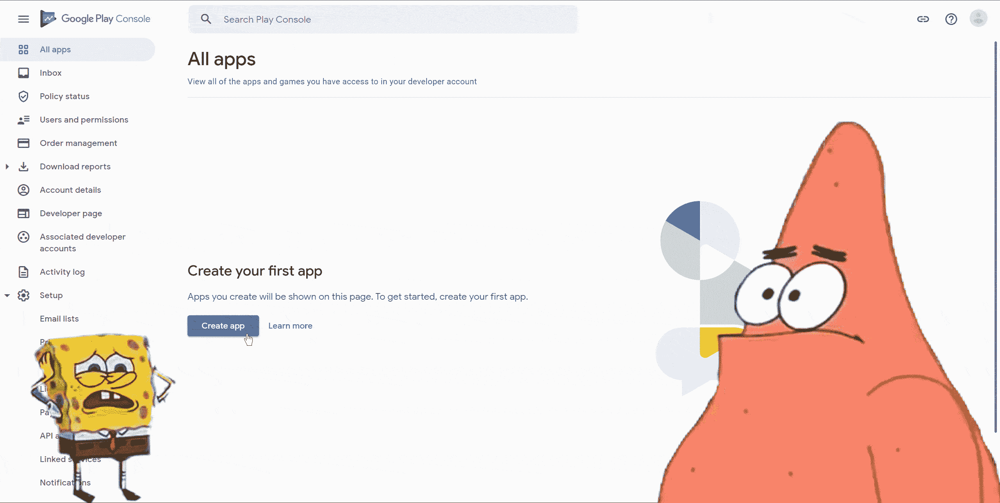

**目标**:将一款用 Unity 制作的 2D 手机游戏发布到 Google Play 商店。

在上一篇文章中，我介绍了[如何在我们的手机游戏中使用 Unity](/nerd-for-tech/rewarded-video-ads-unity-28a9baebaa91) 实现奖励视频广告。现在，是时候将我们完成的游戏发布到 Google Play 商店了。

# 创建开发人员帐户

首先，我们需要在下一个站点创建我们的开发人员帐户:

 [## Google Play 控制台| Google Play 控制台

### 使用 Google Play 控制台发布和管理您的应用程序和游戏，并在 Google Play 上发展您的业务。了解…

play.google.com](https://play.google.com/console/about/) 

进入后，我们会看到一个进入 Google Play 控制台的按钮，我们必须点击它:

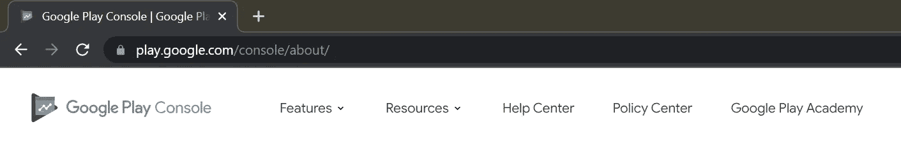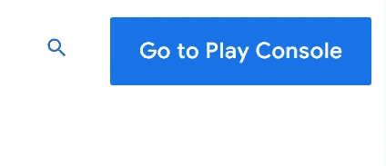

然后，我们需要选择一个 Google 帐户作为我们的开发者帐户。

有两种类型的开发人员帐户:

*   为你(个人)
*   为您的组织或公司

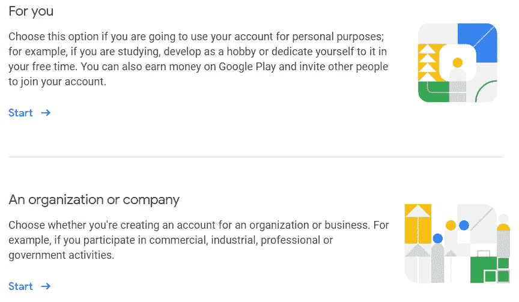

如果您像我一样选择个人帐户，您需要提供个人信息并支付 25 美元的独特费用，才能在 Google Play 商店上发布您的游戏或应用程序:

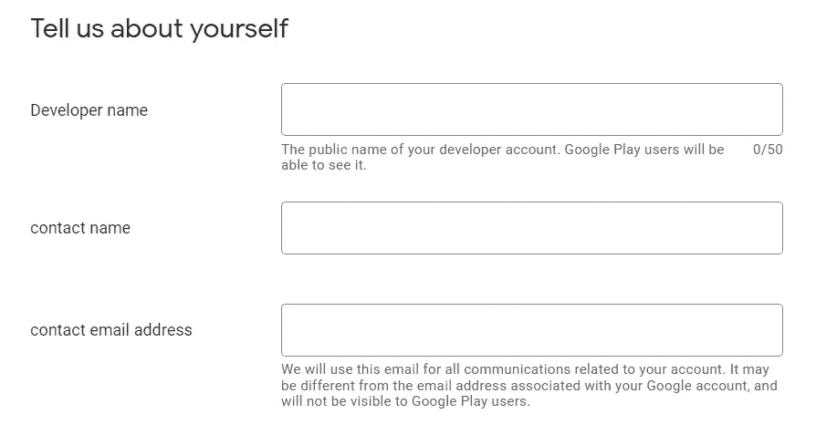

一旦提供了信息并支付了费用，我们将能够看到 Google Play 控制台，在那里我们将看到我们发布的所有应用程序及其分析:

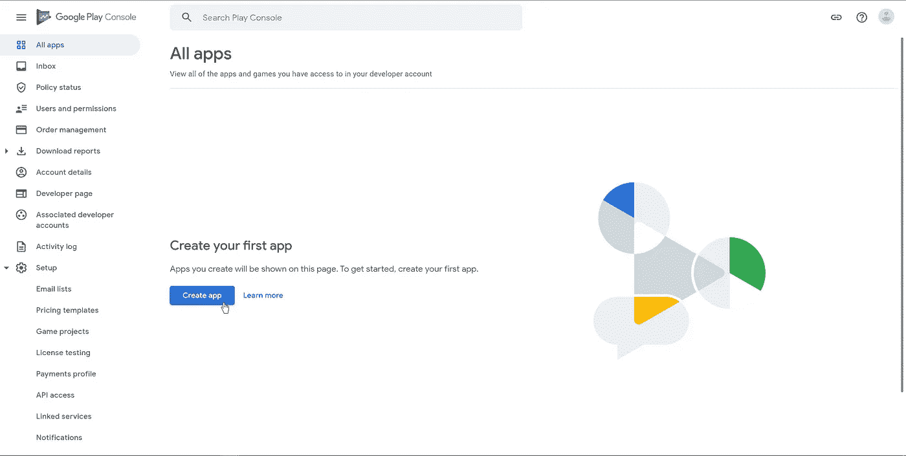

# 用 Unity 打造你的游戏

现在我们已经有了我们的开发者帐户来在 Google Play 商店发布我们的游戏，我们需要在 Unity 中构建我们完成的游戏。

## 配置您的游戏设置

首先，让我们点击 ***文件>构建设置*** ，打开**构建设置**窗口。然后，让我们通过点击窗口底部的左侧按钮打开**播放器设置**:

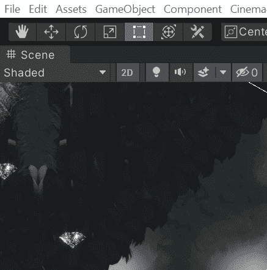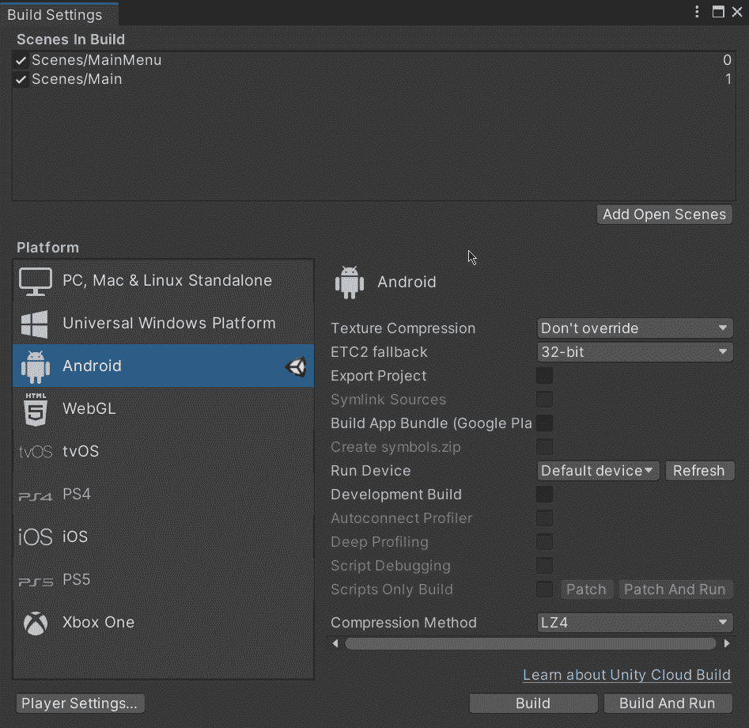

打开后，让我们确保填写信息，并为我们的游戏设置正确的设置，以便按照我们的要求进行部署:

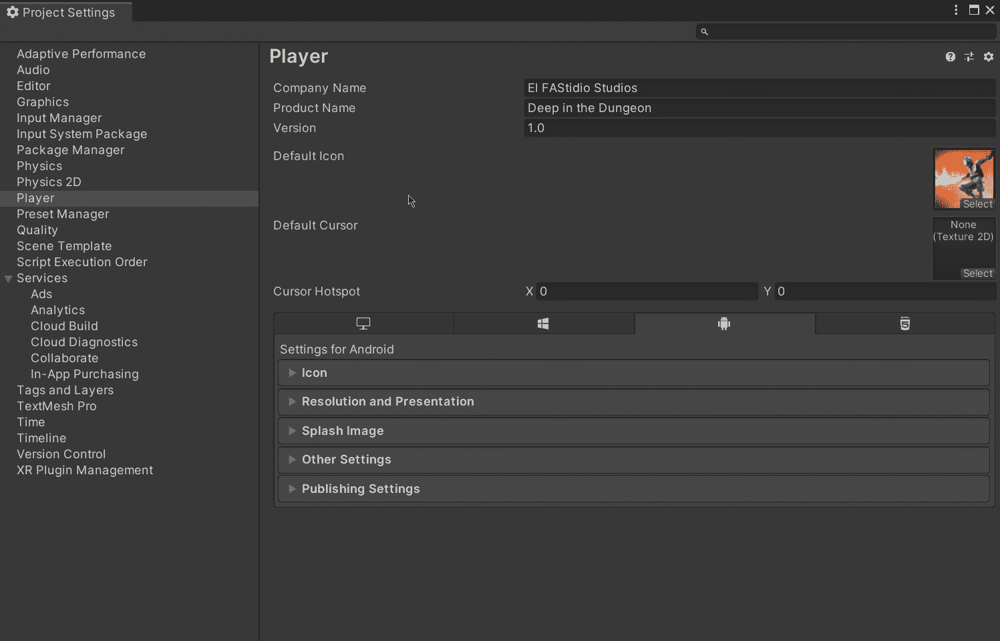

## 在游戏上签名

接下来，当信息被填充并且正确的设置被应用时，我们需要创建一个新的**密钥库**。密钥库将允许我们对应用程序进行签名，并确定我们是开发者，以避免未经授权的使用(必须将签名的应用程序上传到谷歌 Play 商店)。

因此，为了用密钥库对我们的应用程序进行签名，让我们通过单击**发布设置**中的相应按钮来打开**密钥库管理器**窗口:

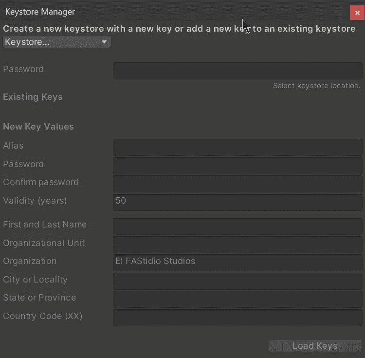

一旦打开，让我们**选择用新密钥**创建一个新的 **密钥库，然后**选择保存它们的位置**。一旦选定，让我们**设置一个安全密码**和**填写钥匙需要的相应信息**:**

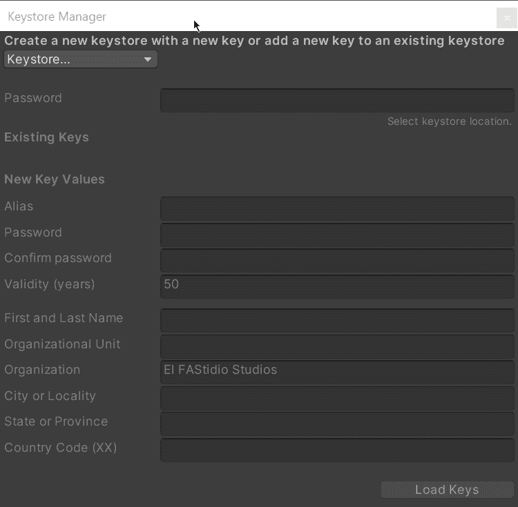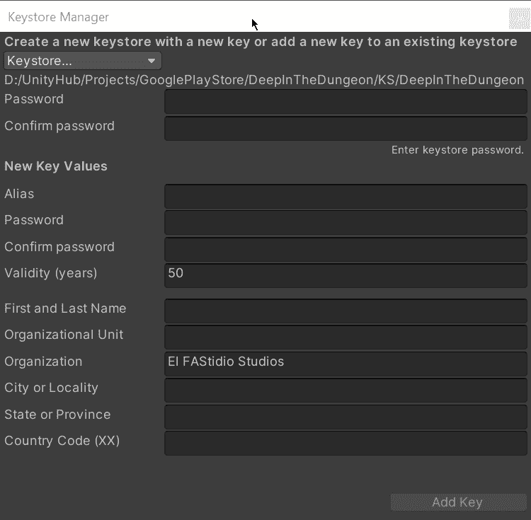

最后，当我们完成这些字段时，让我们通过点击底部的右边按钮来添加密钥:

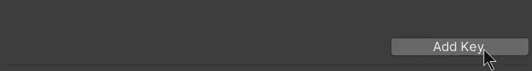

然后，让我们在将提示为我们的项目设置密钥和密钥库的窗口中确认:

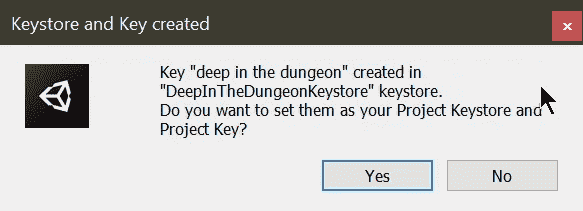

## 构建游戏

现在，为了构建我们的游戏，让我们返回到**构建设置**窗口，在这里我们需要启用 ***构建应用捆绑包(Google Play)*** 选项，然后点击 ***构建*** 按钮来创建一个 AAB 文件:

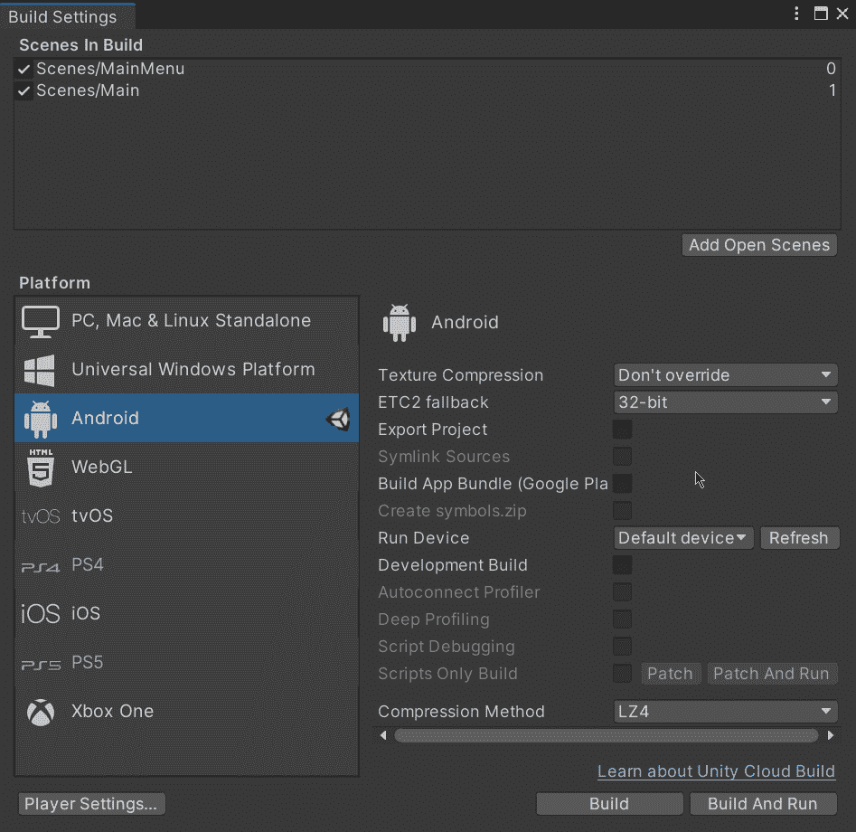

然后，在选择了构建游戏的文件夹后，让我们等待 Unity 来构建它:

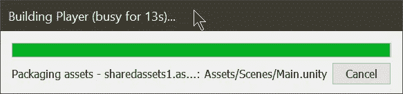

接下来，相应的文件夹将被提示，我们将看到我们的 AAB 文件。如果您想要一个 APK 文件，您只需在构建设置中禁用 ***构建应用捆绑包(Google Play)*** 选项。

> 请记住，谷歌 Play 商店需要一个 AAB 文件，而不是 APK 文件来发布您的游戏。

# 发现的问题

现在，在将我们的游戏发布到 Google Play 商店之前，让我们来看看我在发布游戏之前发现的一些问题，以及我是如何设法解决这些问题的:

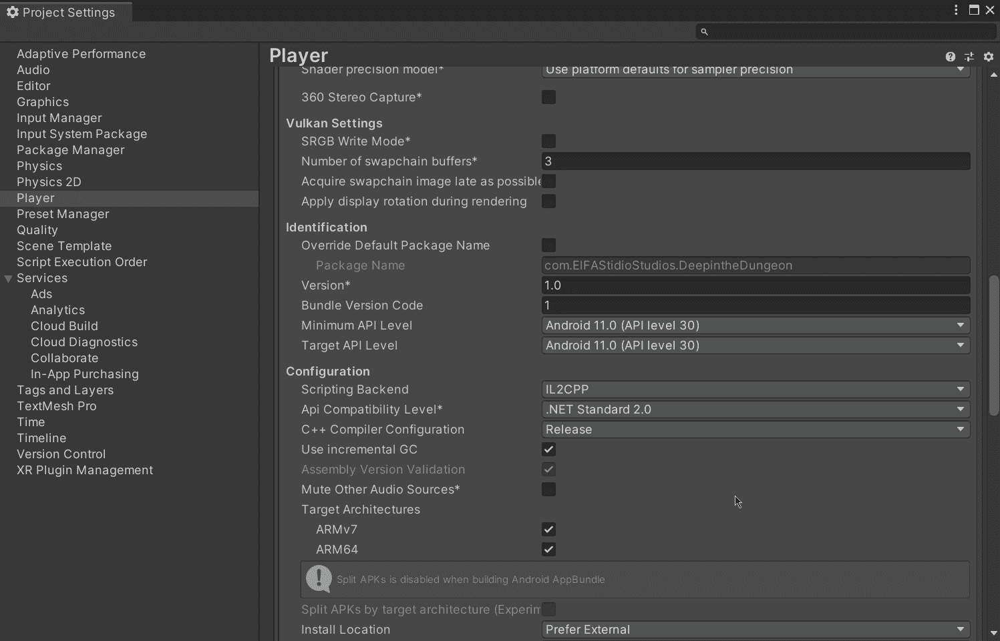

> **不符合 Google Play 64 位要求**

这条错误消息是在我将 AAB 文件上传到商店后出现的，它表明我的应用捆绑包只有 32 位本机代码。所以，我解决这个问题的方法是:

*   打开**项目设置**窗口
*   选择**玩家**标签
*   进入 ***其他设置***
*   将**脚本后端**的配置更改为 **IL2CPP**
*   **选择**两个 **ARMv7** 和 **ARM64** 作为目标架构
*   重新构建游戏

> **在调试模式下对包进行了签名**

这个错误消息是在上传我的 AAB 文件后出现的，它指出我的包是以调试模式签名的。为了解决这个问题，我只是确保我的项目有一个密钥为的 **keystore，然后像上面的步骤一样构建我的游戏。**

> **应用程序应具有最低指定的 30 级 API**

这个错误信息出现在上传我的 AAB 文件后，它说这个应用程序应该用 30 级的最低目标 API 来构建。所以，我解决这个问题的方法是:

*   打开**项目设置**窗口
*   选择**玩家**标签
*   转到 ***其他设置***
*   将**最低 API 等级**改为 30 级
*   将**目标 API 等级**改为 30 级
*   重新构建游戏

# 在 Google Play 商店发布应用程序

现在我们已经有了 AAB 的文件，我们需要在谷歌 Play 商店发布它之前满足一些要求。

首先，让我们使用我们的开发者帐户进入 [Google Play 控制台](https://play.google.com/console)，点击**创建应用**按钮，就可以创建我们游戏的新草稿了:

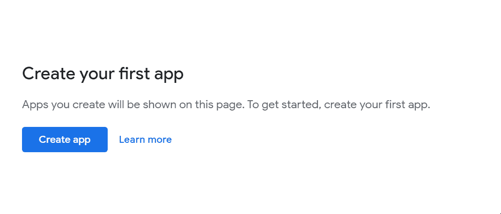

点击后，我们需要填写或接受几个细节来发布我们的游戏:

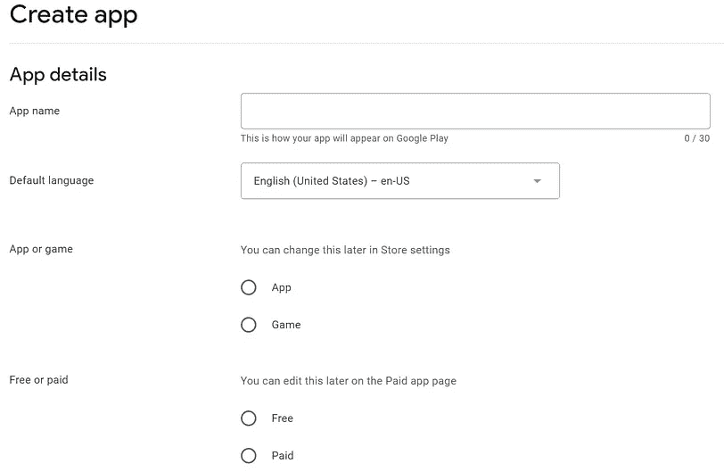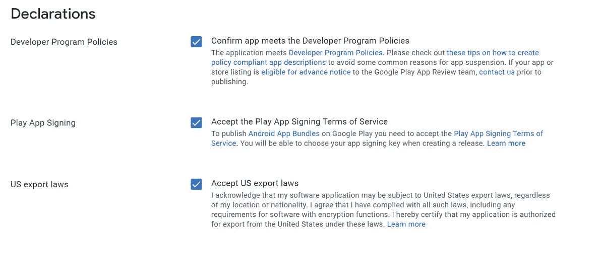

然后，在字段完成后，让我们点击**创建应用**按钮来创建我们游戏的新草稿:

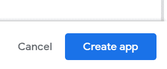

创建完成后，我们将能够看到新应用程序的**仪表盘**:

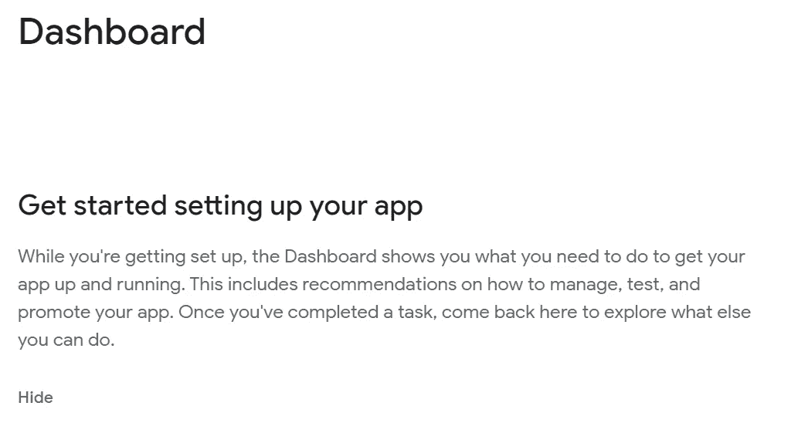

在仪表盘中，我们将看到发布应用程序前要采取的第一步，包括:

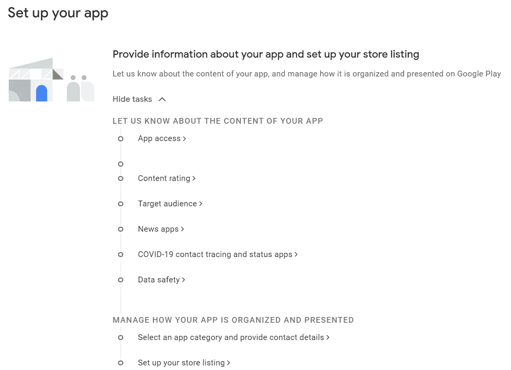

要采取的步骤之一是回答一份**问卷**来对游戏内容进行评级，这样当游戏发布时，它就可以提供给适当的用户:

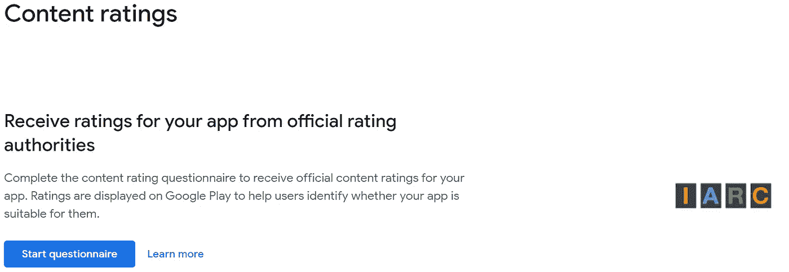

一旦我们完成第一步，我们将需要采取生产跟踪步骤，其中我们需要:

*   选择我们的应用程序可用的国家和地区。
*   创建一个新的版本发布以供审查并最终发布。

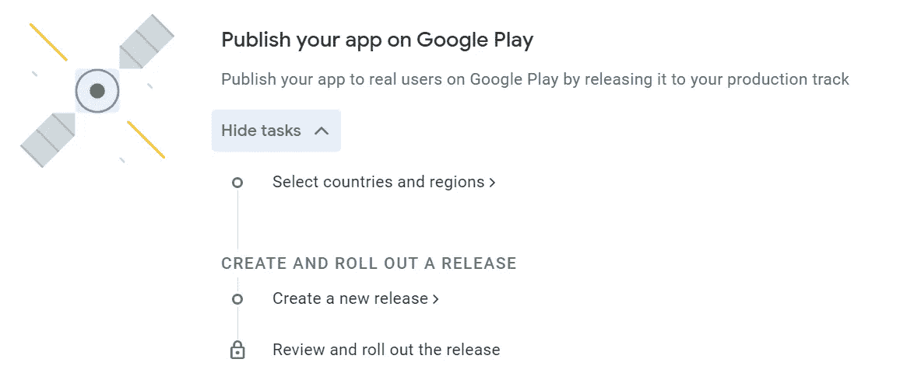

一旦我们选择了应用的国家和地区，就让我们创建一个新的生产版本:

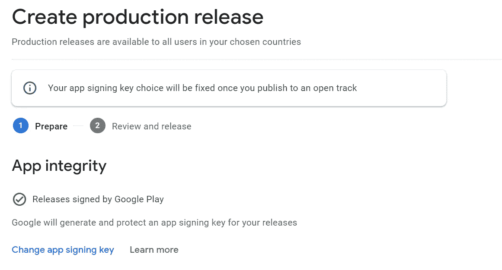

在这里，我们需要上传之前在 Unity 中构建的 AAB 文件:

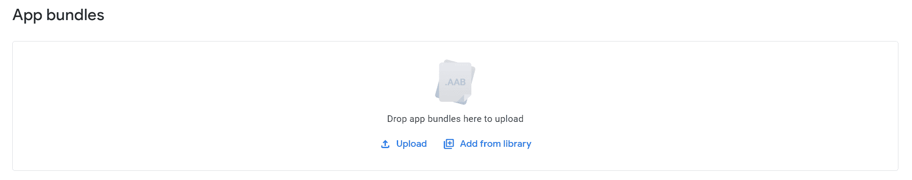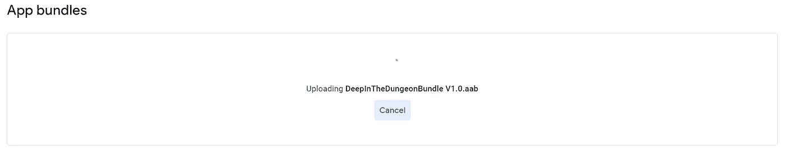

最后，上传后，我们只需保存我们的发布，然后单击页面底部的 review 按钮。如果一切按预期进行，我们将能够在 review 中看到我们的应用状态为 ***，我们只需要等待几个小时或几天就可以看到我们的应用发布在 Google Play 商店上:***

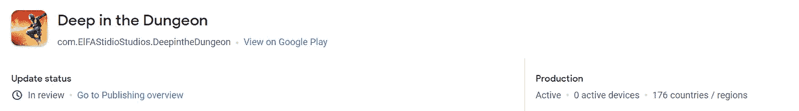

就这样，我们在 Google Play 商店上发布了我们的 2D 游戏(由 Unity 制作)!:d .我会在下一篇文章中看到你，在那里我会展示关于 Unity 的新内容。

如果你想试试我的游戏，你可以在 **Google Play 商店**这里观看:

 [## 地牢深处 Google Play 上的应用

### 每个人 10+在地牢深处你是一个骑士，将在一个古老的地牢中与几个怪物战斗…

play.google.com](https://play.google.com/store/apps/details?id=com.ElFAStidioStudios.DeepintheDungeon) 

或者您可以在线播放(手机友好)或在此下载(Windows ):

 [## 在地牢的深处

### 这个游戏在 itch.io 上是手机友好的，为了更好的体验，请考虑下载游戏的 Windows 版本…

fernandoalcasan.itch.io](https://fernandoalcasan.itch.io/deep-in-the-dungeon) 

请考虑留下评论或评价我的游戏，我真的很感激你的想法。

> *如果你想了解我更多，欢迎登陆*[***LinkedIn***](https://www.linkedin.com/in/fas444/)**或访问我的* [***网站***](http://fernandoalcasan.com/) *:D**