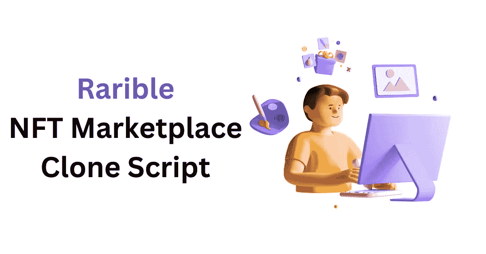

# 启动我们非凡的稀有克隆脚本，提升你的业务

> 原文：<https://medium.com/nerd-for-tech/pump-up-your-business-by-launching-our-remarkable-rarible-clone-script-c24b3eb643e9?source=collection_archive---------1----------------------->

Rarible 是一个专业的市场，出售各种领域的加密收藏品，包括游戏、艺术品、朋克、metaverses、域名、defi 等等。Rarible 是一个使用加密技术的系统，通过平滑的交换测量来支持不可替换代币和高级收藏品的购买、投标、销售和制造。自 2017 年执行 Crypto Kitties 以来，Rarible 一直蓬勃发展。75，000 个 RARI 代币每七天平均分配给买家和卖家。

Rarible 克隆脚本是 Rarible 的复制品，Rarible 是一个基于以太坊的分散式 NFT 市场，在这里你可以铸造、购买和出售数字收藏品。Rarible clone script 包括 Rarible NFT 市场的所有吸引人的功能，是一种经济高效的方式来建立一个包罗万象的 NFT 平台，并在全球范围内吸引加密爱好者的注意力。如果你想创建一个稀有的 NFT 市场，稀有的克隆脚本是一个不错的选择。

稀有克隆脚本开发

**卓越稀有的克隆脚本开发过程**

我们经验丰富的开发人员可以帮助您创建一个可扩展且用户友好的平台，用于购买、销售和管理数字资产。

**商业分析**

我们的专家将评估您的应用概念，并为您公司的成功制定战略。我们的团队将考虑您的想法，并为您的 NFT 商业项目的成功创建一个计划。

**用户界面/UX 设计**

任何 [NFT 市场开发公司](https://www.coinsqueens.com/nft-marketplace-clone-script)都有一个经验丰富的 UI/UX 设计师团队，他们可以帮助你为你的 NFT 市场创建一个令人惊叹的用户友好的界面。我们将与您合作，了解您的平台愿景，并设计符合您要求的用户界面。

**创建 NFT 代币**

我们还可以帮助您创建自己的 NFT 令牌。我们将与您合作，了解您的需求，并设计自定义令牌来满足这些需求。我们还可以帮助您将您的 NFT 代币与知名的钱包和交易所进行整合。

**智能合同开发**

智能合约是任何 NFT 市场的必要组成部分。Coinsqueens 是一家领先的智能合约开发公司，可以帮助您创建满足您特定需求的自定义智能合约。我们有一支经验丰富的内部开发团队来高效地启动您的 NFT 市场。

**NFT 明廷和 IPFS NFT 仓库设置**

我们帮助你铸造你自己的 NFT。我们将与您合作，了解您的需求，并设计满足他们的定制铸造流程。Coinsqueens 通过可靠的数据库和 IPFS 存储解决方案建立了 NFT 市场。

**测试并启动 NFT 市场**

通过一套全面的测试案例，我们帮助您测试您的 NFT 市场。我们将计划和设计一个定制的测试计划来满足他们。在您建立并测试您的 NFT 市场后，我们会将其部署在公共或私有网络上。我们还帮助您向潜在用户推出和营销您的 NFT 市场。

**稀有克隆脚本的显著特征**

Rarible clone script 平台的买家和卖家都将通过其各种功能找到一个有吸引力的选择。

**店面**

这是 NFT 市场最明显的特征。Rarible clone script 平台使用户能够在品牌环境中展示和销售他们的收藏。店面是展示在一个集合下创建的所有 NFT 项目的页面。稀有克隆脚本允许买家和卖家生成他们的店面。

**高级搜索过滤器**

此功能使 NFT 项目和个人资料可见。该功能使用户能够轻松地浏览稀有的 NFT 市场，从而事半功倍地获得更快的结果。用户可以使用此功能按类别、支付方式、列表状态和其他标准搜索数字资产。

**个人钱包**

个人数字钱包能够安全存储和管理您的大量数字资产。这些钱包有助于防止网络攻击和其他有害活动。多钱包功能允许用户集成任何数字钱包来交易 NFT、加密货币等。

**原生奖励令牌**

RARI 是世界上第一个不可替代的代币，它不能以这种方式生产，但需要在平台上挖掘流动性。我们提供一个类似于 RARI 的本地令牌。本地令牌将对客户端可用，并被分发给买方和卖方。

**独一无二的 NFT 拍卖会**

我们稀有的克隆脚本包括最好的 NFT 拍卖过程，提出一个报价和公开招标，这重新想象交易 NFT 市场拍卖模块。通过我们的 Rarible clone 应用程序，你可以获得一个基于 NFT 的拍卖平台，在拍卖中买卖数字收藏品。拍卖过程在开始时间和结束时间之间运行。用户可以获得尽可能好的价格。

**版税系统**

Rarible clone script 上的版税系统允许创作者从其数字资产的每次销售中赚取佣金。这个功能也鼓励创作者在支持社区的稀有克隆平台上列出他们的 NFT。

**稀有克隆剧本的丰厚收入来源**

联系我们的 NFT 专家，在我们开发 NFT 稀有克隆脚本平台时，将您的商业想法变成创收的现实。

**高投资回报率**

稀有的克隆脚本平台将有利于高回报的管理，因为 NFT 的知名度已蔓延到全球与高 NFT 交易量。

**NFT 铸币厂**

NFT 明廷将资产转换为由不可替代的令牌表示的新数字资产。所以它可以在 NFT 市场交易。NFT 市场平台向用户收取铸造费用。

**挂牌费用**

在将照片、艺术品、视频或音乐等资产转换为 NFT 后，用户必须在市场平台上展示他们的 NFT，以便买家可以对该特定资产出价。该平台将向用户收取列出 NFT 的费用。

**交易费用**

一旦 NFT 挂牌出售，感兴趣的买家就会出价购买。当 NFT 所有者同意以特定报价交易 NFT 时，买方打算进行支付。将收取最终售价的 2%至 2.5%作为交易费。

**促销活动**

根据推广模式，你可以在你的 NFT 应用程序上使用特定的横幅来进行营销，并从相关品牌中赚钱。Rarible 克隆平台可能是最快的基于广告的盈利方式。

**认购费**

虽然这不是一个强制性的收费模式，但一些平台使用它来产生收入。希望拥有高级会员资格的用户可以支付这些额外的费用，并从提供的特权中受益。

**投标费用**

在你的 NFT 市场上举行的拍卖也可以用来创收。作为所有者平台费的一部分，你可以从每次拍卖中赚钱。

**包装**

NFTs 与 Rarible 合作，提供具有可交易性、流动性、价值和互操作性的计算机化资源。预计到 2025 年，活动门票市场将达到 680 亿美元，域名领域将显著增长，成为最受欢迎的平台。最后，带着这样一个不可思议的稀有克隆体进入隐球界永远不会太晚。我们在 Coinsqueens 的领先专家可以根据我们客户的具体业务需求获得即时定制的解决方案。今天起床，开始您的加密业务。要开始使用您自己的 [NFT 市场平台](https://www.coinsqueens.com/white-label-nft-marketplace-development)，请立即联系我们。