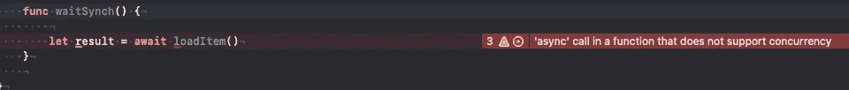
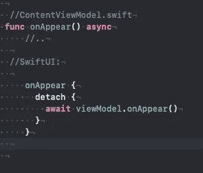
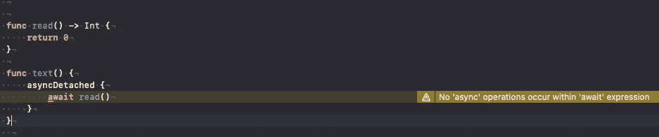
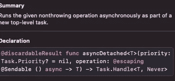
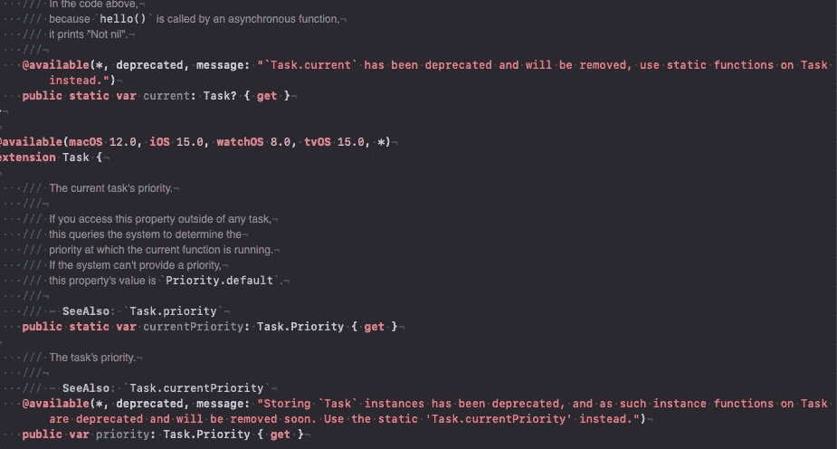
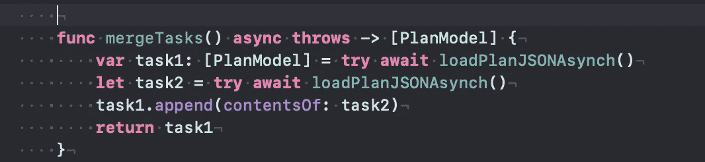
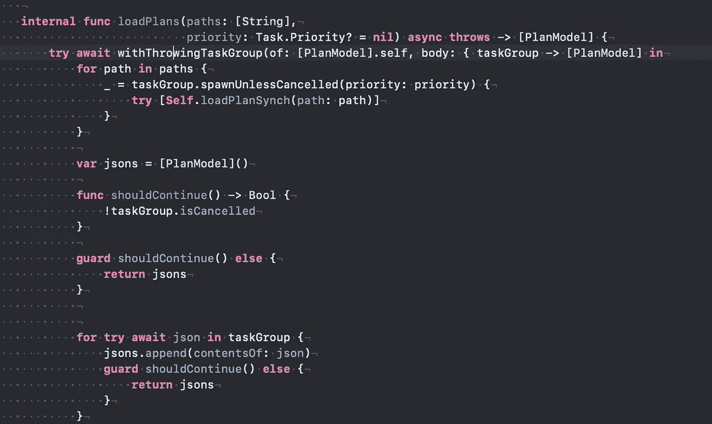
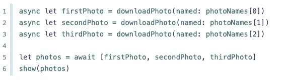
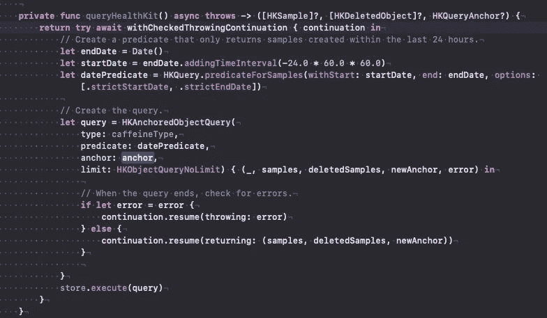
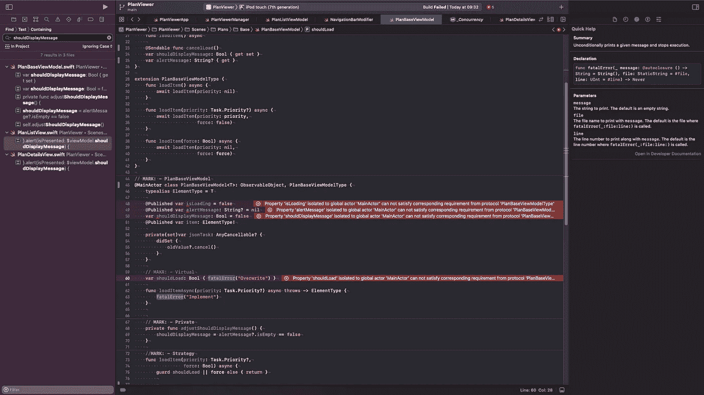

# 追求异步/等待

> 原文：<https://medium.com/nerd-for-tech/pursuing-async-await-f3f01a137b7d?source=collection_archive---------23----------------------->

最后 **async/await** 将出现在 Swift5.5 中，WWDC2021 上的大量视频包含了如何使用这些“词汇”进行异步、并发编程的解释…

简而言之，我们典型的长构造，比如嵌套的**分派**调用可以通过 async/await 来简化。看看“[末日金字塔](https://github.com/apple/swift-evolution/blob/main/proposals/0296-async-await.md)”。反应式方法也试图解决这个问题。

就我个人而言，我在 C#中遇到了 **async/await** 。在使用`await`的 Swift 方法中，应该用`async`标记。目前，我不知道如何在不使用 **async{Detach}** 或类似结构的情况下从 sync one 调用 async 方法。

在 C#中，由于任务中的扩展，我可以从同步调用异步方法。



不能从同步方法调用吧？

```
Let's say we have onAppear async method in viewModel. 
We can call it from **SwitUI** in "detached" block:
```



从 **SwiftUI** 调用虚拟机的异步

Swift 中的 **async{Detached}** 是 C#的一种任务扩展:



来自 WWDC 的幻灯片



“同步地”调用异步方法

实际上 **async{Detached}** 返回一个活动的任务，直到结束或者显式地`cancelled`

探索 Task(位于 *_Concurrent* framework)结构，我们可以看到它的发展正朝着静态方法的方向发展。可以从调用上下文推断任务的属性:



加入任务的简单方法是等待几个任务完成。这可以通过合并任务序列或分组来完成。



按顺序合并任务

分组由**通过{Throwing}TaskGroup 控制，**在关闭时由包含工作任务的 Task{Throwing}Group 操作。任务可以通过 cancelAll()方法取消，并通过 isCancelled 属性检查。



然而，该组等待从逐个任务的迭代返回的任务的终止。



左侧代码片段允许并行运行任务。

苹果的 Coffee Tracker 中描述的暂停任务并在完成处理程序中返回结果的好方法是使用“continuation”。看看跟踪器中优雅的代码:



将结果返回到完成块

**演员**

允许只为一个任务提供对其状态的独占访问。像类这样的参与者是引用类型，但主要是为异步执行开发的。

**MainActor** ，也是运行在主线程上的 Actor。

```
DispatchQueue.main.async {... }can be replaced by MainActor.run { ... }, but should be used in the scope of async programming
```

实体可以被声明为 MainActors(从主线程访问)。然而，让他们遵守协议看起来并不容易。



遵守协议看起来很棘手

我记得在 C#中有异步迭代器，它可以异步地产生新值。我猜 Swift 也会加入类似的构造。

在这篇文章中，我们考虑了 Swift5.5 中的**异步/等待**改进。这些功能可以在 Xcode 13 中尝试，Xcode 13 目前处于测试阶段。不要忘记官方文档和代码。

样本项目可以在 [GitHub](https://github.com/yakushevichsv/PlanViewer) 找到