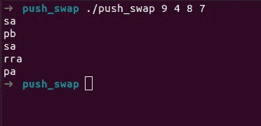
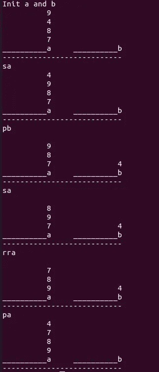
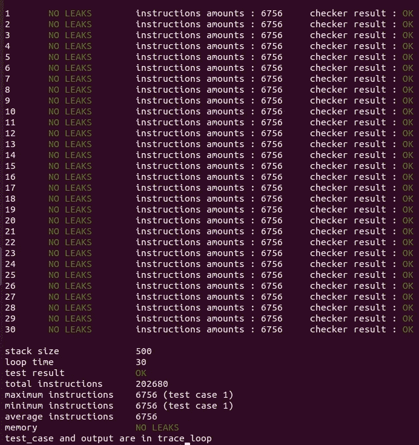

# 推送 _ 交换教程

> 原文：<https://medium.com/nerd-for-tech/push-swap-tutorial-fa746e6aba1e?source=collection_archive---------0----------------------->

Push_swap 是学校 42 的一个算法项目。我简单介绍一下这个项目，分享一个求解的算法:基数排序。

该算法的优点:易于实现，稳定

这种算法的缺点:过得去但不会得满分(除非你能找到优化的方法)

# 介绍

首先，我们从称为 **A** 和 **B** 的两个堆栈开始。

**A** 用一些随机整数填充(没有重复)，B**B**为空。我们可以在这些堆栈上执行某些指令，目标是用尽可能少的指令对所有这些整数进行排序。

如果原始堆栈看起来像这样

```
9487----------     ----------a              b
```

我们的目标是打印一个指令列表，它可以使栈像这样排序

```
4789----------     ----------a              b
```

这里是我们可以执行的指令列表:

sa(交换 A):交换 **A** 中的前两位数

sb(交换 B):交换 **B** 中的前两位数

ss : sa + sb

ra(旋转 A):A**中的顶部数字**到达 A**底部**

rb(旋转 B):在 **B** 中的顶部数字到 **B** 的底部

rr : ra + rb

rra(反向旋转 A):从 **A** 的底部数字到 **A** 的顶部

rra(反向旋转 B):在 **B** 中的底部数字到达 **B** 的顶部

rrr : rra + rrb

pa(推 A):B**中的顶部数字**到达 **A** 的顶部

pb(按 B):A 中的顶部数字转到 B**的顶部**

这是我们运行程序时的样子



一步一步，我们可以看到这些指令真的排序的数字



如果我们的指令列表是正确的，我们将根据我们使用的指令数量进行评级。

对于 3 个数字，我们需要用不超过 3 条指令进行排序。

对于 5 个数字，我们需要用不超过 12 条指令对其进行排序。

有了 100 个数字，我们可以得到

如果说明列表的大小小于 700，则为 5 分

如果说明列表的大小小于 900，则为 4 分

如果说明列表的大小小于 1100，则为 3 分

如果说明列表的大小小于 1300，则为 2 分

如果说明列表的大小小于 1500，则扣 1 分

有了 500 个数字，我们可以得到

如果说明列表的大小小于 5500，则为 5 分

如果说明列表的大小小于 7000，则为 4 分

如果说明列表的大小小于 8500，则为 3 分

如果说明列表的大小小于 10000，则为 2 分

如果说明列表的大小小于 11500，则扣 1 分

根据不可靠的消息来源，我们至少需要得到 6 分才能通过。

# 算法

步骤 1:解析，如果没有检测到错误，将数字放入堆栈 **A**

第二步:检查 **A** 中的数字是否全部排序。如果是这样，结束程序，不打印任何东西。最好写一个函数 A_is_sorted()

第三步:如果 **A** 的大小≤ 5，调用函数 sort_small_stack()。否则，调用函数 sort_big_stack()

在本文中，我们将关注函数 **sort_big_stack()** 的实现

我们可以从这个排序算法开始:基数排序

## 基数排序

你可以看这个短视频，不过我还是要解释一下。

基数排序是对非负整数进行排序的有效算法，时间复杂度为 O(n * d)，其中 d = floor(log_b(k) + 1) for base = b(感谢 Dmitry 的修正)

例如，我们可以用这个算法对下面的整数列表进行排序

```
87 487 781 100 101 0 1
```

想象有 10 个标有 0，1，2，…，9 的盒子

从最不重要的数字开始(它是在 1 的位置上的数字)，我们把每个数字放进它的数字对应的盒子里。

在这个例子中，87 在 1 的位置上有 7，因此我们把它放在框 7 中。487 在 1 的位置上也有 7，所以它也应该放在第 7 个盒子里(就在 87 后面)…我们重复这个过程，直到每个数字都在其中一个盒子里。

```
box 0    100    0
box 1    781    101    1    
box 2    
box 3
box 4
box 5
box 6
box 7     87    487
box 8
box 9
```

之后，我们根据盒子的顺序连接每个数字

```
100 0 781 101 1 87 487
```

正如我们所看到的，这些数字是根据 1 的位置进行排序的。对于在 1 的位置上有相同数字的那些，它们根据它们在原始列表中的顺序进行排序。

我们对 10 位的数字重复这个过程。

100 在 10 的位置上有 0，所以我们将它放在 0 框中，0 在 10 的位置上有 0，所以我们将它放在 100 之后的 0 框中…

```
box 0    100    0    101    1
box 1    
box 2    
box 3
box 4
box 5
box 6
box 7    
box 8    781   87    487
box 9
```

并连接它

```
100 0 101 1 781 87 487
```

此时，数字先按 10 位的数字排序，然后按 1 位的数字排序。

100 位的数字也是如此。(这将是最后一次，因为列表中最大的数字是 781，只有 3 个数字。)

```
box 0      0      1       87
box 1    100    101
box 2    
box 3
box 4    487
box 5
box 6
box 7    781
box 8    
box 9
```

并连接

```
0 1 87 100 101 487 781
```

现在，数字都排序了。

虽然这个算法很快也很优雅，但是我们需要做一些调整才能在我们的 push_swap 上使用它。首先，我们必须简化数字。

## 简化数字

我们之前提到过，这个算法是针对非负整数的。然而，在这个项目中我们会有负数，所以我们应该在开始之前简化数字。

例如，如果我们需要对这些数字进行排序

```
87 -487 781 -100 101 0 1
```

我们的目标是执行一些操作来使它们

```
-487 -100 0 1 87 101 781
```

如果我们用 0，1，2…来代替它们，比如

```
-487 -100 0 1 87 101 781
   0    1 2 3  4   5   6
```

原始列表

```
87 -487 781 -100 101 0 1
```

就变成了

```
4 0 6 1 5 2 3
```

对 87 -487 781 -100 101 0 1 进行排序的操作也可以对 4 0 6 1 5 2 3 进行排序，反之亦然。

所以，现在我们只需要排序 4 0 6 1 5 2 3，而不是排序 87 -487 781 -100 101 0 1。

有了这个思路，我们就可以对任意一个整数列表进行化简，使其取值范围在[0，N](≥0 且< N，N 为列表的大小)。下面是一个简短的 C++实现。

(如果不熟悉 C++的语法，就把 vector <int>想成整数数组，sort 想成对数组进行升序排序的函数。)</int>

```
vector<int> input;//parse the numbers into input ...
//reminder : there is no duplicatevector<int> copy = input; // copy the numbers from inputsort(copy.begin(), copy.end());for(int i = 0 ; i < input.size() ; ++i) 
    for(int j = 0 ; j < copy.size() ; ++j)
        if (input[i] == copy[j])
            input[i] = j;//put input into stack a .../*
Remark : This is actually not the most efficient way to implement them. If you want a more efficient program, please learn about binary search or unordered_map (hash)
*/
```

现在，数组输入中的每个数字都在[0，N]范围内，因此我们可以使用基数排序对它们进行排序。

但是，对于 push_swap 来说，使用 10 个盒子并不是一个好主意，因为我们只有 2 个盒子。显然，在这种情况下，2 个盒子会更合适，这意味着我们应该将数字放在基数 2 中。

为了操作基数为 2 的数字，我们可以将数字保存为由 0 和 1 组成的字符串，或者像一些很酷的程序员一样使用**位运算**。

## 位运算

同样，你可以阅读这篇文章，但我会解释它。

 [## c 按位运算符:与、或、异或、求补和移位运算

### 在算术逻辑单元(在 CPU 内部)中，数学运算如:加、减、乘…

www.programiz.com](https://www.programiz.com/c-programming/bitwise-operators) 

今天我们将在 C/C++中使用两个按位运算符，它们是

```
>> (Right shift)
```

和

```
& (Bitwise AND)
```

>>运算符将所有位向右移位。让我们用一个例子来看看它是如何工作的。

假设我们有一个数字

```
int num = 36;
```

在基数 2 中是

```
0000 ... 0010 0100（32 bits in total）
```

如果我们在 C 语言中使用>>运算符

```
printf("%d\n", num>>2); // output is 9
```

输出将是 9。为什么？

```
0000 ... 00**10 0100** -> 36Right shift 2 bits0000 ... 0000 **1001** -> 9
```

因为 10 进制的 36 是 2 进制的 100100，右移 2 位后变成 1001，也就是 10 进制的 9。

一些你可以尝试的练习。先思考，然后用 c 验证你的答案。

```
8>>1 == ?5>>2 == ?2>>4 == ?87>>3 == ? (Hint : 87 in base 10 is 1010111)
```

然后，按位 AND 运算符(&)。

对于每一位，&工作如下

```
1 & 1 == 1
1 & 0 == 0
0 & 1 == 0
0 & 0 == 0
```

对于两个整数，&将在每个位上执行。例如

```
printf("%d\n", 6&5); //output is 4
```

将打印 4。因为

```
6   : 0000 ... 0 **1 1 0**
5   : 0000 ... 0 **1 0 1**6&5 : 0000 ... 0 **1 0 0** -> 4
```

对于 1 的位置上的位，6 和 5 分别有 0 和 1。0&1 == 0，所以 6&5 的这个位是 0。

对于 10 的位，6 和 5 分别有 1 和 0。1&0 == 0，所以 6&5 的这个位是 0。

对于 100 位的位，6 和 5 分别有 1 和 1。1&1 == 1，所以 6&5 的这个位是 1。

对于 6 和 5，所有其他位都是 0，因此 6&5 == 000000 … 0100 以 2 为基数，以 10 为基数就是 4。

更多的例子

```
2   : 0000 ... 0 **0 1 0**
5   : 0000 ... 0 **1 0 1**2&5 : 0000 ... 0 **0 0 0** -> 0--------------------------------------------------------------------15  : 0000 ... **1 1 1 1**
9   : 0000 ... **1 0 0 1**2&5 : 0000 ... **1 0 0 1**-> 9
```

一些你可以尝试的练习。先思考，然后用 c 验证你的答案。

```
5&10 == ?12&23 == ?
```

现在，我们终于准备好用基数排序实现 push_swap 了

## push_swap 上的基数排序

回到上面的例子，如果我们想要一个指令列表来排序

```
87 -487 781 -100 101 0 1
```

结果与排序相同

```
4 0 6 1 5 2 3
```

在 base 2 中，它将是

```
100 000 110 001 101 010 011
```

在堆栈中，它看起来像

```
100000110001101010011----------     ----------a              b
```

和基数排序一样，我们需要两个盒子分别存放 0 和 1。这里我们把 **A** 作为盒子 1，把 **B** 作为盒子 0。然后，我们从最右边的位开始到最左边的位。

在右数第 I 位，如果 **A** 顶部数字的第 I 位是 0，我们执行 pb 将这个数字放入栈 **B** 。否则，我们执行 ra 以将其留在堆栈 **A** 中。在我们对每个数字执行一次操作后，它们中的每一个都在对应于它的数字的盒子中，就像我们在基数排序中将数字放入盒子中一样。

在我们对第一位(最右边的位)这样做之后，它看起来一定是这样的。

```
 010001            110101            000011            100----------     ----------a              b
```

之后，我们执行 pa，直到堆栈 **B** 中没有数字，因为我们以基数排序的方式连接这些数字。

```
100000110010001101011----------     ----------a              b
```

我们对第二位和第三位重复这一过程。

```
-----The-Second-Bit------ 101110            001010            000011            100----------     ----------a              b---------Connect---------100000001101110010011----------     ----------a              b------The-Third-Bit------ 011100            010101            001110            000----------     ----------a              b---------Connect---------000001010011100101110----------     ----------a              b
```

在我们重复三次之后，数字被排序，因为列表中最大的数字(以 10 为基数的 6，以 2 为基数的 110)只有 3 位。

这就是我们对它们的分类。

用 C++来实现它，就像

```
int size = a.size();int max_num = size - 1; // the biggest number in a is stack_size - 1int max_bits = 0; // how many bits for max_num while ((max_num >> max_bits) != 0) ++max_bits;for (int i = 0 ; i < max_bits ; ++i) // repeat for max_bits times
{
    for(int j = 0 ; j < size ; ++j)
    { int num = a.top(); // top number of A if ((num >> i)&1 == 1) ra(); 
        // if the (i + 1)-th bit is 1, leave in stack a else pb();
        // otherwise push to stack b } // put into boxes done while (!b.empty()) pa(); // while stack b is not empty, do pa

    // connect numbers done}
```

最棘手的部分一定是条件 if ((num>>i)&1 == 1)。(num>>i)&1 的结果必须是 0 或 1，这是 num 的第(i + 1)位的值。

例如，(5>>2)&1 == 1 因为

```
 5       : **1**01
 5>>2    :   **1**
(5>>2)&1 :   **1**
```

(8>>2)&1 == 0 因为

```
 8       : 1**0**00
 8>>2    :   1**0**
(8>>2)&1 :    **0**
```

这就是我们实现 sort_big_stack()函数的方法。如果你做完测试(测试者在下面)，你会看到 stack_size 为 100 的时候，大概有 1084 条指令，stack_size 为 500 的时候，大概有 6756 条指令，足够好通过了。



问:为什么即使输入不同，指令数量也保持不变？(不是 tester 的问题，不信去查一下 test_case。)

除此之外，我们还可以用其他方式实现它，比如

```
bool is_sorted(stack<int> & a);
// please implement this function by yourself :)int size = a.size();for (int i = 0 ; !is_sorted(a) ; ++i)
{ for(int j = 0 ; j < size ; ++j)
    { int num = a.top(); if ((num >> i)&1) ra(); else pb(); } while (!b.empty()) pa();
}
```

您可以尝试分析这些不同实现方式的利弊。

此外，还有一些常见错误:

```
for (int j = 0 ; j < a.size() ; ++j) // ... (x)for (int j = 0 ; j < size ; ++j)     // ... (o)
```

仔细想想，这两个循环有什么区别？

总之，我们就是这样用基数排序完成 push_swap 的。如果你遇到任何困难，下面的工具可能会帮助你。或者可以评论提问或者给点建议。祝你好运:)

# 工具

对于主题和一些有用的工具(基数排序可视化)

[](https://github.com/LeoFu9487/push_swap_tutorial) [## LeoFu9487/push_swap_tutorial

### 首先，阅读以下文章中的算法:中文版…

github.com](https://github.com/LeoFu9487/push_swap_tutorial) 

测试员

[](https://github.com/LeoFu9487/push_swap_tester) [## leofu 9487/push _ swap _ 检测仪

### 首先，转到您的库的根目录，在那里我们可以找到您的 Makefile 并进行 git 克隆…

github.com](https://github.com/LeoFu9487/push_swap_tester)