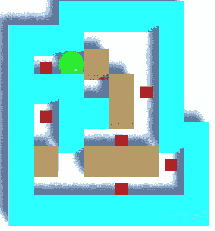
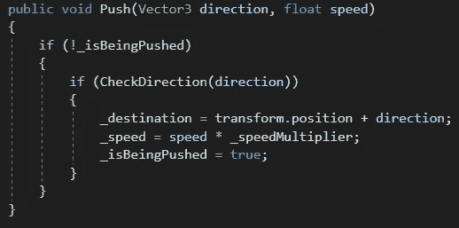
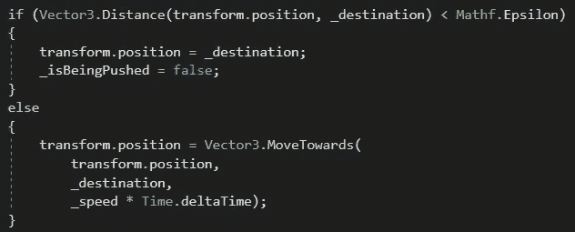
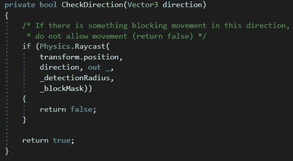

# 锁定在统一网格中的可推块

> 原文：<https://medium.com/nerd-for-tech/pushable-blocks-locked-to-a-grid-in-unity-5ee5763f4455?source=collection_archive---------2----------------------->

**目标:**创造一个玩家可以推动的方块，并锁定在格子上。

失败！

当我们的玩家输入一个方向时，运动脚本“向前看”一个“可推动”的物体。如果它找到一个，它会阻止玩家的移动，但称为块的*推动*方法，传递它推动的方向和速度。

如果块是*而不是当前被推动的*，它将检查其被推动的方向。如果该方向是明确的(即 *CheckDirection* 方法返回 *true* ，它将设置其新的 *_destination* 为该方向。然后，它将把它的 *_speed* 设置为玩家速度的倍数，只是为了确保玩家不能移动到该块空出的空间(我用 1.5 作为我的乘数)。最后，它将 *_isBeingPushed* 设置为*真*，因此在到达其*_ 目的地*之前，它不能被再次推送。

在*更新*方法中，如果块非常接近其*_ 目的地*，它会将自己设置到那个位置，并将 *_isBeingPushed* 设置为 *false* ，这样它就可以被再次推送。

如果*不在*目的地*的*处，它将向其移动。

方块的 *CheckDirection* 方法甚至比玩家的更简单。我们使用*射线*在砖块被推进的方向上检查是否有阻挡物，如墙壁或另一个板条箱。如果有另一个块或墙，我们返回 *false* 并且不允许推送。如果空间是空的，将推动该块。

如果我们想变得更疯狂一点，我们可以检查下一个空格的*是否是*可推的*，如果是，并且在*之后的*空格是空的，我们可以允许玩家推*两个或更多的*方块！*