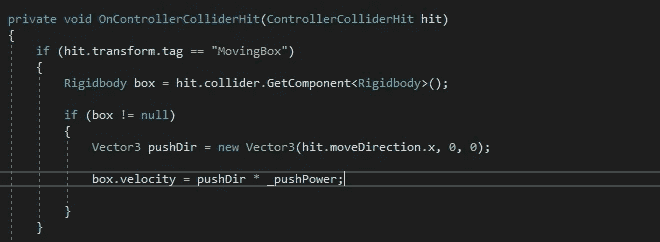
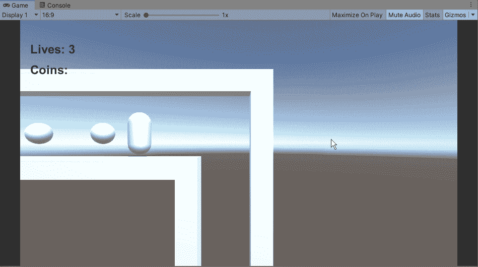
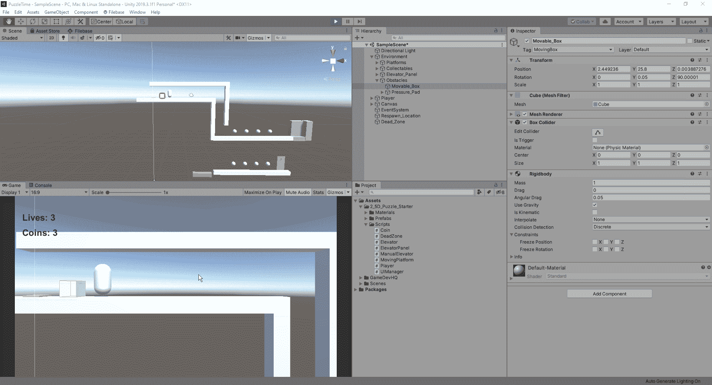
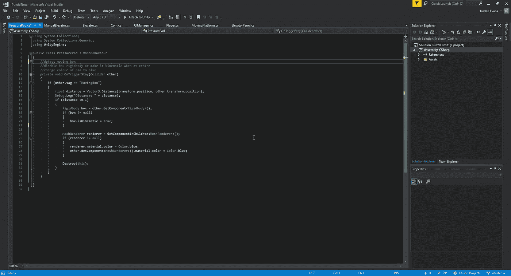
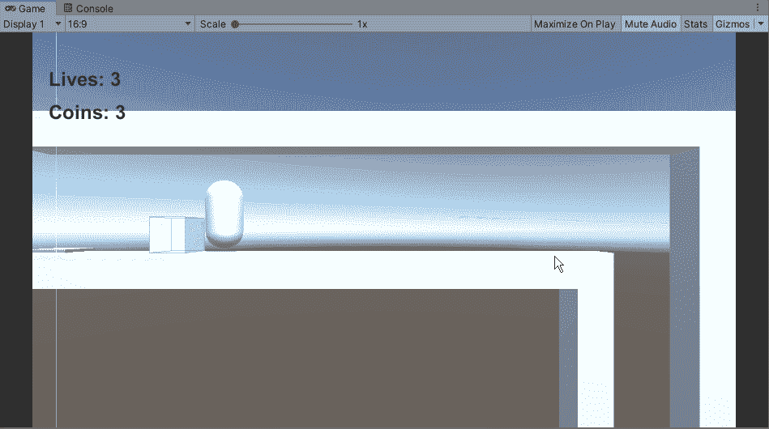
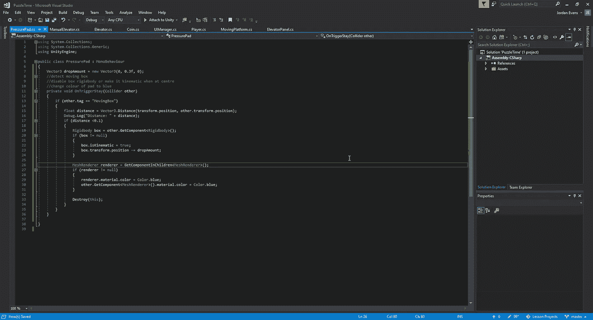
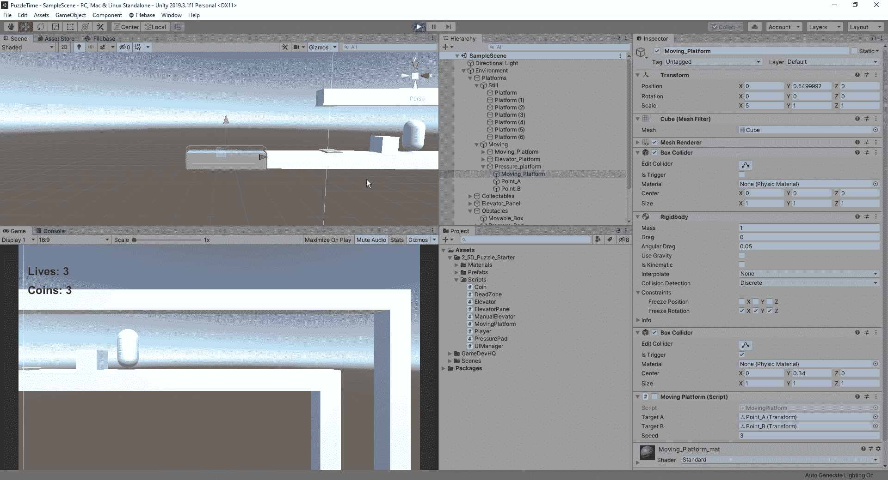

# 推动物体完成拼图

> 原文：<https://medium.com/nerd-for-tech/pushing-objects-in-unity-to-complete-puzzles-83cd40be5dc9?source=collection_archive---------10----------------------->

接下来，这个平台的功能是找出我们如何推动物体来帮助我们到达更高的地方或坐在按钮上。
首先，我们需要进入播放器脚本，为 OnControllerColliderHit 函数添加新功能:

在这个函数中，我们所做的是让刚体接触到我们所撞击的物体。从那里，我们为我们的盒子创建一个新的向量，根据玩家的推动在 x 轴上移动。因为我们在 2.5D 的范围内工作，所以我们不需要 z 轴移动。从这里，我们要创建一个新的变量来处理我们的盒子移动的速度，然后乘以我们想要移动它的方向来创建它的速度:

当我们在游戏中测试这一点时，我们注意到好像玩家正在翻转盒子。然而，我们想要的是滑动，就好像玩家在地板上推动，让它移动。为了实现这一点，我们只需要冻结盒子的旋转值:

现在，我们的盒子在地板上滑动正常，让我们看看如何在这个场景中使用黄色的压力垫。首先，我们将为压力板创建一个新脚本，并在其上创建我们的逻辑:

这样做的目的是创建一个变量，在这个变量中我们可以检测到我们的盒子在压力板上的距离。当我们到达某一点时，我们希望我们的行为发生。在这种情况下，我们希望我们的盒子不能移动，所以我们使它运动。从那里，我们将想改变我们的压力板的网格渲染器，以及对象为蓝色，让玩家知道它已经到位。现在让我们看看它是如何出现在我们的游戏中的:

现在它按照我们的指示工作了，我们发现了这个过程中的一个小问题。由于箱子的高度和我们上方的地板，我们无法清楚地穿过缝隙。在我们的编辑器中有几种方法可以改变这一点，我们可以调整字符或框的高度。我们也可以把上面的地板抬高一点。然而，为了给我们的对象更多的视觉线索，我们不能再移动它了，让我们看看我们如何可以把它稍微“放下”到地板上，这样它看起来就像被锁定在适当的位置。
要做到这一点，我们只需在盒子到达压板后调整它的 y 值:

我们已经添加了一个下降量到我们的盒子动作，一旦它到达盘子。现在，让我们看看这是如何在我们的游戏中结束的:

现在我们有了一个更直观的线索，让我们的移动盒子落入压力板，我们可以看看如何让它向上升起一个平台。要做到这一点，我们可以简单地在地图的边缘添加一个移动的平台，使用我们当前拥有的脚本，并将脚本设置为非活动。接下来，我们只需添加一个变量来连接我们的平台，并添加逻辑来使我们的平台能够在盒子击中衬垫时移动:

我们有了它，我们现在可以四处移动一个盒子，让它与一个压力板交互，它与一个移动平台交互，以允许玩家在关卡中进一步前进。