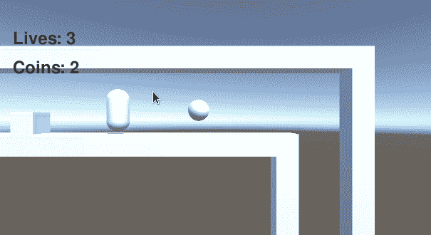
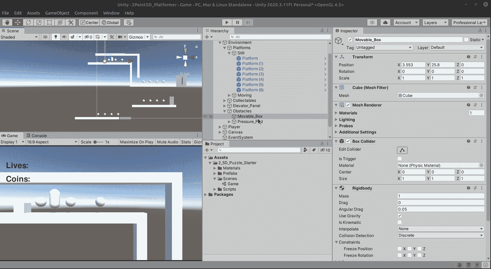
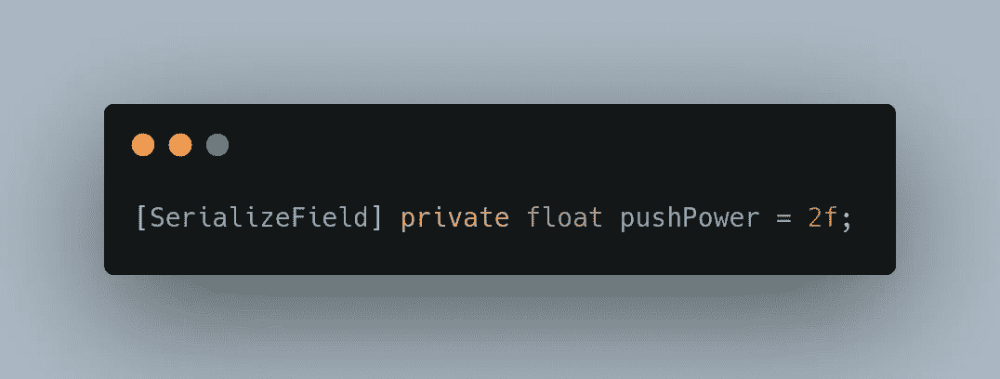
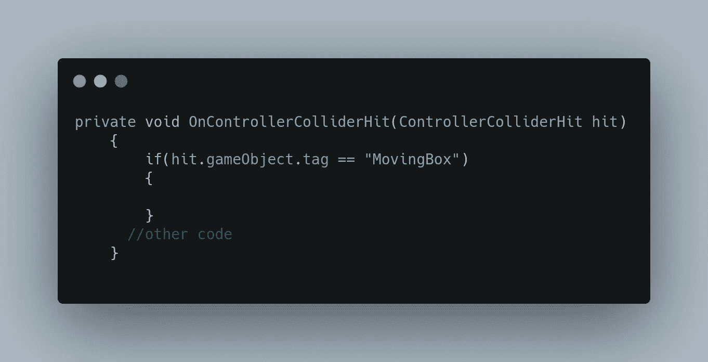
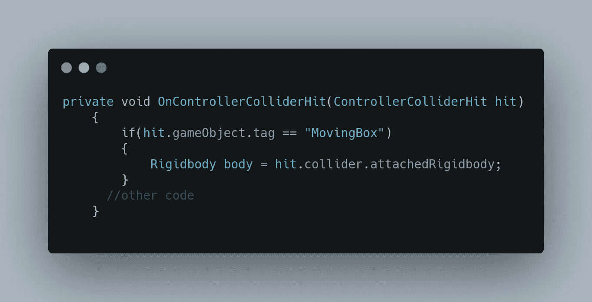
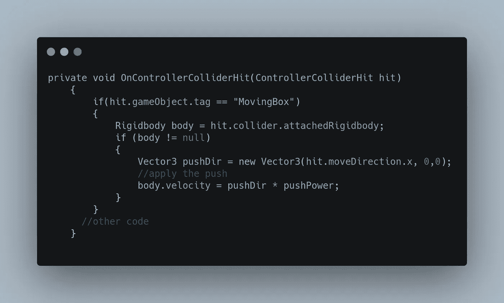
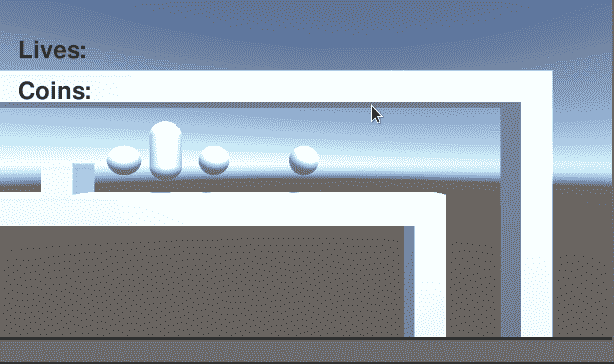
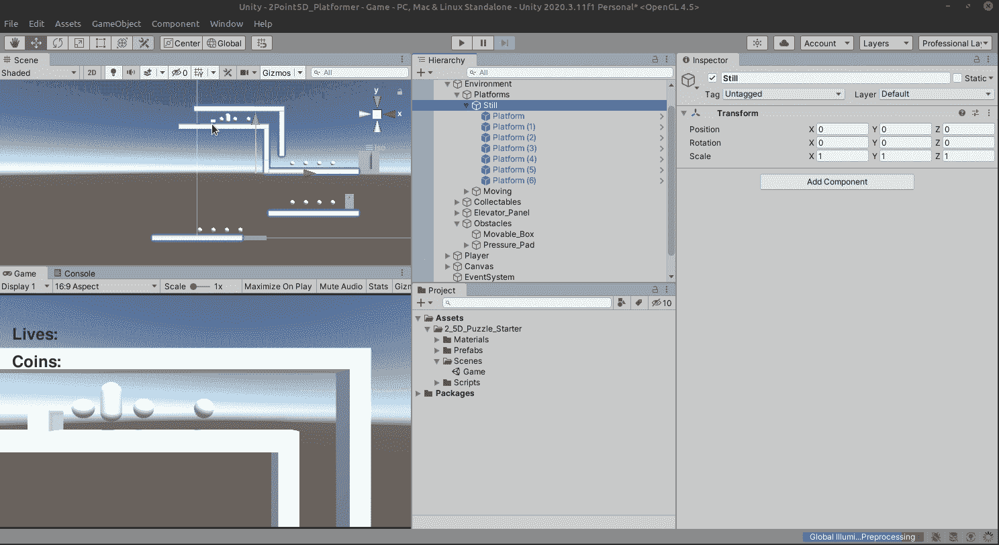
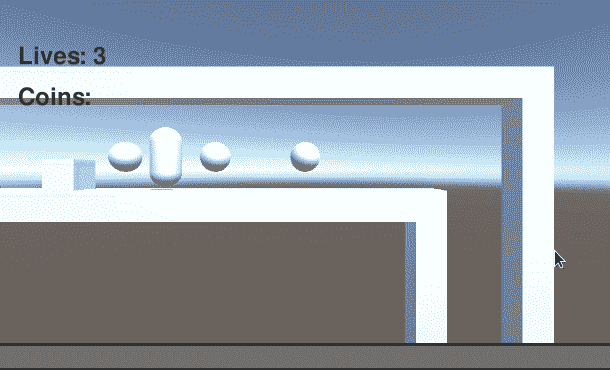

# 推动物体完成拼图

> 原文：<https://medium.com/nerd-for-tech/pushing-objects-in-unity-to-complete-puzzles-a1972b0716e?source=collection_archive---------23----------------------->



另一种流行的解谜机制是将物体推到压力垫上或更高的壁架上。再次，角色控制器来拯救我们，Unity 在控制器碰撞器上的页面为我们提供了答案！

我们感兴趣的相关代码是:

```
void OnControllerColliderHit([ControllerColliderHit](https://docs.unity3d.com/ScriptReference/ControllerColliderHit.html) hit)
    {
        [Rigidbody](https://docs.unity3d.com/ScriptReference/Rigidbody.html) body = hit.collider.attachedRigidbody; // Calculate push direction from move direction,
        // we only push objects to the sides never up and down
        [Vector3](https://docs.unity3d.com/ScriptReference/Vector3.html) pushDir = new [Vector3](https://docs.unity3d.com/ScriptReference/Vector3.html)(hit.moveDirection.x, 0, hit.moveDirection.z); // If you know how fast your character is trying to move,
        // then you can also multiply the push velocity by that.

        // Apply the push
        body.velocity = pushDir * pushPower;
```

Unity 基本上为我们写了代码！感谢团结！让我们准备好箱子，将它标记为“移动箱子”。



接下来，为了遵守 Unitys 的代码，我们需要一个变量来表示 pushing power，所以让我们创建一个全局变量。



现在，在我们的 OnControllerColliderHit 函数中，我们将检查该框:



现在我们将开始传输我们的代码。我们将检查刚体:



我们将转移剩余的代码，但把它放在一个空检查中。



请注意，我们只使用了 moveDirection.x。我们只关心水平移动，因此这是与原始示例相比我们将使用的唯一轴。其他都一模一样！

现在让我们看看它的实际效果！



它工作，但是哎呀…我们不希望盒子滚动！这很容易通过勾掉盒子刚体的旋转约束来解决。



现在让我们再试一次！



完美！明天我们来处理压力垫！