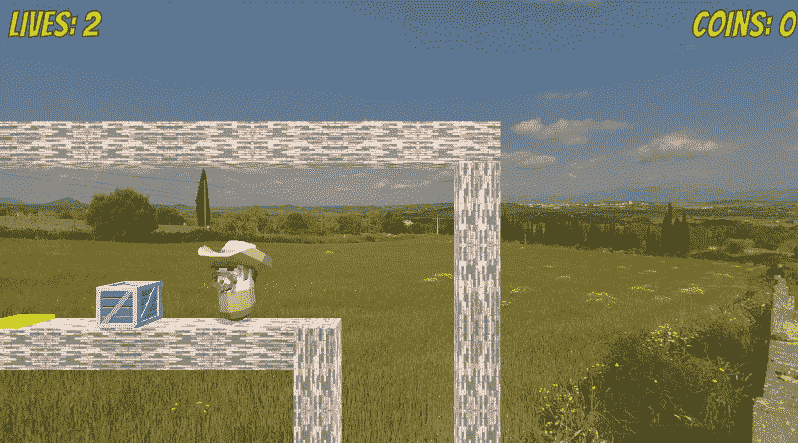
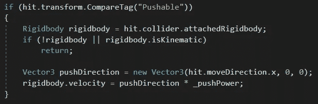
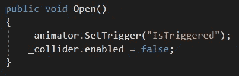
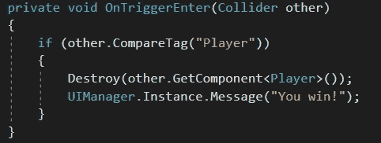

# 推动物体、压板和开门

> 原文：<https://medium.com/nerd-for-tech/pushing-objects-pressure-plates-and-opening-doors-a987b0bda3eb?source=collection_archive---------23----------------------->

**目标:**创建一个谜题，玩家必须将一个板条箱推到压力板上才能开门。

好的，这里有很多步骤来实现这一切！首先，我们将蓝色板条箱标记为“可推”接下来，在我们玩家的 *OnControllerColliderHit* 方法中，我们将检查这个标签。当我们找到它时，我们会得到附加的刚体，并在 x 轴上推动它。我们将使我们的*_ 推力*小于我们正常行走的*_ 速度*，给人一种“沉重”的板条箱正在减慢我们速度的错觉。

压力板是一个简单的对象，带有一个*触发器碰撞器*和它自己的脚本。在它的 *OnTriggerStay* 方法中，它检查可推送的对象。如果它找到一个，它会检查它有多近。如果它们足够靠近，板块会将可推动物体的刚体设置为*是运动学的*，这使其停止与物理相互作用(因此可推动物体不再被推动)。然后，该板的颜色将从黄色变为绿色，并告诉*_ 门*自行打开。最后， *Destroy(this)* 只销毁压力板的脚本，留下不活动的板，通过不再每帧检查其 *OnTriggerStay* 方法来释放资源。

门也是一个简单的物体，只有一个*动画制作人*、一个*碰撞器*和一个脚本。当某个东西调用它的 public *Open* 方法(在这个例子中，我们的压力板)时，门触发它的 Open 动画剪辑并禁用它的*碰撞器*，允许玩家跨过去！

我们的目标更简单…如果玩家击中目标的*是触发碰撞器*，它通过破坏其*玩家*脚本来阻止玩家移动，并告诉 *UIManager* 显示“你赢了！”消息。

