# 推动物体完成拼图| Unity

> 原文：<https://medium.com/nerd-for-tech/pushing-objects-to-complete-puzzles-unity-86ef01b61ff8?source=collection_archive---------9----------------------->

## 统一指南

## 关于如何推动物体和触发压力垫来完成 Unity 中的拼图的快速指南

**目标**:用 Unity 实现一个系统，让玩家在平台游戏中推动物体并触发压力垫。

在上一篇文章中，我介绍了[如何用 Unity](/nerd-for-tech/wall-jumping-unity-adba4072a64c) 实现一个跳墙机制。现在，是时候实现一个系统，让玩家推动物体并触发压力垫，这可以在未来的平台游戏中完成一个谜题。

# 当前阶段

首先，让我们看一下我们将用来实现推和触发机制的阶段:

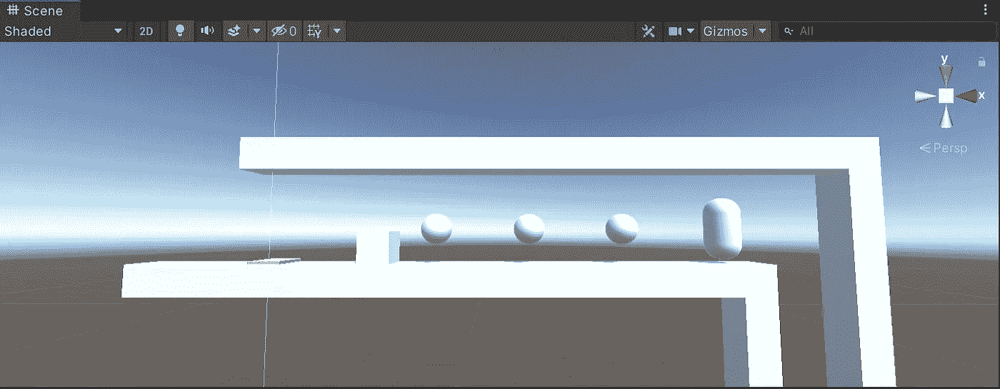

该平台旨在允许玩家(在右侧)向左移动并推动立方体，直到它到达黄色压力垫，并提供一种在我们的平台游戏中构建未来谜题的方法:

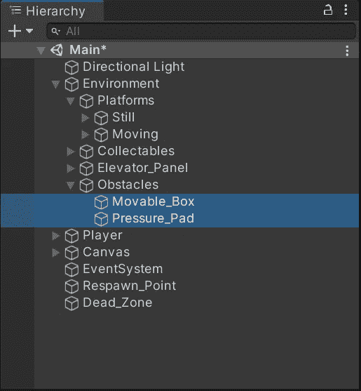

如果我们检查这些游戏对象的组件，我们会看到:

*   立方体包含一个普通的箱式碰撞器和一个受重力影响的刚体。
*   压力板包含一个带有 ***Is Trigger***

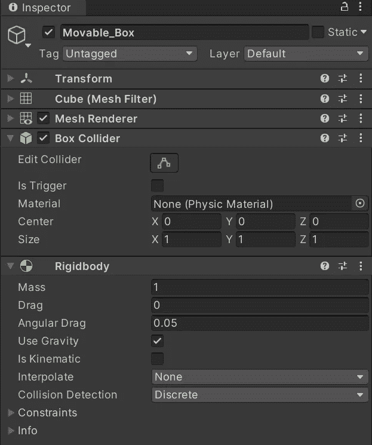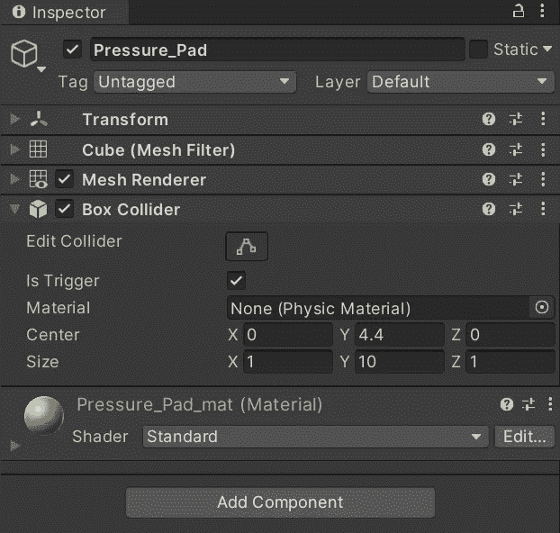

# 推动物体

现在，为了开始实现推送机制，让我们先用一个特殊的标签来标记立方体:

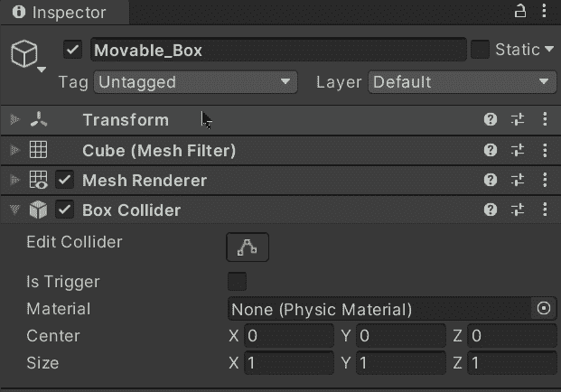

然后，让我们打开播放器脚本并创建一个新变量来指示推动对象时要应用的力量:

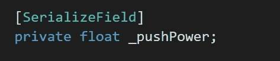

可以使用**【serialize field】**通过 inspector 修改私有值。

创建后，让我们通过检查器修改它的值:

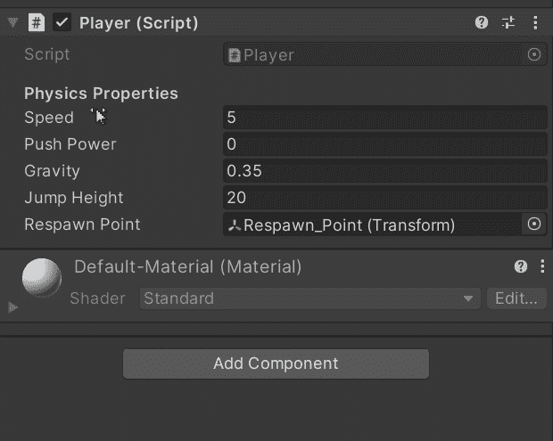

接下来，让我们使用**OnControllerColliderHit**方法来:

*   识别玩家的角色控制器何时与另一个碰撞器发生碰撞。在这种情况下，当它与标记为 ***的碰撞器碰撞时，MovableBox*** 。
*   从识别的碰撞器中使用***attachedRigidbody***属性将刚体附加到碰撞器。
*   检查刚体是否不为空。
*   通过使用 hit 的***move direction***属性确定要应用于碰撞器的水平方向。
*   通过将方向乘以玩家的推力来设置来自另一个碰撞器的刚体的速度。

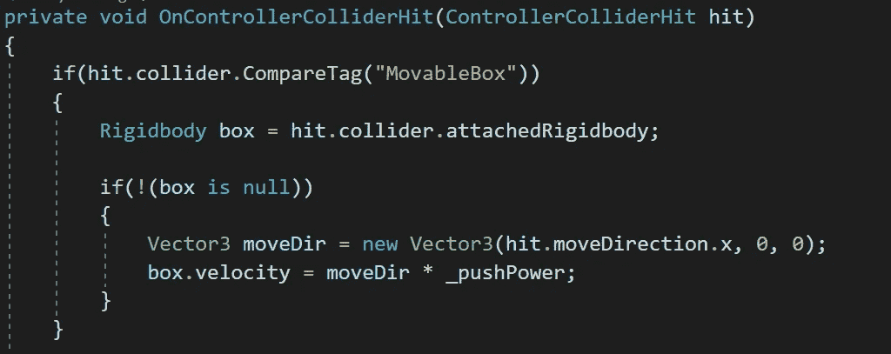

如果我们用 Unity 运行游戏，我们会看到玩家在与立方体碰撞时移动立方体:

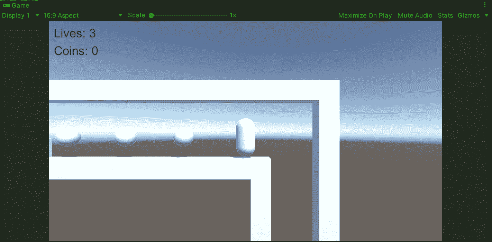

但是如果我们想让推手来滑动魔方呢？嗯，我们可以选择立方体，并冻结立方体在其刚体的**约束**内的旋转:

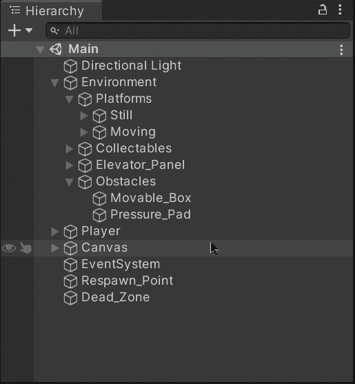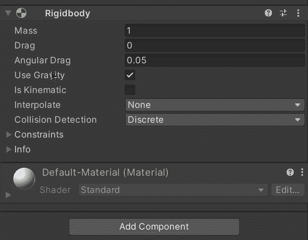

这样我们就能推动物体，避免旋转它:

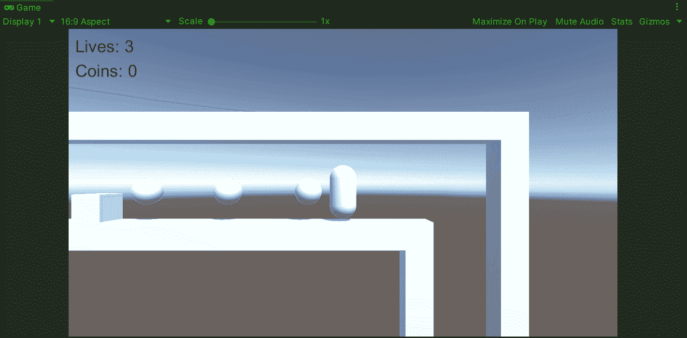

# 触发被推动的对象

现在，为了在我们的压力板检测到立方体时触发一个动作，让我们开始为它创建一个新的脚本:

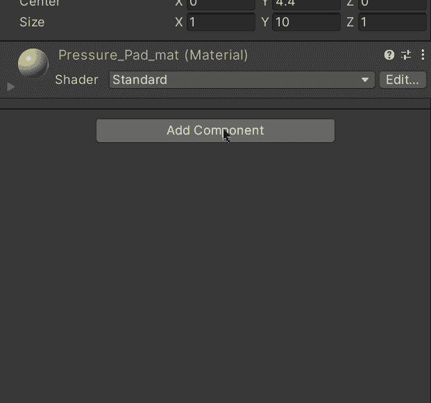

然后，让我们打开脚本并创建一个新的私有变量来存储对压力垫的**网格渲染器**组件的引用:

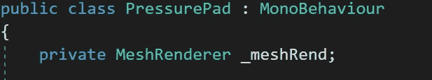

接下来，让我们使用 **Start** 方法来初始化变量，并检查它是否为空，这是一个好习惯:

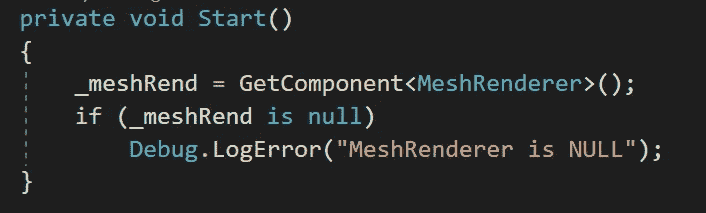

然后，让我们使用 **OnTriggerStay** 方法来识别碰撞器何时停留在压力垫的碰撞器内部。在这种情况下，让我们通过使用 **CompareTag** 方法来检查碰撞器是否属于玩家正在推动的盒子:

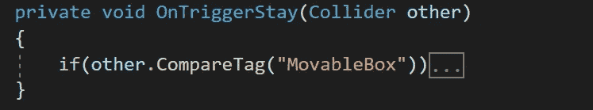

现在，为了识别立方体何时在正确激活压力垫的范围内，让我们使用**矢量 3 获得立方体和压力垫之间的距离。距离**方法:

> 注意:我们可以使用 **Debug。记录**以打印距离并检查哪个值适合我们。

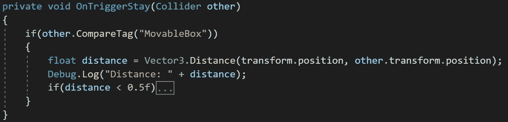

最后，如果立方体在期望的范围内，让我们:

*   通过使用 **attachedRigidbody** 属性从另一个碰撞器获得刚体。
*   检查刚体**是否不为空**。
*   将刚体设置为**运动学**以停止对其应用任何物理。
*   **通过修改材料的颜色属性来改变压力垫的颜色**。
*   **一旦压力垫被触发，破坏脚本**组件。

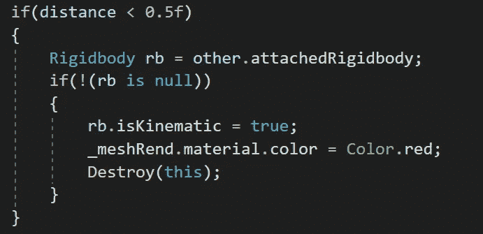

现在，如果我们用 Unity 运行游戏，我们会看到当玩家将盒子推到压力垫上时，压力垫会像预期的那样工作:

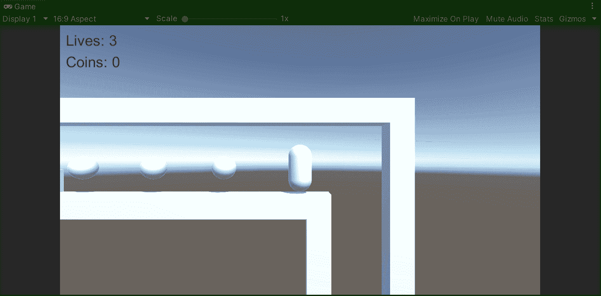

就这样，我们用 Unity 实现了一个为平台游戏推送对象的系统！:d .下一篇文章再见，我将展示如何升级我们的项目，以便在 Unity 中使用通用渲染管道(URP)。

> *如果你想了解我更多，欢迎登陆*[***LinkedIn***](https://www.linkedin.com/in/fas444/)**或访问我的* [***网站***](http://fernandoalcasan.com/) *:D**