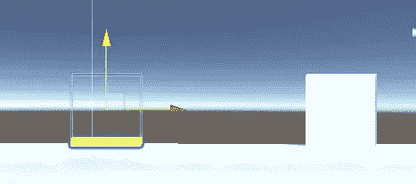
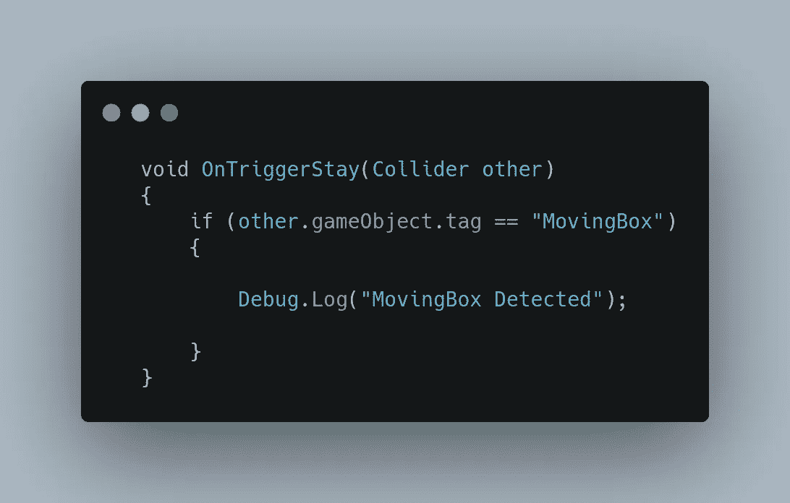
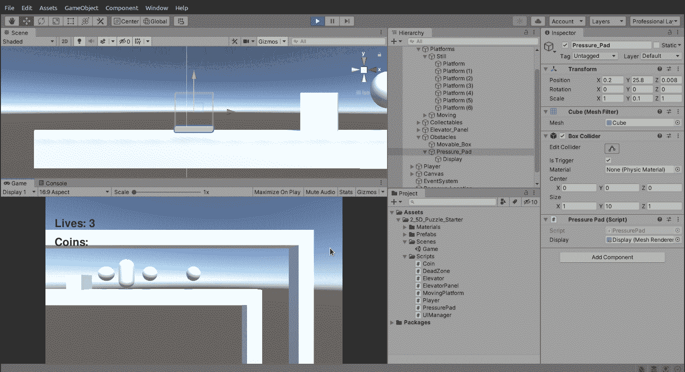
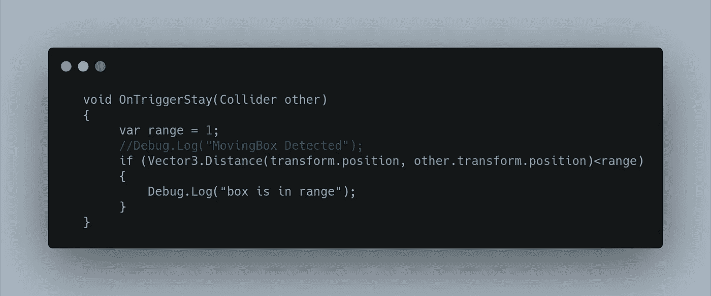
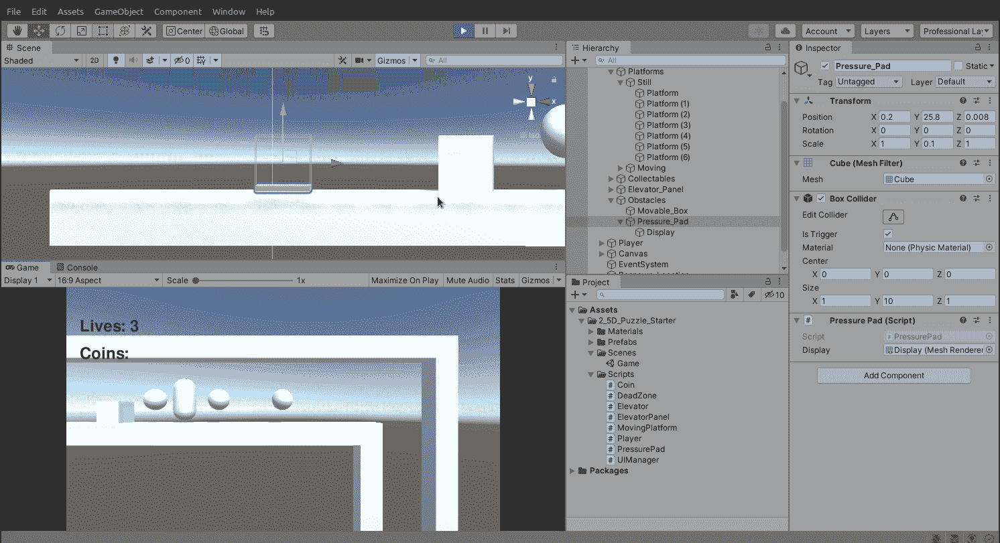
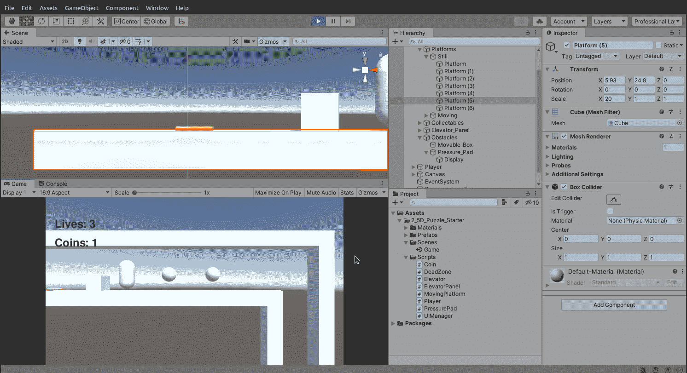
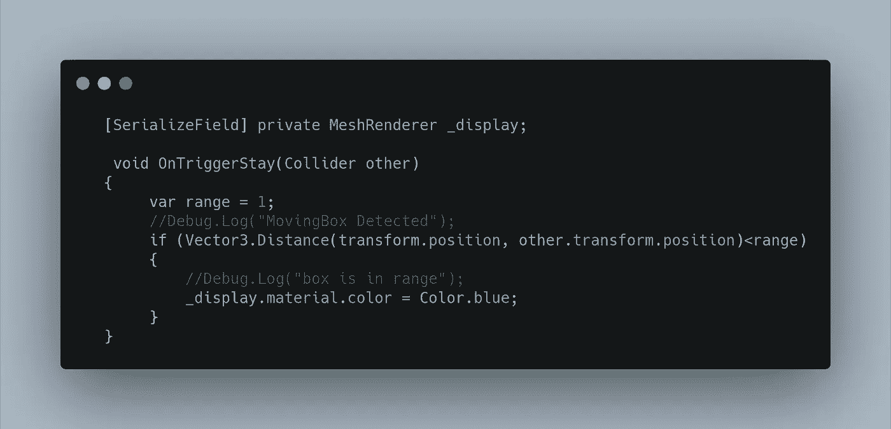
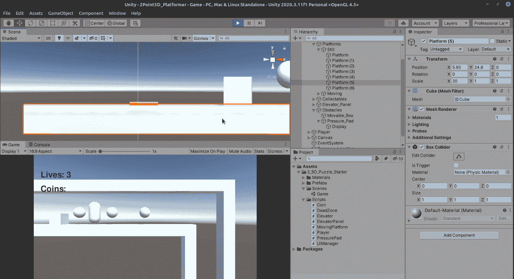
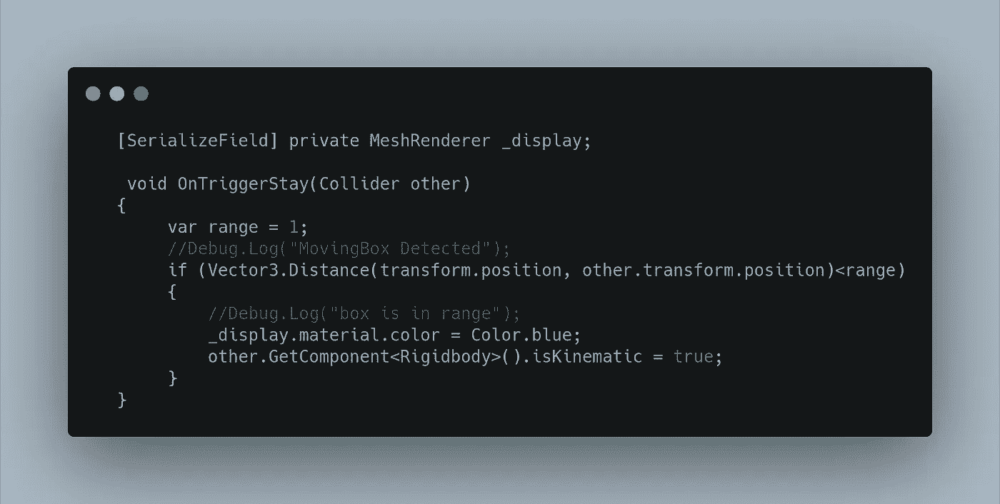
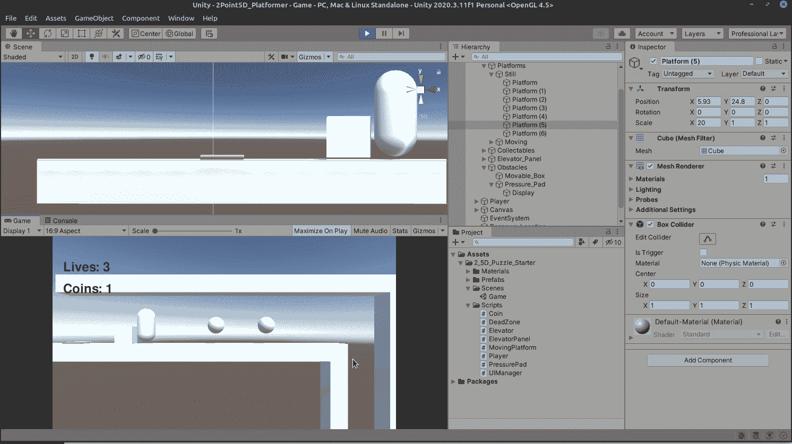

# 将盒子推到压力垫上

> 原文：<https://medium.com/nerd-for-tech/pushing-the-box-onto-the-pressure-pad-be13b7cf91c9?source=collection_archive---------24----------------------->

首先让我们为我们的 Pad 制作一个脚本。

发射台有一个触发碰撞器，我们最初可以用它来检查进入其中的立方体。

所以我们先试着检测一下吧！像电梯面板一样，我们将使用 OnTriggerStay 方法。

让我们看看它是否能检测到:

大获成功！接下来，我们想看看使用 Vertex3。距离将帮助我们检测盒子是否在范围内。我们用 1 作为开始。

让我们看看它是否有效:

有用！但是范围太宽了。我想让这个框在面板上，让我们把范围改成 0.2 左右

好多了！盒子现在实际上在发射台上方。让我们改变垫的颜色。这类似于电梯显示面板，让我们为 pads 'display '对象创建一个 holder 作为一个 MeshRenderer，拖动它，我们将它编码为蓝色。

厉害！最后，让我们让盒子完全停下来，一旦它在垫子上，你就不能再推它了。这很容易做到，通过改变它的刚体运动学。

我们试试吧！

这样我们就有了一个完整的压力垫技工！明天，我们将讨论升级我们的项目。