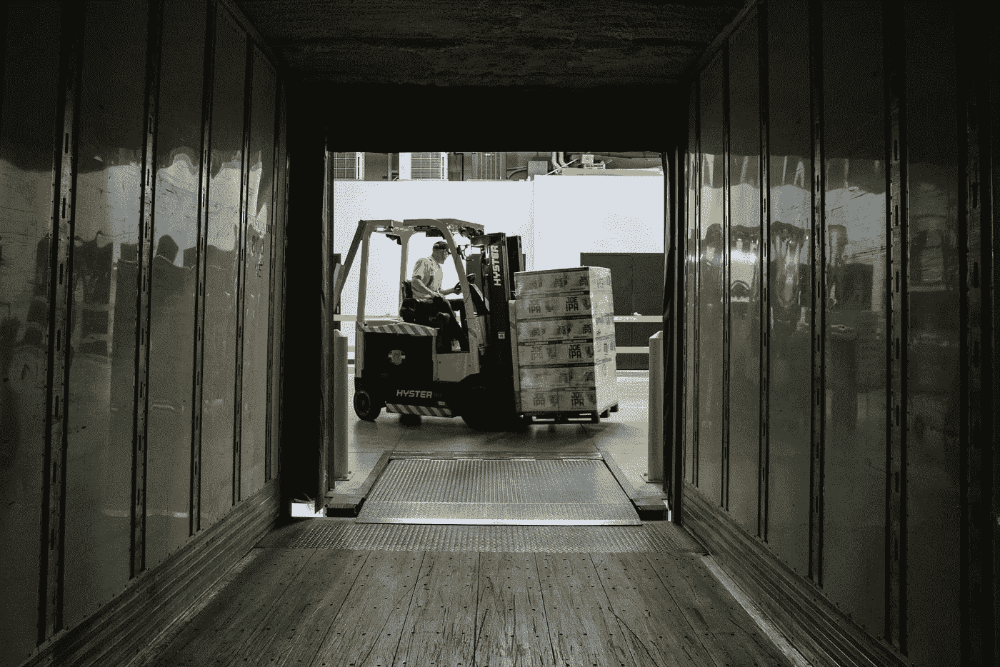
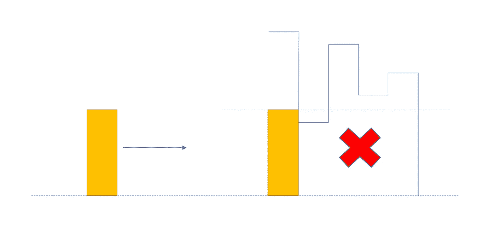
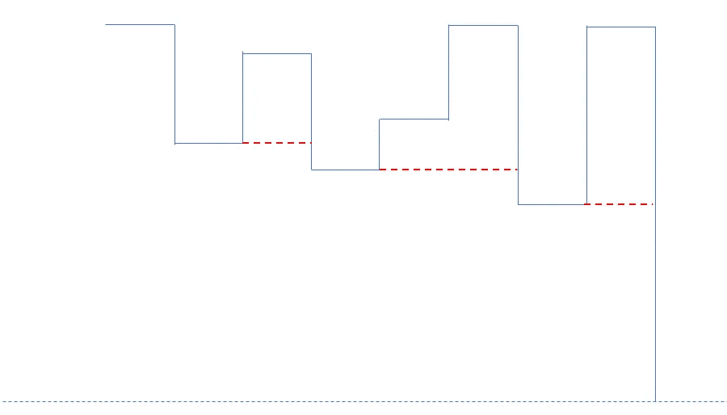

# 将箱子放入仓库 I —每日挑战五月

> 原文：<https://medium.com/nerd-for-tech/put-boxes-into-the-warehouse-i-daily-challenge-may-94f15f3369f1?source=collection_archive---------11----------------------->



照片由[将](https://unsplash.com/@elevatebeer?utm_source=unsplash&utm_medium=referral&utm_content=creditCopyText)提升到 [Unsplash](https://unsplash.com/s/photos/warehouse?utm_source=unsplash&utm_medium=referral&utm_content=creditCopyText) 上

今天的问题来自每日 Leetcode 编码挑战赛——五月版。这是一个中等标签的问题。让我们看看问题陈述。

## [1564](https://leetcode.com/problems/put-boxes-into-the-warehouse-i/) 。把箱子放进仓库

给你两个正整数数组，`boxes`和`warehouse`，分别代表一个仓库中一些单位宽度的箱子的高度和`n`房间的高度。仓库的房间从左到右从`0`到`n - 1`标记，其中`warehouse[i]`(0-索引)是`ith`房间的高度。

箱子按照以下规则放入仓库:

*   盒子不能叠放。
*   您可以重新排列框的插入顺序。
*   箱子只能从左向右推进仓库。
*   如果仓库中某个房间的高度小于一个箱子的高度，那么这个箱子和它后面的所有其他箱子都会停在那个房间的前面。

返回*您可以放入仓库的最大箱子数量。*

## **示例**

```
**Input:** boxes = [4,3,4,1], warehouse = [5,3,3,4,1]
**Output:** 3
**Explanation:** We can first put the box of height 1 in room 4\. Then we can put the box of height 3 in either of the 3 rooms 1, 2, or 3\. Lastly, we can put one box of height 4 in room 0.
There is no way we can fit all 4 boxes in the warehouse.
```

## 理解问题:

由于我们只能从左向右推动仓库中的箱子，所以可以推到一个房间的箱子的高度取决于前一个房间的高度。例如，如果我们的房间高度分别为 4、7，我们就不能将一个高度为 5 的盒子放入高度为 7 的房间，因为它不能放入前面高度为 4 的房间。所以有一件事是清楚的，我们只能在一个房间里放置一个盒子，如果所有前面的房间的最小高度能容纳所说的盒子。



方法:

如上所述，任何房间可以考虑的实际高度是前面高度的最小值。所以我们用前面房间的最小值来更新房间的高度。



例如[5，3，3，4，1] → [5，3，3，3，1]

一旦我们有了有效高度，我们就开始装箱子，先装大箱子。对于仓库中的每一个房间，我们都试图找到是否能把盒子放在那个房间里。我们以贪婪的方式做这件事。为此，我们将盒子按降序排列。

代码实现:

```
def maxBoxesInWarehouse(boxes, warehouse):
    for i in range(1, len(warehouse)):
        warehouse[i]= min(warehouse[i], warehouse[i-1])
    boxes.sort(reverse=True)
    j = 0
    res = 0
    for height in warehouse:
        while j < len(boxes) and boxes[j] > height: 
            j += 1
        if j >= len(boxes):
            break
        res += 1
        j += 1
    return res
```

## 复杂性分析:

*   时间复杂度:O(n*log(n))排序盒子 *m* 创建最小高度数组。O(n + m)表示找到房间的盒子。
*   恒定空间

编码快乐！！