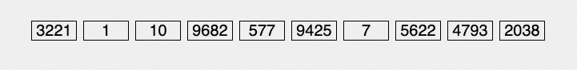
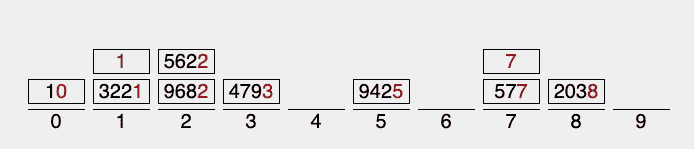
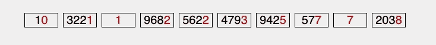
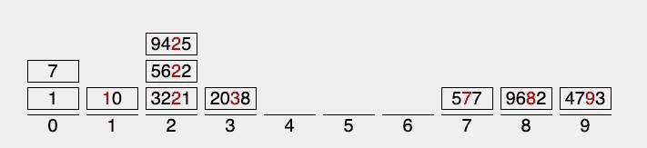
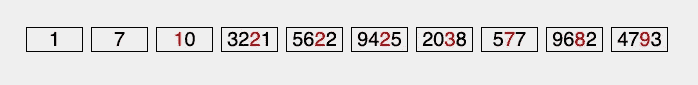
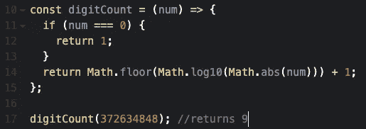
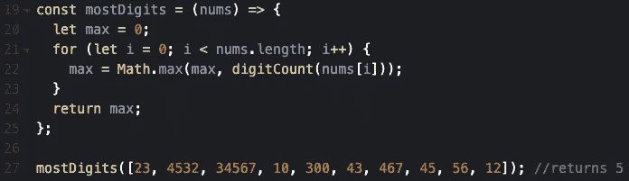
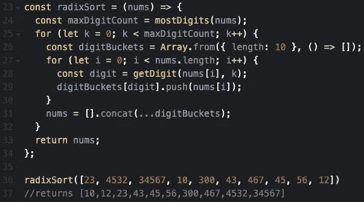
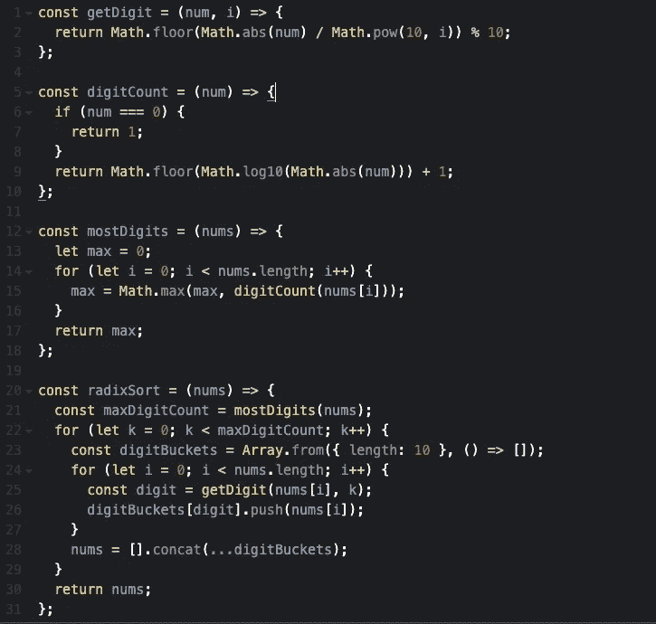

# 将 Rad 放入基数排序中

> 原文：<https://medium.com/nerd-for-tech/putting-the-rad-in-radix-sort-d7c3be4fdbdf?source=collection_archive---------15----------------------->

水桶！

# 阅读完本文后，您应该能够:

*   向朋友解释基数排序。
*   描述两种不同类型的排序算法。
*   实现你自己的基数排序。
*   回答问题，“为什么基数排序？”
*   理解为什么有人会用水桶的照片来展示他们的文章。

## 我将在本次演示中使用的工具:

*   [https://www.codepen.io](https://www.codepen.io)
*   【https://www.visualgo.net 号
*   JavaScript。

作为参考，最终代码可以在 https://codepen.io/WillWatson/pen/wvJjBXx[找到](https://codepen.io/WillWatson/pen/wvJjBXx)

## 在继续阅读之前

你可能已经掌握了一些基本的比较排序算法，比如冒泡排序或者插入排序。这是为了当我们开始讨论大 O 符号时，我们可以理解一些限制，以及为什么基数排序在某些情况下被认为是更优化的。

同样重要的是要注意基数排序可能有点重数学。如果你对数学不感兴趣，我完全理解，但是我保证如果你在演示过程中坚持下来，我们可以帮你度过难关，让你成为基数排序冠军。

# 什么是比较排序？

首先回答“什么是排序算法？”这个问题可能更容易排序算法本质上可以按照它们的名字来定义。它们是基于特定参数对数据进行排序的算法。一个很好的例子是对数字列表进行升序排序。窗帘后面没有人。

比较排序可以说是最流行的数据排序方式，因为它们最常用，也最广为人知。您可能熟悉 JavaScript 的内置数组方法 Array.prototype.sort()。它们被称为比较排序，因为在整个算法运行过程中的任何给定时间，它们都在比较两个特定的数据。

如果你对一系列数字进行升序排序，你会一次关注两个数字，然后一步一步地确定哪个数字更大，并根据这个信息排列它们。

冒泡排序一次比较两个数字。来自 Visualgo.net

# 等待..那什么是基数排序？

基数排序也是一种排序算法，只是它被认为是整数排序算法。你可能会对自己说“他不是刚刚演示了整数排序吗？”你是对的！但是这里的关键区别是基数排序不是通过一次比较两个数字来对整数进行排序。它通过关注数据的特定属性来对整数进行排序。

我所指的具体属性是数字的“长度”或其位数。一般的想法是，如果一个数的位数多，它就一定比位数少的数大。

例如，4579 比 381 大，因为 4579 有四位数，381 有三位数。直觉吧？

## 你说直觉？

基数排序真正酷的地方在于它是如何使用数字的“长度”来对它们进行排序的。

需要注意的是，为了简单起见，我在这次演示中使用的数字都是十进制的。

最初，算法首先遍历所有数字的 1 位置，并根据该位置的数字将它们放入组或桶中。为此，我们需要已经定义了十个存储桶(0–9)。这些桶代表十进制中所有可能的整数。

不同“长度”的随机数列表

放在“桶”中的相同数字列表。

这里我们可以看到数字列表被放置在各自的桶中。“1”位置的数字以红色突出显示，用于确定数字所在的桶。

然后将这些数字放回到列表中，以存储桶的顺序作为指导。

然后，该算法将整数向下(或向上)移动到十位。注意没有十位的数字是如何放在第 0 个桶中的。

然后再一次，数字被放回到列表中，从第 0 个桶开始。

在这里，我们可以看到数字开始以升序排序，因为 1、7 和 10 已经在它们正确的位置上。十位以红色突出显示。

然后对数百、数千等数字重复这些步骤，直到这些数字完全排序。

基数排序直观教具。

# 好吧，好吧，但具体是怎么操作的？

基数排序似乎更酷，它的实际代码执行涉及到一点动态编程。也就是说，为了解决更大的问题，它找到了一堆更小问题的解决方案。这里的一些小问题的例子是隔离整数的每个位置，并找到每个整数的实际“长度”。所以我们需要一些辅助函数来把它们整合在一起。准确地说，是三个助手功能。

现在这就是数学的用武之地，但是不用担心，我们将会使用很多 JavaScript 内置的数学对象，它们将会为我们完成所有的数学工作。

*说够了，我听到了。*

# 带上 getDigit

作为它的最佳实践被如此聪明地命名，getDigit 是我们将要用来在我们当前关注的位置抓取数字的函数。

它看起来像这样。

去找迪吉-威尔·史密斯。

getDigit 接受两个参数，一个数字和我们希望返回的数字的索引。

因此，如果我们在 87654 上调用索引为 3 的 getDigit，我们应该会返回 7。

这个演示的目的是集中在基数排序上，所以我不会深究它在数学上是如何工作的以及为什么工作的。要知道，这绝对比试图将数字转换成字符串，然后集成某种降序循环来获取每个位置，然后必须将它们转换回数字更有趣、更简洁。

MDN 参考资料[https://developer . Mozilla . org/en-US/docs/Web/JavaScript/Reference/Global _ Objects/Math](https://developer.mozilla.org/en-US/docs/Web/JavaScript/Reference/Global_Objects/Math)

# 给我看看长度

接下来，我们将关注数字的数量，或整数的“长度”。这很重要，因为我们需要确切地知道我们要对给定的整数列表排序多少次。如果列表中最大的数字有九个数字，那么我们知道我们必须对数据进行九次排序。

为此，我们需要两个助手函数，它们将协同工作。

第一个叫做 digitCount。

digitCount 接受一个参数，一个数字，并返回数字的数量，或该数字的“长度”。

零在这里是一个特例，因为虽然它是一个位数，但当你对它调用 Math.log10 时，你会得到-无穷大，这是我们真的不想处理的。

下一个是最大位数。

mostDigits 接受一个整数数组，使用 digitCount 返回最大整数的“长度”。在这种情况下，最大数量的数字是五。

# 介绍 MC 基数排序

现在我们有了助手函数，我们可以编写实际的基数排序函数了。剩下要做的就是创建我们的桶，编写我们的循环，并调用我们的帮助函数。

*简单的东西*。

乍一看有点野，但是让我们一行一行地分解一下。

首先，我们自然想要创建我们的函数。这里我们称之为 radixSort。radixSort 只接受一个参数，一个整数数组。

然后我们想知道我们到底需要多少次把我们的整数放入桶中，所以我们调用数组中的 mostDigits 并把它保存到一个变量 maxDigitCount 中。如果我们的数据数组中最大的数字是 87654，我们知道我们需要排序五次。

现在我们有了循环的停止条件，让我们来写它。请注意，这里我们将使用变量“k”。你可以使用任何你想要的字母，我只是建议你不要使用标准的“I ”,因为我们已经有一个使用“I”的函数了。

让我们创建我们的桶。我们将使用 JavaScripts Array.from 方法来实现这一点，第一个参数有一点小技巧。分配给 digitBuckets 的值是一个由十个空子数组组成的数组。我们在外部循环中这样做的原因是因为我们需要为每次迭代准备新的桶。

 [## Array.from() - JavaScript | MDN

### 静态方法从类似数组或可迭代的对象创建一个新的浅复制数组实例。Array.from()让…

developer.mozilla.org](https://developer.mozilla.org/en-US/docs/Web/JavaScript/Reference/Global_Objects/Array/from) 

现在，每次我们按桶进行迭代和排序时，我们都需要遍历实际数据。这就是内部循环发挥作用的地方。当我们在数据中循环时，我们希望将注意力集中在外环位置的数字上。例如，外部循环的第一次迭代，0，将给出第一个位置的数字，或者在调用 getDigit 时给出 1 的位置。分配给可变数字的整数将反映整个数字被放入哪个桶。

digitBucket[digit]是特定的桶，nums[i]是整数。

然后我们想把这些数字，按存储桶顺序，返回到列表中。为此，我们使用了另一个 JavaScript 技巧。concat()和 spreader (…)运算符。具体来说，它抓取(连接)所有的数组，但不是像桶一样有一个子数组，我们只有一个按顺序排列的数字数组。

无论最大“长度”是多少，我们都重复这些步骤，并返回排序后的数据。按升序排列的整数，而不必进行单个数对个数的比较。

# 大 O！

到大 O 符号。基数排序的最佳、平均和最差时间复杂度均为 O(nk)。其中“n”是我们要排序的整数个数或整数数组的长度，“k”是列表中最大数字的“长度”。

基数排序的空间复杂度为 O(n + k)。

“这有什么关系？”你可能会问。在这方面，比较排序的最快平均时间复杂度是 O(n log n)。这意味着在某些情况下，如果满足某些条件，基数排序可以被认为是排序数据的一种更快的替代方法。在给定数据都是不同的情况下，可以理解“k”将被认为是“log n ”,这将使基数排序与快速比较排序一样有效。

一些有趣的链接反映了支持和反对基数排序的观点。

 [## 基数排序和 O(N log N)效率

### 我最近一直在学习基数排序，我使用的来源之一是维基百科页面。目前…

stackoverflow.com](https://stackoverflow.com/questions/48451734/radix-sort-on-log-n-efficiency) 

[https://en.wikipedia.org/wiki/Talk:Radix_sort](https://en.wikipedia.org/wiki/Talk:Radix_sort)(向下滚动到效率标题)。

# 为什么基数排序？

这里真正的问题是，为什么不是基数排序？它很有趣，与众不同，利用了一些很酷的物体和数学技巧。如果使用正确的用例，它也会非常高效。另外，在 Visualgo 上观看数据排序是多么有趣。我相信我们都同意基数排序非常棒……..

# TLDR

# 在你离开之前带上这个:

*   这是一个初学者介绍基数排序使用十进制数。还有许多其他更复杂的用例。
*   基数排序主要用于按字典顺序对二进制或其他数据进行排序。
*   虽然基数排序只能用来排序整数，但我们也可以将字符串、图像等转换成二进制。需要考虑的事情。

只是想感谢你，读者，非常感谢你花时间来检查我的文章。希望你现在对基数排序有了一个很好的理解。如果你做到了这一步，你至少可以理解为什么顶部会有一幅水桶的图片。

如果你有任何问题，只是想谈谈排序算法，或者你发现了一个你认为我可能感兴趣的酷算法，请随时在 Linkedin 和 Twitter 上添加我。

[www.linkedin.com/in/williampwatson](http://www.linkedin.com/in/williampwatson)

https://twitter.com/concatWill