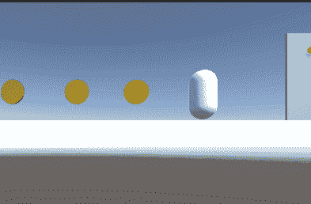
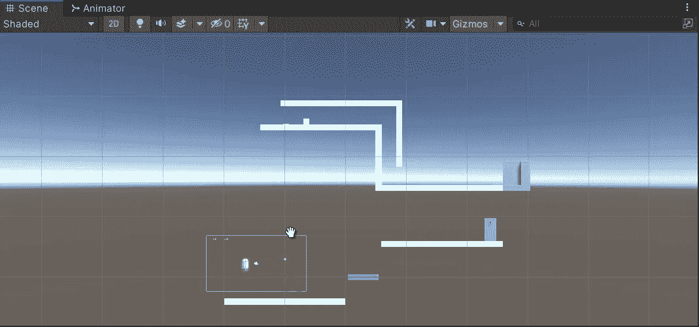
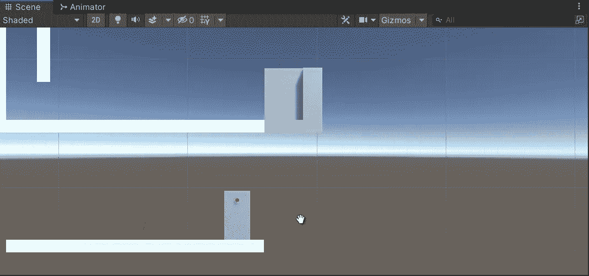
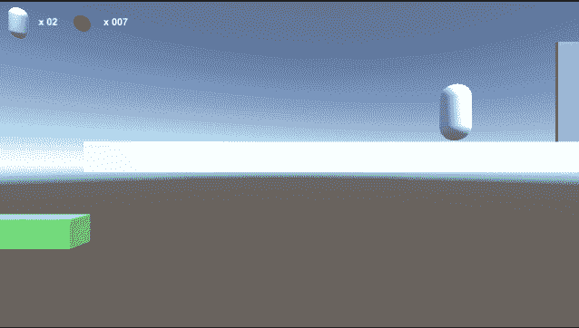
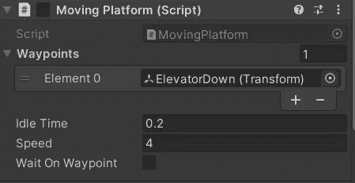
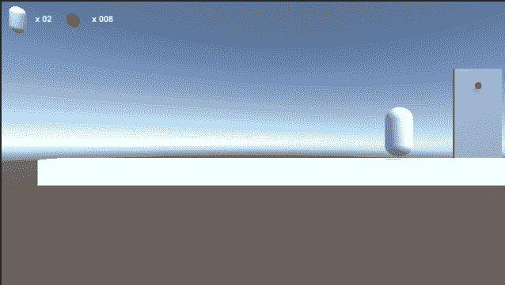

# 谜题—电梯

> 原文：<https://medium.com/nerd-for-tech/puzzles-elevator-47cff6e2e21?source=collection_archive---------6----------------------->

**目标**:用电梯呼叫和上升创造第一个谜题

通过这篇教程，我想展示如何在 2.5D 平台上实现简单的拼图游戏。我提前准备了环境，打算放 3 个拼图。第一个将涉及一个**升降机**。

电梯是由**灰色星团**组成的物体。它将通过下面的面板被调用，有一个**红色** led。想法是当玩家在面板附近并且可以呼叫电梯时，使 led **变绿**，呼叫将通过按 E 键来执行。

只有当玩家收集到足够多的硬币时，才能调用电梯。

`OnTriggerStay()`的工作方式有点像`Update()`在**循环中执行**里面的所有指令。我们检查玩家钱包中的硬币，如果足够，我们将 led 变为绿色，并准备好呼叫(E 键)。根据硬币数量，UI 文本被更新以告诉玩家消息是好是坏。

当退出触发器时，我们再次将 led 变为红色并清除文本。

电梯将有两个脚本:第一个是移动平台，第二个是控制器，因为我们不需要电梯像移动平台一样上下。

因此，作为开始，电梯将禁用移动平台组件，但用唯一的向下位置航路点填充。`CallElevator()`方法将只启用脚本，对象不能不下降。但是因为只有一个路径点，向下，电梯不会在路径点之间循环！

一进入电梯，并适当地放置了进一步的触发器，我们重置了移动平台脚本，将其唯一的航路点更改为向上位置，并设置速度:电梯将向上运行，永不返回！

