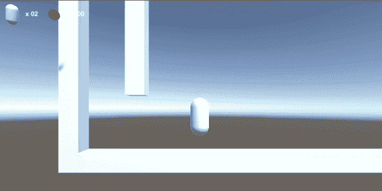

# 拼图——跳墙

> 原文：<https://medium.com/nerd-for-tech/puzzles-wall-jumping-7626230b1c2a?source=collection_archive---------4----------------------->

**目标**:实现翻墙功能，克服障碍

在深入研究这个挑战之前，我们必须对代码进行一些修改。

我将实现一个跳墙功能，当角色在半空中碰到一面墙时就会发生。由于这个原因，我们不能在半空中沿着 x 轴移动角色。

为了实现这一点，有必要在玩家接地时只进行水平输入。

正如我们对双跳转特性所做的那样，我们将引入一个 bool 字段`_canWallJump`来帮助我们构建逻辑。人物:

1.  接地时不能跳墙
2.  不能在跳墙的时候跳两次
3.  墙壁只能在某些表面上跳跃吗
4.  只有当布尔为真时才能跳墙。

我们先检测一下什么时候有可能出现跳墙。

当角色与有碰撞组件的物体碰撞时，调用方法。一个`ControllerColliderHit`参数被传递，包含有价值的信息。

我在这个方法中做的第一件事是使用表面法线属性检查天花板碰撞。

法线是一个长度为**酉**的向量，与表面**正交**并指向表面**之外**(因此定义了一个表面方向)。如果这个法线的 y 分量等于-1，这意味着它是垂直的，指向下，所以角色撞到了它上面的一个水平表面:天花板。因为我们伪造了物理定律，所以当角色不能穿过天花板时，我们的速度向量会像平常一样。这导致玩家撞上天花板，并一直粘在上面，直到速度矢量没有下降到负值，开始下落。因此，当这种情况发生时，我调整速度，以减少这种影响。

然后在碰撞器标签上有一个检查，如果碰撞器适合跳墙，我们存储法线(通常是水平的)并将 bool 设置为 true。

现在布尔为真，我们可以检测到跳墙的输入，这必须发生在半空中，所以当角色不接地时。

我们曾经检测到了针对 double jump 的输入，现在我们也检测到了针对 wall jump 的输入，因为这两者是互斥的:只有当 wall jump 不可能时，我才能进行 double jump；另一方面，只有当 double jump 检查失败时，我才能进行 wall jump。

`WallJump()`方法非常类似于双跳的方法:我们检测输入，然后设置速度并反转布尔(拒绝第二次跳墙)。这一次，速度将不仅是垂直的，而且将具有水平和垂直分量，根据公式(经验、试验和错误，直到我得到我想要的)进行评估。

