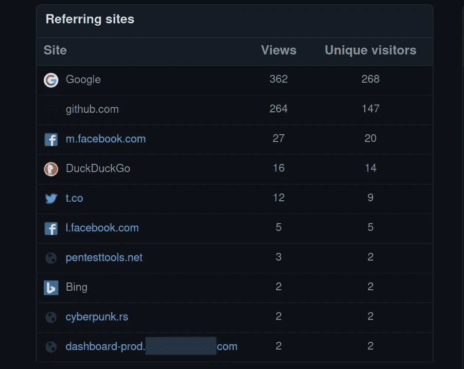
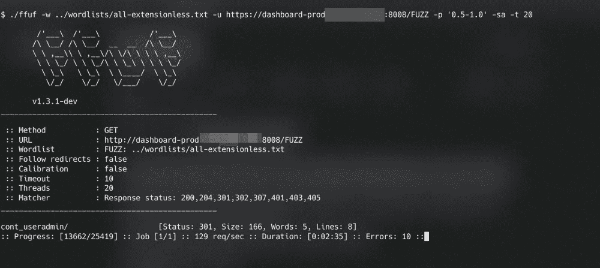
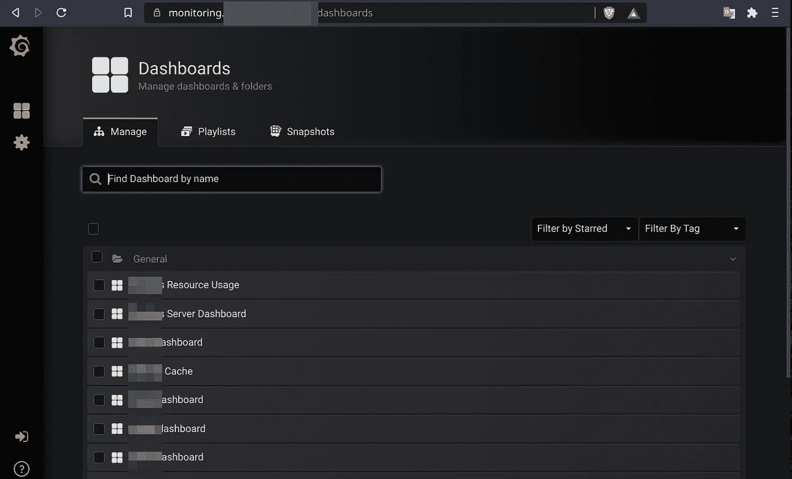
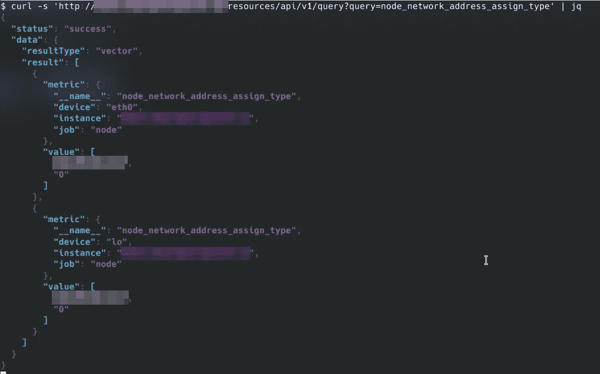
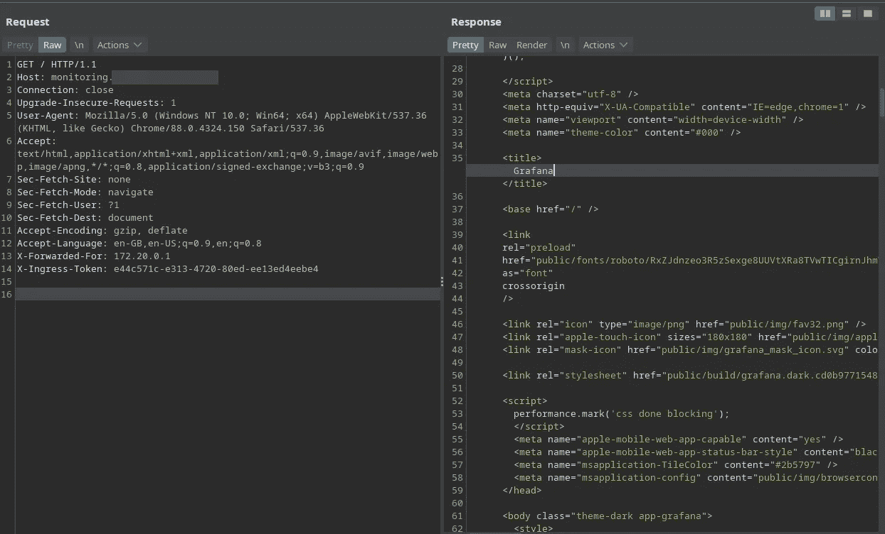
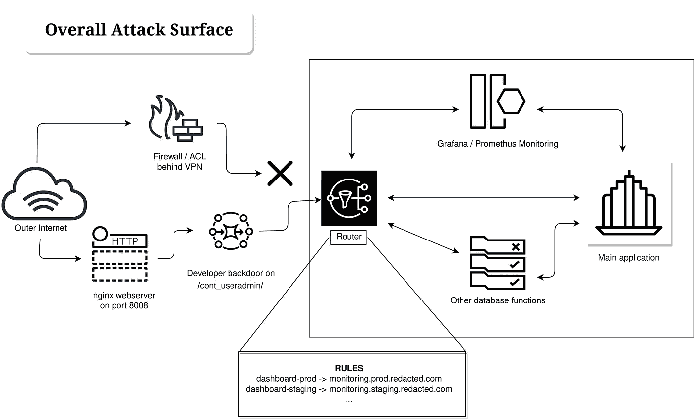

# 用后门程序运行后端程序

> 原文：<https://medium.com/nerd-for-tech/pwning-a-backend-with-a-backdoor-1e0d5b3e9b72?source=collection_archive---------6----------------------->

发展是一项重要任务。但是有意识的安全发展更为重要。在这篇简短的博文中，我详细介绍了一种不寻常的方法，通过这种方法，我能够在一个适当安全的网络后面提升对几个生产实例的访问。


# 怎么开始的。

这一切都是从我在 GitHub 上为一个工具偶然检查一些流量数据开始的。GitHub 允许您查看过去 14 天的一些统计数据，即。知识库中的访问者、克隆人等。

一个特别有趣的推荐网站 URL 引起了我的注意:



GitHub 存储库统计

你是如何抵御这样的诱惑的？不管怎样，我上钩了，开始挖。

在这种情况下，我总是做的第一件事是验证我的目标站点是否有安全联系人。这对*避免*陷入法律纠纷非常重要。幸运的是，这有一个独立的 VDP 运行，所以我决定继续前进。

这里出现的一个明显的问题是，这个特定的 URL 是如何出现在统计页面上的？很明显，有人从某个“仪表板”上点击了指向这个存储库的链接。根据我的理解，GitHub 从浏览器发送的`Referer` 头中积累这些流量统计数据，其中包含了发出请求的前一个网页的 URL。所以可以相当安全地假设他们有某种“仪表板”,其中包含可以点击的链接。

# 映射目标。

我花了半个小时试图绘制目标地图。对它所指向的 IP 进行快速 nmap 快速扫描，发现两个开放的端口，都运行 HTTP— `3000, 8008`。我的第一反应是 Grafana——因为`3000` 通常是 Grafana 实例的默认端口。然而，事实证明并非如此。在浏览器中访问`http://redacted.com:3000` 毫无结果，浏览器只是显示“重定向太多”错误。我认为这可能是一个生产实例，所以它被适当地保护在 ACL 后面。

我决定快速启动 [*ffuf*](https://github.com/ffuf/ffuf) 并为端口`8008` ( `[bruteforce-database](https://github.com/duyet/bruteforce-database)`是我在生产服务器上发现内容的最爱之一)做一些基本的内容枚举。几分钟后，这是我看到的终端画面:



有趣的权利，让我们访问我们的浏览器中的路径？当我被重定向了几次后，我惊讶地发现这个页面位于一个完全不同的子域(`https://monitoring.redacted.com/dashboards`)。



等等，什么？巧合吗？

稍微摆弄了一下，但仔细地看，我发现我是以管理员权限登录的。我可以删除仪表板，创建/删除新的播放列表和快照，当然还可以查看几个生产服务器的敏感监控数据。此外，仪表盘还显示了一个相关的 Prometheus REST 代理 API，该 API 完全未经身份验证。我以前不熟悉 *PromQL* ，所以在[读到它](https://promlabs.com/promql-cheat-sheet/)之后，我想我可以通过 API 提取更多敏感数据。



通过 Prometheus API 提取内部网络信息

就在这时，我停止了测试，并决定将我的发现报告给安全联系人的电子邮件。

# 但是等等，那里发生了什么？

当涉及到我遇到的奇怪的错综复杂时，网络应用经常让我着迷。这一个也不例外，真的引起了我的注意。我决定深入调查是什么引发了这种行为。长话短说，我的结论是,`/cont_useradmin/`路径以某种方式充当了一个代理，它给了我对他们内部 VPN 的*认证*访问，这就是为什么我能够以管理员权限直接访问 Grafana 监控仪表板。**已验证的**——因为很少有额外的头以某种方式与请求中的默认头集一起添加:



请求和响应捕获

然而，这显然没有满足我的好奇心，所以我礼貌地问安全联系人，让我知道到底是什么导致了这种行为。几天后，我收到了回复，说他们已经修复了这个问题，并给了我一个开发者联系人，我可以从他那里得到我的问题的答案。和他交谈了几句，我终于了解了事情的全貌。

原来我接入的确实是一个故意引入的*开发者后门*。造成这种情况的实际原因是端口`8008` 上的 nginx 服务器配置错误，允许开发人员(暗示任何人)直接访问生产环境进行调试。他很坦率地承认，他直接从一个在线论坛的答案中实现了配置文件，而没有真正理解该场景的安全上下文。

HTTP 服务器的 *nginx.conf* 文件如下所示:

```
user              www-data;
worker_processes  1;
error_log         /var/log/nginx/error.log;
pid               /var/run/nginx.pid;

events {
  worker_connections  1024;
}...snip...http {
  include            /etc/nginx/mime.types;
  access_log         /var/log/nginx/access.log;
  sendfile           on;
  keepalive_timeout  65;
  tcp_nodelay        on;

  server {
    listen      *:8008;
    access_log  /var/log/nginx/access.8008.log;
    location    /cont_useradmin/ {
      rewrite           /cont_useradmin(.*) $1 break;
      proxy_pass        http://172.20.0.1:60000;
      proxy_redirect    off;
      proxy_set_header  Host             $host;
      proxy_set_header  X-Forwarded-For  $proxy_add_x_forwarded_for;
      proxy_set_header  X-Ingress-Token  e44c571c-e313-4720-80ed-ee13ed4eebe4
        }
    }
}...snip...
```

已经注意到什么不对了吗？让我把它分解一下。该配置将任何*请求转发到端口`8008`上的`/cont_useradmin/`端点，以及带有`X-Ingress-Token` 认证报头的内部 IP `172.20.0.1:60000` 。端口`60000`托管着一个内部路由器守护进程，它映射了所有的内部生产端点。该路由器不可公开访问，并接受来自特定白名单 IP 的连接，并进行适当的身份验证，即开发人员有意嵌入 nginx 配置中的`X-Ingress-Token` 报头。*



整体攻击面可视化

现在，路由器看到我已经通过了身份验证，并且正在尝试访问 *dashboard-prod* 子域，它根据它的映射配置将我重定向到 Grafana 实例。此外，所有通过路由器的请求都被明确列入白名单，这意味着我实际上是作为一名管理员。

开发人员解释说，这是一个自托管的吉拉板，我的 GitHub 库的链接就是从这里开始的。默认情况下，路由器通过我在 GitHub 的统计页面上看到的`dashboard-prod` 子域映射所有来自内部 HTTP 端点的出站 HTTP 流量。

# 外卖食品

## 对于开发人员

发展的确是一项艰巨的任务，但确保安全更为重要。尽管开发人员采取了相当多的措施来保护他们的生产环境，将它放在 VPN 之后，我仍然能够通过简单的错误配置访问他们的内部网络。开发者后门很酷，允许快速访问，但如果其他人发现它，可能会致命——因为他们通常拥有较高的特权级别。

在几个地方实现访问控制也是一个很好的做法。在这种情况下，路由器映射的每个服务都应该有额外的身份验证，从本质上防止横向移动。我本可以通过查询来探测路由器，从而找到更敏感的服务，因此可能会破坏他们的内部网络。想象一下这样一个简单的错误会导致如此毁灭性的结果。

这里有一个有趣的引用，来自评论这篇文章的 Somdev(感谢他！):

> 有后门的后端只是前门。

## 对于安全人员

永远不要退而求其次。总是留意网络应用程序中的怪异行为，并试着改变它。你可能会在最意想不到的地方发现一些东西。

就是这样！经过深思熟虑，我在此总结。下次见。干杯！🥂