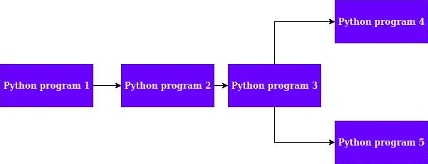
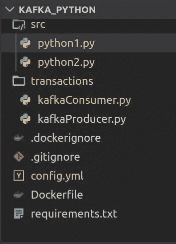
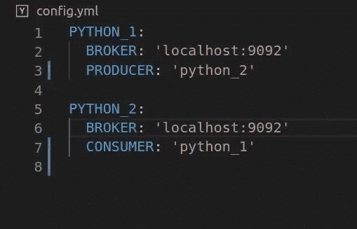
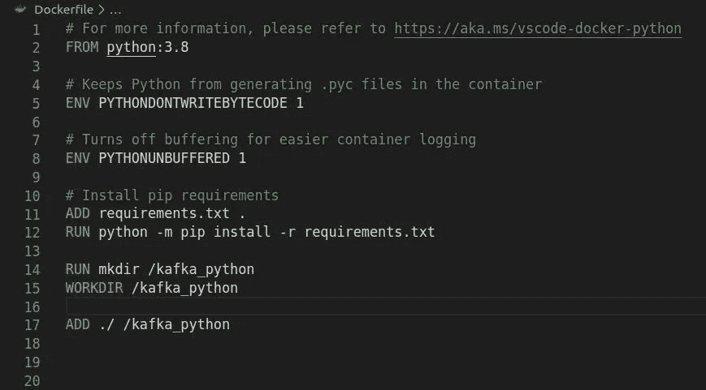
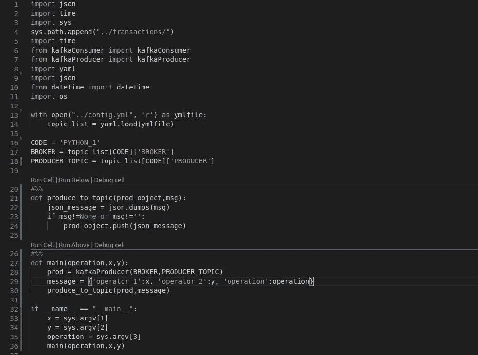
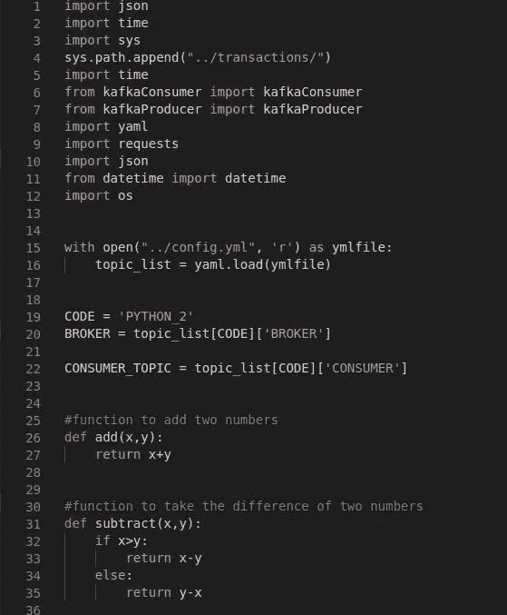
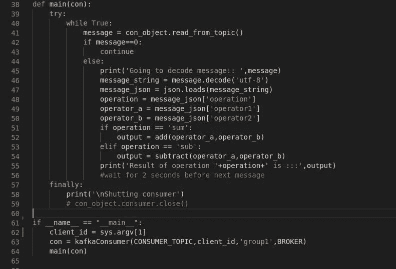
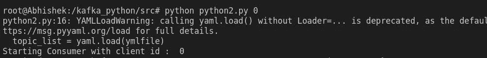
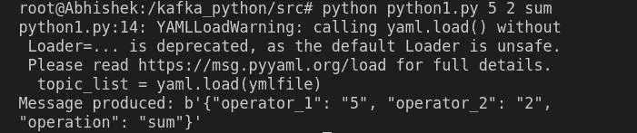
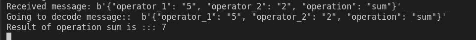

# Python 和卡夫卡:消息传递及更多

> 原文：<https://medium.com/nerd-for-tech/python-and-kafka-message-passing-and-more-44ccb4f1576c?source=collection_archive---------1----------------------->

在开发人员职业生涯的许多阶段，他/她必须构建能够与他人通信的系统。例如，可能有两个 ***python*** 程序，第二个程序的操作可能依赖于第一个程序的输出。线性序列中可以有多个程序，每个连续的程序都依赖于前一个程序的输出。线性序列甚至可以根据前一个程序的输出分支到两个子程序。下面是一个 ***依赖图*** 的例子。



图 python 程序的依赖图

如图 1 所示，程序 2 依赖于程序 1 的输出。类似地，程序 3 依赖于程序 2 的输出。程序 3 又分支成两个子程序，接受来自程序 3 的输出。如果开发人员的目标是让程序 4 和程序 5 并行运行，那么他/她必须以多线程的方式对这些程序进行异步调用。由于 python 本身并不是线程安全的，所以创建可伸缩的多线程系统变得有点困难。这就是 ***阿帕奇卡夫卡*** 可以用的地方。

在讨论 Apache Kafka 的实现和与 Python 的集成之前，让我先简单介绍一下它。

由 **LinkedIn 开发的软件平台 Kafka** 是一个开源的流处理管道，后来被捐赠给了 **Apache 软件基金会。**


[https://kafka.apache.org/](https://kafka.apache.org/images/logo.png)[的阿帕奇标志](https://kafka.apache.org/)

正如官方 **Apache** 网站上提到的， **Kafka** 可用于创建**数据管道**，这些管道可横向扩展、速度极快且具有容错能力。

上面给出的涉及 python 程序的用例并不是一个精确的流管道，但是 Kafka 可以用来解决向程序发送消息以供执行的问题，也可以用来在程序之间水平缩放信息。

让我们向前看，看看如何做到这一点。

# **1。在 Ubuntu 和 Confluent 上安装 Kafka-Kafka for python:**

为了安装 Kafka，只需按照 [**这个**](https://www.digitalocean.com/community/tutorials/how-to-install-apache-kafka-on-ubuntu-18-04) 在 [**DigitalOcean**](https://www.digitalocean.com/) 上给出的 Ubuntu 18 安装教程。

[***confuent-Kafka***](https://www.confluent.io/)是 Kafka 服务的全托管企业平台。

Confluent 还为 Kafka 出货了一个 ***Python 客户端*** ，可以用来直接集成 Kafka 和 Python。这个客户端可以用来创建主题、删除主题以及发送和接收消息。

# 2.通过 python 使用 Kafka:

让我们开始制作项目文件夹。



图 2:项目文件夹

我们将使用 Docker 进行实验，因为它是一项很棒的技术，让开发人员的生活变得极其简单。

一个好的做法是有两个项目文件夹，但对于这个实验，将只使用一个。为了执行 python 程序，我们将进入容器内部，手动运行它们。

> 如果你想要一个关于使用 Docker 和 python 的教程，看看这些博客-> [**Docker 和 Tensorflow**](/@abose550/installing-tensorflow-2-0-on-ubuntu-18-04-using-docker-run-all-experiments-from-a-container-4be9c2a8004d) **还有** [**Docker 和 YOLO**](/@abose550/deep-learning-for-production-deploying-yolo-using-docker-2c32bb50e8d6)

让我们现在开始检查这些文件。

Config.yml : 包含主题列表以及两个程序将要读取的内容。还包含代理信息。一个 kafka 主题为一定数量的主题保留了一定的信息。卡夫卡的主题也可以被分解成分区。然后，用户可以在这些分区中发送特定的消息。要了解更多关于卡夫卡主题和分区的内容，请查看此链接- > [***卡夫卡主题和分区***](http://cloudurable.com/blog/kafka-architecture-topics/index.html) ***。***Kafka 消费者阅读来自特定主题的消息，Kafka 向主题产生/发送消息。



图 3:主题的配置文件

**KafaConsumer.py 和 KafkaProducer.py :** 这两个文件包含了 ***Kafka 消费者*** 和 ***Kafka 生产者的类。*** 完整信息请参考[***github repo***](https://github.com/AbhishekBose/kafka_python)。下面给出的链接。这两个文件包含使用来自***confluent _ Kafka***library . main(operation，x，y)的**消费者**和**生产者**类创建的类

**Dockerfile:** 包含我们将要生成的 docker 容器的配置。这将使用一个 **python:3.8 镜像**并使用 **requirements.txt** 文件安装所有需要的库。使用 **ADD** 命令将项目文件夹添加到容器中，如下图 4 所示。



图 4:docker 文件

**Requirements.txt** :包含这个项目所有 python 库的列表

**python_1.py :** 这个文件的任务是向主题发送一条消息，这条消息将被第二个 python 代码读取。使用 **PyYaml 库读取**配置文件**。**定义为 **main(operation，x，y)** 的函数初始化名为 prod 的生产者对象，并向其发送消息。该消息是 json 格式的，可以在第二个程序中读取。在这个例子中，第二个函数将执行两个操作，即加法和减法。操作和运算符作为命令行参数。



图 5:显示了为特定主题生成消息的程序

**python_2.py:** 这段代码本质上将包含消费者。消费者将阅读主题，其中 **python_1.py** 将产生消息。这两个函数分别定义为***【x，y】add***和 ***subtract(x，y)。*** 这些功能将被接收的两个操作符执行操作，如图 6.1 所示。图 6.2 中定义的主要函数是 while 循环，它不断地从消费者主题中读取信息。该函数通过读取 json 格式的消息来检查前面代码发送的**操作**，并调用相应的函数。如果消息中的运算符是 ***和*** ，则调用**加**函数，否则调用**减**函数。



图 6.1:显示了将要调用的两个函数。



图 6.2:显示了从消费者主题中读取的主函数。

# **3。构建映像并运行容器:**

为了构建映像，请键入以下命令:

```
docker build -t 'image_name' .
```

构建映像后，通过键入以下命令生成一个容器:

```
docker run -it -d --name=container_name --network=host image_name
```

# **4。执行程序:**

通过键入以下命令进入容器内部:

```
docker exec -it container_name  bash
```

这能让你进去。上面的容器打开了容器内部的 bash shell。

在两个单独的 shells 中运行以下命令来观察输出

首先运行消费者

```
cd src
python python2.py 0
```

这里的 0 是**客户端 id** ，它为您的消费者提供了一个名称。您可以让 ***多个消费者*** 阅读消费者主题。这确保了并行处理，如图 7.1 中的**所示。只需给每个**消费者**分配一个不同的**客户 id** 。**



图 7.1:启动消费者

现在，通过以下方式执行生成器:

```
python python1.py 5 2 sum
```

这里的运算是求和，**运算符是 5 和 2** (图 7.2)



图 7.2:用 sum 操作符执行的 python1 程序

在图 7.3 中，可以立即看到对之前的 shell 进行加法操作的结果



图 7.3:可以看到输出消息和结果 7

# **5。结论:**

这个项目是卡夫卡如何被广泛用于创建大规模并行数据管道的一个基本例子。在 [**阎娜科技**](https://nayan.co) 我们广泛使用**卡夫卡**用于我们的深度学习推理和训练数据管道。

**Github 回购**:[***https://github.com/AbhishekBose/kafka_python***](https://github.com/AbhishekBose/kafka_python)