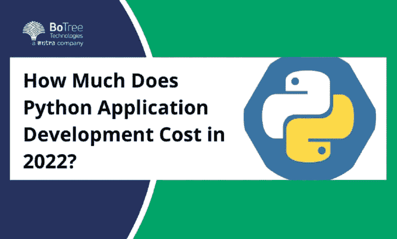

# 2022 年 Python 应用开发费用多少？

> 原文：<https://medium.com/nerd-for-tech/python-application-development-cost-221da37f7b7e?source=collection_archive---------5----------------------->

Python 是应用程序开发的最佳编程语言之一。作为企业级、高质量、安全应用的第一项技术，它被广泛接受。但是 Python 有多少呢？Python 软件的成本是 IT 部门经常考虑的问题。

虽然[编程语言](https://www.business2community.com/big-data/python-ai-why-python-is-better-for-machine-learning-and-ai-02389380)是开源的，这意味着它是免费的，但开发过程涉及其他成本。Python 软件的成本取决于应用程序的具体要求。

那么 Python 软件要多少钱呢？答案可能没那么简单。多重因素影响和决定 [Python 应用开发成本](https://www.botreetechnologies.com/blog/how-much-does-it-cost-to-build-a-python-application/)。在我们开始估算成本之前，让我们看看哪些因素决定了 Python web 应用程序开发的成本。

# **Python 对企业免费吗？**

Python 是一种开源编程语言。这意味着开发者和企业可以下载该语言并开始编码，而无需支付任何许可费。这使得 Python 成为企业的免费编程语言。

Python 开发服务开源的另一个好处是开发者可以修改和升级这项技术。他们可以添加新的功能，这不会是什么额外的东西。因此，企业不需要支付任何费用就可以获得最新版本的 Python。

本质上，Python 本身不需要任何成本。这是一项免费技术，任何人都可以使用。与 Python 相关的所有问题都来自于雇佣[可信的软件开发公司](https://www.botreetechnologies.com/)，构建应用程序所花费的时间，Python 应用程序的维护和升级，以及类似的方面。

> **阅读更多:** [**十大真实 Python 用例及应用**](https://www.botreetechnologies.com/blog/top-10-python-use-cases-and-applications/)

# **Python App 开发要花多少钱？**

我们知道 Python 是一种免费的开源编程语言。然而，构建一个 Python 应用程序是有成本的。Python 成本的估计取决于多种因素。让我们详细探讨这些因素。

以下是决定 Python 应用程序开发成本的几个因素

1.  **应用复杂度:**

*   决定 Python 应用程序开发成本的最大因素之一是应用程序的复杂性。企业想要的特性越多，他们在开发过程中花费的就越多。高度复杂的功能需要大量的时间、精力和资源。
*   为了理解 Python 开发的准确估计，预先设计好特性是一个很好的实践。这会节省很多时间和金钱。企业还可以确定哪些功能是真正有用的，哪些功能可以删除以节省资金。

**2。所需时间:**

*   由[受信任的企业软件开发公司](https://www.botreetechnologies.com/enterprise-software-development-company)创建一个 Python 应用程序所需的时间是影响 Python 应用程序开发成本的一个关键因素。当一个应用程序包含基本元素，并且不需要很多移动应用程序开发时间时，费用就不仅仅是高了。
*   然而，具有尖端功能的复杂应用程序需要利用人工智能，这进一步增加了 Python 应用程序的成本。因此，成本因素同样依赖于开发、计划、测试的预期时间，而这仅仅是开始。

**3。数据迁移和软件集成:**

*   将数据迁移和软件集成添加到一般的大杂烩中，企业可以获得更多的人时。然而，数据迁移和软件集成并不是各自独立的。假设该公司一直在过去的生态系统中处理大量数据，它们是很重要的。
*   在这些方面花费多少时间和金钱取决于企业拥有的数据量。它还取决于遗留系统在新编程中的可行性。因此，要用 Python 构建 web 应用程序，企业也需要注意这一点。

**4。应用程序设计:**

*   web 应用程序的设计对于方便性来说也是非常重要的。这就是为什么创造者投入了大量的工作来使它在外表上吸引人，本能的，聪明的，本质上令人愉快的使用。这些设计师独立收费，而且基本上没有 Python 工程师收费高，所以在美国，企业可以以每小时 22-35 美元的价格雇佣设计师。
*   这将同样依赖于 [Python web 应用](https://www.botreetechnologies.com/blog/top-15-websites-built-with-python/)的网站设计者的领域和经验。通常，设计师在日常工作中会使用他们自己的工具。企业大概不需要为任何产品付费。

**5。可扩展性:**

*   如果 Python web 应用程序必须针对大量受众或地理区域进行扩展，其成本同样会上升。例如，如果应用程序要发送到 5 个国家，企业确实应该考虑制造附近的服务器和从每个地区雇用员工的成本。
*   在这种情况下，与只有一个站点的项目相比，开发成本会增加。

**6。开发公司所在地:**

*   发达国家和农业国家之间的薪酬差距是企业可以从中获利的变量之一。在很大程度上，北美的工程师比中欧的设计师收费更高，而最后一种选择也能完成同样艰巨的任务。这正是为什么离岸外包最近变得如此引人注目。
*   企业可以以较低的时薪获得一个专家工程师团队，这让他们节省了资金。然而，成本越低的企业，雇佣一个真正可靠的团队的可能性就越令人遗憾。他们需要达到 Python 工程师每小时 50 美元的行业标准，或者接近这个标准。然而，BoTree Technologies 提供给 [Python 工程师](https://www.botreetechnologies.com/blog/guide-to-hiring-python-developers/)的报酬从每小时 30 美元到 50 美元不等。

**7。应用维护:**

*   组织经常忽视应用程序的维护，尽管这很重要。这些成本包括了应用程序大修、新交付、错误修复和配置更改的成本——每一个重要的成本。
*   应用程序支持是 [Python 应用程序](https://dev.to/botreetechnologies/7-ways-a-python-application-can-benefit-your-business-2g2k)开发包的一部分。在任何情况下，如果企业选择不进行维护，那么 [Python web app 开发](https://www.digitalgpoint.com/7-python-development-tips-to-improve-productivity/)的成本可能会降低。维护是进一步开发客户端协作和随着应用程序的开发交付尖端用户体验的基础。

> **阅读更多:**[**2022 年为什么选择 Python 做网站开发**](https://www.botreetechnologies.com/blog/why-choose-python-for-website-development/)

## 结论

Python web 应用程序的成本大约在 25，000 美元到 250，000 美元之间。这完全取决于我们上面讨论的因素。某些企业级应用超过 25 万美元。然而，一旦企业获得了这些应用程序，他们的投资回报就会成倍增长，因为他们的数字化计划在 Python 应用程序上有了新的转机。

[**联系我们**](https://www.botreetechnologies.com/contact) **今天免费咨询。**

*原载于 2022 年 11 月 14 日*[*https://itechviews.com*](https://itechviews.com/how-much-does-python-application-development-cost-in-2022/)*。*