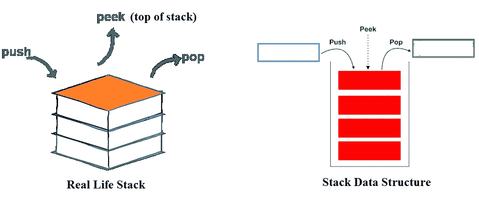
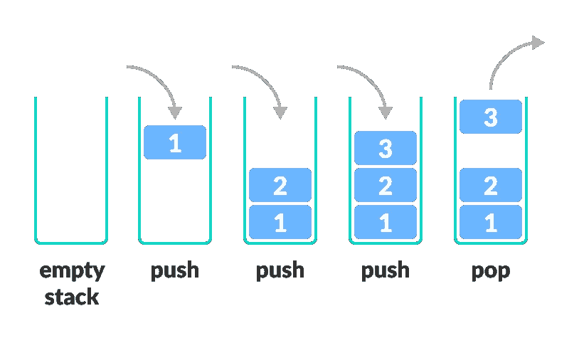
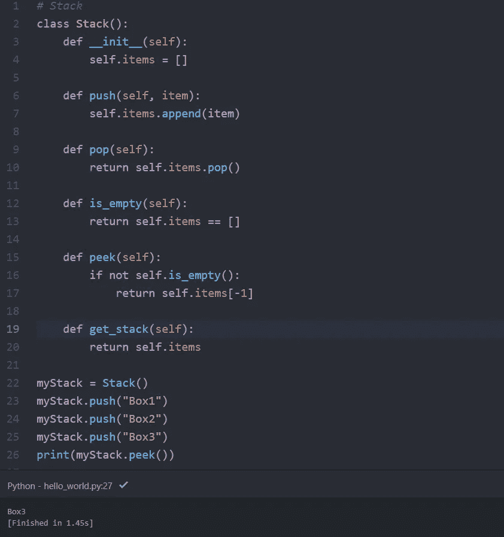

# Python 数据结构-堆栈

> 原文：<https://medium.com/nerd-for-tech/python-data-structure-stack-39e52285ecf3?source=collection_archive---------14----------------------->

堆栈是编程中一种有用的数据结构。它就像一堆书，一个压一个。

图片:codingtutorial4u

想想你能用这么一堆盘子做些什么

*   在上面放一个新盘子
*   拆下顶板

如果你想把盘子放在底部，你必须先把上面的盘子都拿走。这样的安排叫做**后进先出**——最后一项也就是第一项出去。

图像:编程/dsa

# 堆栈的基本操作

堆栈是一种对象(抽象数据类型— ADT ),它允许以下操作:

*   **推送**:将一个元素添加到栈顶
*   **弹出**:从栈顶移除一个元素
*   **IsEmpty** :检查堆栈是否为空
*   **GetStack** :返回整个堆栈
*   **Peek** :在不移除顶部元素的情况下获取其值

# Python 中的堆栈实现

图片:Atom/AshwinPC

# 堆栈时间复杂度

对于堆栈的基于数组的实现，推入和弹出操作需要恒定的时间，即`O(1)`

# 堆栈数据结构的应用

虽然 stack 是一种实现起来很简单的数据结构，但是它非常强大。堆栈最常见的用途是:

*   **把一个单词倒过来** —把所有的字母堆成一堆，然后弹出来。由于堆栈的后进先出顺序，您将得到逆序的字母。
*   **在编译器中** —编译器通过将表达式转换为前缀或后缀形式，使用堆栈来计算像`2 + 4 / 5 * (7 - 9)`这样的表达式的值。
*   **在浏览器中** —浏览器中的后退按钮将您之前访问过的所有 URL 保存在一个堆栈中。每次你访问一个新的页面，它都会被添加到堆栈的顶部。当您按下“后退”按钮时，当前 URL 将从堆栈中删除，并访问以前的 URL。