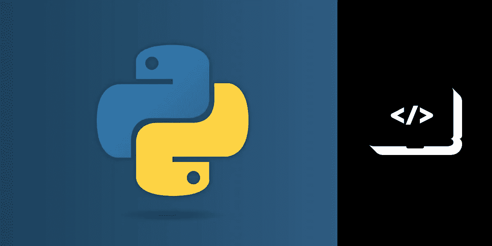
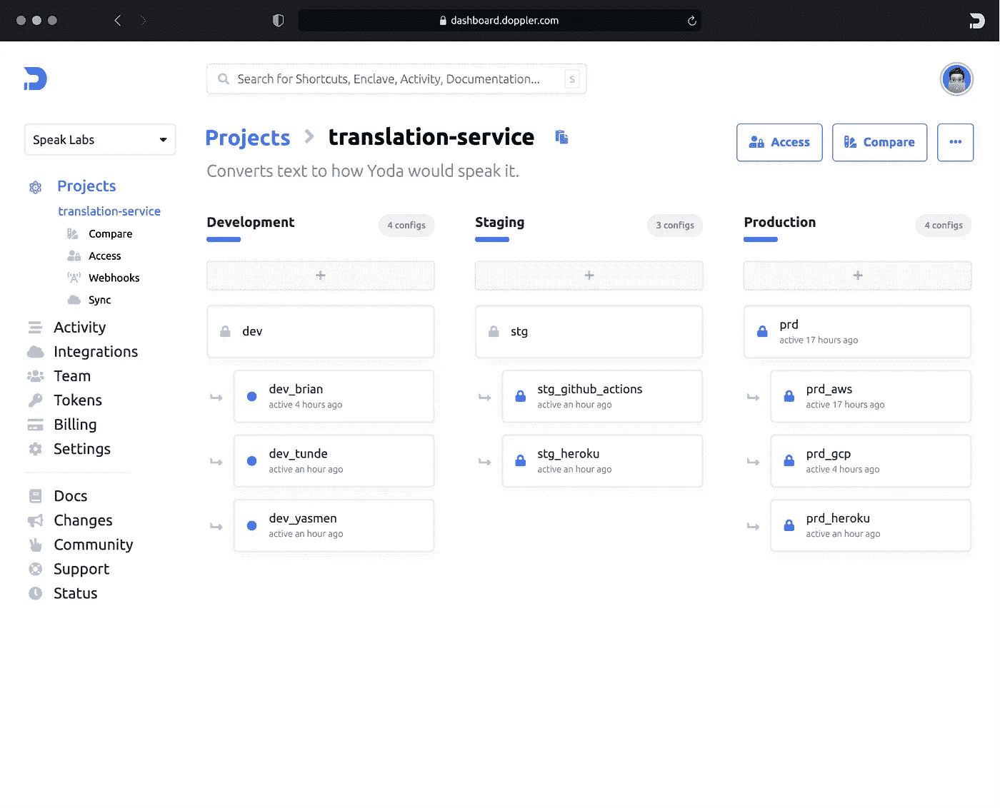

# Python 环境变量:入门

> 原文：<https://medium.com/nerd-for-tech/python-environment-variables-a-primer-7bff210f1da2?source=collection_archive---------2----------------------->

Python 程序员有很多秘密。这并不意味着他们有很多发誓保守秘密的事情(尽管他们可能会)。相反，他们经常处理不想让其他人看到的数据——例如，API 密钥、API 秘密、数据库名称等。

程序员存储这些秘密的一种方式是在环境变量中。在本文中，您将了解到在 Python 中使用环境变量所需的一切，包括如何设置、获取环境变量，以及保护所有秘密安全的不同方法。

# 什么是环境变量？

环境变量是存储在程序外部的变量，它会影响程序的运行。例如，您可以设置包含 API 的密钥和秘密的环境变量。当您的程序连接到 API 时，它可能会使用这些变量。

将您的秘密存储在您的环境中而不是源代码中有两个优点。

首先，它可以保护敏感数据的安全。例如，您可能不希望任何下载您的源代码的人访问您正在使用的 API 密钥。

第二个优点是，当您使用环境变量时，当您的秘密改变时，您不必更新您的源代码。

例如，假设您的代码根据用户运行的操作系统而不同地运行。您可以使用环境变量自动更新值，而不是每次使用不同的用户运行代码时都更改源代码。

您经常将环境变量存储在操作系统中，但是您将很快了解到使用它们的其他方法。

# 安装 Python

为了遵循本文中的示例，您需要安装 Python。

Python 有两个主要版本:Python 2 和 3。对于本教程，请确保您使用的是 Python 3。

如果你还没有，你可以按照这里的说明安装 Python 3 [。](https://www.python.org/downloads/)

# Python 中的环境变量

您可以使用内置的`os`模块在 Python 中获取和设置环境变量。通过将以下代码保存在 Python 文件中，然后运行此 Python 程序，可以查看程序中的所有环境变量:

上面的 Python 代码中的最后两行从操作系统中获取了"`USER"`环境变量，但是当您使用第一种方法时，如果 Python 没有找到该变量，就会抛出一个异常。

如果运行 Python 应用程序需要环境变量，您可能希望使用第一种方法；如果环境变量是可选的，您可能希望使用第二种方法。

在`os.environ`中，您可以访问的一个重要环境变量是`PYTHONPATH`。

`PYTHONPATH`中的 URL 是 Python 寻找模块的地方。

如果您导航到您的`PYTHONPATH`中的 URL，您可以自己看到这一点(您应该在那里看到 Python 的所有内置模块)。

当 Python 查找模块时，将目录添加到这个环境变量会将它们添加到 Python 的搜索路径中。

这意味着您可以在计算机上的任何地方将一个包含模块的目录添加到`PYTHONPATH`，Python 将能够找到它。

# 操作系统中的环境变量

在前面的例子中，“`USER"`是一个环境变量，你的操作集代表谁在使用你的计算机。虽然您的操作系统会自动创建此变量，但您也可以在操作系统上创建自己的环境变量。

下面是如何在您的操作系统上创建一个环境变量(使用一个类似 Unix 的系统)。首先，打开你的命令行。然后，键入以下命令:

您可以使用内置的`os`模块在 Python 中获取和设置环境变量。通过将以下代码保存在 Python 文件中，然后运行此 Python 程序，可以查看程序中的所有环境变量:

运行这段代码时，Python 解释器应该打印出操作系统的所有环境变量。

您可以像访问 Python 字典一样访问`os.environ`中的不同环境变量。以下是访问它们的两种方式:

上面的 Python 代码中的最后两行从操作系统中获取了"`USER"`环境变量，但是当您使用第一种方法时，如果 Python 没有找到该变量，就会抛出一个异常。

如果运行 Python 应用程序需要环境变量，您可能希望使用第一种方法；如果环境变量是可选的，您可能希望使用第二种方法。

在`os.environ`中您可以访问的一个重要环境变量是`PYTHONPATH`。

`PYTHONPATH`中的 URL 是 Python 寻找模块的地方。

如果您导航到您的`PYTHONPATH`中的 URL，您可以自己看到这一点(您应该在那里看到 Python 的所有内置模块)。

当 Python 查找模块时，将目录添加到这个环境变量会将它们添加到 Python 的搜索路径中。

这意味着您可以在计算机上的任何地方将一个包含模块的目录添加到`PYTHONPATH`，Python 将能够找到它。

在前面的例子中，“`USER"`是一个环境变量，您的操作集代表谁在使用您的计算机。虽然您的操作系统会自动创建此变量，但您也可以在操作系统上创建自己的环境变量。

下面是如何在您的操作系统上创建一个环境变量(使用一个类似 Unix 的系统)。首先，打开你的命令行。然后，键入以下命令:

上面的代码创建了一个名为`vonage_api`的变量，并将其设置为`your_api`。

现在，您可以像这样打印变量的值:

当您运行上面的代码时，您的终端应该打印出`your_api`。

如果您使用的是 Windows，您可以在这里[了解如何获取和设置环境变量](https://docs.oracle.com/en/database/oracle/machine-learning/oml4r/1.5.1/oread/creating-and-modifying-environment-variables-on-windows.html#GUID-DD6F9982-60D5-48F6-8270-A27EC53807D0)。

# 将环境变量存储在文件中

当您使用终端创建新的环境变量时，它只存在于该会话中。当您关闭终端时，环境变量不再存在。

通常，在编程时，您希望环境变量持久化。实现这一点的一种方法是将它们存储在一个文件中:例如一个`.env`文件。

要在一个`.env`文件中存储环境变量，您必须在您的项目目录中创建一个`.env`文件。

首先，创建一个新项目。

然后，进入新目录并创建一个`.env`文件:

接下来，在`.env`文件中创建一个变量，如下所示:

现在你需要下载 Python 的`dotenv`库。

首先，通过在终端的命令提示符下键入以下命令，创建并激活一个新的虚拟环境:

然后，使用 pip 下载`dotenv`:

现在，您可以使用 Python 的`dotenv`库将您的环境变量加载到`os.environ`中，如下所示:

代码行`load_dotenv`将您的环境变量带入`os.environ`，然后您可以像平常一样使用它们。

# 在云中存储环境变量

当你为生产创建软件时，你可能不会在你的电脑上运行它。

相反，您最有可能在服务器上运行您的代码。

这意味着您需要知道如何从生产中运行代码的任何地方设置和获取环境变量。

以下是云提供商列表，您可以从中获得更多关于使用它们处理环境变量的信息:

1.  [Azure 网站](https://docs.microsoft.com/en-us/azure/app-service/configure-common#application-settings)
2.  [Azure Functions](https://docs.microsoft.com/en-us/azure/azure-functions/functions-how-to-use-azure-function-app-settings?tabs=portal#application-settings)
3.  [AWS](https://docs.aws.amazon.com/lambda/latest/dg/configuration-envvars.html)
4.  [Docker 文件](https://docs.docker.com/engine/reference/builder/#/env)
5.  [Docker 运行](https://docs.docker.com/engine/reference/run/#/env-environment-variables)
6.  [Heroku](https://devcenter.heroku.com/articles/config-vars)

# 通用机密管理器

将您的秘密存储在一个`.env`文件中会保存您的环境变量，但是确实有一些问题。

例如，假设你在一个十人团队中。每个人都在`.env`文件中追踪他们的秘密，其中一个秘密发生了变化(假设你得到了一个新的 API 密匙)。

在这种情况下，十个人都必须更新他们的`.env`文件，这不是很有效率。

或者，如果你决定从 Heroku 转到 AWS 呢？在这种情况下，你将不得不学习如何在一个新的平台上处理秘密，这需要额外的工作。

为了解决这些问题，一些程序员使用[一个像 Doppler 一样的通用秘密管理器。](https://www.doppler.com/)

通用机密管理器允许您将机密存储在一个地方，这样团队中的每个人都可以访问它们。

有了通用的秘密管理器，你的秘密独立于你的本地机器或云提供商，所以无论你在哪里运行你的代码，你都可以带着它们。

# 最后的想法

设置环境变量是创建生产软件的重要部分。

现在，您已经熟悉了如何使用 Python 获取和设置环境变量。

您现在也了解了存储秘密的不同选项:使用操作系统临时设置它们，将它们存储在. env 文件中，将它们保存在云上，以及使用通用秘密管理器。

选择哪种方法取决于您正在进行的项目的环境。

我希望这篇文章能帮助你更好地理解如何管理你所有的秘密。

如果您有任何问题，请随时在 Twitter 上联系我们！

*最初发布于*[*https://learn . vonage . com/blog/2021/10/01/python-environment-variables-a-primer/*](https://learn.vonage.com/blog/2021/10/01/python-environment-variables-a-primer/)