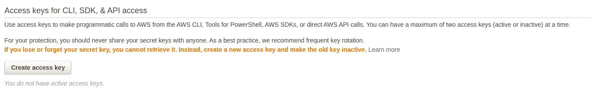
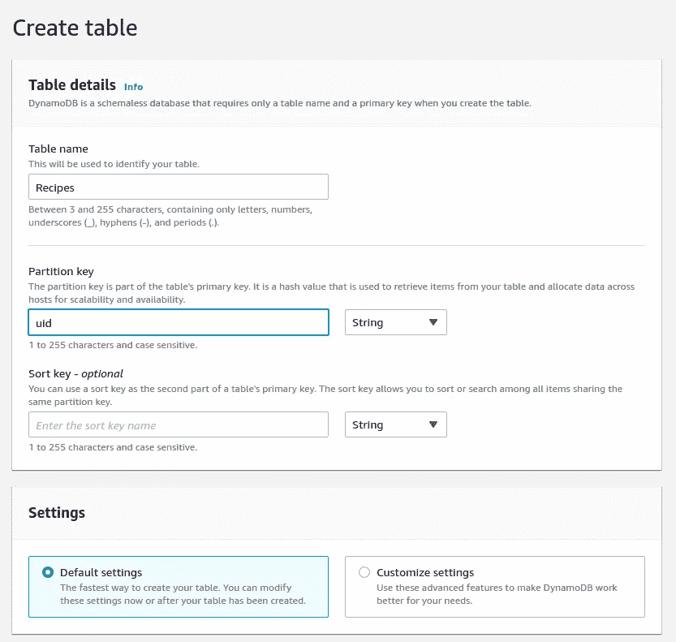
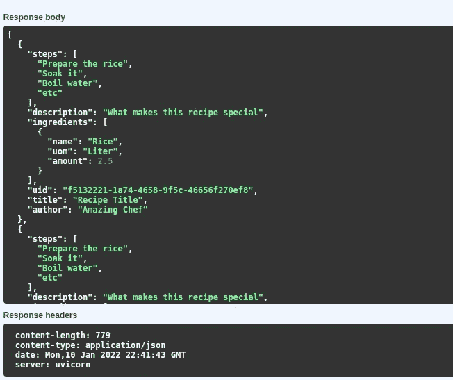

# 带有 AWS DynamoDB 的 Python FastAPI

> 原文：<https://medium.com/nerd-for-tech/python-fastapi-with-aws-dynamodb-931073a87a52?source=collection_archive---------1----------------------->

使用基于 NoSQL 的数据库 AWS DynamoDB 利用 FastAPI Web App

照片由[马库斯·温克勒](https://unsplash.com/@markuswinkler?utm_source=medium&utm_medium=referral)在 [Unsplash](https://unsplash.com?utm_source=medium&utm_medium=referral) 上拍摄

在本文中，我们将从使用本地 DynamoDB 转向使用云版本。总的来说，我们的代码没有什么需要改变的。但是有一点是肯定的，我们需要改变硬编码数据库的配置。显然，您不希望对敏感数据进行硬编码。

注意，本文是 FastAPI 和 AWS DynamoDB 系列的第二篇文章。如果你没有看过第一篇文章，你可以到这里:

[https://medium . com/nerd-for-tech/introduction-to-fastapi-and-local-dynamo db-595 c 990 ed 0 f 8](/nerd-for-tech/introduction-to-fastapi-and-local-dynamodb-595c990ed0f8)

# 设置访问键

在更改数据库配置之前，我们需要一个访问键。

首先，登录您的 AWS 帐户。单击包含您的 AWS 帐户名称的右上角。然后选择*安全凭证*。

之后，您将被重定向到 IAM 控制台管理。在 AWS IAM 凭据选项卡下方，您会看到一个标题为“创建访问密钥”的按钮。单击它，并确保下载包含您的访问密钥 id 和秘密访问密钥的 CSV 文件。

如果您丢失了访问密钥 id 和秘密访问密钥，您可以停用并删除旧的，然后创建一个新的。

到目前为止，我们已经有了访问密钥。现在，让我们创建一个 DynamoDB 表。

# 创建 DynamoDB 表

对于这个例子，我们将通过选择默认设置来简化事情。

然后点击*创建表格*。

# 更新代码

在项目的根目录下创建`.env`文件来存储我们的凭证。将这些值更改为前面生成的访问键，并指定在哪个区域创建了 DynamoDB 表。

现在，在`db.py`文件中更改我们的数据库配置。

在第 7 行和第 9 行，我们将包含`.env`文件的项目根目录存储为`base_dir`，然后加载它。

现在，让我们测试我们的应用程序。转到[http://localhost:5000/docs](http://localhost:5000/docs)访问我们的 API 文档。

您可以使用文档中的示例创建一个配方，然后获取所有配方。

# 结论

在上一篇文章中，我们着重于构建应用程序和使用本地 DynamoDB 进行开发。在您通过开发过程之后，您想要部署您的应用程序，但是由于某些原因，您应该使用云版本而不是本地版本。AWS DynamoDB 的功能将帮助您优化应用程序，减轻管理服务器的负担。

您可以在这里获得本文的完整代码[https://github . com/agusrichard/AWS-workbook/tree/master/fastapi-dynamo](https://github.com/agusrichard/aws-workbook/tree/master/fastapi-dynamo)

感谢您的阅读和快乐编码！

# 资源

 [## Python 和 DynamoDB 开发入门

### 在本教程中，您将使用 AWS SDK for Python (Boto3)编写简单的程序来执行以下 Amazon…

docs.aws.amazon.com](https://docs.aws.amazon.com/amazondynamodb/latest/developerguide/GettingStarted.Python.html)