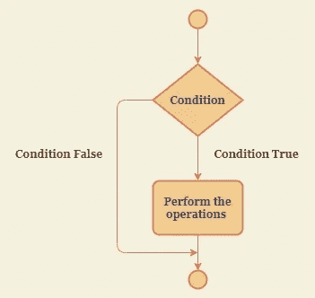
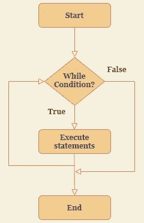
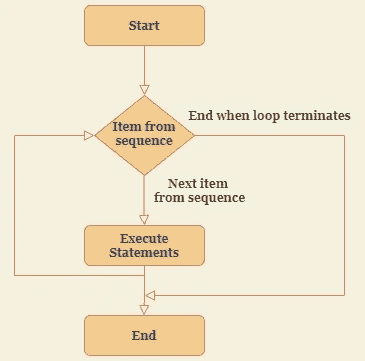

# 用于竞争性编程的 Python:初学者指南。

> 原文：<https://medium.com/nerd-for-tech/python-for-competitive-programming-a-beginners-guide-3e70ce34d26d?source=collection_archive---------10----------------------->

## 如何入门？它在哪里结束？迷茫？请继续阅读！！

马特·邓肯在 [Unsplash](https://unsplash.com/s/photos/start?utm_source=unsplash&utm_medium=referral&utm_content=creditCopyText) 上的照片

如果你最终决定投身于竞争性编程的世界，并看到前面有一条漫长的永无止境的道路。对你来说一切都势不可挡。不要担心，通常从竞争性编程开始会令人望而生畏。刚开始使用它的新手也会觉得它太难了。相信我，不是的。

Python 是最简单也是最强大的语言，你可以从它开始。只要对简单的条件语句、循环和基本的 python 数据结构有一个透彻的理解，就足以让你马上开始有竞争力的编程。

## Python 条件语句

Python 有**如果.. 否则如果..else** 条件块。

如果语句被检查，则条件出现在**中。如果计算结果为 true，则控制 id 传递给 If 块内的语句。如果计算结果为 false，则跳过 If 部分，并将控制权传递给 if 语句下面的顺序语句。**

## **Python 循环**

python 中的循环有 3 种类型:

1.  While 循环
2.  For 循环
3.  嵌套循环

考虑到某人刚刚开始学习竞争性编程，精通 while 和 for 循环将会让你走得很远。

**While 循环**

While 循环用于执行代码块，直到 while 循环的条件被评估为 true。

**为循环**

For 循环用于通过迭代可迭代对象的一系列语句来执行代码块。

## Python 数据结构

python 中最基本的内置数据结构有:

1.  目录
2.  元组
3.  一组
4.  词典

**列表**

List 是一个**异构**(能够存储不同的数据类型)，并且**可变**(数据可以改变)的数据结构。

列表是非常强大的数据结构，经常在竞争性编程中使用。对 list 的各种功能和方法有很好的认识。它们对于实现不同的代码逻辑非常方便。

**元组**

元组与列表相同，除了元组是**不可变的**，即数据不能改变。

元组比链表更有优势，它们比链表更快。需要时，在代码中明智地使用它们。

**设定**

集合类似于数学中的集合。它容纳了**无序的**、**独特的**元素在里面。套**可变**。

当需要独特的元素、交集、并集等时，集合在竞争性编程中非常方便。

**字典**

Dictionary 是保存 **{key:value}** 对中数据的数据结构。它们是**可变的**。

字典在合作伙伴关系中很有用。

**抬头:)**

以上只是使用 python 开始 CP 的路线图。这些数据结构的详细功能可以在 [**官方 python 文档**](https://docs.python.org/3/tutorial/datastructures.html) **中找到。**

在 CP 的各种在线平台上创建帐户，然后直接进入。

既然你都准备好了，最重要的是——练习，练习，再练习。相信我，没有什么能打败它，不管是什么语言。

一旦你很好地掌握了这些数据结构，开始学习用户定义的数据结构，如栈、队列、树、链表、图、散列表等。