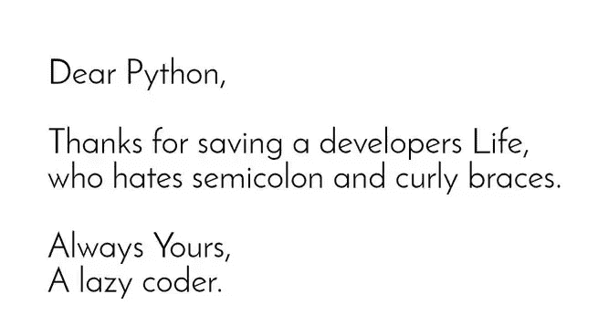
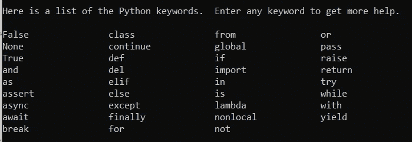
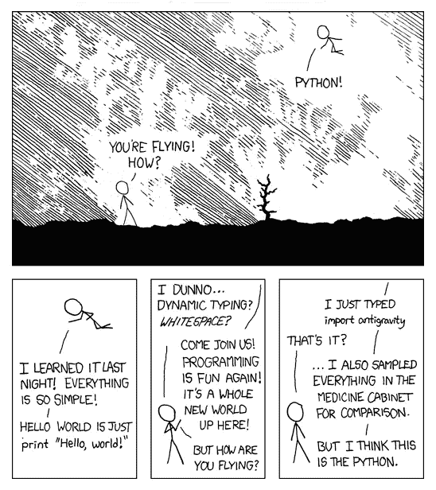

# ✨PYTHON 是新 C✨

> 原文：<https://medium.com/nerd-for-tech/python-is-the-new-c-bd0fe01cdc95?source=collection_archive---------3----------------------->

关于 PYTHON 语言你需要知道的一切🐍


[Unsplash](https://unsplash.com?utm_source=medium&utm_medium=referral) 上 [Hitesh Choudhary](https://unsplash.com/@hiteshchoudhary?utm_source=medium&utm_medium=referral) 的照片

**一般来说，蟒蛇在杀死戴夫·巴里方面比其他任何动物都在行**

各位读者好，本文完全是关于 Python 编程的，基本上是 Python 的**训练营**🐍。我试图包括尽可能多的我可以和抱歉没有包括一切因为我只是一个人毕竟。



现在最大的问题出现了 ***为什么选择 Python*** 🐍？

众所周知，所有语言之母是 C 语言。没有人可以否认，它是编程的基础，但随着时间的变化，一切都是如此。所以大多数的公司，开发者，(我😜)正在转向 Python 语言，原因如下:

1.  Python 语言对于**新手和新手**来说非常容易使用和学习。
2.  庞大的**开发者社区**。
3.  Python 编程语言得到了脸书、亚马逊网络服务，尤其是谷歌的大力支持。
4.  **巨蟒互助社区**。
5.  python 语言有许多**框架和库**。
6.  Python 语言**高效可靠**，比大多数现代语言都要快得多。
7.  可以在几乎任何一种环境下运行。
8.  可以做任何事情，比如**机器学习、数据科学、云计算、深度学习**和 E.t.c .

> **编写 Python 代码的乐趣在于看到简短、简洁、可读的类，它们用少量清晰的代码表达大量动作，而不是大量让读者厌烦致死的琐碎代码-** *Guido Van Rossum*

> **CONTENT :**
> 
> Python 简介:关键字、标识符、语句、注释和数据类型。
> 
> Python I/O、导入、操作符、名称空间和一些有用的函数。
> 
> 流量控制(回路和条件)。
> 
> Python 数据类型(列表、元组、字典、字符串)。
> 
> 使用序列进行索引和切片。
> 
> 异常处理(基础)
> 
> python 中的 dir()。
> 
> f 是 python 中的字符串。
> 
> 功能和模块。
> 
> 综合清单。
> 
> 迭代器和生成器。
> 
> Python 中的类和对象。
> 
> 闭包和装饰符。
> 
> 描述符和属性。
> 
> 红利:python 是解释的还是编译的？

> Python 是“你仍然可以阅读的最强大的语言”——保罗·杜布瓦


照片由[伊利娅·波什科夫](https://unsplash.com/@boshkov?utm_source=medium&utm_medium=referral)在 [Unsplash](https://unsplash.com?utm_source=medium&utm_medium=referral) 拍摄

# **Python 简介:关键字、标识符、语句、注释&数据类型。**

**Python** 是一种简单的、通用解释的、交互式的、高度可读的面向对象的高级编程语言。它是由吉多·范·罗苏姆在 1985- 1990 年间创造的。Python 源代码也可以在 GNU **通用公共许可证(GPL)** 下获得。

**Python 关键字**是保留字，不能用作常量、变量或任何其他标识符名称。所有 Python 关键字都只包含小写字母。



**Python 标识符**是用于标识变量、函数、类、模块或其他对象的名称。标识符以字母 A 到 Z 或 A 到 Z 或下划线(_)开头，后跟零个或多个字母、下划线和数字(0 到 9)。

例如，python 和 Python 是两种不同的标识符。

**Python 语句**是写在源代码中用于执行的指令。有多行语句:Python 中的语句通常以新的一行结束。然而，Python 允许使用行继续符(\)来表示行应该继续。

```
Using semicolons(;) :
flag = 0;Using Continuation Character (\):
sumo = 1 + 2 + 3 + \
       4 + 5 + 6
```

**Python 注释**是开发者为了让读者理解源代码而提供的有用信息。它解释了代码中使用的逻辑或部分逻辑。当你不再回答关于代码的问题时，注释通常对维护或增强你的代码的人有帮助。注释有两种类型:

单行注释 **:** Python 单行注释以不带空格(#)的 hashtag 符号开始，一直持续到行尾。

```
# I am a comment and you are a snake.
```

多行字符串作为注释 **:** Python 多行注释是一段文本，包含在注释两端的分隔符`(""")`中。

```
''' 
I am a comment 
and you are still a snake.
'''
```

由于在 Python 编程中一切都是对象， **Python 数据类型**实际上是类，变量是这些类的实例(对象)。

**Python 编号:**

整数、浮点数和复数都属于这一类。它们在 Python 中被定义为`int`、`float`和`complex`类。

**列表:**

这是一个有序的项目序列。它是 Python 中最常用的数据类型之一，非常灵活。列表中的所有项目不需要属于同一类型。

用逗号分隔的项目用括号`[ ]`括起来。

**元组:**

它是和列表一样的有序的项目序列。唯一的区别是元组是不可变的。元组一旦创建就不能修改。元组用于写保护数据，通常比列表快，因为它们不能动态改变。

它在圆括号`()`中定义，圆括号中的项目用逗号分隔。

**字符串:**

它是 Unicode 字符的序列。我们可以用单引号或双引号来表示字符串。多行字符串可以用三重引号、`'''`或`"""`来表示。

**设定:**

这是唯一项目的无序集合。集合由括号内逗号分隔的值定义`{ }`。器械包中的物品没有顺序。

**字典:**

Dictionary 是一个无序的键值对集合。

在 Python 中，字典被定义在大括号`{}`中，每个条目都是一对`key:value`形式的条目。键和值可以是任何类型。

# **2。Python I/O，Import，操作符，名称空间，以及一些有用的函数。**

像`input()`和`print()`这样的 Python 内置函数分别被广泛用于**标准 I/O** 操作。

我们可以**使用`import`语句导入一个模块**，并使用点运算符(.).这里有一个例子:

在 Python 中，可以说名称空间是您定义的每个名称到相应对象的映射。简单地说，名称空间是名称的集合。包含所有内置名称的名称空间是在我们启动 Python 解释器时创建的，只要解释器运行，它就存在。

这就是内置函数如`id()`、`print()`等的原因。在程序的任何部分都是可用的。每个模块都创建自己的全局名称空间。

下面是相同的基本 Python 函数，如 **len()、range()、list()、min()、max()、round()、abs()、pow()、strip()、split()、type()** 、e.t.c .这些函数是各种应用中非常常用的函数。

[***点击这里***](https://docs.python.org/3/library/functions.html) 了解 Python 中**内置函数**的全部内容。

# **3。流量控制(循环和条件)。**

可以说 F **low Control** —对执行代码“流程”的控制。它有能力决定下一步该做什么。

## 流量控制的类型:

Python 编程中最常用的流控制类型如下

最基本的流控制类型是简单的`if`语句:

```
x=3
**if** x==3:
   ** print**("x is equal to 3.")
**elif** x>3:
    **print**("x is greater than 3")
**else**:
    **print**("x is smaller than 3")
```

**另一个重要且最有用的流控制语句是循环:**

最简单的循环是一个`while`循环。一个`while`循环被给定一个条件并执行循环，直到条件为假。(如果条件为假，则不执行任何操作。)

```
a=1
**while a** > 0:
    print("I love chicken")
```

然而，最常见的循环是`for`。大多数语言都有`for`循环，只是在一些语法帮助下循环。Python `for`循环更加通用——它们通过*容器*循环。

```
**for** i **in** **range**(**5**):
      **print**(i)
```

另外，在循环中有两个有用的流控制语句*:*

`break`退出当前循环，并在它之后继续前进。例如:

```
**for** i **in** **range**(**100**):
  **if** i==**5**:
    **break**
**print**(i)
```

`continue`的工作方式类似，但是*不是逃离*循环，而是立即开始下一次迭代:

```
**for** i **in** **range**(**10**):
  **if** i==5:
    **continue**
  **print**(i)
```

要了解更多关于循环的信息，您可以查看这里的[](https://docs.python.org/3/tutorial/controlflow.html)**。**

# **4.Python 数据类型(列表、元组、字典、字符串)。**

**我们已经在本文的上面看到了这些 Python 数据类型，但是现在我们来看它的详细实现:**

****Python 中的列表** :
列表就像其他语言中声明的数组一样。但最重要的是，列表不必总是同质的。单个列表可以包含字符串、整数以及对象。列表也可以用于实现堆栈和队列。列表是可变的，也就是说，一旦声明，它们就可以被改变。**

```
 L = [1, “a” , “string”] 
print L 
```

****Python 中的元组:**
元组是不可变的 Python 对象的序列。元组就像列表一样，只是元组一旦声明就不能更改。元组通常比列表快。**

```
tupl = (1, “a”, “string”) 
print(tupl)
```

****Python 中的字典:**
在 Python 中，字典类似于其他语言中的 hash 或 maps。它由键值对组成。该值可以通过字典中的唯一键来访问。**

```
 d = dict() # or d = {}# Add a key — value pairs to dictionary 
d[‘xyz’] = 123
d[‘abc’] = 345
print d 
```

****Python 中的字符串:**
字符串是一个字符序列。可以使用双引号(" ")在 python 中声明它。字符串是不可变的，即它们不能被改变。**

```
str = “This is a string and you are merely a snake”
print (str)
```

****

**由 [Roman Synkevych](https://unsplash.com/@synkevych?utm_source=medium&utm_medium=referral) 在 [Unsplash](https://unsplash.com?utm_source=medium&utm_medium=referral) 上拍摄**

> **[人生苦短(你需要 Python)](https://www.inspiringquotes.us/quotes/eSW0_uhqpv7Ff)
> ——[**布鲁斯·埃凯尔**](https://www.inspiringquotes.us/author/9711-bruce-eckel)**

# **5.用序列进行索引和切片。**

**Python 最好的部分是这个**索引和切片**在 Python 中，字符串数据类型是由一个或多个单独的字符组成的序列，这些字符可以由字母、数字、空白字符或符号组成。**

****索引**是指通过一个可迭代的元素在可迭代中的位置来引用它。字符串的每个字符都对应一个索引号，每个字符都可以使用它们的索引号来访问。**

```
# declaring the string 
str = “I told you earlier that You are a Snake!”# accessing the character of str at 0th index 
print(str[0])# accessing the character of str at 6th index 
print(str[6])
```

**python 中的字符串支持**索引和切片**。要从字符串中提取单个字符，请在字符串后面用方括号([ ])括起所需字符的索引，记住字符串的第一个字符的索引为零。**

****python 中切片的语法:****

```
string[start : end : step]
start : the starting index.
end : the end index(this is not included in substring).
step : It is an optional argument.#For Example:
str =”Python is a snake just like you!”# slicing using indexing sequence 
print(str[: 3]) 
print(str[1 : 5 : 2]) 
```

**要了解更多关于索引和切片的信息，请点击这里。**

# **6.异常处理(基础)。**

**在 Python 中，错误可以是一个**语法错误**或者一个**异常。****

**错误是程序中的问题，由于这些问题，程序将停止执行。然而，当一些改变程序正常流程的内部事件发生时，就会引发异常。**

**下面是处理简单运行时错误的简单程序，因为列表中没有第三个元素。**

# **7.python 中的 dir()。**

****dir()方法**试图返回对象的有效属性列表。**

## **从 dir()返回值:**

**`dir()`试图返回**一个对象**的有效属性列表。**

*   **如果对象有`__dir__()`方法，该方法将被调用，并且必须返回属性列表。**
*   **如果对象没有`__dir__()`方法，这个方法试图从`__dict__`属性(如果定义的话)和类型对象中寻找信息。在这种情况下，返回的列表`dir()`可能不完整。**
*   **如果一个对象没有被传递给`dir()`方法，它返回当前局部范围内的名字列表。**

```
class Person:
  def __dir__(self):
    return ['age', 'name', 'salary']

teacher = Person()
print(dir(teacher))# o/p: ['age', 'name', 'salary']
```

# **8.python 中的 f 字符串。**

****字符串格式化**使用特定编程语言提供的格式化技术来设计你的字符串。**

****f 字符串**在程序的**运行时**求值。与以前的方法相比，它很快。**

****f-string** 与之前的 *Python* 的字符串格式化技术相比，具有更简单的语法。我们将使用不同的例子来探究这种格式的每一点。**

**也称为“**格式化的字符串文字**”，f-string 是在开头有一个`f`的字符串文字，花括号包含将被其值替换的表达式。表达式在运行时被求值，然后使用`__format__`协议格式化。一如既往, [Python 文档](https://docs.python.org/3/reference/lexical_analysis.html#f-strings)将帮助您了解更多。**

# **9.功能和模块。**

**一个**功能**是一个有组织的、可重用的代码块，用于执行一个相关的动作。**

**正如本文前面所讨论的，我们有**内置函数**，我们甚至可以创建我们自己的函数，称为**用户定义函数。****

**功能块以关键字 **def** 开始，后跟功能名和括号(())。**

****语法:****

```
def function_name( parameters ):
   function_body
   return [expression]
```

**一个**模块**允许你逻辑地组织你的 Python 代码。模块是一个 Python 对象，具有可以绑定和引用的任意命名的属性。**

**一般来说，模块是由 Python 代码组成的文件。模块可以定义函数、类和变量。模块也可以包含可运行的代码。**

# **10.列出理解。**

****列表理解**是一种基于现有列表定义和创建列表的优雅方式。**

****示例**:使用列表理解遍历字符串**

```
h_letters = [ letter for letter in 'human' ]
print( h_letters)
```

**当我们运行程序时，输出将是:**

```
['h', 'u', 'm', 'a', 'n']
```

## **列表理解的语法:**

```
[expression for item in list]
```

# **11.迭代器和生成器。**

**一个 **Python 生成器**函数借给我们一个 Python 迭代的值序列。**

```
>>> def even(x):
       while(x!=0):
           if x%2==0:
                 yield x
              x-=1
>>> for i in even(8):
               print(i)Output: 
8
6
4
2
```

**Python 迭代器返回给我们一个迭代器对象——一次一个值。**

```
>>> iter_obj=iter([3,4,5])
>>> next(iter_obj)
```

**3**

```
>>> next(iter_obj)
```

**4**

# **12.Python 中的类和对象。**

**python 是一种面向对象的编程语言。不像 C 这样的面向过程的编程语言，主要强调的是函数，面向对象的编程强调的是对象。**

**在 Python 中，类定义以一个 **class** 关键字开始。一个**类**是一个用户定义的蓝图或原型，从这里创建对象。一个**对象**是一个类的实例。一个类就像一个蓝图，而一个实例则是一个带有*实际值*的类的副本。**

# **13.闭包和装饰器。**

****闭包**是一个嵌套函数，它可以从已经完成执行的封闭函数中访问自由变量。Python 闭包的三个特征是:**

*   **它是一个嵌套函数。**
*   **它可以访问外部作用域中的自由变量。**
*   **它是从封闭函数返回的。**

```
 def outerFunction(text): 
 text = textdef innerFunction(): 
  print(text) return innerFunctionif __name__ == '__main__': 
 myFunction = outerFunction('Hey!') 
 myFunction()
```

**Python 有一个有趣的特性，叫做**decorator**，用于向现有代码添加功能。**

**这也被称为**元编程**，因为程序的一部分试图在编译时修改程序的另一部分。**

```
 def hello_decorator(): 
 print(“Gfg”)‘’’Above code is equivalent to -def hello_decorator(): 
 print(“Gfg”) 

hello_decorator = gfg_decorator(hello_decorator)’’’
```

# **14.Python 中的描述符。**

****描述符**是 Python 对象，它实现了**描述符协议**的一种方法，这种方法使您能够创建在作为其他对象的属性被访问时具有特殊行为的对象。**

```
__get__(self, obj, type=None) -> object
__set__(self, obj, value) -> None
__delete__(self, obj) -> None
__set_name__(self, owner, name)
```

**如果你的描述符只实现了`.__get__()`，那么它就是一个**非数据描述符**。如果它实现了`.__set__()`或`.__delete__()`，那么它就是一个**数据描述符**。请注意，这种差异不仅仅是名称上的，也是行为上的差异。**

> **python 是解释的还是编译的？**

**众所周知，Python 语言是一种解释型语言。但是这是对的一半，因为 python 程序首先被编译，然后被解释。编译部分对程序员来说是隐藏的，因此，许多程序员认为它是一种解释型语言。当我们执行代码时，首先完成编译部分，这将生成字节码，在内部，这个字节码由 python 虚拟机(p.v.m)根据底层平台(机器+操作系统)进行转换。**

****

**感谢阅读😇**