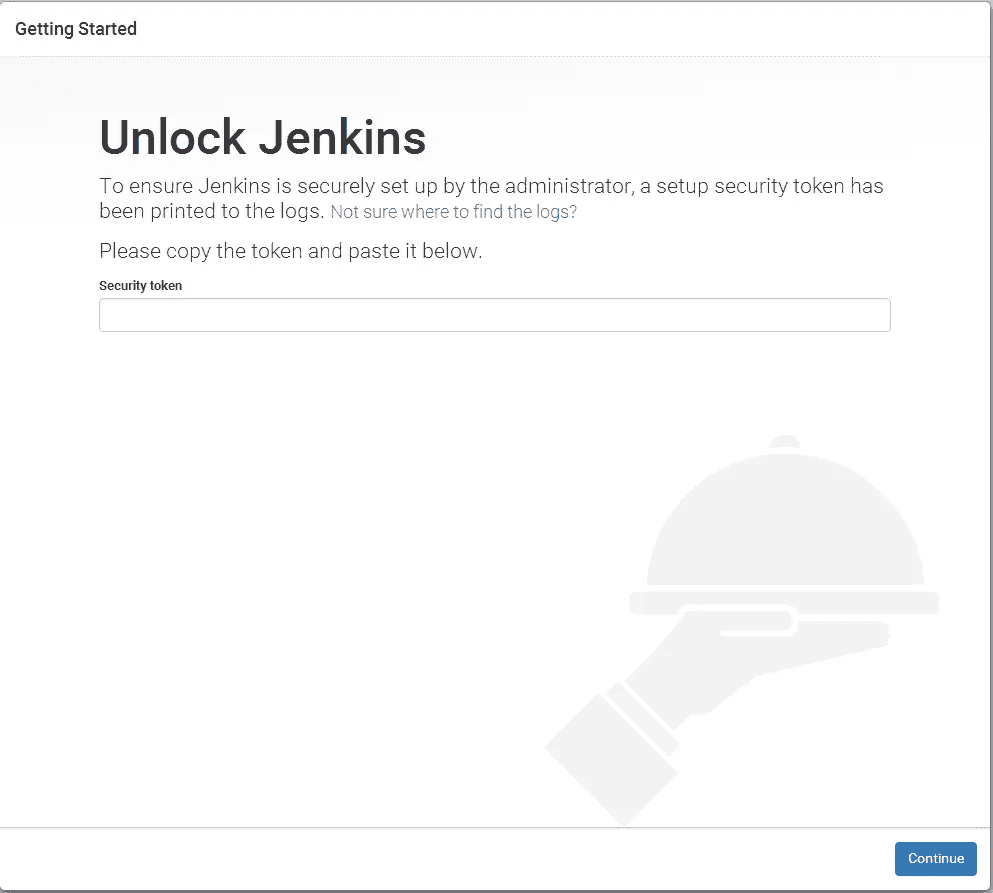
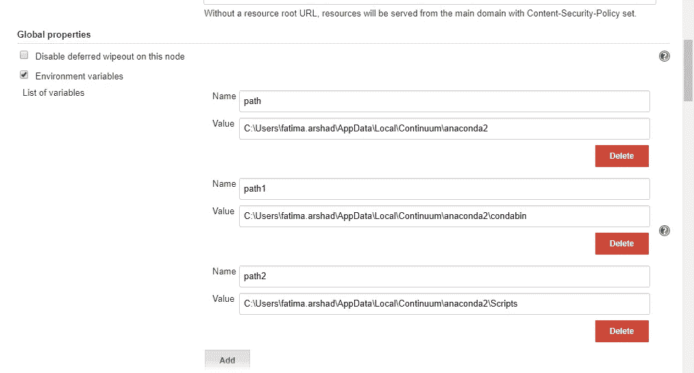
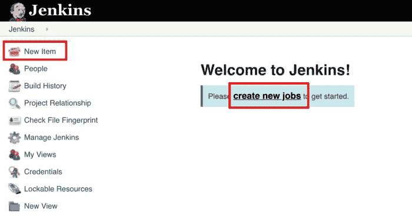
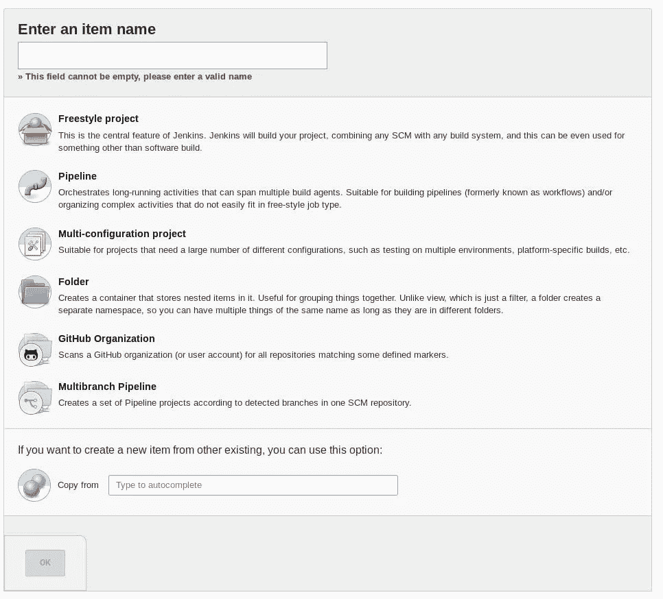
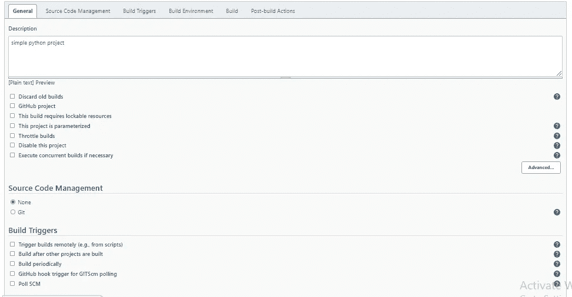
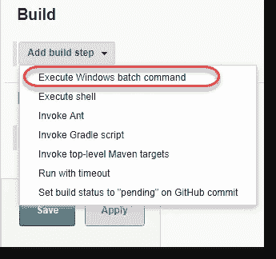
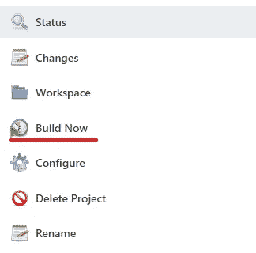
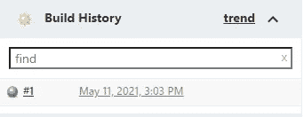
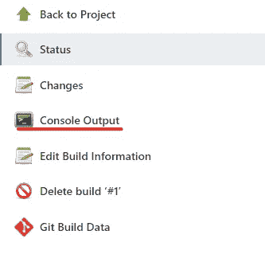

# 使用 Jenkins 构建 Python

> 原文：<https://medium.com/nerd-for-tech/python-job-using-jenkins-35dd0afa396b?source=collection_archive---------1----------------------->


在这个故事中，我们将了解如何安装 Jenkins，以及如何在 Jenkins 中运行 python 作业。

# 装置

1.  你可以直接从他们的官方网站安装 jenkins，会有一个名为 **jenkins.war** 的文件下载那个文件。
2.  下载后，打开您的命令提示符，并将其定向到您保存 jenkins.rar 文件的文件
3.  然后运行以下命令 **java -jar jenkins.war**
4.  在那之后，你可以看到它加载了如此多的文件，并且在那个副本中将会有一个密码
5.  打开你的浏览器并粘贴链接或者简单地输入 **localhost:8080** 并点击回车
6.  它会向您显示类似这样的东西，您必须粘贴您复制的密码，并在所有插件安装完毕后按 enter 键。

**注意:不要关闭命令提示符**



# 为 python 定义环境变量

管理 Jenkins →全局工具配置→并为 python 设置路径



# 创建新项目

在你的电脑上创建一个 python 文件，在里面写一些代码，然后按照下面的步骤操作



单击新项目，它将显示以下选项卡



输入您的项目名称，并将其保存为一个自由式项目，之后，您必须配置该项目



你必须给出一些描述，然后点击**添加构建**并选择提到的那个



在里面给出下面的命令

```
SET PATH = %your_path_name%python your_file_location\filename.py
```

# 建设

保存之后，运行构建，蓝色圆圈表示构建成功。单击该建筑并检查控制台，您输出将在那里



建设



安慰

# Python 插件

不使用窗口终端，我们可以通过安装 python 插件直接使用 python 终端。

管理 jenkins →管理插件→可用→搜索 python 并安装


之后，配置项目中的添加构建选项将类似于


您可以直接在那里编写和构建您的代码！