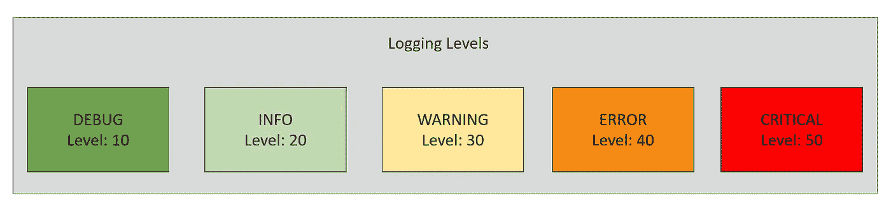
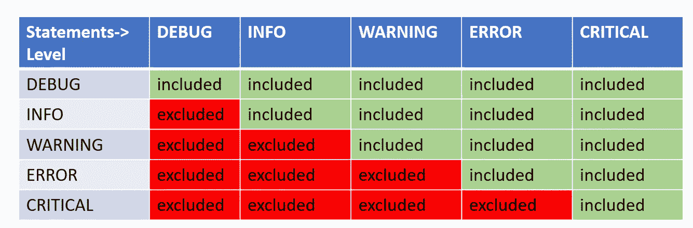
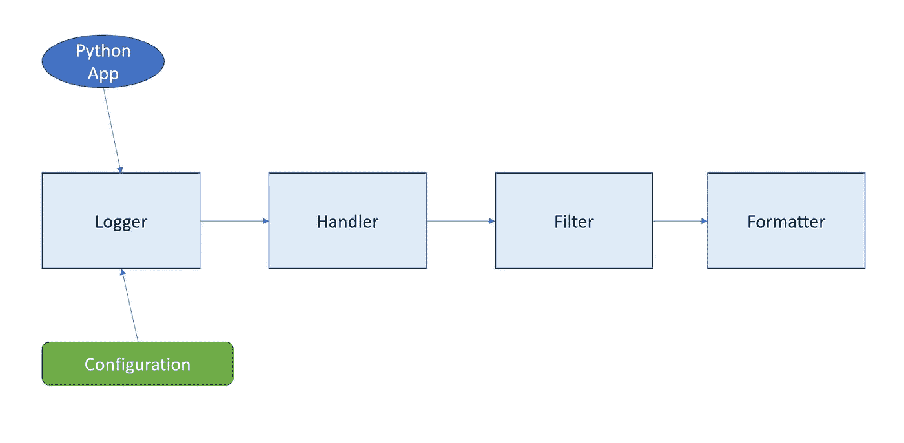

# Python 日志记录-简化

> 原文：<https://medium.com/nerd-for-tech/python-logging-simplification-e24824a748f9?source=collection_archive---------0----------------------->


图片来源:谷歌

日志记录是应用程序用来与受众交流的模式。任何交流(记录)的关键是考虑你的受众和他们的需求。这就是为什么我们为不同受众(开发人员、系统管理员等)提供不同的日志级别。



在 Python 的日志模块中，我们有以下**日志级别:**

> ***调试*** *—细粒度的应用流消息，如内部对象的转储*
> 
> ***INFO*** *—粗粒度的应用流程，如状态变化。*
> 
> ***警告*** *—可能导致问题的事情。*
> 
> ***错误*** *—对操作致命(可恢复)的东西，而不是应用/程序本身。*
> 
> ***严重*** *—需要立即注意的程序或系统故障*

> 调试< INFO < WARNING < ERROR < CRITICAL



Each message or log record should have time stamp, contextual information, actual message and log level. Let us see how to correctly setup logging in a python application to include those. The recommended way is to use config files to set the logging configuration. Below example just show how we can load a YAML based config file and then start logging in our app.

```
import logging
import logging.config
import os
import yamlDEFAULT_LEVEL = logging.INFOdef log_setup(log_cfg_path='cfg.yaml'):
    if os.path.exists(log_cfg_path):
        with open(path, 'rt') as cfg_file:
            try:
                config = yaml.safe_load(cfg_file.read())
                logging.config.dictConfig(config)
            except Exception as e:
                print('Error with file, using Default logging')
                logging.basicConfig(level=default_level)
    else:
        logging.basicConfig(level=default_level)
        print('Config file not found, using Default logging')#set up logging configuration
log_setup()# create logger
logger = logging.getLogger('dev')logger.debug('debug message')
logger.info('info message')
logger.warning('warn message')
logging.error("error message")
logger.critical('critical message')
```

Check out the attributes supported by log record :
[https://docs . python . org/3/library/logging . html # log record-attributes](https://docs.python.org/3/library/logging.html#logrecord-attributes)

**日志记录:**

> ***名称*** —用于记录事件的记录器的名称
> 
> ***级别*** —记录事件的数字级别，这被转换为*两个*属性`levelno` (10，20，30)和`levelname`(调试，信息)
> 
> ***路径名*** —进行日志记录调用的源文件的路径名。
> 
> ***行号*** —源文件中进行记录调用的行号。
> 
> ***消息*** —实际消息，带占位符。
> 
> ***args*** —将变量数据合并到 *msg* 参数中，以获得事件描述。
> 
> ***exc_info*** —异常信息
> 
> ***func*** —发出记录调用的函数的名称。
> 
> ***sinfo*** —从当前线程中堆栈的底部开始，直到日志调用的堆栈信息。

在记录消息或设置日志格式时，可以使用上述属性。

日志配置有几个组件，如记录器、处理程序、过滤器和格式化程序。

> ***记录器*** —应用代码使用的 api。
> 
> ***处理程序*** 将日志记录重定向到适当的目的地。
> 
> ***按名称过滤*** 根据定义过滤出日志记录
> 
> ***格式器*** 指定输出中日志记录的格式/布局。



上图描述了日志记录的流程。我没有包括传播，如果存在的话，它是递归完成的。

让我们看看 cfg.yaml 的内容，检查这些组件是如何使用的。

```
version: 1disable_existing_loggers: trueformatters:
  extended:
    format: '%(asctime)-20s :: %(levelname)-8s :: [%(process)d]%(processName)s :: %(threadName)s[%(thread)d] :: %(pathname)s :: %(lineno)d :: %(message)s'
  simple:
    format: "%(asctime)s :: %(name)s :: %(message)s"handlers:
  console:
    class: logging.StreamHandler
    level: DEBUG
    formatter: simple
    stream: ext://sys.stdout file_handler:
    class: logging.FileHandler
    filename: my_app.log
    formatter: extended
    level: INFO
    propagate: false

loggers:
  dev:
    handlers: [console, file_handler]
  prod:
    handlers: [file_handler]

root:
  level: DEBUG
  handlers: [console]
```

在上面的 YAML 中，我们没有过滤器，但可以设置如下:

```
filters:
  infoFilter:
    (): logging.filters.infoFilter
```

然后在日志设置中添加以下代码:

```
class infoFilter(logging.Filter):
    def filter(self, log_record):
        return log_record.levelno == logging.INFO
```

伐木快乐！！