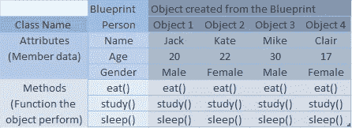
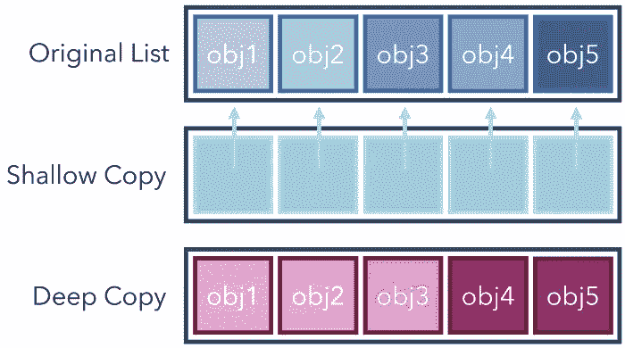

# Python 面向对象编程

> 原文：<https://medium.com/nerd-for-tech/python-object-oriented-programming-5a9950d15e48?source=collection_archive---------8----------------------->

## 我的数据科学之旅(第 4.1 部分)

面向对象编程是指使用对象而不仅仅是函数和方法定义的编程范式。对象包含数据，称为属性和方法(行为)。


照片由 [Unsplash](https://unsplash.com?utm_source=medium&utm_medium=referral) 上的 [Clément Hélardot](https://unsplash.com/@clemhlrdt?utm_source=medium&utm_medium=referral) 拍摄

# 类别和对象

类是创建对象的代码模板或蓝图。类为创建的对象提供属性和方法。类是一个逻辑实体，在运行时不消耗内存。

对象是指在执行期间从类创建的运行时实例。对象被认为是真实世界的实体。对象在创建时会消耗内存。

属性:属性是所有实例共享的类的变量

方法:方法是一个对象执行的函数



# 创建一个类

```
class Student:
  def __init__(self,Name,Age,Gender):
    self.Name=Name
    self.Age=Age
    self.Gender=Gender

  def eat(self):
    print("{} is eating".format(self.Name))

  def study(self):
    print("{} is studying".format(self.Name)) def sleep(self):
    print("{} is sleeping".format(self.Name))
--------------------------------------------------------------------Creating an object
obj_1=Student("Jack",20,"Male")obj_1.eat()
→Jack is eating
```

**构造函数**:构造函数是 python 在对象初始化时调用的一种特殊方法。初始化类时，它将实例变量赋给对象。实例变量是属于特定实例(对象)的变量。更改对象 2 的实例变量不会影响对象 1 的实例变量

当 obj_1 被创建时，调用 __init__ 方法，它将变量(Jack，20，Male)赋给对象(obj_1)

**Self**:Self 关键字用来表示类的实例

```
obj_1=Student("Jack",20,"Male")
obj_2=Student("Kate",22,"Female")
```

这里两个对象(obj_1，obj_2)有他们的名字、年龄和性别。这是可能的，因为有 self 关键字。每个对象都有自己的实例变量

如果 self 被省略，那么所有创建的对象将具有相同的变量

self 关键字作为方法中的参数传递，以便该方法可以访问这些属性

所以自我对于 obj_1 →是 obj_1

obj_1.eat()与 Student.eat(obj_1)相同

注意:对于方法 eat()有 1 个已定义的参数，但是调用时没有给定参数(obj_1.eat())，因为这与(Student.eat(obj_1))相同

# 变量(属性)

类中定义了两种类型的变量

1.  实例变量
2.  静态变量

**实例变量:**实例变量归类的每个对象所有。每个对象都有自己的变量，可以单独更改(特定对象的变量)。它是在 __init__ 方法中定义的。对象只能调用这些变量。

```
print(obj_1.Name)→Jack
print(obj_2.Name)→Kate
```

**静态变量或类变量:**类拥有的变量。所有对象通用的变量。它是在 __init__ 方法(构造函数方法)外部定义的。这些变量可以由对象和类调用

```
class Student:
  Stream="CSE"                         #Class Variable
  def __init__(self,Name,Roll):
    self.Name=Name                     #Instance Variable
    self.Roll=Roll                     #Instance Variablea=Student("A",1)
b=Student("B",2)
print(a.Name)→A
print(b.Name)→B
print(a.Roll)→1
print(b.Roll)→1
print(a.Stream)→CSE
print(b.Stream)→CSE print(Student.Stream)→CSE#Class varible can be updated for each object 
a.Stream="Mech"print(a.Stream)→"Mech"
print(b.Stream)→"CSE"
print(Student.Stream)→"CSE"#Class variable canged for all instance
Student.Stream="Prod"print(a.Stream)→"Prod"
print(b.Stream)→"Prod"
print(Student.Stream)→"Prod"
```

# 方法

3 种方法

1.  实例方法
2.  分类方法
3.  静态方法

**实例方法:**实例方法是可以访问实例变量的方法。在上面的例子中，eat()、sleep()、study()都是实例方法，因为它们可以访问实例变量。Instance(self)作为 Instance 方法中的第一个参数传递。

实例方法可以分为访问器方法和赋值器方法

1.  访问器方法:获取实例变量的实例方法
2.  Mutator 方法:修改特定对象的实例变量的实例方法

**类方法:**类方法是绑定到类的方法。它不需要创建对象来访问该方法。类方法用于访问类变量。Class(cls)作为 Class 方法中的第一个参数传递。类方法可以访问和修改类状态

**静态方法:**静态方法不接受任何隐式参数(例如 self 或类的 cls)。静态方法也属于类而不是对象，但是与类方法不同，静态方法不能改变类的状态。静态方法对该类一无所知。

```
class Student:   
  school="xyz"                                  #Class Variable def __init__(self,name,roll):                 #Constructor Metod
    self.name=name                              #Instance Variable
    self.roll=roll                              #Instance Variable def display(self):                            #Instance Metod
    print("name is {} and roll is{}".format(self.name,self.roll)) @classmethod
  def info(cls):                                 #Class Method
    return cls.school @staticmethod                                  #Static Method
  def isAdult(age):
    if age>18:
      return "yes"
    else:
      return "no"--------------------------------------------------------------------
o1=Student("Jack",1)o1.display()                                     #Instance Method
name is Jack and roll is 1**Student.display(o1)  #class name can be used to call instance method
name is Jack and roll is 1**Student.info()                                   #Class Method
xyz**o1.info()  #object can be used to get the class method also
xyz**Student.isAdult(20)                              #Static Method
yes**o1.isAdult(20)  #object can be used to get the static method also
yes**-------------------------------------------------------------------o1.name                                          #Accessor
Jacko1.name="Mike"                                   #Mutator
o1.name
Mike
```

# 遗产

继承允许我们定义一个从另一个类继承所有方法和属性的类。父类是被继承的类，也称为基类。子类是从另一个类继承的类，也称为派生类。

为了创建子类，父类作为参数被发送给子类。

```
class Person:
  def __init__(self,fname,lname):
    self.fname=fname
    self.lname=lname

  def display(self):
    print(self.fname,self,lname)x=Person("Jack","Doe")
x.display
Jack Doe
--------------------------------------------------------------------
class Student(Person):
  passy=Student("Mike","olson")
y.display
Mike olson
```

Class Student 继承了 Person 的所有属性和方法

如果 __init__ 被添加到 student 类，则 student 类将不再从父类继承。学生类的 __init__ 方法覆盖了父类的 __init__ 方法。

```
class Student(Person):
  def __init__(self,roll,marks):
    self.roll=roll
    self.marks=marks
# This class can no longer inherit from the parent class Person
```

为了使子类继承父类，使用了 super()函数。

```
class Student(Person):
  def __init__(self,fname,lname,roll,marks):#Constructor for Student
    super().__init__(fname,lname)           #Constructor for Person
    self.roll=roll
    self.marks=marks
```

子类构造函数应该包含子类和父类的参数。super()仅用于继承父类属性。

# 多重遗传

## 多重遗传

```
class Parent1:
    -
class Parent2:
    -class Child(Parent1, Parent2):
    -
```

## 多级遗传

```
class Parent:
    -class Child(Parent):
    -

class Child2(Child):
    -
```

## 方法解析顺序

MRO 是一个用于继承的概念。它是在类层次结构中搜索方法的顺序。

在多重继承的情况下，首先在当前类中搜索任何指定的属性。如果没有找到，则搜索继续以自下而上和自左向右的方式进入父类，而不搜索相同的类两次。

```
class A:
  def display(self):
    print("class A method")class B:
  def display(self):
    print("class B method")class C(A,B):
  def info(self):
    print("class C method")x=C()
x.display()
class A methodif 
class C(B,A):
  def info(self):
    print("class C method")x=c()
x.display()
class B method
```

# 装修工

python 中的设计模式允许用户在不改变结构的情况下向现有对象添加新功能。

在 python 中，函数被认为是一级的

## 一级属性

*   函数是对象:函数可以赋给变量

```
def display(text):
  return(text)display(abc)
abcx=display(abc)               #assignig function to a variable
print(x)
abc
```

*   函数可以作为参数传递给其他函数:

```
def a(text):
  return textdef b(x):
  print(x)b(a(2))
2
```

*   函数可以返回函数

```
def a(x):
  def squared(): 
    return x*x
  return squared()a(2)
4
```

## 关闭

内部函数可以访问外部函数的参数。在上面的例子中，内部函数(squared)不接受任何参数，但是外部函数接受参数 x

```
def main_welcome(msg): 
  def sub_welcome():
    print("Hello")
    print(msg)
    print("Bye")
  return sub_welcome()main_welcome("how are you")
Hello 
how are you 
Bye
```

关闭

```
def main_welcome(msg): 
  def sub_welcome():
    print("Hello")
    print(msg)
    print("Bye")
  return sub_welcome x=main_welcome("how are you")
print(x())
Hello 
how are you 
Byedef multiplier(x): 
  def multiply(y):
    return x*y
  return multiplyx=multiplier(3)
print(x(2))
6 
```

Clousers 是一个函数对象，它会记住封闭范围(外部函数)中的值，即使它不在内存中

```
def main_welcome(text): 
  def sub_welcome():
    print("Hello")
    print(text)
    print("Bye")
  return sub_welcomex=main_welcome("how are you")
del main_welcome
x()Hello 
how are you 
Bye
```

在上面的例子中，x 存储了内部函数的状态，并且即使在删除了外部函数之后也能够运行

可以接受其他函数的函数称为高阶函数

```
def main_welcome(func):
  def sub_welcome():
    print("Hello")
    func()
    print("Bye")
  return sub_welcomedef display():
  print("How are you")x=main_welcome(display)
x()Hello 
How are you 
Bye
--------------------------------------------------------------------def main_welcome(func):
  def sub_welcome():
    print("Hello")
    func()
    print("Bye") 
  return sub_welcome()      # **parenthesis returns the called          
                              function(return the result), without 
                              parenthesis function is returned**def display():
  print("How are you")x=main_welcome(display)
x                           # **since the return sub_welcome() returns 
                              the result, x is called x insted of 
                              x()**
```

括号返回被调用的函数(返回结果)，不带括号的函数返回

## 装修工

```
def main(func):
  def sub():
    print("1")
    print("2")
    func()
  return subdef qq():
  print("3")--------------------------------------------------------------------
main(qq)()
1
2
3z=main(qq)
z()
1
2
3@main
def qq():
  print("3")
qq()
1
2
3
--------------------------------------------------------------------
def main(func):
  def sub(a,b):
    print("1")
    print("2")
    func()def qq(a,b):
  return a*bmain(qq)(2,3)      # passing the qq function in the main, then 
1                    passing the parameters for qq in sub
2z=main(qq)
z(2,3)
1
2@main
def qq(a,b):
  return a*b
qq(2,3)
1
2# The function qq is not being printed--------------------------------------------------------------------# To print the qq function the function is assgined to a variable then printed def main(func):
  def sub(a,b):
    print("1")
    print("2")
    val=func(a,b)
    print(val)
  return subdef qq(a,b):
  return a*bmain(qq)(2,3)
1
2
6@main
def qq(a,b):
  return a*b
qq(2,3)
1
2
6
```

# 公共、私有和受保护的变量

```
self.name=   → public
self._name=  → protected
self.__name= → private
```

Public:变量可以在任何地方访问

Protected:可以在类内访问，也可以通过从父类继承来访问。

Private:不能访问或修改。变量是初始设置的。不能在函数外部修改或访问它。

在 python 中，Public、Private 和 Protected 只是给开发者的提示。例如，私有变量不阻止访问或修改。它仍然可以被访问或更改。这只是表明这个变量是私有的，所以不要改变或访问它。

# 邓德方法或魔术方法

有两个前缀和后缀的方法加下划线。这些方法在没有被调用的情况下被初始化，例如 __init__，__add__，__str__。这些方法并不意味着被直接调用，而是从类内部调用，例如，将两个数相加。

```
1+2
3a=1
b=2
a.__add__(b)
3
```

当添加 2 个数字时，内部调用 __add__()方法

dir()函数显示了继承的魔法方法列表。Dunder 方法主要用于改变预定义的行为。

# 多态性

多态性是单个实体(方法、对象或操作符)在不同场景中表示不同类型的能力。

例如，len()函数在给定字符串输入时返回字母的数量，在给定列表作为输入时返回元素的数量，在给定字典时返回键的数量

"+"运算符在输入中给定一个数字时将两个数字相加，在给定一个字符串时将字符串连接起来。

## 运算符重载

运算符重载会更改方法的预定义行为，例如+运算符调用。__add__()方法将两个数字相加或连接两个字符串。+运算符不能添加两个类对象，因此可以重载+运算符来添加该类的两个对象。

```
class S:
def __init__(self,M):
  self.M=M
def __add__(self,other):
  add=self.M+other.M
  return adds1=S(9)                         #2 objects
s2=S(5)s1+s2
14s1.__add__(s2)
14S.__add__(s1,s2)
14in def __add__(self,other)  self is s1 and other is s2 
```

## 方法重载

默认情况下，Python 不支持方法重载

方法重载是指一个类有两个同名但参数不同的方法

```
def prod(a,b):
  return a*bdef prod(a,b,c):
  return a*b*c
```

python 只接受最新定义的方法。所以 prod(2，1，4)可以工作，但是 prod(1，2)不行

在 python 中有两种方法可以实现这个函数

*   使用*参数

```
def prod(*args):
  p=1
  for x in args:
    p=p*x
  return pprod(1,2)
2prod(1,2,3)
6prod(1,2,3,4)
24
```

*   多重调度装饰器

```
@dispatch(int,int)
def prod(a,b):
  return a*b@dispatch(int,int,int)
def prod(a,b,c):
  return a*b*cprod(1,2)
2prod(1,2,3)
6
```

多分派装饰器根据调用的参数在几个函数体中选择运行。

## 方法覆盖

当子类中的方法与其超类中的方法具有相同的名称、相同的参数时，那么子类中的方法被认为覆盖了超类中的方法。

```
class A:
  def display(self):
    return "Method A"
class B(A):
  passx=B()
x.display()
Method A
--------------------------------------------------------------------
class A:
  def display(self):
    return "Method A"
class B(A):
  def display(self):
    return "Method B"x=B()
x.display()
Method B
```

# = vs copy() vs deepcopy()

```
lst1=[1,2,3,4]
lst2=lst1
lst2
[1,2,3,4]id(lst1)
140632842905872id(lst2)
140632842905872
#memory location
```

两个变量 lst1 和 lst2 代表相同的内存位置，因此一个变量的变化会影响另一个变量

## 。复制()

也叫浅抄。浅层复制不会复制每个元素的值。相反，它们引用 lst1 中每个值的存储位置。

```
lst1=[1,2,3,4]
lst2=lst1.copy()id(lst1)
140632842905152id(lst2)
140632842449936print(id(lst1[0]))
print(id(lst2[0]))94269450803712 
94269450803712
--------------------------------------------------------------------
Note if values are changed in lst1 lst2 is not affected
lst1[0]=0lst1
[0,2,3,4]lst2
[1,2,3,4]print(id(lst1))
print(id(lst2))140182184495536 
140182184530480print(id(lst1[0]))
print(id(lst2[0]))94269450803680 
94269450803712
--------------------------------------------------------------------
lst2 refereces each element to lst1 this can be clearly seen in nested listlst1=[[1,2,3],[4,5,6]]
lst2=lst1.copy()lst1[0][0]=0print(lst1)
print(lst2)[[0, 2, 3], [4, 5, 6]] 
[[0, 2, 3], [4, 5, 6]]
--------------------------------------------------------------------
lst1=[[1,2,3],[4,5,6]]
lst2=lst1.copy()lst1.append([7,8,9])print(lst1)
print(lst2)[[1, 2, 3], [4, 5, 6], [7, 8, 9]] 
[[1, 2, 3], [4, 5, 6]]
only changes inside the nested list is copied 
```

## 。deepcopy()

创建要复制的新内存，不引用任何内容。



# *args 和**kwargs

args 是 arguments 的缩写，即函数或方法期望传递给它的值。如果您不确定要传递给函数多少个参数，可以使用 args 语法，它可以接受任意数量的参数

```
def prod(*args):
  p=1
  for x in args:
    p=p*x
  return pprod(1,2)
2prod(1,2,3)
6prod(1,2,3,4)
24
```

kwargs 是关键字参数的缩写

```
def func(**kwargs):
  for key, value in kwargs.items()
    print (“%s == %s” %(key, value))func(fname="A",lname="B")fname == A 
lname == B
```

# 异常处理

运行时无法处理错误。可以在运行时处理异常。

```
try:
   Block of code except *ExceptionI*:   #specific error 
   If there is ExceptionI error in the try block, then execute this    
   block.
except Exception :   #can handle all error
   If there is ExceptionII error in the try block, then execute this 
   block.

else:
   If there is no exception then execute this block.finally:
   this block is run irrespective of whether the code returned an 
   error or ran succesfully
```

例如，

```
try:
  a=b
except Exception as ex:
  print(ex)
else:
  print(“No Error”)
finally:
  print(“executed”)name 'b' is not defined 
executed
--------------------------------------------------------------------
#personalized errortry:
  a=b
except NameError :
  print("Variable b not defined")
else:
  print(“No Error”)
finally:
  print(“executed”)Variable b not defined 
executed
```

## 自定义异常处理

```
class Error(Exception):          #inherit from exception class
  pass
class DOBerror(Error):           #custom error 
  passyear=int(input())
age=2021-year
try:
  if age>1 and age<=100:
    print("ok")
  else:
    raise DOBerror
except DOBerror:
  print("enter valid age")1999
ok2021 
enter valid age
```

感谢您的阅读