# 蟒蛇熊猫:快速提示

> 原文：<https://medium.com/nerd-for-tech/python-pandas-quick-tips-e4e4866e1e14?source=collection_archive---------4----------------------->


# 关于

这些是我在 pandas 中最常用的一些命令，在此分享以方便参考。这些例子使用了 **python 版本 3.9** 和[T5【熊猫版本](https://pypi.org/project/pandas/) **1.3.0** 。

# 1)使用“wget”下载一个“csv”文件

```
# import libraries
from pathlib import Path
import pandas as pd# create directories, if they don't already exist
Path("data_raw").mkdir(parents=True, exist_ok=True)
Path("data_derived").mkdir(parents=True, exist_ok=True)# assign variable names to the directories
path_datain = "data_raw/"
path_dataout = "data_derived/"data_url = "[https://raw.githubusercontent.com/CSSEGISandData/COVID-19/master/csse_covid_19_data/csse_covid_19_time_series](https://raw.githubusercontent.com/CSSEGISandData/COVID-19/master/csse_covid_19_data/csse_covid_19_time_series)"
file_name = "time_series_covid19_confirmed_global.csv"file_url = data_url + "/" + file_name# get the file
!wget -N {file_url} -P {path_datain}df = pd.read_csv(path_datain + file_name)
```

## 看数据框

```
**df.head()**
```


# 2)读入一个`. csv '文件并创建一个数据帧

```
df = **pd.read_csv**(path_datain + file_name)
```

# 3)制作数据帧的副本

```
df2 = **df.copy()**
```

# 4)浏览数据帧

## 读入数据

```
import pandas as pd

# Creating the dataframe 
df = pd.DataFrame({"A":[2, 4, 6, None],
                   "country":["India", "Italy", "Kenya", "Unknown"],
                   "C":[10, 9, 8, 7],
                   "D":[1, 3, None, 5],
                   "E":['2020-01-01', '2020-01-02','2020-01-03', 'NaN']})
```

## 获取数据帧的维度(行数和列数)

```
**df.shape()**
```

`(5,5)`

## 获取信息

```
**df.info()**
```

## >输出

```
<class 'pandas.core.frame.DataFrame'>
RangeIndex: 5 entries, 0 to 4
Data columns (total 5 columns):
 #   Column   Non-Null Count  Dtype  
---  ------   --------------  -----  
 0   A        4 non-null      float64
 1   country  5 non-null      object 
 2   C        5 non-null      int64  
 3   D        4 non-null      float64
 4   E        5 non-null      object 
dtypes: float64(2), int64(1), object(2)
memory usage: 328.0+ bytes
```

## 获取数据帧中变量的唯一出现次数

```
import pandas as pd

# Creating the dataframe 
df = pd.DataFrame({"A":[2, 4, 6, None],
                   "country":["India", "Italy", "Kenya", "India"],
                   "C":[10, 9, 8, 7],
                   "D":[1, 3, None, 5],
                   "E":['2020-01-01', '2020-01-02','2020-01-03', 'NaN']})**df['country'].unique()**
```


## 获取数据帧中变量的频率计数

```
df['country']**.value_counts(normalize=False)**
```


注意:使用`normalize=True`获得百分比。

# 5)使用“过滤器”保留变量(列)的子集

```
import pandas as pd

# Creating the dataframe 
df = pd.DataFrame({"A":[2, 4, 6],
                   "B":[1, 2, 3],
                   "C":[10, 9, 8],
                   "D":[1, 3, None]
})**keep_cols = ['A', 'B']****df_v2 = df.filter(keep_cols)**
```

# 6)在数据帧中“删除”一个或多个变量

```
import pandas as pd

# Creating the dataframe 
df = pd.DataFrame({"A":[2, 4, 6],
                   "B":[1, 2, 3],
                   "C":[10, 9, 8],
                   "D":[1, 3, None]
})df
```

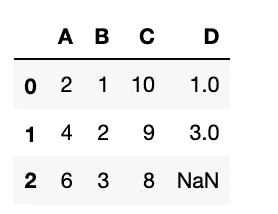

```
**drop_cols = ['A', 'B']****df.drop(drop_cols, axis=1, inplace=True)**df
```

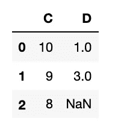

# 7)获取数据帧中行的子集:使用‘isin’

```
import pandas as pd

# Creating the dataframe 
df = pd.DataFrame({"A":[2, 4, 6],
                   "B":[1, 2, 3],
                   "C":[10, 9, 8],
                   "D":[1, 3, None]
})df
```

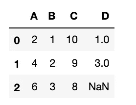

```
**filtered_list = [2, 4]****check1 = df[df["A"].isin(filtered_list)]**check1
```

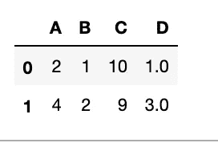

# 8)对列重新排序

```
import pandas as pd

# Creating the dataframe 
df = pd.DataFrame({"A":[2, 4, 6],
                   "B":[1, 2, 3],
                   "C":[10, 9, 8],
                   "D":[1, 3, None]
})**df.head(2)**
```


```
**new_order = ['D', 'A', 'C', 'B']****df_new = df.reindex(new_order, axis=1)**df_new.head(2)
```

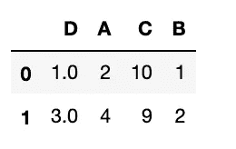

# 9)重命名数据帧中的列

```
import pandas as pd

# Creating the dataframe 
df = pd.DataFrame({"A":[120, 140, 100],
                   "B":[80, 90, 60],
                   "C":[10, 9, 8],
                   "D":[1, 3, None]
})df
```

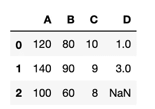

```
**df = df.rename(columns={'A': 'systolic',
                        'B': 'diastolic'
                       })**df
```

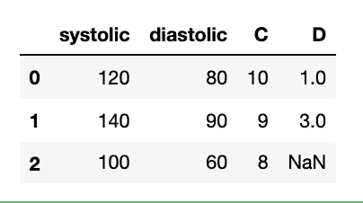

# 10)转置数据框架(数据透视表)；使用“融化”

```
# importing pandas as pd
import pandas as pd

# Creating the dataframe 
df = pd.DataFrame({"country":["India", "USA", "Mongolia"],
                   "year": [2019, 2020, 2021],
                   "A":[10, 9, 8],
                   "B":[1, 3, None],
                   "C":['2020-01-01', '2018-01-01', 'NaN']})df
```

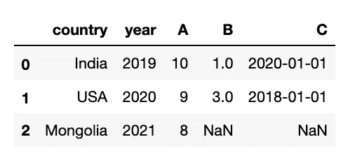

```
df_long = **df.melt(id_vars=['country', 'year'])**df_long
```

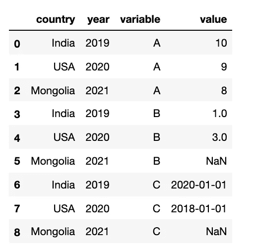

# 11)将数据帧写入一个`. csv '文件

```
# Takes dataframe "df" and writes it out a csv file named "report.csv"**df.to_csv**('data_derived/report.csv')
```

# 12)使用“掩码”分配新的数据值

```
# importing pandas as pd
import pandas as pd

# Creating the dataframe 
df = pd.DataFrame({"A":[2, 4, None],
                   "country":["India", "USA", "Unknown"],
                   "C":[10, 9, 8],
                   "D":[1, 3, None],
                   "event_date":['2020-01-01', '2018-01-01', 'NaN']})df
```

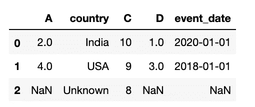

更改现有列

```
# IF the event_date='2018-01-01', then assign country (existing column in df) to be "United States"**df['country'].mask(df['event_date'] == '2018-01-01', 'United States', inplace=True)**df
```

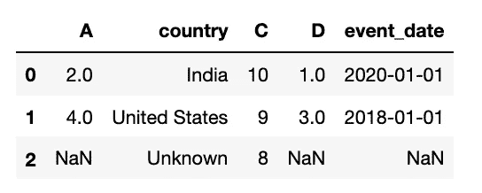

创建新列

```
# IF the event_date='2018-01-01', then assign chapter_status (a new column) to be "unbegun"# NOTE:  the new column needs to be initialized**df['chapter_status'] = ""****df['chapter_status'].mask(df['event_date'] == '2018-01-01', 'unbegun', inplace=True)**df
```

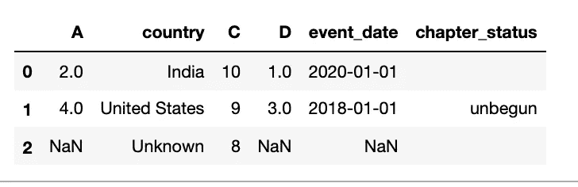

# 13)从字符转换为整数

```
# importing pandas as pd
import pandas as pd

# Creating the dataframe 
df = pd.DataFrame({"A":[12, 4, 5, None],
                   "B":[7, 2, 54, 3],
                   "C":[20, 16, 11, 3],
                   "D":[14.3, 3.5, 5.0, 6.8]})df.head()
```

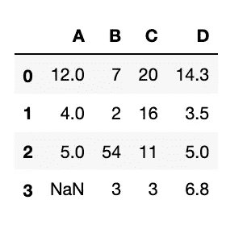

```
**df['D_n']= df['D'].astype(int)**df.head()
```

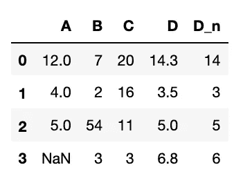

# 14)用另一个值替换“NaN”

```
# importing pandas as pd
import pandas as pd

# Creating the dataframe 
df = pd.DataFrame({"A":[12, 4, 5, None, 1],
                   "B":[7, 2, 54, 3, None],
                   "C":[20, 16, 11, 3, 8],
                   "D":[14, 3, None, 2, 6]})df.head()
```

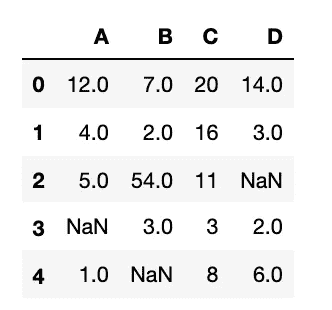

```
# replace the NaN values with 1000**df.mask(df.isna(), 1000)**
```

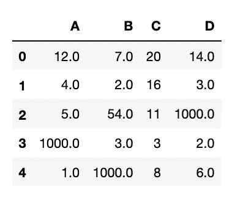

```
# NOTE: use inplace=True, so it is permanently replaced in the dataframe. df.mask(df.isna(), 1000, **inplace=True**)
```