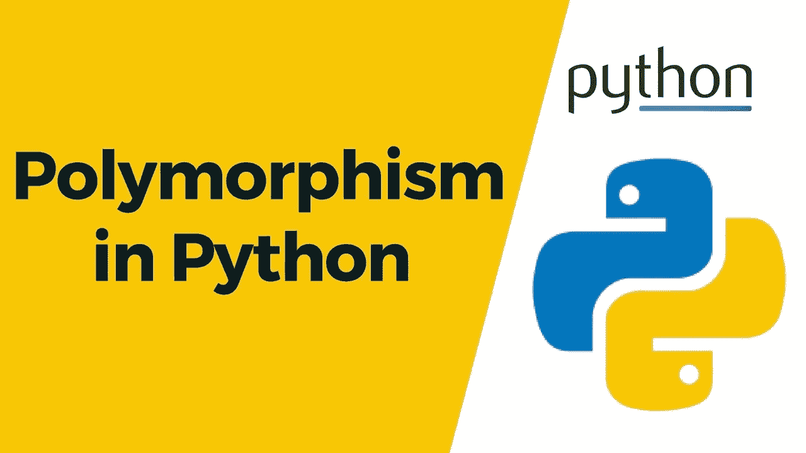

# Python 多态性介绍

> 原文：<https://medium.com/nerd-for-tech/python-polymorphism-6718b8475f5a?source=collection_archive---------10----------------------->



多态性这个词意味着有许多形式。

在编程中，多态性意味着相同的函数名(但不同的签名)用于不同的类型。

在 Python 中，它指的是使用单一类型实体(方法、运算符或对象)来表示不同场景中的不同类型。

有两种类型的多态性:

1.  编译时重载
2.  运行时覆盖

# 过载

## **操作员超载**

我们知道+运算符在 Python 程序中被广泛使用。但是，它没有单一的用法。在算术中，它用于数字相加，在字符串中，它用于连接。

```
a,b = 2,3
print(a+b)c,d = 'hello','world'
print(c+d)5
helloworld
```

方法重载是不可能的 python 将总是考虑最后一个方法和构造函数重载也是不可能的最后一个构造函数将被考虑。

# 最重要的

多态性允许我们访问这些与父类同名的重写方法和属性。

示例:

```
class Animal:
 def move(self):
  print(‘move’)
class Cheetah(Animal):
 def move(self):
  print(‘move fastly’)
class Tortoise(Animal):
 def move(self):
  print(‘move slowly’)a = Cheetah()
b = Tortoise()a.move()
b.move()move fastly
move slowly
```

# 公共、私有和受保护说明符

**公共成员**(通常是在类中声明的方法)可以从类外访问。默认情况下，所有成员都是公共的。

**一个类的受保护成员**可以从类内部访问，也可以被它的子类访问。不允许其他环境访问它。 **_** 前缀用于定义受保护的成员。

**私员**强烈建议不要从课外接触。任何这样做的尝试都将导致 AttributeError。 **__** 前缀用于定义私有成员。

示例:

```
class Demo:
 x = 5
 _y = 10
 __z = 20
 def met1(self):
  print(Demo.x)
  print(Demo._y)
  print(Demo.__z)a = Demo()
a.met1()5
10
20
```

正如我们看到的，当通过类的方法调用它时，可以访问三个成员。让我们试着直接称呼它，

```
print(Demo.x)  
print(Demo._y)
print(Demo.__z)5
10
AttributeError: type object 'Demo' has no attribute '__z'
```

正如我们之前讨论的，私有成员不能在类外调用。

# 结论

感谢您的阅读。我希望这有助于你更好地理解什么是多态性。