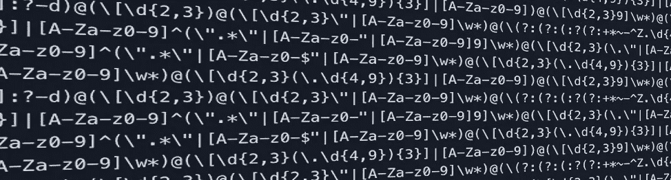
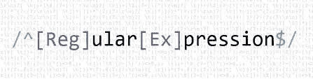
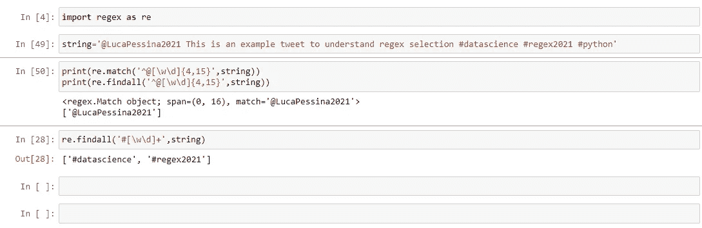
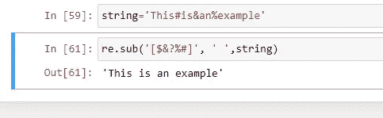

# Python 正则表达式 5 分钟

> 原文：<https://medium.com/nerd-for-tech/python-regular-expressions-in-5-minutes-ecc8b6624308?source=collection_archive---------3----------------------->

你作品的介绍和快速参考。



Python 中的正则表达式是我们数据科学技能墙的基石。它使我们能够快速简单地选择文本，并在日常工作中使用它。

假设您想要从一大页时态中选择一些重复出现的文本，例如在对 tweet 的情感分析中，您想要选择所有的人 ID，如“@myname ”,或者例如特定 tweet 中的所有标签，如“#datascience 或#regex。

在 python 中，通过“regex”模块是可能的，它允许我们在文本中选择、匹配和替换一些识别的模式。我们开门见山吧！

使用正则表达式，我们用一些特殊字符重新识别每个字母、符号或模式，下面列出了主要的字符。

*   **。(点)**:匹配**除换行符以外的任何字符**。
*   **\d** :选择任意一个**十进制数字**，所以数字在【0，9】之间。
*   **\s** :表示空白**，当我们想要选择多个单词时很有用。**
*   ****\w** :匹配任意**字字符**，所以字母【a-zA-Z】；数字[0，9]和 uderscore。**
*   ****\D \S \W** :如果我们使用大写字母，则符号表示与小写符号相对的**。所以它们是一个非数字、非空格和非单词字符。****

**所有这些符号都用于选择句子中的字符，但如果没有一些重复限定符，这些符号就没有用，这些限定符可以让我们提高选择的质量，例如，给出数字的数量或特定字符重复的次数。它们应用在 regex 语句之后，指的是最后一个特殊字符。所以主要的量词是:**

*   ******* :选择前面 regex 语句的**零个** **或更多个重复**，例如 regex 语句“ab*”将选择:“a”后跟任意数量的 bs；(' a '，' ab '，' abb '等..).**
*   ****+** :匹配**一个或多个重复的 regex 语句**。**
*   ****{ n }；{n，m}** : **n 次重复**或**前面文本的 n 到 m 次重复**。**
*   ****？** : **测试选择的零次或一次重复**。**

**还有其他特殊字符用于确定与时态相关的 regex 语句的位置。我们可以决定选择是在字符串的开头还是结尾。**

*   ****^** :匹配管柱的**起点**。**
*   ****$** :匹配字符串的**端**。**
*   ****[]** :用于选择特定**集合**中的所有字符，例如所有大写字母(【A-Z】)。**
*   ****\** :如果我们想使用一些特殊的带有**原始用法**的 chacarters，比如' $ '，我们必须前置' \ '符号。因此，要选择美元符号，我们必须写' \$ '。**

**最后是模块的属性和内容，它们用于选择、替换或查找文本中的 regex 语句。我们将通过一些例子来探讨它们。**

****

**现在，我们终于掌握了使用 regex 模块制作一些示例和练习的所有基本技能。首先导入模块:**

```
import regex as re 
```

**我们将使用的第一种方法是选择文本中的所有明喻模式，这是“findall”方法。假设您有一个包含姓名和电话号码的字符串，并且您只想选择后者。在这种情况下，我们将使用特殊字符' \d '。**

```
phone_numbers='Luke: 4-567-123-6789 Mike: 97-567-78-54376're.findall("\d{1,2}-\d{3}-d{2,3}-\d{4,5}", phone_numbers)output ['4-567-123-6789', '97-567-78-54376']
```

**但是回到第一段，如果我们正在进行分析，我们想从 twitter 帖子中选择用户名和标签，该怎么办？**

**在 twitter 中，如果满足以下条件，则用户名有效:**

*   **在'^@'正则表达式中，是以“@”开头的文本吗**
*   **仅包含字母数字字符(字母 A-Z，数字 0-9)。在这种情况下，我们可以使用“[A-Za-z0–9]”或“[\w\d]”。我们使用括号是因为我们想对集合应用另一个量词。**
*   **它必须在 4 到 15 个字符之间，所以{4，15}。**

**您可以使用 re.match()或 re.search()方法来查找字符串的匹配项，下面的代码通过 regex 语句报告了选择。**

****

**为了选择所有的标签，我们在开头使用“#”符号，然后添加未定义数量的数字或单词，例如:“#[\w\d]+”。**

**我们可以探索的最后一种方法对替换文本中的特定表达式很有用。它是“re.sub(old，new，string)”方法，在下面几行中我报告一个简单的例子:**

****

**如何使用 re.sub()方法？**

**正则表达式是一个强大而有用的工具，可以在一个长而复杂的脚本中选择、替换和匹配特定的文本表达式。这是一个快速介绍和备忘单，我附加了一些链接来提高你的正则表达式能力。**

 **[## 正则表达式-学习正则表达式-第 1 课:介绍，和 ABC

### 正则表达式在从文本中提取信息时非常有用，比如代码、日志文件、电子表格或…

regexone.com](https://regexone.com/)**  **[## Python Datetime -练习、实践、解答- w3resource

### 页面底部有一个编辑器，用于编写和执行脚本。] 1.写一个 Python 程序来检查…

www.w3resource.com](https://www.w3resource.com/python-exercises/re/)**  **[## 重新正则表达式操作- Python 3.9.1 文档

### 这个模块提供了类似于 Perl 中的正则表达式匹配操作。无论是图案还是字符串…

docs.python.org](https://docs.python.org/3/library/re.html)**