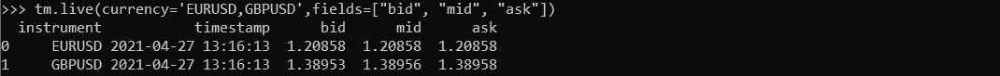
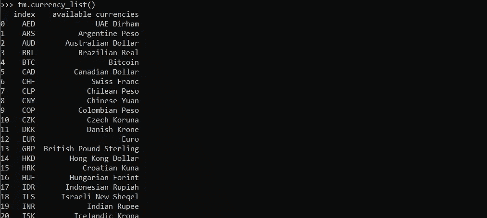
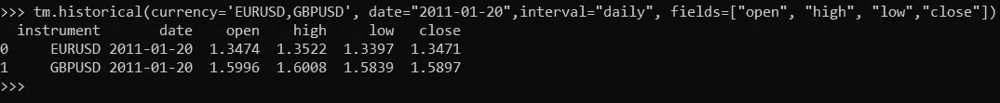
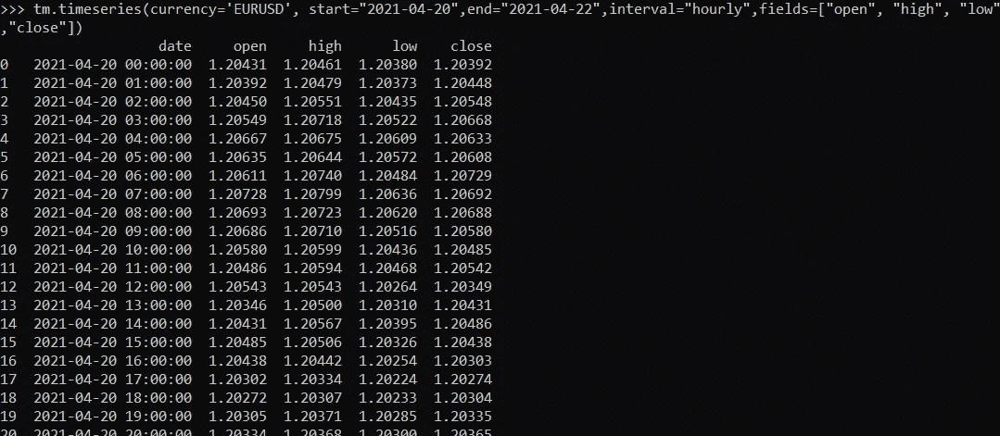
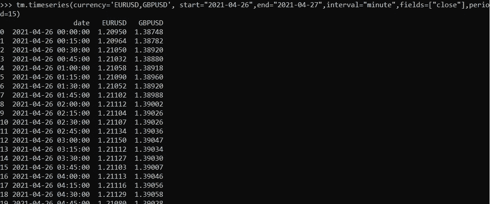

# 外汇 Python 开发工具包

> 原文：<https://medium.com/nerd-for-tech/python-sdk-for-forex-data-77e4ea728413?source=collection_archive---------5----------------------->


如果你是 python、SDK(软件开发工具包)的粉丝，并且正在寻找外汇数据，那么不要再找了。我想介绍 TraderMade Python-SDK，它将使您在获取外汇数据，尤其是时间序列方面的生活变得更加简单。

让我们开始吧。

第一步是[注册](https://marketdata.tradermade.com/signup)并获得一个 [API 密匙。](https://marketdata.tradermade.com/myAccount)只需几秒钟，每月最多 1000 次请求都是免费的。一旦你有了一个 API 密匙，要保证它的安全。

第二步是安装 SDK，这也相当简单，只需从终端运行以下命令(需要 python 3)。

```
pip install tradermade
```

你也可以访问 [PyPI](https://pypi.org/project/tradermade/) 了解更多信息。一旦安装了 tradermade，打开一个 IDE 并运行以下代码。

也可以通过视频关注[Python SDK 教程。](https://www.youtube.com/watch?v=UhYogs6iCGQ)

```
import tradermade as tm

# set api key
tm.set_rest_api_key("api_key")
```

现在，您可以设置 API 键来获取数据。

**实时外汇数据**

```
#get live data
tm.live(currency='EURUSD,GBPUSD',fields=["bid", "mid", "ask"]) # returns live data - fields is optional
```



运行上述命令得到你的数据，你可以从字段中选择你想要的，如果你只是想出价，只需提供字段=["bid"]等等。

要获得货币代码，只需运行以下程序:

```
#get currency codestm.currency_list() # gets list of all currency codes available add two codes to get code for currencypair ex EUR + USD gets EURUSD
```



**历史数据**

如果您需要过去任何给定时间点的外汇数据，您只需提供需要 OHLC 数据的日期和货币对，SDK 将返回该日期所有这些货币对的数据。

```
#get live datatm.historical(currency='EURUSD,GBPUSD', date="2011-01-20",interval="daily", fields=["open", "high", "low","close"]) # returns historical data for the currency requested interval is daily, hourly, minute - fields is optional
```



为了请求粒度数据，只需将日期参数更改为“YYYY-MM-DD-HH-MM”格式，您将获得如下所示的粒度数据。


**时间序列数据**

如果您正在寻找时间序列分析或在图表上绘制数据，那么时间序列函数是最好的。简单地提供一个开始和结束的日期和时间间隔，如下所示。小时时间系列最多可使用 2 个月，分钟时间系列最多可使用 2 天。如果选择了分钟间隔(默认值为 15 ),则可以传递周期参数。

```
# timeseries datatm.timeseries(currency='EURUSD', start="2021-04-20",end="2021-04-22",interval="hourly",fields=["open", "high", "low","close"]) # returns timeseries data for the currency requested interval is daily, hourly, minute - fields parameter is optional (you can select ["close"] if you just want close prices)
```



如果您想要请求多种货币的数据，则必须将字段设置为["close"]，如下所示。

```
tm.timeseries(currency='EURUSD,GBPUSD', start="2021-04-26",end="2021-04-27",interval="minute",fields=["close"],period=15)# returns 15 min bar for two currencies - you may need to adjust date to two days back or function will return an error that only two days of data is allowed for minute interval.
```



如你所见，与直接使用 API 相比，这使得获取外汇数据更加容易。您也可以在 [Tradermade Github 页面](https://github.com/tradermade/Forex-Python-SDK)下载教程代码，更多信息请访问 [TraderMade docs 页面](https://marketdata.tradermade.com/docs/restful-api#python-SDK)希望这对您有所帮助，请分享并鼓掌。如果您有任何要求或问题，请告诉我们。