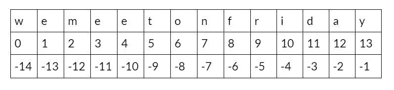

# Python 子字符串:您需要知道的一切

> 原文：<https://medium.com/nerd-for-tech/python-substrings-everything-you-need-to-know-4cca526c07eb?source=collection_archive---------11----------------------->


在 python 中，字符串是一个字符序列，可能包含特殊字符或字母数字字符，例如，*“我们在星期五早上 08:00 见面*”。可以访问字符串的子部分，通常称为 python 子串。

您也可以将 substring 定义为字符串中的字符序列。在前面的例子中，python 子字符串可以是“Friday”、“at”、“meet”等等。

Python 提供了不同的方式和方法来生成子串、检查子串是否存在、子串的索引等等。

您可以通过使用获取子字符串的索引进行切片来从字符串中提取子字符串，如下所示:

字符串[开始:停止:步进]

*   **start** —子串的起始索引。
*   **stop** —子串的结束索引。
*   **步骤** —指定切片步骤的数字。默认值为 1。



指数可以是正数，也可以是负数。正索引从字符串的开头到结尾开始，负索引从字符串的结尾到开头开始。

在本文中，您将学习到与 [python](https://hackernoon.com/top-10-python-frameworks-ranked-on-github-as3x341n?ref=hackernoon.com) 中子字符串相关的各种操作。

# 1.从字符串中获取前 n 个字符

这个例子将向你展示如何从字符串中截取前 5 个字符。

```
string = "hello world"
print(string[:5])
```

在这里，您定义停止指数为 5。默认情况下，起始索引为 0。

输出:
‘你好’

# 2.通过 python 子字符串从字符串中获取中间字符

这个例子将向你展示如何从字符串中切分出从索引 3 到索引 5 的字符。

```
string = "hello world"
print(string[3:5])
```

输出:
‘lo’

# 3.从字符串中获取最后一个字符

要获得最后一个字符，请使用-1 索引(负索引)。看看下面的例子。

```
string = "hacker noon"
print(string[-1])
```

输出:
'n '

# 4.从字符串中获取最后 n 个字符

在本例中，您将从字符串中截取最后 4 个字符。这里使用负索引从字符串的末尾开始切片。

```
string = "hackernoon"
print(string[-4:])
```

输出:
‘正午’

# 5.通过 python 子字符串用步骤分割字符串

您可以在指示 start-index 和 stop-index 之后用步长对字符串进行切片。默认情况下，步长为 1，但在以下示例中，步长为 2。

```
string = "welcome to hackernoon"
print(string[::2])
```

输出:
'wloet akron '

# 6.验证字符串中是否存在子字符串

有时你想检查一个子串是否存在于一个字符串中。以下示例将验证子字符串“noon”是否在字符串中。

```
substring = "noon"
string = "welcome to hackernoon"
print(substring in string)
```

如果存在，它将返回 True，否则返回 False。

输出:
真

# 7.检查字符串中是否存在 python 子串的另一种方法

您可以使用 find()方法检查字符串中是否存在子字符串。

让我们看看下面的例子。

```
substring = "zz"
string = "hello world"
print(string.find(substring))
```

如果可用，它返回子串最左边的索引，否则返回-1 表示不可用。

输出:
-1

这意味着**“ZZ”**不存在于“hello world”中。

# 8.获取给定索引的字符。

您可以选择根据索引号对特定字符进行切片。

```
string ="hello world"
print(string[4])
```

输出:
‘O’

# 9.用 python 从一个字符串创建一个子字符串列表

您可以使用 **split()** 方法来创建一个子字符串列表。让我们看看下面的例子。

```
string = "welcome to hackernoon platform"
print(string.split()
```

Output:
['welcome '，' to '，' hackernoon '，' platform']

# 10.用负阶反转弦

要反转字符串，步长必须是负值。例 1。

```
string = "welcome to hackernoon"
print(string[::-1])
```

输出:
' noorekcah ot emoclew '

# 11.计算字符串中子字符串的出现次数

您可以使用 count()方法来了解一个特定的子字符串在一个字符串中出现了多少次。

```
string = "we will have a quick introduction to hackernoon this afternoon"
print(string.count('noon'))
```

输出:
2

# 关于 Python 子字符串的最终想法

恭喜👏👏，你已经做到这篇文章的结尾了！我希望您已经了解了 python substring 的一些新知识。

如果你学到了新的东西或者喜欢阅读这篇文章，请分享给其他人看。在那之前，下期帖子再见！

也可以在 Twitter [@Davis_McDavid](https://twitter.com/Davis_McDavid?ref=hackernoon.com) 上找我。

*最后一件事:在以下链接中阅读更多类似的文章*

[](https://towardsdatascience.com/how-to-practice-logging-in-python-with-logzero-82e4f9842a5c) [## 如何用 Logzero 练习 Python 中的日志记录

### 为您的 Python 项目提供强大而有效的日志记录。

towardsdatascience.com](https://towardsdatascience.com/how-to-practice-logging-in-python-with-logzero-82e4f9842a5c) [](/analytics-vidhya/auto-format-your-python-code-with-black-f74d5f13bd7c) [## 用黑色自动格式化你的 Python 代码。

### 如何停止担心，拥抱自动格式化

medium.com](/analytics-vidhya/auto-format-your-python-code-with-black-f74d5f13bd7c) 

*本文首发* [*此处*](https://hackernoon.com/python-substrings-everything-you-need-to-know-031537pa) *。*