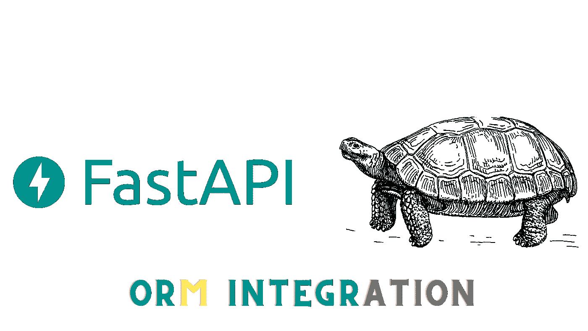
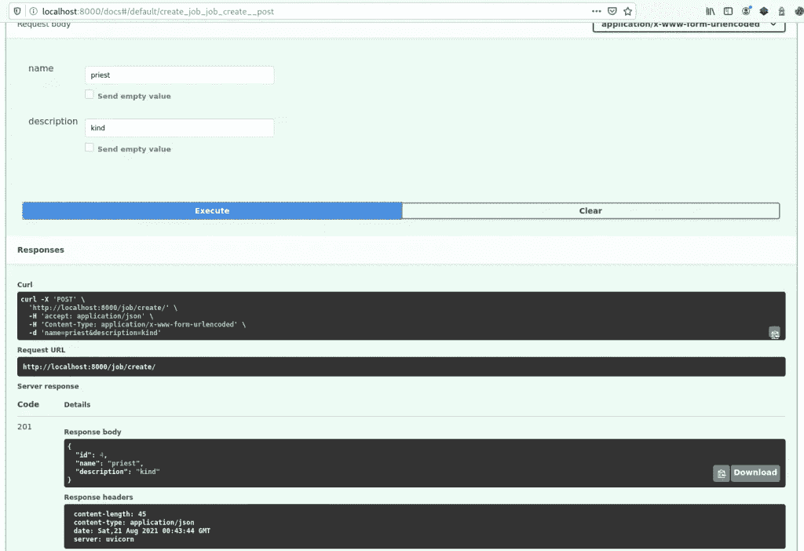
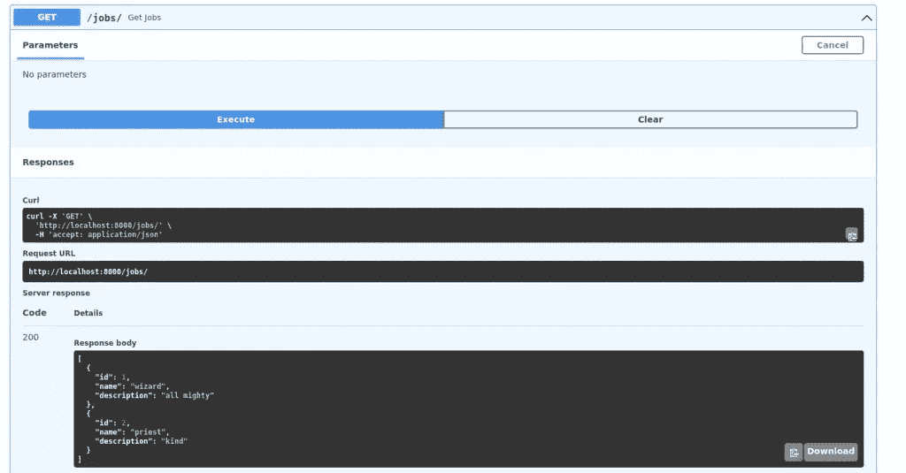
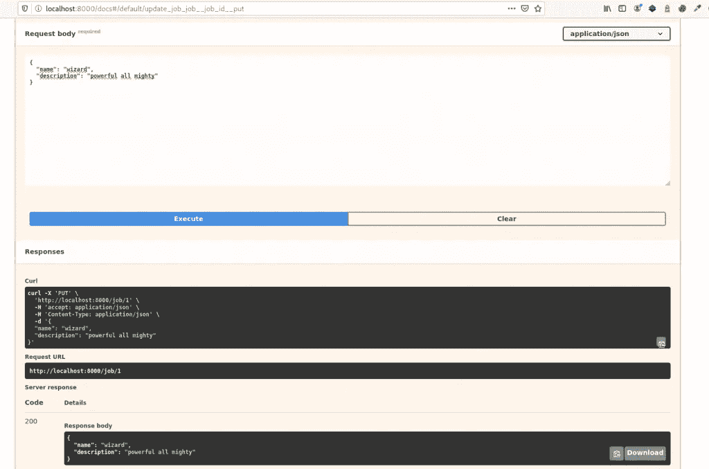
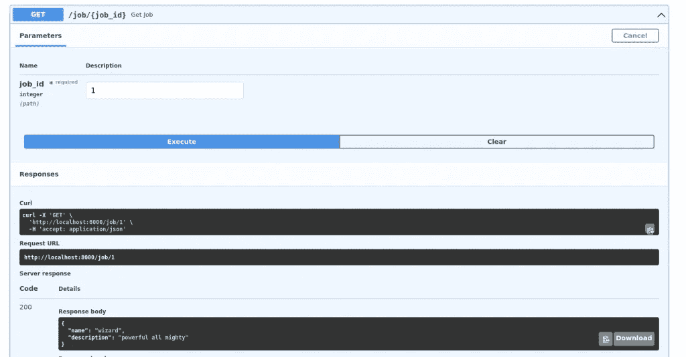
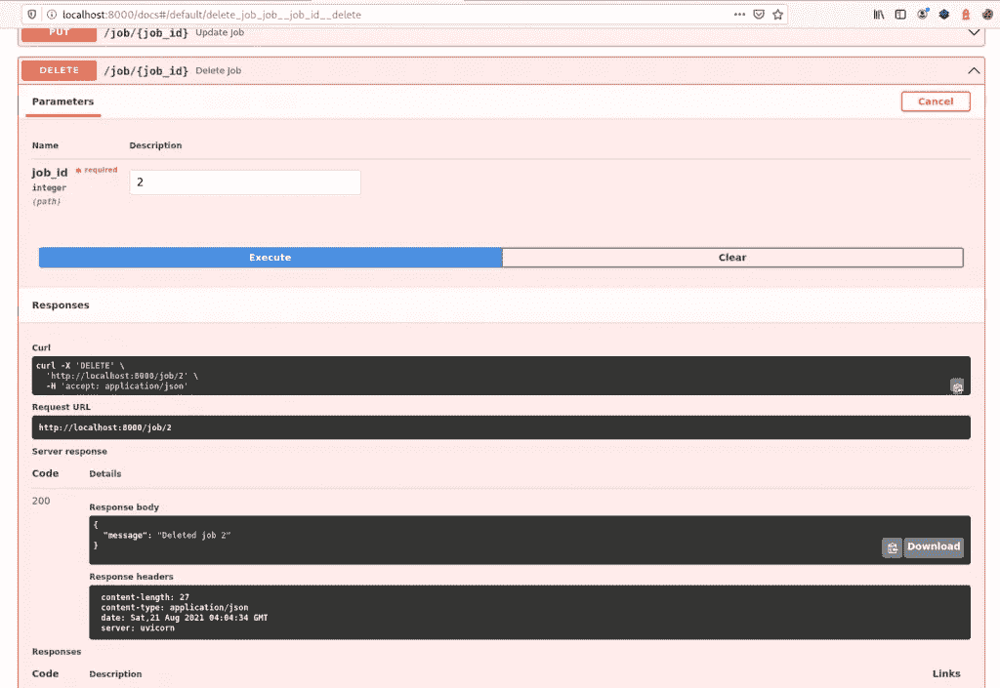

# Python 乌龟 ORM 与 FastAPI 的集成

> 原文：<https://medium.com/nerd-for-tech/python-tortoise-orm-integration-with-fastapi-c3751d248ce1?source=collection_archive---------0----------------------->



我最喜欢 Django 的一点是它的 ORM 这个框架如此受欢迎的原因之一。另一方面，FastAPI 没有 ORM，只专注于服务端点，与数据库无关。

python *有不少 ORM 选项:Django-alchemy* 、 *peewee* 、 *ponyORM、乌龟*。后者除了异步之外，还受到了 Django ORM 的启发，因此其语法非常相似，甚至许多乌龟函数都与它们的 Django 对应物共享名称，因此使用 Django ORM go 的用户节省了大量学习乌龟函数的时间。

在本教程中，我将同时使用 fastAPI 和 tortoise-orm，因此请确保您至少了解 fastAPI 框架和数据库的基础知识。

# 乌龟相容性

Tortoise 支持以下数据库。

*   PostgreSQL> = 9.4(使用 asyncpg)
*   SQLite(使用 aiosqlite)
*   MySQL / MariaDB(使用 aiomysql 或 asyncmy)

但是对于这个例子，我将使用 SQLite，因为它不需要任何配置。

# Python 乌龟 ORM 安装

要安装 tortoise-orm，只需使用您选择的虚拟环境管理器，我将使用 pipenv。

```
*pipenv install tortoise-orm*
```

我还将安装 fastAPI 和我们将需要的其他实用程序

```
*pipenv install python-multipart fastapi uvicorn pydantic*
```

# 用乌龟创建模型

我们将创建一个名为 app 的目录和一个名为 *models.py* 的模型文件

```
*# app/models.py
from tortoise.models import Model
from tortoise import fields* *class Job(Model):
    # P*rimary key field is created automatically *# id = fields.IntField(pk=True) 
    name = fields.CharField(max_length=255)
    description = fields.TextField()* *def __str__(self):
        return self.name*
```

如果您注意到语法与 Django 字段非常相似，甚至一些参数也是相同的。

要开始使用乌龟 ORM，我们需要:

1.  连接到数据库
2.  创建所需的表

# 用 Tortoise 连接数据库

我们将在名为 database 的目录中创建一个连接到数据库的函数:

```
*# database/connectToDatabase.py
from tortoise import Tortoise**async def connectToDatabase():
    await Tortoise.init(
        db_url='sqlite://db.sqlite3',
        modules={'models': ['app.models']}
    )*
```

# 使用 Tortoise 生成示意图

现在，让我们创建一个函数，在应用程序的根目录下生成模型。

```
*# createSchema.py
from tortoise import Tortoise, run_async
from database.connectToDatabase import connectToDatabase**async def main():
    await connectToDatabase()
    await Tortoise.generate_schemas()**if __name__ == '__main__':
    run_async(main())*
```

观察我们如何将刚刚创建的函数导入到 connect 中，然后调用 *generate_schemas ()* 方法，该方法将负责读取我们的模型并对数据库进行更改。

另一个你应该理解的方面是，我们在 *run_async ()* 函数中运行 main 函数，这个函数是由 tortoise 提供的。这是我们的 await 函数运行所必需的，否则，只会创建一个 *corroutine* 对象。

为什么我们把这个方法放在一个外部文件中？因为***generate _ schemas()*只需要使用一次**；当表被创建时。我们不能将它包含在执行 fastAPI 时将运行的文件中。

知道了这一点，让我们运行它来创建我们的表。

```
*python3 createSchema.py*
```

如果一切顺利，我们将在 SQLite 数据库中创建表。

# Tortoise 与 FastAPI 集成

我们将从一个简单的 fastAPI 应用程序开始。

要把 fastAPI 和 tortoise 联系起来，后者给了我们一个函数叫做 *register_tortosise ()* 。What 接收我们用 fastAPI 创建的实例、数据库的地址以及模型的位置。

```
*# main.py
from fastapi import FastAPI
from database.connectToDatabase import connectToDatabase**app = FastAPI()
await connectToDatabase()**@app.get("/")
async def read_root():
    return {"Hello": "World"}**register_tortoise(
    app,
    db_url="sqlite://db.sqlite3",
    modules={"models": ["app.models"]},
    generate_schemas=True,
    add_exception_handlers=True,
)*
```

# 用乌龟创造一个物体

要创建一个对象，我们可以选择在一个用我们的实例的 *post ()* 方法修饰的函数内**调用模型的 *create ()* 方法，或者我们也可以创建一个实例，然后调用它的 *save ()* 方法。**

```
*# main.py
from fastapi import FastAPI
from tortoise.contrib.fastapi import HTTPNotFoundError, register_tortoise**app = FastAPI()**@app.get("/")
async def read_root():
    return {"Hello": "World"}**@app.post("/job/create/", status_code=201)
async def create_job(name=Form(...), description=Form(...)):
    job = await Job.create(name=name, description=description)
    return {"status":"ok"}
# ...*
```

如果我们现在使用 fastAPI 创建的文档接口发出 web 请求，在 */ docs /* 中，我们将看到我们将能够使用名称和描述创建一个作业对象。



# 用 Pydantic 和 Tortoise 序列化对象

我们已经创建了对象，但是如果我们想在创建后返回对象呢？因为它是一个模型的实例，我们不能就这样返回它。对于 HTTP 响应，我们需要一个合适的数据类型。

**Pydantic 允许我们序列化来自数据库的对象，以便能够将它们作为 JSON 响应**或我们想要的任何内容返回。

您必须导入 *pydantic_model_creator* 函数，并将其作为参数传递给我们的模型。

```
*# main.py
from fastapi import FastAPI
from app.models import Job
from tortoise.contrib.fastapi import HTTPNotFoundError, register_tortoise
from tortoise.contrib.pydantic import pydantic_model_creator**app = FastAPI()**job_pydantic = pydantic_model_creator(Job)**@app.get("/")
async def read_root():
    return {"Hello": "World"}**@app.post("/job/create/", status_code=201)
async def create_job(name=Form(...), description=Form(...)):
    job = await Job.create(name=name, description=description)
    return await job_pydantic.from_tortoise_orm(job)**register_tortoise(
    app,
    db_url="sqlite://db.sqlite3",
    modules={"models": ["app.models"]},
    add_exception_handlers=True,
)*
```

为了在 JSON 中获取我们的对象，我们调用我们刚刚创建的对象的方法 *from_tortoise_orm ()* 。

记得在*前加上*字*等待*，否则你将返回一个*协程*。

# 从查询集中获取对象列表

我们将使用 fastAPI 实例的 **get ()** 方法。

为了获得对象列表，我们使用了 *all ()* 方法，并用 *from_queryset ()* 序列化结果。

```
*# main.py**# ...**@app.get("/jobs/")
async def get_jobs():
    return await job_pydantic.from_queryset(Job.all())*
```



# 用乌龟更新对象

现在**我们创建一个接收 id 的端点，并用 *put ()* 方法**进行修饰。我们将 job_pydantic 对象作为 response_model，[传递，以便它验证数据条目，将其包含在文档中，并将响应限制在可修改的字段](https://fastapi.tiangolo.com/tutorial/response-model/)。

我们还将创建第二个 job_pydantic 对象，也就是说，另一个序列化程序，它排除了只读字段(我们的主键),返回没有 id 的字段。

为了更新一个对象，我们使用 fastAPI 的 put 方法并接收要编辑的对象的 id。接下来，我们用 *Job.filter ()* 过滤那些匹配 id 的对象，然后我们调用它的 *update ()* 方法。因为 id 是唯一的，因为它是主键，所以只有 id 与我们发送的数据相对应的对象才会被编辑。

```
*# main.py**job_pydantic = pydantic_model_creator(Job)
job_pydantic_no_ids = pydantic_model_creator(Job, exclude_readonly=True)
# ...**@app.put("/job/{job_id}", response_model=job_pydantic, responses={404: {"model": HTTPNotFoundError}})
async def update_job(job_id: int, job: job_pydantic):
    await Job.filter(id=job_id).update(**job.dict())
    return await job_pydantic_no_ids.from_queryset_single(Job.get(id=job_id))*
```



# 用乌龟得到一个物体

现在我们可以应用上一节中的相同方法。这一次我们将**需要一个 id 和 fastAPI *get ()* 方法**。我们将 *response_model* 传递给它，以便它负责验证，并且我们定义我们将使用的唯一参数是 id，通过它我们将对 ORM 查询的结果使用 *from_queryset_single* ()方法:Job.get *(id = job_id)* 。

```
*# main.py**# ...**@app.get("/job/{job_id}", response_model=job_pydantic, responses={404: {"model": HTTPNotFoundError}})
async def get_job(job_id: int):
    return await job_pydantic_no_ids.from_queryset_single(Job.get(id=job_id))*
```



# 删除带有乌龟的对象

要删除一个对象**，我们**也**需要一个 id 并调用 fastAPI 的 *delete ()* 方法**，因此函数如下:

```
*# main.py
class Status(BaseModel):
    message: str
# ...**@app.delete("/job/{job_id}", response_model=Status, responses={404: {"model": HTTPNotFoundError}})
async def delete_job(job_id: int):
    deleted_job = await Job.filter(id=job_id).delete()
    if not deleted_job:
        raise HTTPException(status_code=404, detail=f"Job {job_id} not found")
    return Status(message=f"Deleted job {job_id}")*
```

我们通过在 URL 中获得的 id 进行过滤，如果找到对象，我们就删除它，如果对象的 id 不存在，我们将通过异常返回 404 错误。如果是，我们将不再返回对象，但是返回一条消息通知 id 已被删除就足够了。



这样，我们就可以使用 tortoise 作为 orm 在 fastAPI 中执行基本的 CRUD 操作。在这篇文章中，我没有涉及外键、外键字段、多对多或模型之间的其他类型的关系。我将来可能会写一个关于这个的条目，同时，你可以阅读官方的乌龟文档。