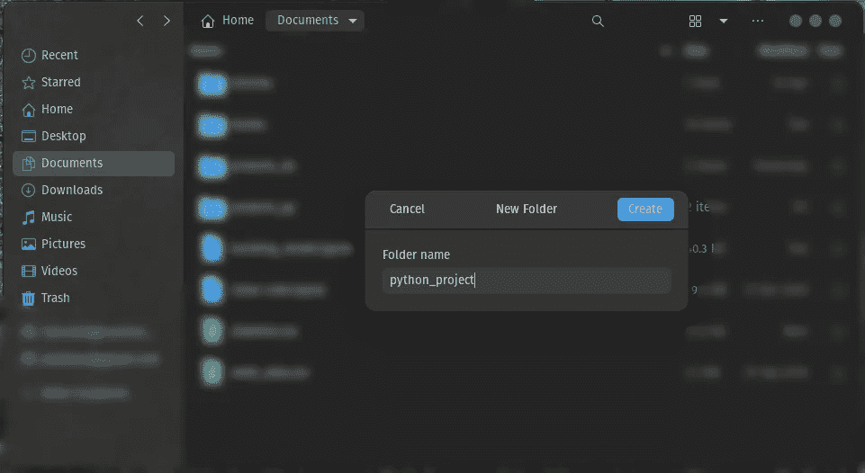
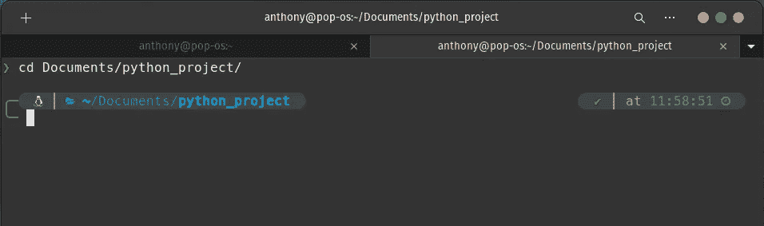
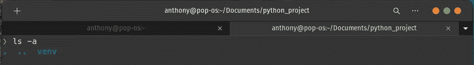
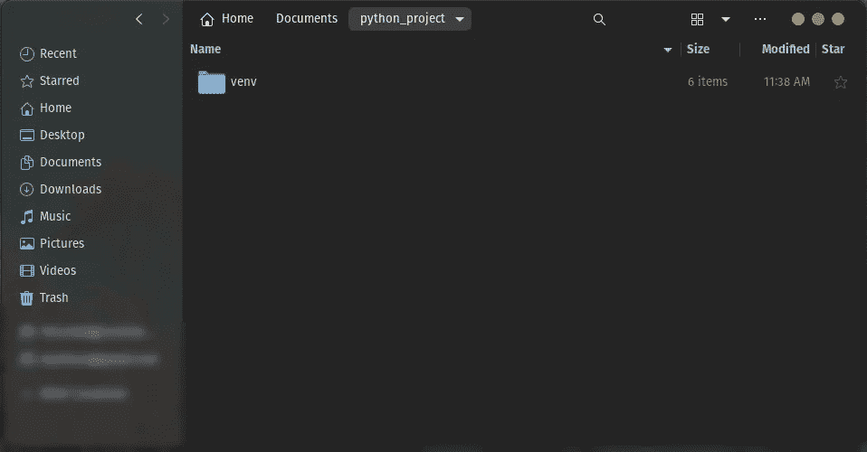
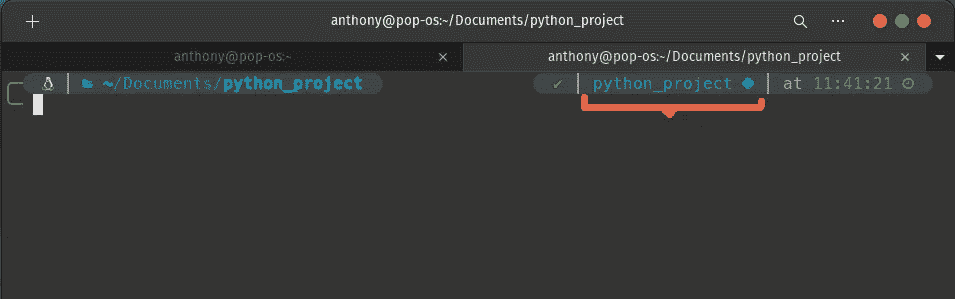
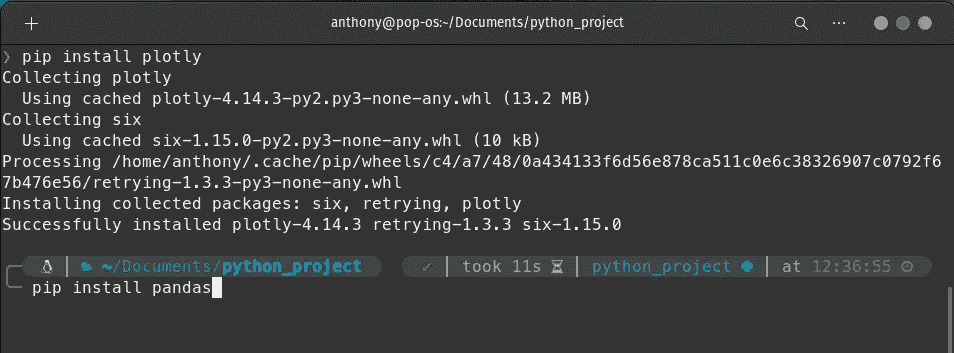

# Python 虚拟环境— Linux

> 原文：<https://medium.com/nerd-for-tech/python-virtual-environment-linux-9bab86bae567?source=collection_archive---------8----------------------->

虚拟环境是一种工具，通过为不同项目创建隔离的 python 虚拟环境，有助于保持不同项目所需的依赖关系分离。每当你在任何基于 Python 的项目上工作时，都应该使用虚拟环境。一般来说，为您所从事的每个基于 Python 的项目创建一个新的虚拟环境是很好的。


# (砰！_OS 20.10)

欢迎，下面的帖子是专门针对那些开始接触 Linux 的人的。

您应该做的第一件事是安装以下模块:

```
sudo apt install python3-venv
```

# 第一步

## 创建您的项目文件夹

```
# TERMINALcd Documents/
mkdir python_project
```



你也可以像在 windows 10 中一样创建它

# 第二步

## 现在我们必须移动到我们刚刚创建的文件夹

```
cd Documents/python_project/
```



末端的

# 第三步

## 创建虚拟 python 环境

```
python3 -m venv venv
```

您应该看到创建了一个名为“venv”的隐藏文件夹。



末端的



文件

# 第四步

## 主动虚拟环境

```
. venv/bin/activate
```



末端的

现在，您可以安装项目中需要的库了。



此外，您可以通过键入以下命令来禁用虚拟环境:

```
deactivate
```